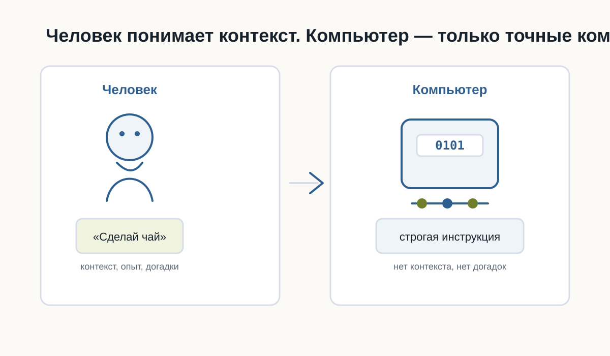
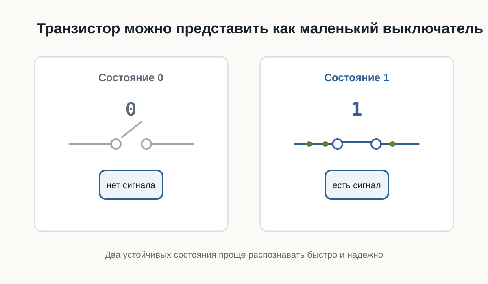
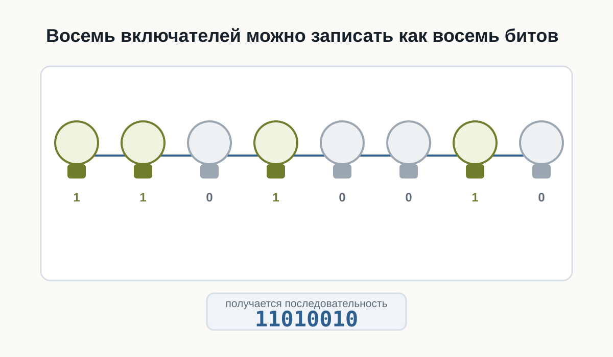
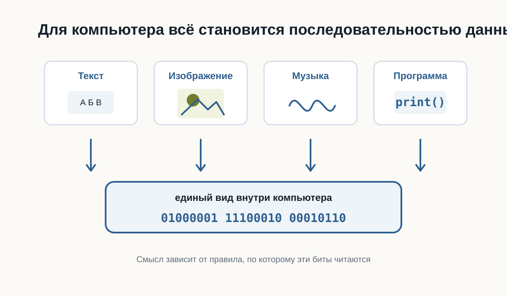
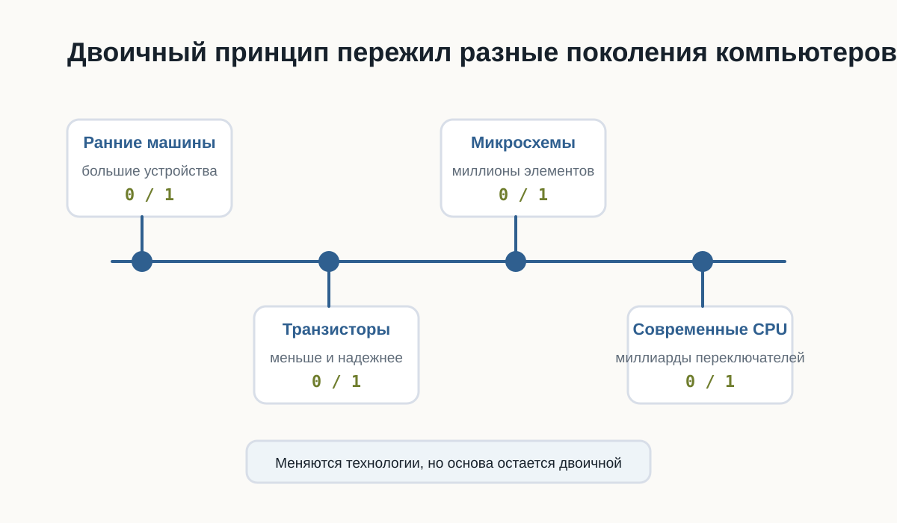

# 2.2 Почему компьютер понимает только 0 и 1 {.unnumbered}

В предыдущей главе мы разобрались, что компьютер выполняет только точные инструкции.

Но возникает следующий вопрос:

**почему компьютер вообще работает с нулями и единицами?**

Почему нельзя заставить его сразу понимать слова, числа или команды так, как это делает человек?

Чтобы ответить на этот вопрос, нужно немного заглянуть внутрь компьютера.

Не слишком глубоко. Нам не понадобится изучать электронику или физику полупроводников.

Для Python-разработчика важно понять только основной принцип.

## Почему компьютер не понимает человеческий язык

Человек умеет использовать контекст.

Если сказать:

> Сделай чай.

другой человек обычно понимает, что нужно сделать.

Он знает:

- где находится чайник;
- сколько примерно налить воды;
- какую кружку взять;
- когда вода закипела;
- что означает слово «чай».

Большая часть информации вообще не проговаривается.

Наш мозг автоматически достраивает недостающие шаги.

Компьютер так не умеет.

Если программа должна выполнить определённое действие, это действие необходимо описать достаточно точно.

Компьютер не понимает намерение разработчика.

Он выполняет только то, что действительно указано в программе.

::: {.callout-important title="Главная мысль"}

Компьютер не обладает здравым смыслом.

Он не догадывается, что программист хотел сделать.

Он выполняет конкретные инструкции.

:::

{fig-alt="Сравнение человека и компьютера при выполнении инструкции"}

## Что находится внутри компьютера

Современный компьютер состоит из огромного количества электронных компонентов.

Один из самых важных — **транзистор**.

Транзистор — это очень маленький электронный переключатель.

Для понимания программирования его можно представить как обычный выключатель света.

Выключатель имеет два устойчивых состояния:

```text
Включён

Выключен
```

Транзистор работает по похожему принципу.

В упрощённом виде для нас достаточно считать, что он различает два состояния электрического сигнала:

```text
Высокий уровень сигнала

Низкий уровень сигнала
```

Или ещё проще:

```text
Есть сигнал

Нет сигнала
```

::: {.callout-note title="Насколько точно это объяснение?"}

В реальной электронике всё немного сложнее.

Компьютер работает не с буквальными состояниями «ток есть» и «тока нет», а с диапазонами напряжений, которые электронные схемы интерпретируют как два логических состояния.

Но для первого знакомства модель «включено / выключено» достаточно точно передаёт основной принцип.

:::

Современный процессор содержит огромное количество транзисторов.

Каждый из них очень мал, но вместе они способны выполнять миллиарды операций.

Чем больше транзисторов можно разместить внутри микросхемы и чем быстрее они переключаются, тем более сложные вычисления способен выполнять процессор.

{fig-alt="Упрощённая схема двух состояний транзистора"}

## Почему именно два состояния

Можно задать вполне разумный вопрос:

> Почему только два?

Почему не три?

Почему не десять?

Теоретически вычислительную систему можно построить и на другом количестве состояний.

Такие идеи действительно существовали и существуют.

Но двоичная система оказалась чрезвычайно удобной для электронной техники.

Причина — **надёжность**.

Представим, что электронная схема должна различать десять уровней напряжения.

Условно:

```text
0.5 В
1.0 В
1.5 В
2.0 В
...
```

Тогда даже небольшая помеха может привести к ошибке.

Например, устройство ожидало 1.5 В, а из-за электрического шума получило 1.6 В.

Какое это состояние?

Чем больше состояний должна различать система, тем сложнее надёжно определить каждое из них.

С двумя состояниями гораздо проще.

Электронная схема может работать по принципу:

```text
Низкий уровень → одно состояние

Высокий уровень → другое состояние
```

Между ними можно оставить запас.

Если сигнал немного изменится из-за помех, схема всё равно правильно определит его состояние.

Именно поэтому два состояния особенно хорошо подходят для быстрых и надёжных цифровых устройств.

::: {.callout-tip title="Простая аналогия"}

Представьте два выключателя.

Первый имеет только два положения:

```text
ВКЛ
ВЫКЛ
```

Второй имеет десять очень близко расположенных положений.

Каким выключателем проще пользоваться без ошибки?

Примерно по той же причине электронным схемам удобно работать с двумя состояниями.

:::

## Откуда появились 0 и 1

Сами транзисторы не знают никаких цифр.

Внутри компьютера не бегают настоящие нули и единицы.

Цифры **0** и **1** придумали люди как удобные обозначения двух состояний.

Условно можно записать:

```text
Низкий уровень сигнала → 0

Высокий уровень сигнала → 1
```

Можно было выбрать и другие обозначения:

```text
НЕТ / ДА

ВЫКЛ / ВКЛ

FALSE / TRUE

ЧЁРНЫЙ / БЕЛЫЙ
```

Принцип работы компьютера от этого бы не изменился.

Но обозначения `0` и `1` оказались особенно удобными, потому что позволяют использовать **двоичную систему счисления**.

О ней мы поговорим подробнее позже.

Пока достаточно понимать:

**0 и 1 — это математические обозначения двух физических состояний.**

{fig-alt="Последовательность включённых и выключенных лампочек и соответствующие нули и единицы"}

## Что такое бит

Теперь можно аккуратно познакомиться с первым важным термином.

**Бит** — это минимальная единица цифровой информации, которая может принимать одно из двух значений:

```text
0
```

или

```text
1
```

Слово `bit` произошло от английского выражения:

**binary digit** — двоичная цифра.

Один бит способен хранить только два варианта.

Например:

```text
0 → нет

1 → да
```

или:

```text
0 → свет выключен

1 → свет включён
```

Но одного бита недостаточно для хранения сложной информации.

Поэтому компьютеры используют большие последовательности битов.

Например:

```text
01000001
```

Здесь уже восемь битов.

Группа из восьми битов называется **байтом**.

Подробно с битами, байтами и тем, как из них складываются данные, мы познакомимся в следующей главе.

::: {.callout-note title="Не нужно зубрить"}

Пока достаточно запомнить:

- бит принимает значение `0` или `1`;
- несколько битов можно объединять;
- из больших последовательностей битов компьютер строит сложные данные.

:::

## Как из двух состояний получается сложная информация

На первый взгляд кажется странным:

как всего два состояния могут описать фотографию, музыку или целую компьютерную игру?

Ответ заключается в количестве комбинаций.

Возьмём один бит:

```text
0
1
```

Возможно только **2 комбинации**.

Теперь два бита:

```text
00
01
10
11
```

Уже **4 комбинации**.

Три бита:

```text
000
001
010
011
100
101
110
111
```

Получаем **8 комбинаций**.

Чем больше битов, тем больше разных состояний можно закодировать.

Для `n` битов количество комбинаций равно:

```text
2ⁿ
```

Например:

```text
8 бит → 256 комбинаций
```

Именно поэтому даже небольшая последовательность битов уже может представлять достаточно много разных значений.

Компьютер использует огромные последовательности битов.

Поэтому двух базовых состояний оказывается достаточно для хранения практически любой цифровой информации.

## Всё превращается в числа

Компьютер не хранит букву так, как её видит человек.

Возьмём:

```text
A
```

Компьютеру нужно договориться, какое число будет обозначать эту букву.

Например, в одной из распространённых систем кодирования латинской букве `A` соответствует число:

```text
65
```

Число `65`, в свою очередь, можно представить в двоичной форме:

```text
01000001
```

Получается цепочка:

```text
A
↓
65
↓
01000001
```

С изображениями идея похожая.

Фотография состоит из пикселей.

Каждый пиксель описывается числами.

Например, числа могут определять интенсивность красного, зелёного и синего цветов.

Дальше эти числа снова представляются последовательностями битов.

```text
Фотография
↓
Пиксели
↓
Числа
↓
0 и 1
```

Музыка также может быть представлена числами.

Звуковая волна измеряется много раз в секунду.

Результаты измерений записываются как числа.

```text
Звук
↓
Измерения
↓
Числа
↓
0 и 1
```

Видео можно рассматривать как последовательность изображений вместе со звуком.

Программы тоже состоят из данных и инструкций, которые в конечном итоге представлены тем же способом.

{fig-alt="Преобразование текста, фотографии, музыки и программы в числа и двоичные данные"}

::: {.callout-important title="Главная мысль"}

Компьютер способен работать с текстом, фотографиями, музыкой и программами не потому, что понимает их смысл.

Он умеет представлять всё это числами.

А числа можно представить последовательностями `0` и `1`.

:::

## Что происходит технически

Теперь немного точнее посмотрим на путь информации.

Когда программа работает с некоторым значением, происходит несколько уровней преобразований.

Упрощённо:

```text
Данные программы
        ↓
Числовое представление
        ↓
Биты
        ↓
Электрические сигналы
        ↓
Электронные схемы
```

Например, Python-программа может работать со строкой:

```python
message = "Hello"
```

Для разработчика это текст.

Python рассматривает его как объект строки.

Дальше компьютерное оборудование работает уже с машинным представлением этих данных.

В памяти находятся не слова в человеческом смысле, а закодированные значения.

На самом нижнем уровне они физически представлены состояниями электронных элементов.

Важно понимать, что программист почти никогда не работает напрямую с этим уровнем.

Python специально скрывает большую часть сложности.

Мы можем писать:

```python
message = "Hello"
```

и не думать о том, какие конкретно биты находятся в оперативной памяти.

Это один из главных принципов программирования:

**каждый следующий уровень скрывает сложность предыдущего.**

Мы ещё много раз встретим эту идею в книге.

## От транзисторов к логическим операциям

Один транзистор сам по себе умеет немного.

Но транзисторы объединяют в электронные схемы.

Из них можно создавать так называемые **логические элементы**.

Они выполняют простые операции над двумя состояниями.

Например:

```text
И
ИЛИ
НЕ
```

Позже из таких простых операций строятся более сложные схемы:

```text
логические элементы
        ↓
сумматоры
        ↓
регистры
        ↓
память
        ↓
процессор
```

В результате миллиарды очень простых переключателей способны совместно выполнять сложные программы.

::: {.callout-note title="Почему это важно программисту"}

Python-разработчику не нужно уметь проектировать процессоры.

Но полезно понимать, что любой сложный код в конечном итоге выполняется системой, построенной из огромного количества простых логических операций.

Это помогает избавиться от ощущения, что компьютер работает благодаря какой-то магии.

:::

## Немного истории

Первые электронные компьютеры выглядели совсем не так, как современные ноутбуки.

До появления транзисторов в вычислительной технике широко использовались **электронные лампы**.

Они выполняли похожую функцию — позволяли управлять электрическими сигналами.

Но у них были серьёзные недостатки.

Лампы были:

- большими;
- горячими;
- энергозатратными;
- сравнительно ненадёжными.

Ранние компьютеры могли занимать целые помещения.

Появление транзистора позволило резко уменьшить размеры электронных схем.

Транзисторы были значительно меньше, экономичнее и надёжнее ламп.

Позже инженеры научились размещать множество транзисторов на одной микросхеме.

Количество транзисторов продолжало расти.

Сегодня внутри одного современного процессора могут находиться **миллиарды транзисторов**.

То, для чего когда-то требовалось целое помещение, теперь помещается в небольшом устройстве.

{fig-alt="Эволюция от электронных ламп к транзисторам, интегральным схемам и современным процессорам"}

## Почему это важно будущему Python-разработчику

Можно задать вопрос:

> Если Python скрывает все эти детали, зачем мне вообще знать про транзисторы и биты?

Чтобы писать первые программы, эти знания действительно не обязательны.

Но они помогают сформировать правильное представление о компьютере.

Когда позже мы начнём говорить о:

- переменных;
- типах данных;
- памяти;
- файлах;
- кодировках;
- базах данных;
- сетях;

вы будете понимать, что всё это разные способы организации одной и той же цифровой информации.

Кроме того, становится понятнее важный принцип:

**абстракции позволяют программисту работать со сложной системой, не думая постоянно о её нижних уровнях.**

Python — один из таких уровней абстракции.

## Практика

### Задание 1

Представьте четыре выключателя.

Каждый может быть либо включён, либо выключен.

Попробуйте самостоятельно записать все возможные комбинации из четырёх состояний с помощью `0` и `1`.

Подсказка:

```text
0000
0001
0010
...
```

Сколько комбинаций получится?

### Задание 2

Попробуйте объяснить своими словами:

> Почему два состояния удобнее для электронной системы, чем десять?

Не используйте определение из книги дословно.

Главная задача — сформулировать мысль самостоятельно.

### Задание 3

Выберите любой объект:

- фотографию;
- песню;
- текстовый документ;
- видео.

Попробуйте мысленно пройти путь:

```text
Объект
↓
Как его можно представить числами?
↓
Как числа можно представить битами?
```

Не нужно знать точные форматы файлов.

Нас интересует только общий принцип.

## Ответы к практике

Используйте этот раздел для самопроверки после того, как попробовали выполнить задания самостоятельно.

### Ответ к заданию 1

Для четырёх выключателей получится **16 комбинаций**:

```text
0000
0001
0010
0011
0100
0101
0110
0111
1000
1001
1010
1011
1100
1101
1110
1111
```

Почему именно 16:

```text
2 × 2 × 2 × 2 = 16
```

У каждого выключателя два состояния, а выключателей четыре.

### Ответ к заданию 2

Два состояния удобнее, потому что электронной системе проще быстро и надёжно отличать одно состояние от другого.

Например:

- есть сигнал или нет сигнала;
- высокое напряжение или низкое напряжение;
- включено или выключено.

Если состояний десять, системе пришлось бы гораздо точнее измерять сигнал и чаще решать, к какому состоянию он относится.

Это увеличивает риск ошибок.

### Ответ к заданию 3

Пример с текстовым документом:

```text
Текстовый документ
↓
Символы получают числовые коды
↓
Числа записываются битами
```

Пример с фотографией:

```text
Фотография
↓
Изображение разбивается на пиксели
↓
Цвет каждого пикселя записывается числами
↓
Числа записываются битами
```

Главное: объект не хранится в компьютере «как есть». Он переводится в числовое представление, а числа уже можно записать последовательностями `0` и `1`.

## Проверьте себя

Попробуйте ответить без подсказок:

1. Что такое транзистор в упрощённом представлении?
2. Почему электронным схемам удобно использовать два состояния?
3. Действительно ли внутри компьютера находятся цифры `0` и `1`?
4. Что такое бит?
5. Сколько возможных состояний имеет один бит?
6. Почему несколько битов позволяют хранить больше информации?
7. Как текст можно превратить в двоичные данные?
8. Можно ли по одному принципу хранить текст, музыку и фотографии?
9. Зачем Python-разработчику понимать эти основы, если Python скрывает работу электроники?

Если вы можете уверенно объяснить ответы своими словами, значит основная идея главы усвоена.

## Ответы для самопроверки

1. В упрощённом представлении транзистор можно считать маленьким электронным выключателем.

Он находится в одном из двух состояний: сигнал есть или сигнала нет.

2. Два состояния удобны, потому что их легко быстро и надёжно отличать друг от друга.

Электронной схеме проще определить «есть сигнал» или «нет сигнала», чем различать много близких состояний.

3. Нет, внутри компьютера нет настоящих цифр `0` и `1`.

Это условные обозначения двух физических состояний.

4. Бит — это минимальная единица информации.

Он может принимать одно из двух значений: `0` или `1`.

5. Один бит имеет два возможных состояния.

```text
0
1
```

6. Несколько битов дают больше комбинаций.

Например, два бита дают четыре комбинации:

```text
00
01
10
11
```

Чем больше битов, тем больше разных значений можно закодировать.

7. Текст можно превратить в двоичные данные через числовые коды символов.

Например:

```text
буква → числовой код → биты
```

8. Да, можно.

Текст, музыка и фотографии отличаются правилами кодирования, но в памяти компьютера всё равно хранятся как последовательности битов.

9. Эти основы помогают понимать, что происходит под уровнем Python.

Когда позже появятся переменные, типы данных, файлы, кодировки и память, будет проще понять, почему они работают именно так.

## Главное, что нужно запомнить

1. В основе цифрового компьютера лежат электронные элементы с двумя различимыми состояниями.
2. Эти состояния условно обозначают как `0` и `1`.
3. Один `0` или `1` представляет один бит информации.
4. Последовательности битов позволяют кодировать множество различных значений.
5. Текст, изображения, музыка, видео и программы в конечном итоге представляются цифровыми данными.
6. Python скрывает большую часть нижнего уровня и позволяет работать с понятными человеку объектами.

::: {.callout-important title="Главный вывод главы"}

Компьютер не «говорит на языке нулей и единиц».

Нули и единицы — это удобная математическая модель двух физических состояний электронных схем.

Комбинируя огромное количество таких простых состояний, компьютер способен хранить данные и выполнять сложнейшие программы.

:::

## Что дальше

Теперь мы знаем, почему компьютер использует два состояния и откуда появляются `0` и `1`.

Но остаётся важный вопрос:

**как именно из последовательностей битов получаются числа, буквы, изображения и другие данные?**

В следующей главе мы разберёмся, как компьютер хранит информацию и познакомимся с битами, байтами и кодированием данных подробнее.
