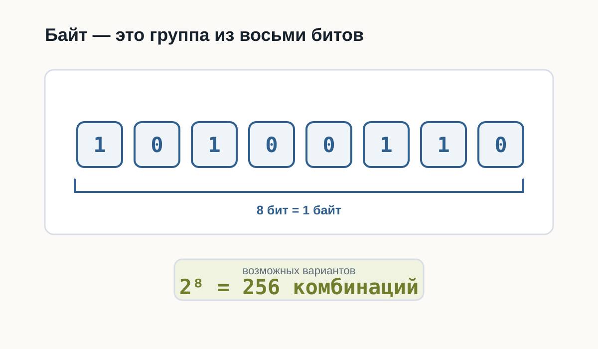
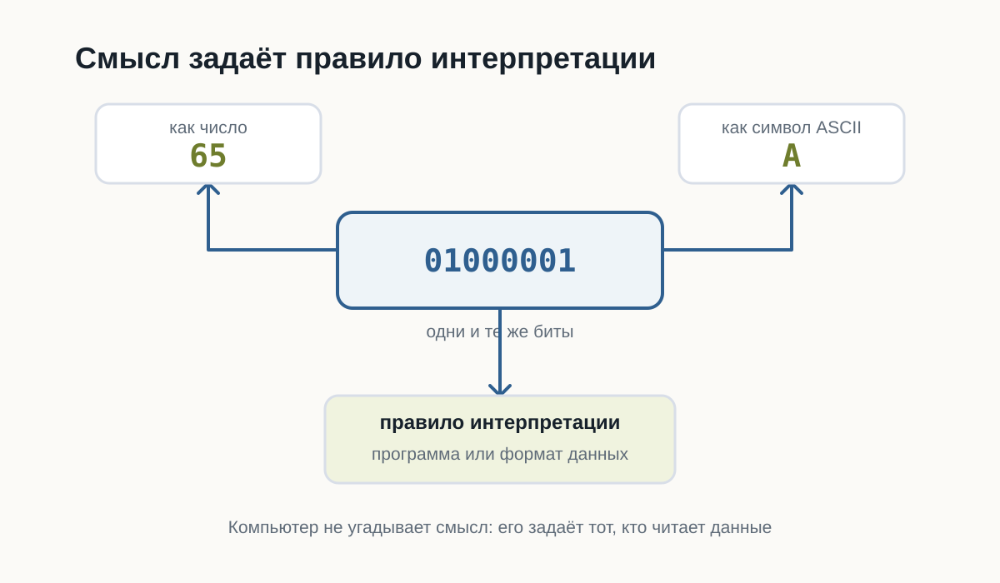
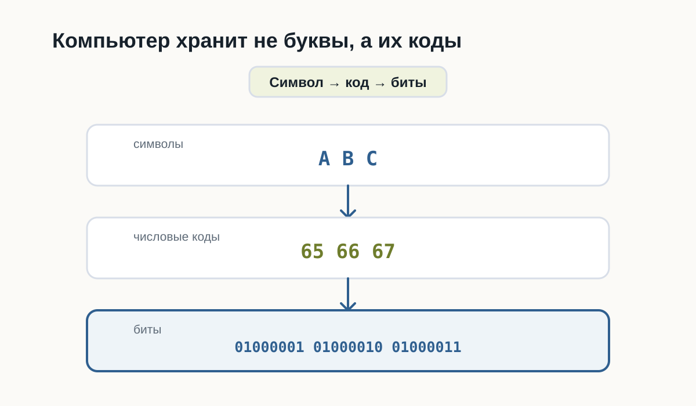
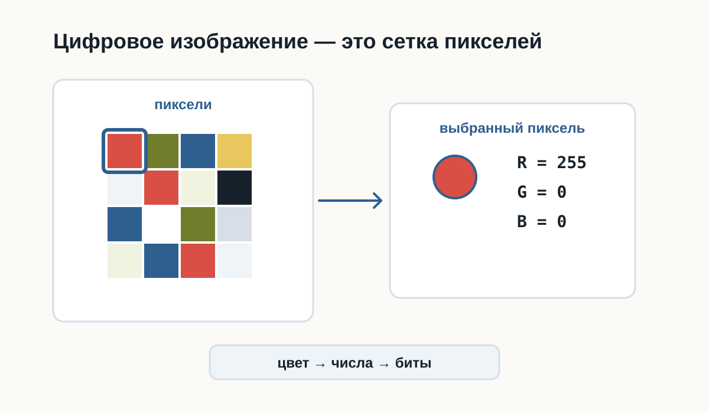
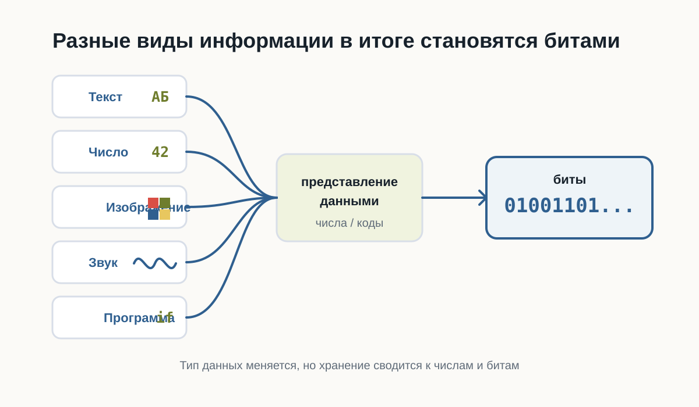

---
pagetitle: "Как компьютер хранит данные: биты, байты и файлы"
description: "Как компьютер хранит данные: биты, байты, числа, текст, изображения, звук и программы в памяти компьютера простыми словами для начинающих."
keywords:
  - как компьютер хранит данные
  - биты и байты
  - кодирование текста
  - цифровые изображения
  - данные в компьютере
number-sections: false
---

# 2.3 Как компьютер хранит данные {.unnumbered}

::: {.callout-important}
Главный вопрос главы:

**Если компьютер знает только 0 и 1, как он хранит текст, числа, фотографии, музыку и программы?**
:::

После предыдущей главы мы уже знаем важную вещь:

> Любая информация внутри компьютера состоит только из нулей и единиц.

Но возникает следующий вопрос.

Когда вы открываете фотографию, запускаете игру или читаете текстовый файл, вы не видите последовательность вроде

```
010011010100101011...
```

Вы видите изображение, буквы, числа и кнопки.

Почему?

Потому что сами биты ничего не означают.

Смысл появляется только тогда, когда существует правило их интерпретации.

---

# Бит — самая маленькая единица информации

Бит может принимать только два значения.

```
0
```

или

```
1
```

Это похоже на обычный выключатель.

```
Выключено -> 0

Включено -> 1
```

Одного бита почти никогда недостаточно.

Поэтому биты объединяют в группы.

---

# Байт

Самая известная группа — **байт**.

Один байт состоит из восьми битов.

```
10100110
```

или

```
00000000
```

или

```
11111111
```

Всего существует

```
2 × 2 × 2 × 2 × 2 × 2 × 2 × 2 = 256
```

различных комбинаций.

Поэтому один байт способен хранить одно из **256 различных значений**.

Это очень удобно.



---

# Как компьютер понимает, что хранится в байте?

Представьте число

```
65
```

Что это означает?

Без контекста — ничего.

Это может быть:

- возраст;
- скорость;
- номер страницы;
- температура.

То же самое происходит с байтами.

Последовательность

```
01000001
```

сама по себе ничего не означает.

Но если договориться считать её символом ASCII, получится буква

```
A
```

Если считать её числом —

```
65
```

То есть одинаковые биты могут означать разные вещи.

Все зависит от правил.



---

# Как хранится текст

Компьютер не хранит буквы.

Он хранит номера букв.

Например,

| Символ | Код |
|--------|----:|
| A | 65 |
| B | 66 |
| C | 67 |

Когда вы набираете

```
ABC
```

в памяти оказывается примерно следующее:

```
65 66 67
```

или в двоичном виде

```
01000001
01000010
01000011
```

Позже программа снова превращает эти числа в буквы.



---

# Почему этого оказалось недостаточно

ASCII содержал только 128 символов.

Для английского языка этого хватало.

Но как быть с

```
Привет
こんにちは
مرحبا
😀
```

Появился Unicode.

Он назначает номер практически каждому символу, существующему сегодня.

Поэтому современные программы способны одновременно показывать русский, японский, арабский и эмодзи.

---

# Как хранится число

Компьютер не знает, что такое "сорок два".

Он хранит двоичное представление.

Например,

```
42
```

становится

```
00101010
```

Для компьютера это просто набор битов.

Если программа знает, что это число, она выполняет арифметику.

Если считает, что это символ, получит совершенно другой результат.

---

# Как хранится изображение

Фотография — это вовсе не рисунок.

Это огромная таблица пикселей.

Например,

```
🟥 🟩 🟦
⬜ ⬛ 🟨
```

Каждый пиксель имеет цвет.

Цвет тоже можно записать числами.

Например,

```
Красный
R = 255
G = 0
B = 0
```

или

```
Зелёный

R = 0
G = 255
B = 0
```

Таким образом фотография превращается в огромное количество чисел.

А числа уже легко представить битами.



---

# Как хранится музыка

Музыка — это изменение давления воздуха.

Микрофон много тысяч раз в секунду измеряет это давление.

Получается последовательность чисел.

Например,

```
125
127
130
126
120
...
```

Компьютер хранит именно эти числа.

При воспроизведении динамик выполняет процесс в обратную сторону.

---

# Как хранится программа

Самое интересное — программы тоже являются данными.

Файл Python

```python
print("Hello")
```

хранится как обычный текст.

Но после запуска интерпретатор читает этот текст и начинает выполнять инструкции.

То есть один и тот же набор битов может быть:

- текстом;
- программой;
- изображением;
- музыкой.

Все определяется тем, **кто именно читает эти данные**.



---

# Главное, что нужно запомнить

Компьютер хранит только последовательности битов.

Никаких букв, фотографий или музыки внутри памяти нет.

Есть лишь числа.

Именно программы знают, как превратить эти числа обратно в текст, изображения, звук или команды.

Поэтому можно сказать так:

> Компьютер хранит не сами данные, а их двоичное представление.

---

# Что дальше?

Теперь мы понимаем:

- почему всё сводится к битам;
- как появляются байты;
- почему существуют кодировки;
- как текст, изображения и числа становятся последовательностями битов.

Но остается следующий вопрос.

Даже если программа уже хранится в памяти как набор битов, **как процессор начинает её выполнять?**

Именно об этом будет следующая глава:

**«Как компьютер выполняет программы».**
