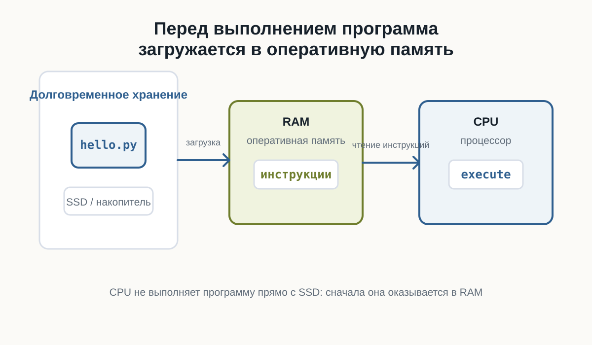
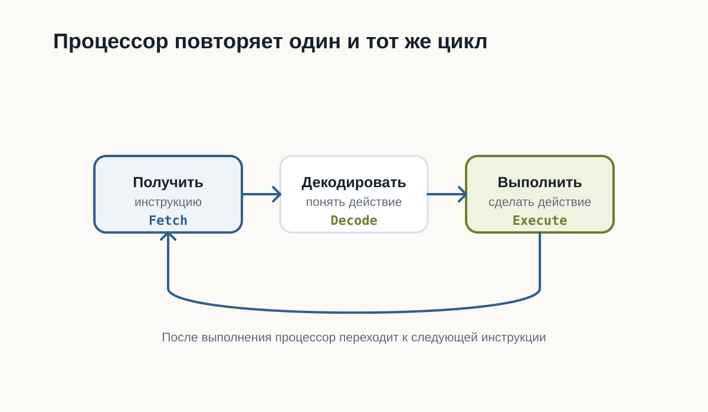
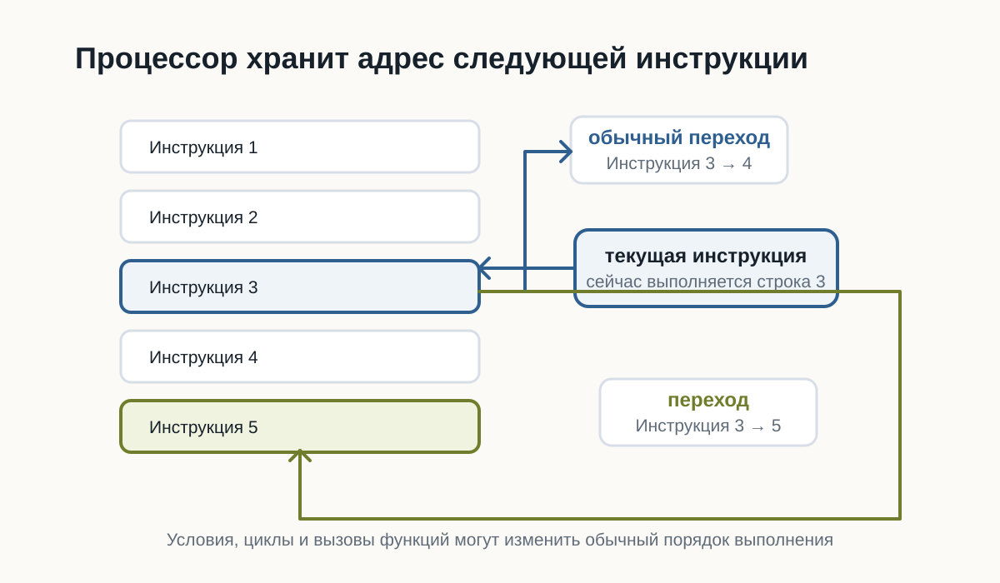
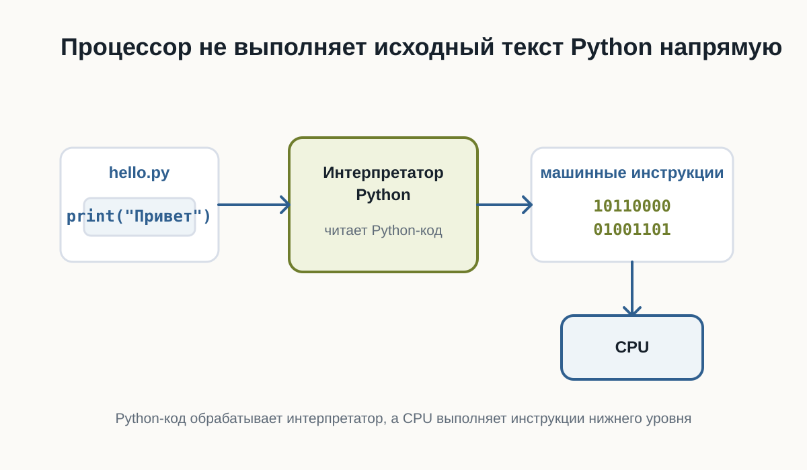

---
number-sections: false
---

# 2.4 Как компьютер выполняет программы {.unnumbered}

::: {.callout-important}
Главный вопрос главы:

**Если программа хранится в памяти как обычные данные, как процессор начинает её выполнять?**
:::

Когда вы запускаете программу, компьютер не «читает намерения».

Он выполняет конкретную последовательность действий: находит файл, загружает нужные данные в оперативную память и передаёт инструкции процессору.

## После этой главы вы сможете

- объяснить, что происходит после запуска программы;
- понимать разницу между файлом программы и работающим процессом;
- объяснить, зачем нужна оперативная память;
- понимать общий цикл работы процессора;
- объяснить, зачем Python-коду нужен интерпретатор.

## Программа — это инструкция для компьютера

Программа может храниться как обычный файл.

Например:

```text
hello.py
```

Внутри файла находится текст программы.

Сам файл ещё не выполняется. Он просто лежит на накопителе как данные.

Чтобы программа начала работать, операционная система должна подготовить её к выполнению.

## Где находится программа до запуска

До запуска программа обычно находится на SSD или другом накопителе.

Накопитель подходит для долговременного хранения:

- файлы не исчезают после выключения компьютера;
- данные можно хранить долго;
- можно открыть файл позже.

Но процессор не выполняет программу прямо с накопителя.

Перед выполнением нужные данные загружаются в оперативную память.

## Что происходит после запуска

После запуска операционная система создаёт процесс.

Процесс — это работающая программа вместе с ресурсами, которые ей выделены.

Например, процесс может использовать:

- оперативную память;
- файлы;
- ввод с клавиатуры;
- вывод в терминал.



Главная идея проста: файл программы хранится на накопителе, но во время работы программа находится в оперативной памяти, а процессор выполняет её инструкции.

## Как процессор выполняет инструкции

Процессор работает пошагово.

Он не выполняет всю программу сразу.

В упрощённом виде его работа выглядит как повторяющийся цикл:

1. получить очередную инструкцию;
2. понять, что она означает;
3. выполнить действие.



Этот цикл повторяется очень быстро.

Именно поэтому программа может выполнять тысячи, миллионы или миллиарды операций за короткое время.

## Откуда процессор знает, какую инструкцию выполнять

Процессор должен знать, какую инструкцию выполнить следующей.

Для этого он хранит указатель на текущую или следующую инструкцию.

Обычно после одной инструкции процессор переходит к следующей.

Но не всегда.

Условия, циклы и вызовы функций могут изменить порядок выполнения.



Это одна из причин, почему программа может не просто идти сверху вниз, а принимать решения и повторять действия.

## А где здесь Python?

Python-программа обычно хранится в файле с расширением `.py`.

Например:

```python
print("Привет")
```

Процессор не выполняет такой текст напрямую.

Python-код читает специальная программа — интерпретатор Python.

Когда вы запускаете команду:

```bash
python hello.py
```

вы просите интерпретатор Python прочитать файл `hello.py` и выполнить инструкции внутри него.



На этом этапе достаточно понимать общую идею: Python-код обрабатывает интерпретатор, а процессор выполняет инструкции более низкого уровня.

## Короткий итог

Программа хранится как файл.

После запуска операционная система создаёт процесс и загружает нужные данные в оперативную память.

Процессор получает инструкции, декодирует их и выполняет.

Python-код не выполняется процессором напрямую: между файлом `.py` и процессором находится интерпретатор Python.

## Практика

Объясните своими словами, чем отличается файл `hello.py` от запущенной программы.
