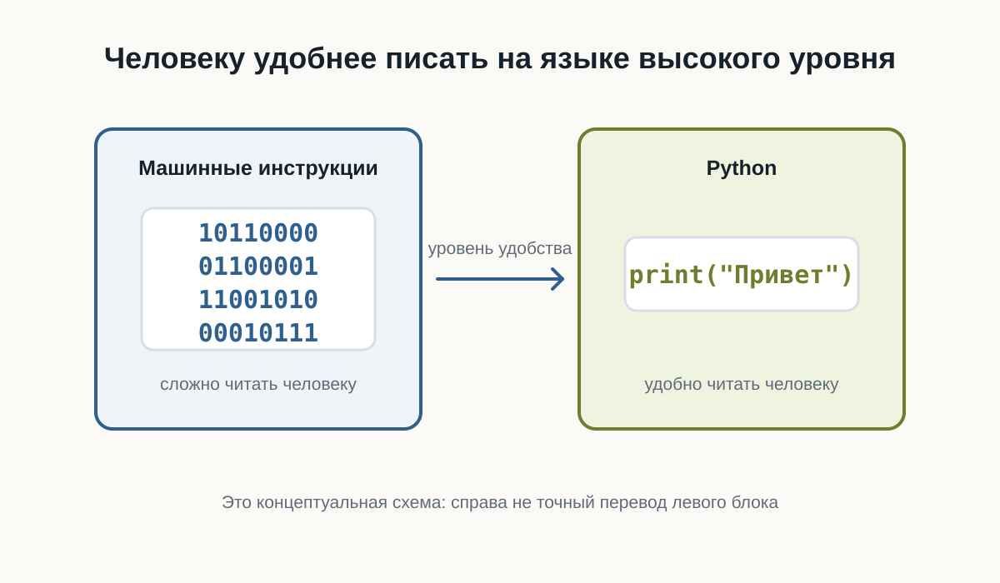
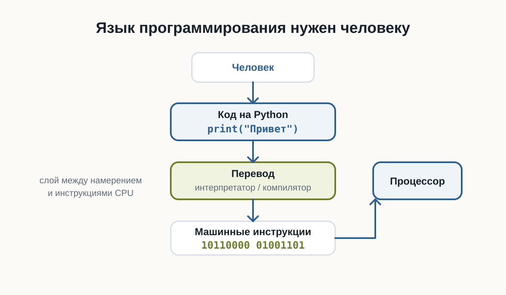
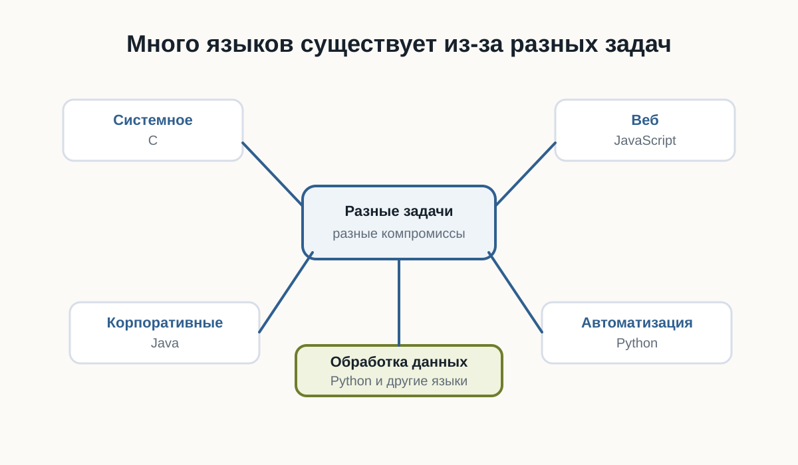
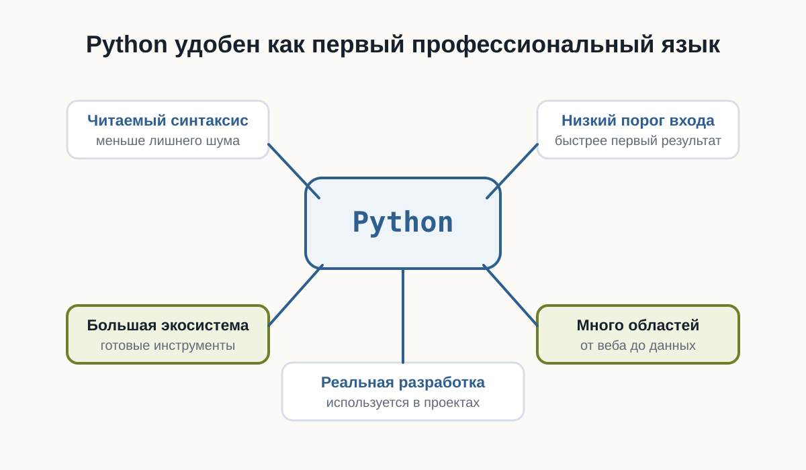
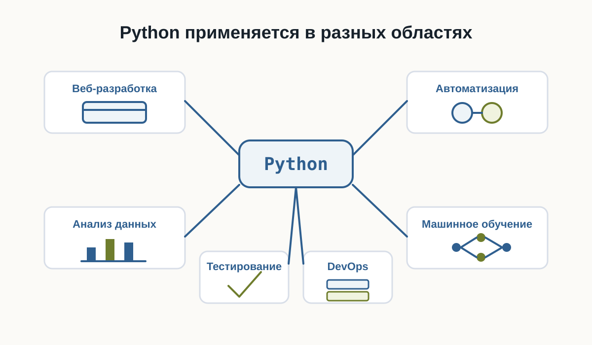

---
pagetitle: "Почему Python: язык для старта в программировании"
description: "Почему стоит изучать Python: простота синтаксиса, области применения, backend-разработка, автоматизация, анализ данных и первые шаги новичка."
keywords:
  - почему Python
  - Python для начинающих
  - изучать Python
  - области применения Python
  - backend Python
number-sections: false
---

# 2.5 Почему Python {.unnumbered}

::: {.callout-important}
Главный вопрос главы:

**Если существуют десятки языков программирования, почему мы начинаем именно с Python?**
:::

В предыдущих главах мы разобрались, как компьютер хранит данные и как процессор выполняет инструкции.

Теперь возникает следующий вопрос.

Если процессор в конечном счёте работает с машинными инструкциями, зачем человеку вообще нужен язык программирования?

И если языков программирования много, почему для этой книги выбран именно Python?

Чтобы ответить на этот вопрос, сначала нужно понять, зачем языки программирования появились вообще.

---

## Можно ли писать программы сразу на машинном языке

Технически — да.

Процессор выполняет машинные инструкции.

В самом низком уровне программа действительно превращается в последовательности чисел и битов.

Условно можно представить это так:

```text
10110000
01100001
11001010
00010111
```

Для процессора такой формат нормален.

Для человека — почти нет.

Попробуйте определить по этим битам:

- что делает программа;
- где начинается одна инструкция;
- где заканчивается другая;
- какое значение используется;
- что нужно изменить, чтобы программа работала иначе.

Даже небольшая программа быстро превратилась бы в огромную последовательность чисел.

Писать, читать и исправлять такой код было бы чрезвычайно сложно.



---

## Язык программирования нужен человеку

Язык программирования позволяет описывать действия компьютера в форме, которую человеку намного проще читать.

Например:

```python
print("Привет")
```

Эта строка гораздо понятнее, чем набор машинных инструкций.

Мы можем довольно быстро догадаться, что программа должна вывести текст.

Но процессор не понимает Python напрямую.

Поэтому между кодом программиста и процессором появляется ещё один слой.



Перевод выполняют специальные программы.

В зависимости от языка это могут быть:

- компиляторы;
- интерпретаторы;
- виртуальные машины;
- комбинации нескольких подходов.

Пока нам не нужно подробно разбираться в этих механизмах.

Важно понять главное:

> Язык программирования существует прежде всего для человека, а не для процессора.

---

## Почему языков программирования так много

Если один язык удобнее машинного кода, возникает естественный вопрос:

**Почему не существует одного языка для всех программ?**

Потому что разные задачи предъявляют разные требования.

Иногда важнее:

- максимальная скорость;
- полный контроль над памятью;
- безопасность;
- простота разработки;
- работа в браузере;
- удобство обработки данных;
- быстрая автоматизация.

Поэтому разные языки делают разные компромиссы.

Например:

- C позволяет работать близко к устройству компьютера;
- JavaScript стал основным языком программирования в браузере;
- Java широко используется в крупных приложениях;
- Python делает большой акцент на читаемости и скорости разработки.

Это не означает, что один язык лучше остальных.

У каждого инструмента есть область, в которой он особенно удобен.



---

## Почему для обучения выбран Python

Python хорошо подходит для знакомства с программированием по нескольким причинам.



Первая — **читаемость**.

Сравните простой фрагмент:

```python
age = 20

if age >= 18:
    print("Доступ разрешён")
```

Даже не зная Python, можно приблизительно понять смысл программы.

Синтаксис не скрывает основную идею за большим количеством служебных конструкций.

---

Вторая причина — **небольшой порог входа**.

Чтобы написать простую программу, обычно не требуется сначала изучать:

- сложную систему типов;
- управление памятью;
- структуру проекта;
- процесс компиляции;
- большое количество обязательного синтаксиса.

Это позволяет быстрее перейти к самому программированию:

- переменным;
- условиям;
- циклам;
- функциям;
- структурам данных;
- алгоритмам.

---

Третья причина — **Python остаётся профессиональным инструментом**.

Это важно.

Мы выбираем Python не только потому, что на нём удобно учиться.

Он используется в реальных проектах.

На Python пишут:

- серверные приложения;
- инструменты автоматизации;
- тесты;
- системы обработки данных;
- научные программы;
- инструменты DevOps;
- приложения машинного обучения;
- внутренние сервисы компаний.

Поэтому знания, полученные во время обучения, не становятся бесполезными после первых глав.

---

## Python не лучший язык для всего

Важно не создавать неправильное впечатление.

Python не является универсально лучшим языком.

Например, он может быть не лучшим выбором, когда требуется:

- писать драйвер устройства;
- создавать часть операционной системы;
- получать максимальную производительность на низком уровне;
- программировать микроконтроллер с очень ограниченной памятью;
- писать код, который должен напрямую выполняться в браузере.

В таких задачах могут лучше подходить другие языки.

Поэтому профессиональный разработчик выбирает язык не потому, что он ему нравится больше остальных.

Он выбирает инструмент под задачу.

---

## В чём сила Python

У Python есть ещё одно важное свойство.

Сам язык относительно компактный, но вокруг него существует огромная экосистема.

Это означает, что многие сложные задачи уже имеют готовые инструменты.

Например, вместо того чтобы самостоятельно писать всё с нуля, разработчик может использовать существующие библиотеки.

Условно:

```text
Python
  ↓
Библиотеки
  ↓
Готовые инструменты
  ↓
Решение задачи
```

Это позволяет сосредоточиться не на низкоуровневых деталях, а на самой задаче.

Именно поэтому Python часто используют для автоматизации и быстрого создания новых программ.

---

## Где используется Python

Python применяется в очень разных областях.



## Веб-разработка

На Python можно создавать серверную часть сайтов и API.

Например, программа может:

- принимать запрос;
- обращаться к базе данных;
- выполнять вычисления;
- возвращать результат пользователю.

---

## Автоматизация

Python часто используют для небольших программ и скриптов.

Например:

- переименовать тысячи файлов;
- обработать таблицы;
- собрать данные из нескольких источников;
- автоматически создать отчёт;
- проверить состояние серверов.

---

## Анализ данных

Python широко используется для работы с большими наборами данных.

Программы могут:

- читать данные;
- очищать их;
- выполнять вычисления;
- строить графики;
- искать закономерности.

---

## Машинное обучение

Большая часть современной экосистемы машинного обучения доступна через Python.

При этом сложные вычисления часто выполняются не самим Python.

Python используется как удобный интерфейс к высокопроизводительным библиотекам.

---

## Тестирование

Python также подходит для автоматического тестирования программ.

Вместо того чтобы каждый раз проверять программу вручную, можно написать другой код, который выполнит проверку автоматически.

---

## Простота не означает примитивность

Иногда простой синтаксис создаёт впечатление, что Python — это только учебный язык.

Это не так.

Простой язык и простая задача — не одно и то же.

На Python можно написать:

```python
print("Привет")
```

а можно построить сложную систему из:

- десятков сервисов;
- баз данных;
- очередей сообщений;
- фоновых процессов;
- API;
- автоматических тестов.

Сложность реальной разработки появляется не только в синтаксисе языка.

Она появляется в архитектуре, данных, взаимодействии компонентов и требованиях к системе.

---

## Что именно мы будем изучать

Наша цель — не просто выучить команды Python.

Важно научиться мыслить как разработчик.

Поэтому дальше мы будем постепенно разбирать:

- как хранить данные в программе;
- как принимать решения;
- как повторять действия;
- как разбивать программу на функции;
- как работать со структурами данных;
- как организовывать код;
- как находить и исправлять ошибки;
- как тестировать программы.

Python будет нашим инструментом для изучения этих идей.

---

## Что важно запомнить

Процессору не нужен Python.

Процессор выполняет машинные инструкции.

Python нужен нам, потому что писать программу на языке высокого уровня намного удобнее, чем непосредственно на машинном коде.

При этом Python:

- относительно легко читать;
- имеет небольшой порог входа;
- позволяет быстро писать программы;
- используется в реальной разработке;
- имеет большую экосистему библиотек;
- подходит для множества разных задач.

Но самое важное:

> Мы изучаем не только Python. Мы изучаем программирование с помощью Python.

---

## Что дальше?

Теперь понятно, почему для этой книги выбран Python.

Следующий вопрос уже практический.

**Что нужно установить и настроить, чтобы начать писать программы на Python?**

Этому посвящена следующая глава:

**«Рабочее пространство Python-разработчика».**
