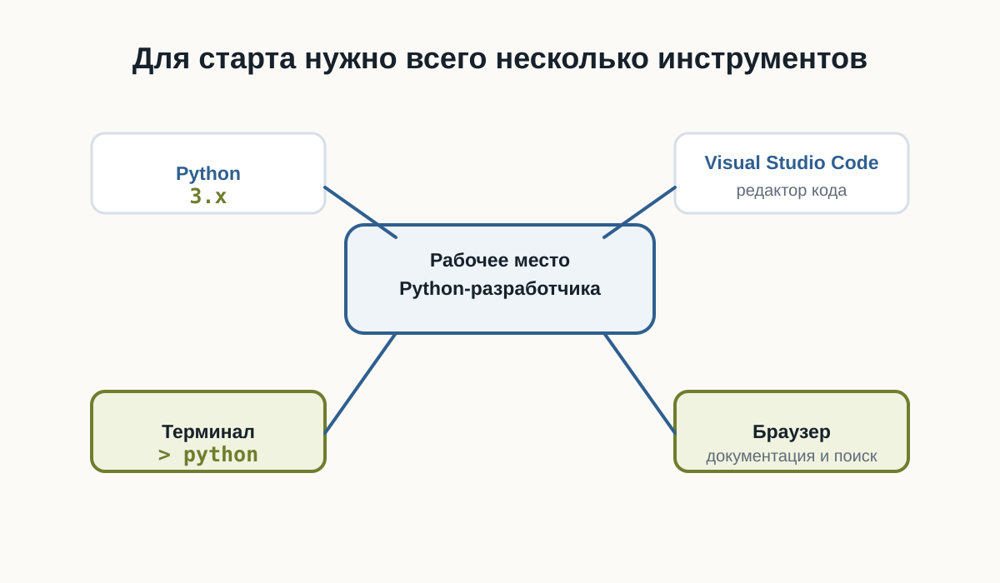
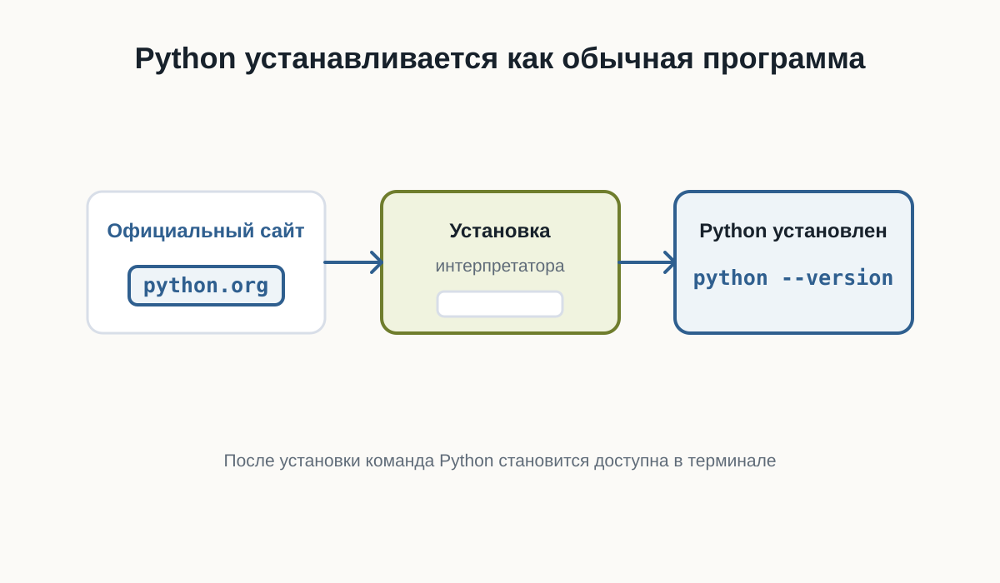
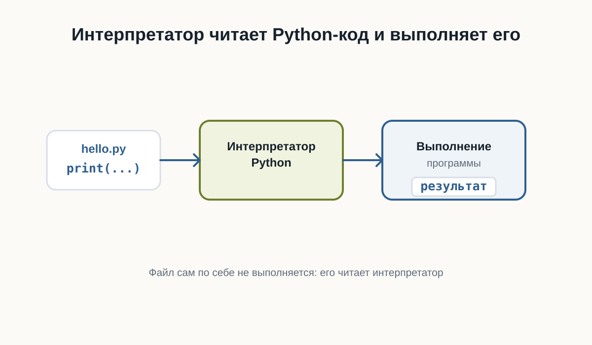
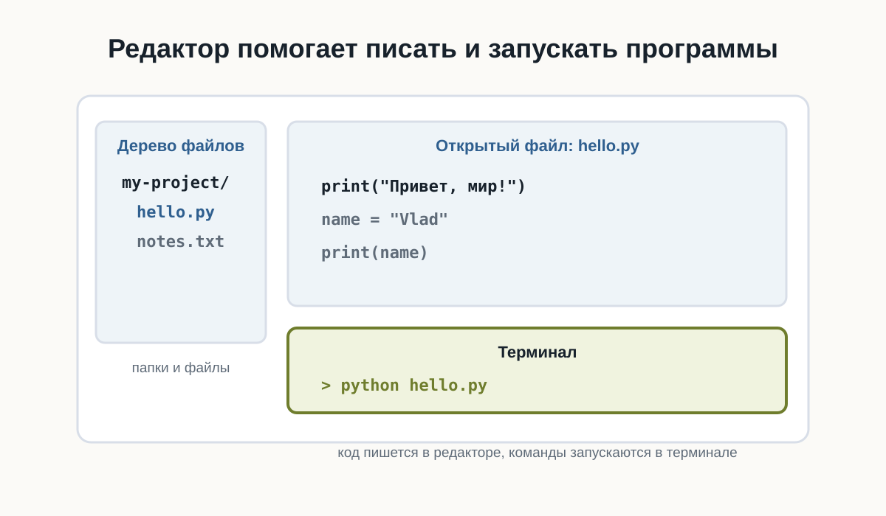
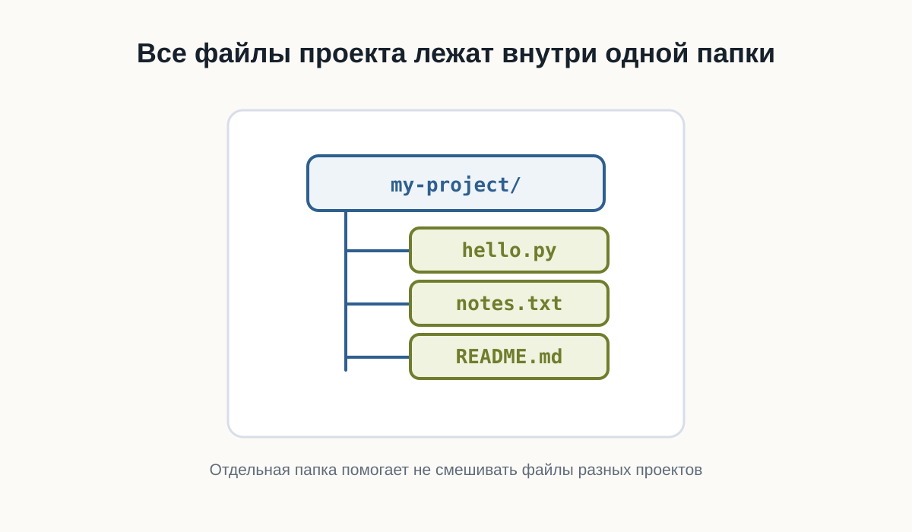

# 2.6 Рабочее пространство Python {.unnumbered}

Перед тем как писать программы, нужно подготовить рабочее пространство.

Рабочее пространство - это набор инструментов и папок, в которых вы будете писать, запускать и хранить код.

## После этой главы вы сможете

- понимать, зачем нужен редактор кода;
- понимать роль терминала;
- создать папку проекта;
- объяснить, зачем нужно виртуальное окружение.

## Основные инструменты

Для начала нужны:

- установленный Python;
- Visual Studio Code или другой редактор кода;
- терминал;
- браузер;
- папка проекта.

Этого достаточно, чтобы написать и запустить первую программу.



## Где скачать Python

Python скачивают с официального сайта проекта.

Важно понимать: Python устанавливается на компьютер как отдельная программа.

После установки его можно запускать из терминала.



## Python — это интерпретатор

Когда вы запускаете файл `.py`, его читает интерпретатор Python.

Именно интерпретатор понимает Python-код и выполняет программу.



## Что такое редактор кода

Редактор кода помогает писать программы, открывать файлы проекта и запускать команды.

На первом этапе достаточно понимать основные части редактора: дерево файлов, область кода и терминал.



## Структура рабочего проекта

Каждый проект лучше хранить в отдельной папке.

Например:

```text
python-start/
```

Внутри будут лежать файлы программы, заметки, настройки и позже зависимости.



## Терминал

Терминал позволяет запускать команды.

Например:

```bash
python --version
```

Эта команда показывает установленную версию Python.

## Виртуальное окружение

Позже у разных проектов могут появиться разные зависимости.

Чтобы они не мешали друг другу, используют виртуальные окружения.

::: {.callout-note title="Пока достаточно понимать идею"}
На первом шаге важно знать, что виртуальное окружение изолирует зависимости проекта. Подробно мы разберем это позже.
:::

## Короткий итог

Рабочее пространство помогает держать код в порядке.

Редактор нужен для написания кода, терминал - для запуска команд, папка проекта - для организации файлов.

## Практика

Создайте папку `python-start` и проверьте в терминале версию Python командой `python --version`.
