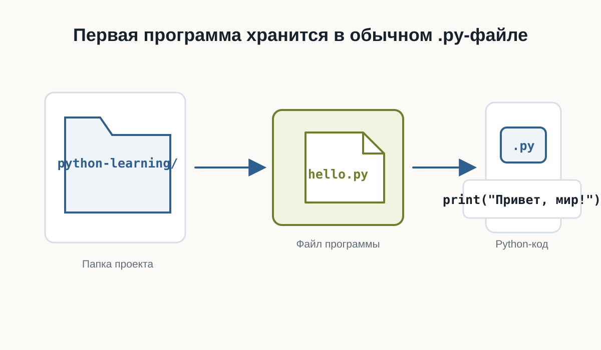
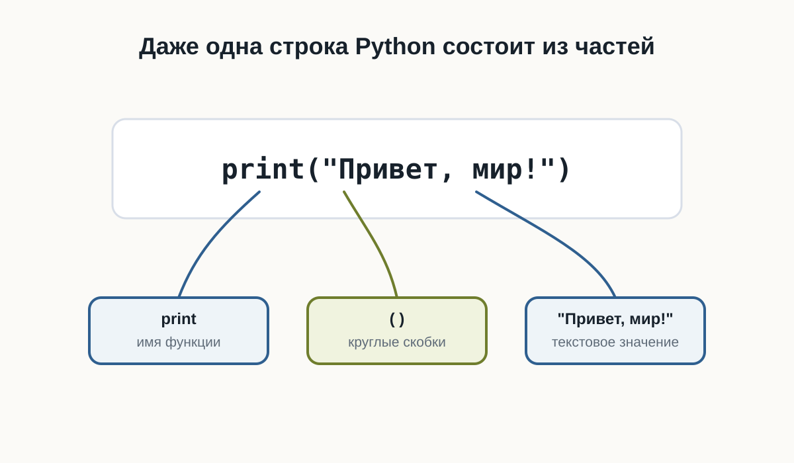
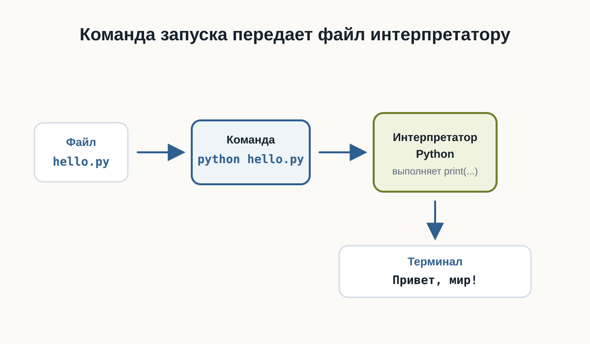
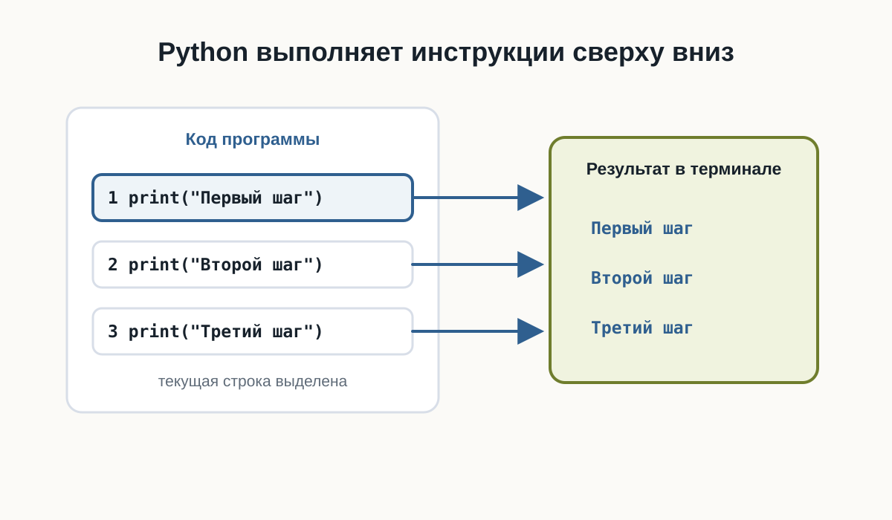
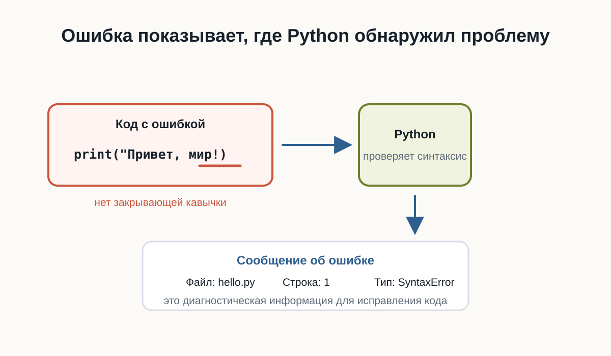
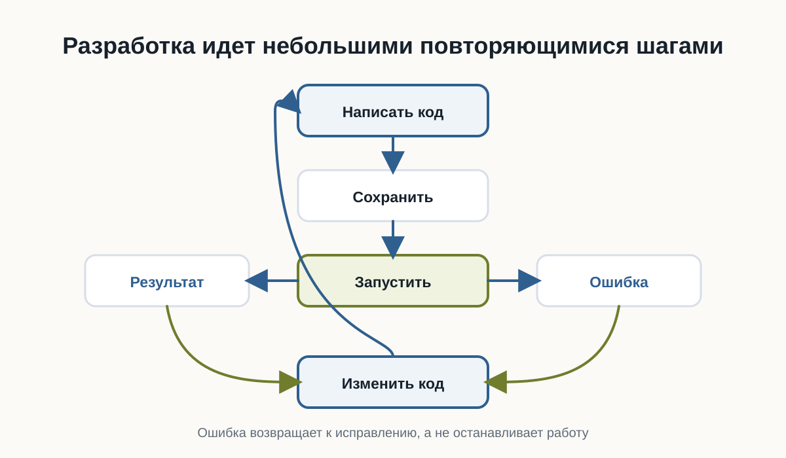

# 2.7 Первая программа на Python {.unnumbered}

::: {.callout-important}
Главный вопрос главы:

**Как написать, запустить и понять свою первую программу на Python?**
:::

Мы уже подготовили рабочее пространство.

Теперь можно перейти от объяснений к настоящему коду.

В этой главе мы создадим простой Python-файл, запустим его из терминала и разберём, что именно происходит на каждом этапе.

Наша первая программа будет очень маленькой.

Но путь её выполнения почти такой же, как у гораздо более сложных Python-приложений.

---

## Создаём файл программы

Создайте рабочую папку для первых экспериментов.

Например:

```text
python-learning/
```

Внутри неё создайте файл:

```text
hello.py
```

Расширение `.py` означает, что файл содержит исходный код на Python.

В результате структура папки будет выглядеть так:

```text
python-learning/
└── hello.py
```



Теперь откройте `hello.py` в редакторе кода.

---

## Пишем первую строку Python

Добавьте в файл:

::: {.content-visible when-format="html"}
::: {.python-playground data-source="../examples/chapter07/hello.py" data-title="Первая программа"}
:::
:::

::: {.content-visible when-format="pdf"}
```python

```
:::

::: {.callout-tip title="Попробуйте сами"}
Измените текст внутри кавычек, добавьте второй `print()` и запустите пример снова.
:::

Сохраните изменения.

Это уже полноценная программа на Python.

Она содержит одну инструкцию.

Её задача — вывести текст на экран.

---

## Что делает `print`

В выражении

```python
print("Привет, мир!")
```

можно выделить несколько частей.

`print` — это имя функции.

Круглые скобки:

```text
()
```

используются для передачи функции данных.

А текст:

```text
"Привет, мир!"
```

находится внутри кавычек.

Так Python понимает, что перед ним текстовое значение.

Пока не нужно подробно изучать функции и строки.

Мы разберём их позже.

Сейчас достаточно понимать:

> `print(...)` просит Python вывести переданное значение.



---

## Запускаем программу

Откройте терминал в папке проекта.

Убедитесь, что терминал находится в каталоге, где лежит файл:

```text
hello.py
```

Теперь выполните:

```text
python hello.py
```

В некоторых системах команда может называться:

```text
python3 hello.py
```

Если всё работает правильно, терминал выведет:

```text
Привет, мир!
```

Первая программа выполнена.

---

## Что произошло после команды запуска

Команда

```text
python hello.py
```

содержит две важные части.

Первая:

```text
python
```

указывает, какую программу нужно запустить.

Это интерпретатор Python.

Вторая:

```text
hello.py
```

указывает, какой файл нужно передать интерпретатору.

Поэтому команду можно мысленно прочитать так:

```text
Запусти Python и попроси его выполнить hello.py
```

После этого происходит примерно следующая последовательность:



---

## Код и результат — не одно и то же

Это важное различие.

Файл:

```python
print("Привет, мир!")
```

содержит **код программы**.

А строка:

```text
Привет, мир!
```

является **результатом выполнения программы**.

Код описывает, что компьютер должен сделать.

Результат появляется после выполнения кода.

Позже одна программа сможет:

- принимать данные;
- выполнять вычисления;
- работать с файлами;
- обращаться к сети;
- принимать решения;
- возвращать разные результаты.

Но принцип останется тем же.

---

## Добавим ещё одну инструкцию

Изменим программу:

```python
print("Привет, мир!")
print("Я изучаю Python")
```

Теперь снова запустим:

```text
python hello.py
```

Результат:

```text
Привет, мир!
Я изучаю Python
```

Python выполнил инструкции сверху вниз.

Сначала первую:

```python
print("Привет, мир!")
```

затем вторую:

```python
print("Я изучаю Python")
```

Это один из фундаментальных принципов выполнения программ.

По умолчанию инструкции выполняются последовательно.

---

## Порядок инструкций имеет значение

Рассмотрим программу:

::: {.content-visible when-format="html"}
::: {.python-playground data-source="../examples/chapter07/sequential.py" data-title="Последовательное выполнение"}
:::
:::

::: {.content-visible when-format="pdf"}
```python

```
:::

Результат будет:

```text
Первый шаг
Второй шаг
Третий шаг
```

Если изменить порядок строк:

```python
print("Третий шаг")
print("Первый шаг")
print("Второй шаг")
```

изменится и результат:

```text
Третий шаг
Первый шаг
Второй шаг
```

Компьютер не пытается догадаться, какой порядок имел в виду программист.

Он выполняет инструкции в том порядке, который указан в программе.



::: {.callout-tip title="Попробуйте сами"}
Поменяйте строки местами, запустите пример снова и сравните порядок вывода.
:::

---

## Программа должна быть записана точно

Попробуйте убрать одну кавычку:

::: {.content-visible when-format="html"}
::: {.python-playground data-source="../examples/chapter07/syntax_error.py" data-title="Синтаксическая ошибка"}
:::
:::

::: {.content-visible when-format="pdf"}
```python

```
:::

::: {.callout-tip title="Попробуйте сами"}
Запустите пример с ошибкой, затем исправьте кавычку и запустите ещё раз.
:::

Python не сможет выполнить такую программу.

Он сообщит об ошибке.

Это происходит потому, что исходный код должен соответствовать правилам языка.

Эти правила называются **синтаксисом**.

Как и в естественном языке, форма записи имеет значение.

Но компьютер гораздо строже человека.

Он не пытается догадаться, что вы хотели написать.



---

## Ошибка — часть программирования

Сообщение об ошибке не означает, что произошло что-то необычное.

Ошибки постоянно возникают во время разработки.

Например:

```python
print("Привет"
```

Python может сообщить о синтаксической ошибке.

Это полезная информация.

Интерпретатор показывает, что программу невозможно разобрать согласно правилам языка.

Работа разработчика часто выглядит так:



Этот цикл будет повторяться на протяжении всей книги.

И в профессиональной разработке происходит то же самое.

---

## Читайте сообщения об ошибках

Начинающие разработчики иногда видят красный текст в терминале и сразу считают его проблемой.

На самом деле сообщение об ошибке — это подсказка.

Например, оно может показать:

- тип ошибки;
- файл, в котором она возникла;
- номер строки;
- дополнительное описание.

Позже мы научимся читать такие сообщения подробно.

Пока важно привыкнуть к простой мысли:

> Ошибка — это информация о том, почему программа не смогла выполнить ожидаемое действие.

---

## Первый маленький эксперимент

Измените текст внутри программы самостоятельно.

Например:

```python
print("Меня зовут Алекс")
print("Сегодня я написал первую программу")
print("Следующая цель — понять переменные")
```

Запустите файл ещё раз.

Затем:

1. поменяйте порядок строк;
2. добавьте ещё один `print`;
3. удалите одну строку;
4. измените текст;
5. специально допустите ошибку в кавычках;
6. прочитайте сообщение Python;
7. исправьте ошибку и снова запустите программу.

Это простое упражнение важнее, чем может показаться.

Вы уже проходите основной цикл разработки:

```text
написать → запустить → посмотреть → изменить → запустить снова
```

---

## Практика: программа-визитка

Создайте новый файл:

```text
about_me.py
```

Напишите программу, которая выводит несколько строк о вас.

Например:

::: {.content-visible when-format="html"}
::: {.python-playground data-source="../examples/chapter07/business_card.py" data-title="Программа-визитка"}
:::
:::

::: {.content-visible when-format="pdf"}
```python

```
:::

Запустите:

```text
python about_me.py
```

Проверьте результат.

Затем измените программу так, чтобы она содержала не менее пяти строк вывода.

::: {.callout-tip}
Не копируйте пример полностью.

Введите собственные значения и несколько раз измените программу.

Сейчас важнее привыкнуть самостоятельно редактировать, сохранять и запускать `.py`-файлы.
:::

---

## Не бойтесь экспериментировать

Одно из преимуществ программирования — большинство экспериментов легко отменить.

Можно:

- изменить строку;
- запустить программу;
- посмотреть результат;
- вернуть код обратно;
- попробовать другой вариант.

Именно через такие небольшие эксперименты появляется понимание поведения языка.

Не ограничивайтесь только примерами из книги.

Если возникает вопрос:

> А что произойдёт, если я напишу вот так?

попробуйте.

---

## Что мы уже умеем

После этой главы вы уже способны пройти полный путь небольшой программы:

```text
Идея
  ↓
Файл .py
  ↓
Python-код
  ↓
Запуск через интерпретатор
  ↓
Результат в терминале
```

Вы также знаете, что:

- Python-программа хранится в `.py`-файле;
- `print()` позволяет вывести значение;
- интерпретатор выполняет программу;
- инструкции обычно выполняются сверху вниз;
- синтаксис должен быть записан точно;
- ошибки являются нормальной частью разработки;
- программу удобно создавать небольшими итерациями.

---

## Что важно запомнить

Первая программа:

```python
print("Привет, мир!")
```

очень маленькая.

Но в ней уже присутствуют основные элементы процесса разработки:

1. исходный код;
2. файл программы;
3. интерпретатор;
4. запуск;
5. выполнение инструкции;
6. результат;
7. возможные ошибки;
8. исправление и повторный запуск.

Именно из таких простых действий постепенно строятся большие программы.

---

## Что дальше?

Мы научились запускать код.

Но пока наши программы умеют только выводить заранее записанный текст.

Следующий важный вопрос:

**Как программе запоминать значения и работать с ними?**

Для этого нам понадобится одна из основных идей программирования:

**переменные.**
