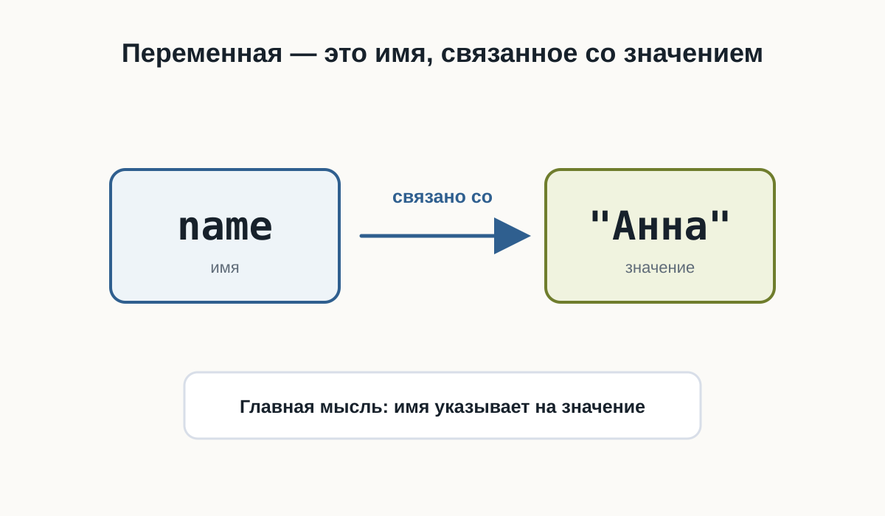
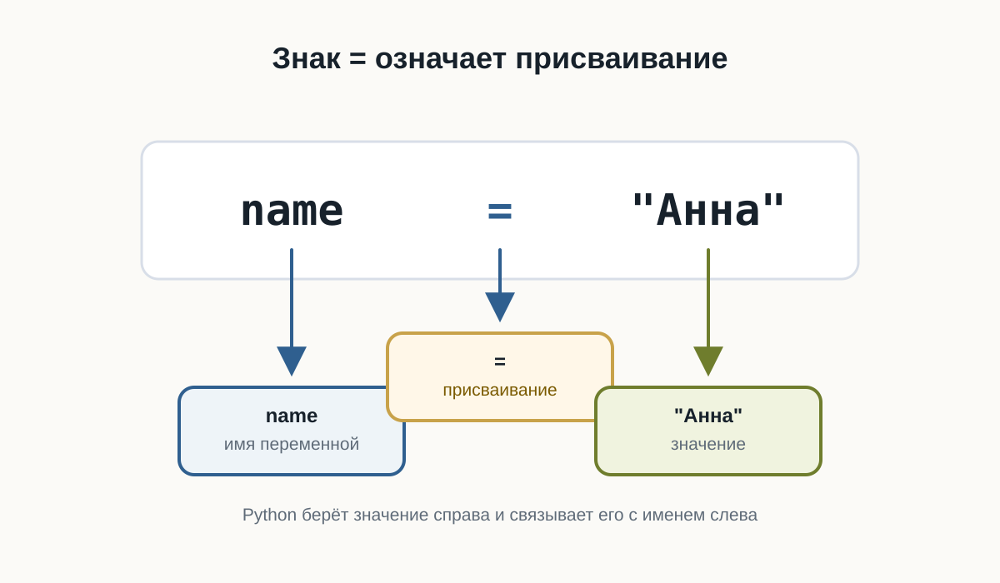
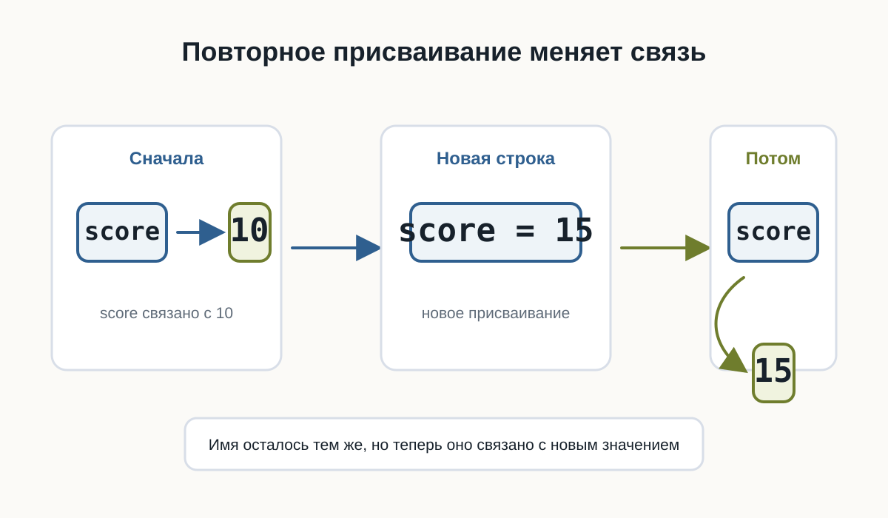

# 3.1 Переменные {.unnumbered}

::: {.callout-important}
Главный вопрос главы:

**Как программа запоминает данные?**
:::

В первой программе мы уже передавали Python готовые значения:

```python
print("Привет!")
print(25)
```

Но настоящие программы редко работают только с данными, которые заранее написаны прямо в коде.

Программе часто нужно помнить имя пользователя, город, текущий счёт, выбранный язык или другое значение.

Для этого в Python используются **переменные**.

## Значению можно дать имя

Представим, что в программе несколько раз используется имя пользователя:

```python
print("Анна")
print("Привет, Анна!")
print("Анна вошла в систему")
```

Такой код работает, но значение `"Анна"` повторяется несколько раз.

Если имя понадобится изменить, придётся искать и исправлять каждое место.

Вместо этого значению можно дать имя:

```python
name = "Анна"
```

Теперь это имя можно использовать в программе:

```python
name = "Анна"

print(name)
print("Привет,", name)
```

Результат:

```text
Анна
Привет, Анна
```

`name` — это **переменная**.

Переменная — это имя, связанное со значением.

В нашем примере:

```text
name -> "Анна"
```

Когда Python встречает `name`, он использует значение, связанное с этим именем.

{fig-alt="Переменная name связана со значением Анна"}

## Что означает знак `=`

Посмотрим ещё раз:

```python
name = "Анна"
```

Знак `=` здесь не означает математическое равенство.

В Python он используется для **присваивания**.

Эту строку можно прочитать так:

> связать имя `name` со значением `"Анна"`.

Слева от `=` находится имя переменной.

Справа от `=` находится значение.

Python берёт значение справа и связывает его с именем слева.

Например:

```python
age = 25
temperature = 21.5
city = "Вена"
```

После выполнения этих строк можно представить связи так:

```text
age         -> 25
temperature -> 21.5
city        -> "Вена"
```

{fig-alt="Python связывает имя переменной со значением справа от знака присваивания"}

::: {.callout-note}
Для начала достаточно помнить простое правило:

**слева от `=` находится имя переменной, справа — значение.**
:::

## Переменную можно использовать много раз

Главная польза переменной становится заметна, когда одно значение используется в нескольких местах.

```python
name = "Миша"

print("Привет,", name)
print("Рады тебя видеть,", name)
print("До встречи,", name)
```

Результат:

```text
Привет, Миша
Рады тебя видеть, Миша
До встречи, Миша
```

Если теперь нужно изменить имя, достаточно исправить одну строку:

```python
name = "Оля"
```

Остальной код менять не придётся.

Переменные позволяют программе работать с данными через понятные имена.

## Значение переменной можно изменить

Имя может быть связано с одним значением, а позже — с другим.

```python
score = 10
print(score)

score = 15
print(score)
```

Результат:

```text
10
15
```

Сначала:

```text
score -> 10
```

После новой строки:

```python
score = 15
```

связь становится другой:

```text
score -> 15
```

{fig-alt="Переменная score сначала связана со значением 10, а затем со значением 15"}

Это называется **повторным присваиванием**.

## Python использует текущее значение

Python выполняет программу строка за строкой и использует то значение, которое связано с именем в данный момент.

```python
message = "Начало"
print(message)

message = "Конец"
print(message)
```

Результат:

```text
Начало
Конец
```

Первый `print()` использует значение `"Начало"`.

Второй `print()` использует уже новое значение `"Конец"`.

## Имена переменных должны быть понятными

Сравните:

```python
x = 25
```

и:

```python
age = 25
```

Обе строки работают.

Но во втором случае сразу понятнее, что означает число `25`.

Поэтому лучше использовать имена, которые объясняют смысл значения:

```python
user_name = "Анна"
product_price = 120
player_score = 50
```

а не:

```python
a = "Анна"
b = 120
c = 50
```

Чем больше программа, тем важнее понятные имена.

## Как можно называть переменные

Простые имена выглядят так:

```python
name = "Анна"
age = 25
score = 100
```

Если имя состоит из нескольких слов, обычно используют символ `_`:

```python
user_name = "Анна"
player_score = 100
product_price = 49
```

Такой стиль называется `snake_case`.

Для начала достаточно соблюдать несколько правил:

- использовать буквы, цифры и `_`;
- не начинать имя с цифры;
- не использовать пробелы;
- выбирать имя, которое объясняет смысл значения.

Например:

```python
user_name = "Маша"
```

работает.

А такие варианты использовать нельзя:

```python
2name = "Маша"
user name = "Маша"
```

Python не сможет правильно разобрать такой код.

::: {.callout-tip}
Не пытайтесь делать имена максимально короткими.

Лучше написать:

```python
player_score = 100
```

чем:

```python
ps = 100
```

если длинное имя делает код понятнее.
:::

## Попробуйте сами

Создайте несколько переменных:

```python
name = "Алекс"
city = "Москва"
age = 20

print(name)
print(city)
print(age)
```

Запустите программу.

Затем:

1. измените имя;
2. измените город;
3. измените возраст;
4. запустите программу ещё раз.

Обратите внимание: команды `print()` менять не приходится.

Теперь добавьте ещё одну переменную:

```python
language = "Python"
```

и выведите её значение.

## Практика: карточка разработчика

Создайте программу, которая хранит информацию о начинающем Python-разработчике.

::: {.content-visible when-format="html"}
::: {.python-playground data-source="../examples/chapter08/developer_card.py" data-title="Карточка разработчика"}
:::
:::

::: {.content-visible when-format="pdf"}
```python

```
:::

Измените значения и запустите программу ещё раз.

## Практика: изменение счёта

Создайте переменную `score`, несколько раз присвойте ей новое значение и после каждого изменения выводите результат.

::: {.content-visible when-format="html"}
::: {.python-playground data-source="../examples/chapter08/score.py" data-title="Изменение счёта"}
:::
:::

::: {.content-visible when-format="pdf"}
```python

```
:::

Каждое новое присваивание связывает имя `score` с новым значением.

## Что важно запомнить

- переменная — это имя, связанное со значением;
- `=` используется для присваивания;
- слева от `=` находится имя переменной;
- справа находится значение;
- значение, связанное с именем, можно изменить;
- Python выполняет код сверху вниз;
- понятные имена делают программу легче для чтения;
- имена из нескольких слов обычно записывают в стиле `snake_case`.

Главная идея главы:

```text
имя -> значение
```

Например:

```text
name  -> "Анна"
score -> 100
age   -> 25
```

## Что дальше?

Теперь мы умеем давать данным имена.

Но наши переменные уже содержали разные значения:

```python
name = "Анна"
age = 25
temperature = 21.5
```

`"Анна"`, `25` и `21.5` выглядят по-разному — и Python работает с ними по-разному.

В следующей главе разберёмся:

> **Какие данные может хранить программа?**
