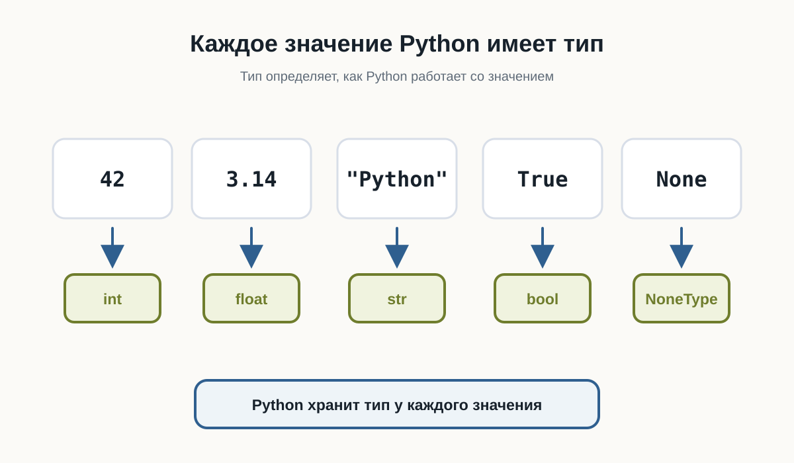
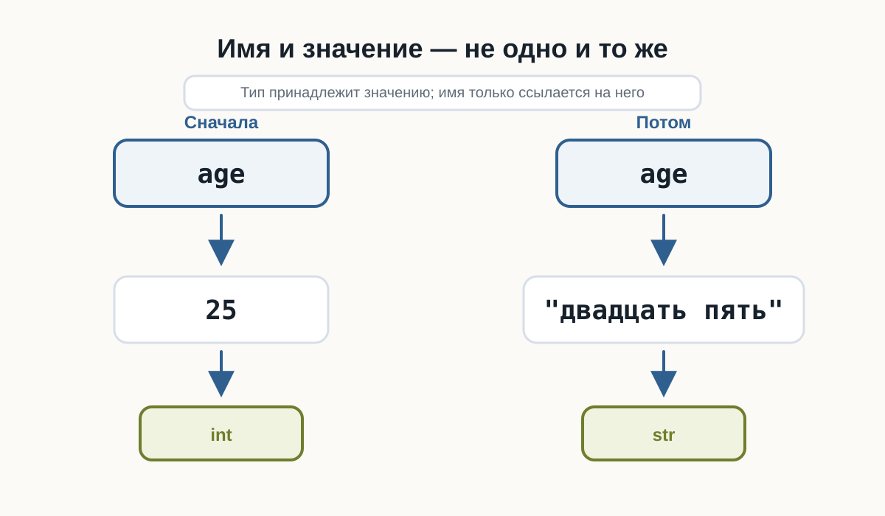
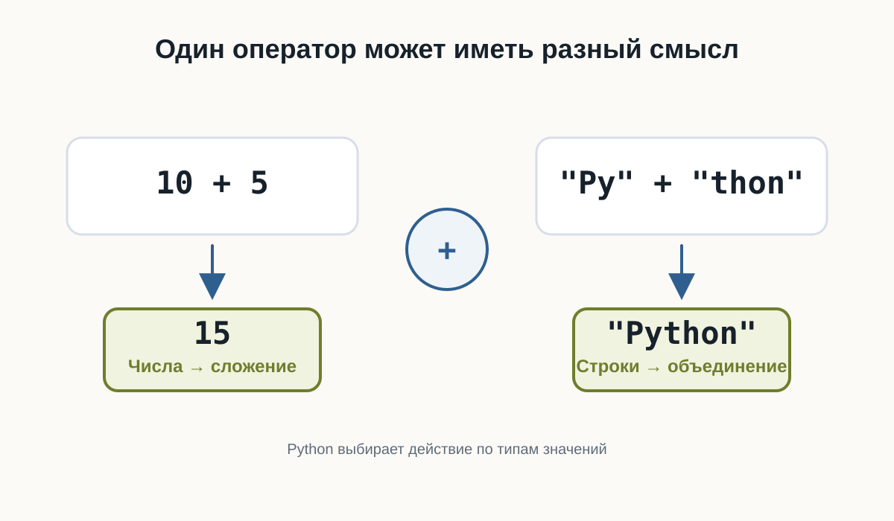
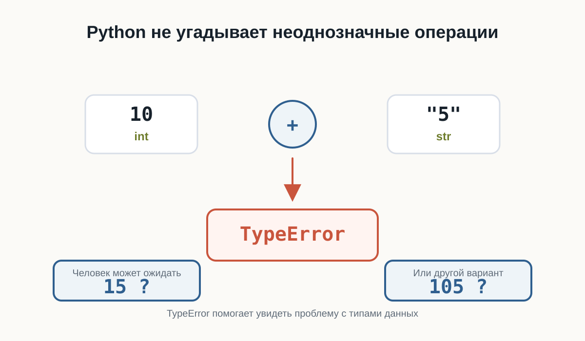
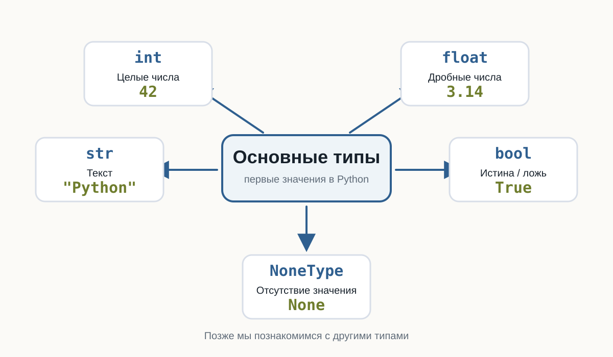

---
pagetitle: "Типы данных в Python: str, int, float и bool"
description: "Типы данных в Python для начинающих: строки, целые и дробные числа, логические значения, type(), ошибки типов и поведение операторов."
keywords:
  - типы данных Python
  - str Python
  - int Python
  - float Python
  - bool Python
  - type Python
number-sections: true
---

# 3.2 Типы данных {.unnumbered}

::: {.callout-important}
Главный вопрос главы:

**Как Python понимает, что значение является числом, текстом или логическим значением — и почему это важно?**
:::

В предыдущей главе мы познакомились с переменными.

Мы уже можем сохранить значение:

```python
name = "Анна"
age = 25
```

Но эти два значения отличаются друг от друга.

`"Анна"` — текст.

`25` — число.

Для человека разница очевидна.

Но Python тоже должен её понимать.

Почему?

Потому что с разными данными можно выполнять разные действия.

Например, числа можно складывать:

```python
10 + 5
```

а текст можно объединять:

```python
"Py" + "thon"
```

В обоих случаях используется знак `+`, но результат получается разным.

Чтобы понимать, как работать со значением, Python хранит информацию о его **типе**.

---

## Что такое тип данных

Тип данных описывает, **что представляет собой значение и какие операции с ним допустимы**.

Рассмотрим несколько значений:

```python
42
3.14
"Python"
True
```

Для человека это:

- целое число;
- дробное число;
- текст;
- логическое значение.

Python различает их примерно так же.

У каждого значения есть свой тип.

```text
42          → int
3.14        → float
"Python"    → str
True        → bool
```

Названия `int`, `float`, `str` и `bool` мы скоро разберём подробнее.

Пока важна сама идея:

> Тип сообщает Python, что это за значение и как с ним можно работать.

{fig-alt="Значения 42, 3.14, Python, True и None связаны с типами int, float, str, bool и NoneType"}

---

## Тип принадлежит значению

Здесь есть важный момент.

Посмотрим на код:

```python
age = 25
```

Иногда говорят:

> `age` — переменная типа `int`.

Для первого знакомства это допустимое упрощение.

Но точнее будет сказать так:

> Имя `age` сейчас ссылается на значение `25`, а значение `25` имеет тип `int`.

Почему это важно?

Потому что позже мы можем написать:

```python
age = 25
age = "двадцать пять"
```

Сначала имя `age` связано с целым числом.

Затем — с текстом.

Само имя не навсегда привязано к одному типу.

{fig-alt="Имя age сначала ссылается на значение 25 типа int, затем на строку двадцать пять типа str"}

---

## Python определяет тип автоматически

В некоторых языках программист заранее указывает тип переменной.

Например, концептуально это может выглядеть так:

```text
целое число age = 25
```

В Python обычно достаточно написать:

```python
age = 25
```

Python видит значение `25` и сам определяет его тип.

То же самое происходит здесь:

```python
price = 19.99
language = "Python"
is_learning = True
```

Python определит:

```text
19.99      → float
"Python"   → str
True        → bool
```

Нам не нужно отдельно сообщать ему тип каждого значения.

Такой подход делает первые программы компактнее.

---

## Как узнать тип значения

Python предоставляет встроенную функцию `type()`.

Например:

```python
print(type(42))
```

Результат будет примерно таким:

```text
<class 'int'>
```

Для текста:

```python
print(type("Python"))
```

получим:

```text
<class 'str'>
```

Можно проверить и значение, связанное с переменной:

```python
age = 25

print(type(age))
```

Результат:

```text
<class 'int'>
```

Пока слово `class` можно не разбирать.

Мы вернёмся к классам значительно позже.

Сейчас достаточно смотреть на часть:

```text
int
```

или:

```text
str
```

Она сообщает тип значения.

::: {.callout-tip title="Попробуйте сами"}
Создайте несколько переменных:

```python
age = 25
height = 1.82
name = "Анна"
is_student = True
```

Используйте `type()` и посмотрите тип каждого значения.

Попробуйте заранее предположить результат до запуска программы.
:::

---

## Целые числа: `int`

Целые числа в Python имеют тип:

```text
int
```

Название происходит от английского слова *integer* — целое число.

Примеры:

```python
0
1
42
-10
1000000
```

Все они имеют тип `int`.

```python
print(type(42))
print(type(-10))
```

Целые числа можно использовать в арифметических операциях:

```python
a = 10
b = 3

print(a + b)
print(a - b)
print(a * b)
```

Результат:

```text
13
7
30
```

Размер числа при этом не определяет другой тип.

Например:

```python
small = 10
large = 1000000000000000000000000000000
```

Оба значения являются `int`.

---

## Дробные числа: `float`

Для чисел с дробной частью Python использует тип:

```text
float
```

Например:

```python
3.14
0.5
-10.25
```

Важно использовать **точку**, а не запятую:

```python
price = 19.99
```

Проверим тип:

```python
print(type(price))
```

Результат:

```text
<class 'float'>
```

`int` и `float` — разные типы, но оба представляют числа.

Поэтому Python позволяет использовать их вместе:

```python
total = 10 + 2.5

print(total)
```

Результат:

```text
12.5
```

Об особенностях вычислений с дробными числами мы поговорим отдельно, когда начнём глубже работать с числами.

---

## Текст: `str`

Текстовые значения имеют тип:

```text
str
```

Название происходит от слова *string* — строка.

Строка записывается в кавычках:

```python
"Python"
```

или:

```python
'Python'
```

Например:

```python
name = "Анна"
language = "Python"

print(type(name))
print(type(language))
```

Оба значения имеют тип `str`.

Очень важно понимать разницу между:

```python
42
```

и:

```python
"42"
```

Выглядят они похоже.

Но первое значение — число:

```text
int
```

а второе — текст:

```text
str
```

Для Python это принципиально разные данные.

---

## Одинаково выглядит — разный смысл

Рассмотрим:

```python
number = 42
text = "42"
```

Если вывести значения:

```python
print(number)
print(text)
```

мы увидим:

```text
42
42
```

На экране они выглядят одинаково.

Но проверим тип:

```python
print(type(number))
print(type(text))
```

Получим:

```text
<class 'int'>
<class 'str'>
```

Именно тип определяет, какие действия Python будет выполнять с этими значениями.

---

## Один оператор может работать по-разному

Посмотрим на числа:

```python
print(10 + 5)
```

Результат:

```text
15
```

Python выполняет сложение.

Теперь используем строки:

```python
print("Py" + "thon")
```

Результат:

```text
Python
```

Знак `+` остался тем же.

Но операция изменилась.

Для чисел:

```text
10 + 5 → сложение
```

Для строк:

```text
"Py" + "thon" → объединение
```

Python может выбрать правильное действие именно потому, что знает тип каждого значения.

::: {.content-visible when-format="html"}
::: {.python-playground data-source="../examples/chapter09/same-operator.py" data-title="Один оператор и разные типы"}
:::
:::

::: {.content-visible when-format="pdf"}
```python

```
:::

{fig-alt="Для чисел 10 плюс 5 означает сложение, для строк Py плюс thon означает объединение"}

---

## Что произойдёт, если типы несовместимы

Попробуем выполнить:

```python
print(10 + "5")
```

Человек может подумать:

> Наверное, получится `15`.

Но Python не делает таких предположений.

`10` имеет тип `int`.

`"5"` имеет тип `str`.

Python не знает, хотим ли мы получить:

```text
15
```

или:

```text
105
```

Поэтому программа завершится ошибкой.

Пример сообщения:

```text
TypeError
```

Название уже подсказывает причину:

> ошибка связана с типами данных.

Это полезное поведение.

Python не пытается угадывать намерения программиста там, где результат может быть неоднозначным.

::: {.content-visible when-format="html"}
::: {.python-playground data-source="../examples/chapter09/type-error.py" data-title="TypeError при несовместимых типах"}
:::
:::

::: {.content-visible when-format="pdf"}
```python

```
:::

{fig-alt="Python не выбирает между вариантами 15 и 105 при сложении int и str, а сообщает TypeError"}

---

## Логические значения: `bool`

Иногда программе нужно хранить не число и не текст, а ответ на простой вопрос:

> Да или нет?

Для этого существует тип:

```text
bool
```

У него всего два значения:

```python
True
False
```

Например:

```python
is_student = True
is_admin = False
```

Проверим:

```python
print(type(is_student))
```

Результат:

```text
<class 'bool'>
```

Обратите внимание: `True` и `False` пишутся с большой буквы.

Это специальные значения Python.

Нельзя писать:

```python
true
```

или:

```python
false
```

если мы хотим получить логические значения Python.

---

## Зачем нужны `True` и `False`

Логические значения особенно важны, когда программа должна принимать решения.

Например:

```python
is_logged_in = True
```

Позже программа сможет проверить это значение и решить:

```text
показать страницу
```

или:

```text
попросить пользователя войти
```

Пока мы только научимся хранить такие значения.

Условия и принятие решений разберём в отдельной главе.

---

## Отсутствие значения: `None`

Иногда нужно явно показать:

> Здесь пока нет значения.

Для этого Python предоставляет специальное значение:

```python
None
```

Например:

```python
result = None
```

Проверим его тип:

```python
print(type(result))
```

Получим:

```text
<class 'NoneType'>
```

`None` — это не:

```python
0
```

не:

```python
""
```

и не:

```python
False
```

Это отдельное специальное значение.

Оно означает отсутствие обычного значения.

Позже мы встретим `None` при работе с функциями, поиском данных и многими библиотеками Python.

---

## Не путайте значение и его представление

Рассмотрим ещё один пример:

```python
age = 25
```

Здесь `25` — число.

Но после:

```python
print(age)
```

терминал показывает символы:

```text
25
```

Это не означает, что значение внутри программы стало строкой.

`print()` просто превращает значение в форму, которую можно показать человеку.

Поэтому внешний вид данных на экране не всегда говорит об их типе внутри программы.

Если сомневаетесь — используйте:

```python
type()
```

---

## Тип может измениться при новом присваивании

Рассмотрим:

```python
value = 10

print(type(value))
```

Получим:

```text
<class 'int'>
```

Теперь присвоим этому имени другое значение:

```python
value = "Python"

print(type(value))
```

Получим:

```text
<class 'str'>
```

Это нормальное поведение Python.

Имя `value` сначала ссылалось на число, затем — на строку.

Такое свойство связано с **динамической типизацией** Python.

Термин полезно знать, но пока достаточно понимать сам принцип:

> Тип определяется значением во время выполнения программы.

::: {.content-visible when-format="html"}
::: {.python-playground data-source="../examples/chapter09/dynamic-types.py" data-title="Имя и значения разных типов"}
:::
:::

::: {.content-visible when-format="pdf"}
```python

```
:::

---

## Динамическая типизация не означает отсутствие типов

Иногда можно услышать:

> В Python нет типов.

Это неправильно.

Типы в Python есть, и они играют очень важную роль.

Например:

```python
10 + "5"
```

не работает именно потому, что Python различает `int` и `str`.

Особенность Python в другом:

> Обычно программисту не нужно заранее объявлять тип переменной.

Python определяет тип значения во время выполнения.

---

## Основные типы, которые мы уже встретили

На этом этапе достаточно знать пять типов:

| Тип | Что хранит | Пример |
|---|---|---|
| `int` | целые числа | `42` |
| `float` | дробные числа | `3.14` |
| `str` | текст | `"Python"` |
| `bool` | истина или ложь | `True` |
| `NoneType` | отсутствие значения | `None` |

{fig-alt="Карта основных типов Python: int, float, str, bool и NoneType с примерами значений"}

Это далеко не все типы Python.

Позже появятся:

```text
list
tuple
dict
set
```

а ещё позже мы научимся создавать собственные типы с помощью классов.

Но сейчас этого набора достаточно для первых программ.

---

## Небольшой эксперимент

Создайте файл:

```text
data_types.py
```

и добавьте:

```python
age = 25
height = 1.82
name = "Анна"
is_learning = True
result = None

print(age, type(age))
print(height, type(height))
print(name, type(name))
print(is_learning, type(is_learning))
print(result, type(result))
```

Запустите программу.

Перед запуском попробуйте самостоятельно предсказать тип каждого значения.

Затем измените значения.

Например:

```python
age = "25"
```

или:

```python
height = 182
```

Снова запустите программу и посмотрите, что изменилось.

::: {.content-visible when-format="html"}
::: {.python-playground data-source="../examples/chapter09/type-inspection.py" data-title="Небольшой эксперимент с type()"}
:::
:::

::: {.content-visible when-format="pdf"}
```python

```
:::

::: {.callout-tip title="Попробуйте сами"}
Создайте пять собственных переменных так, чтобы среди них были:

- целое число;
- дробное число;
- строка;
- логическое значение;
- `None`.

Для каждой переменной выведите значение и результат `type()`.

После этого измените тип хотя бы двух значений и запустите программу повторно.
:::

## Найдите ошибку

Рассмотрим программу:

```python
price = 100
discount = "20"

print(price - discount)
```

Попробуйте перед запуском определить:

1. выполнится ли программа;
2. если нет — почему;
3. какие типы имеют `price` и `discount`.

Запустите код и изучите сообщение Python.

Пока не нужно исправлять программу преобразованием типов.

Мы специально оставим эту проблему для следующей темы.

---

## Что важно запомнить

Каждое значение в Python имеет тип.

Тип определяет:

- что представляет собой значение;
- какие операции с ним можно выполнять;
- как Python должен его обрабатывать.

Мы познакомились с основными типами:

```text
int
float
str
bool
NoneType
```

Python обычно определяет тип автоматически.

При этом имя переменной не обязано навсегда быть связано с одним типом:

```python
value = 10
value = "Python"
```

Поэтому точнее думать так:

> Переменная — это имя, которое ссылается на значение, а тип принадлежит самому значению.

И ещё одна важная мысль:

> Данные могут выглядеть одинаково для человека, но иметь совершенно разный смысл для программы.

Например:

```python
42
```

и:

```python
"42"
```

— разные значения, потому что у них разные типы.

---

В следующей главе разберём:

> **Ввод данных**
