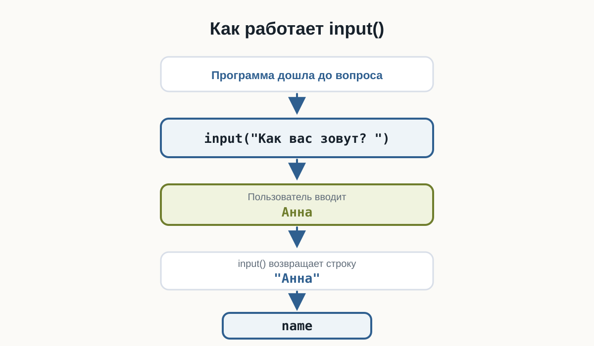
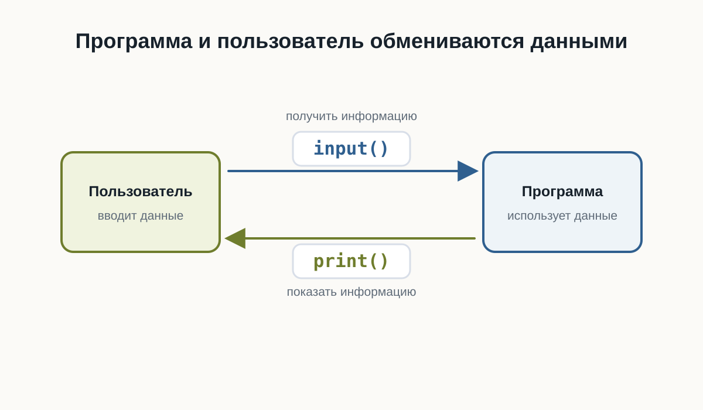
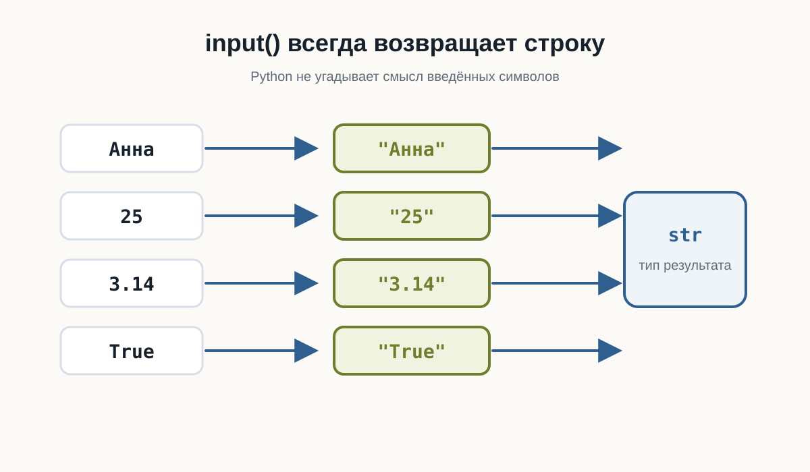
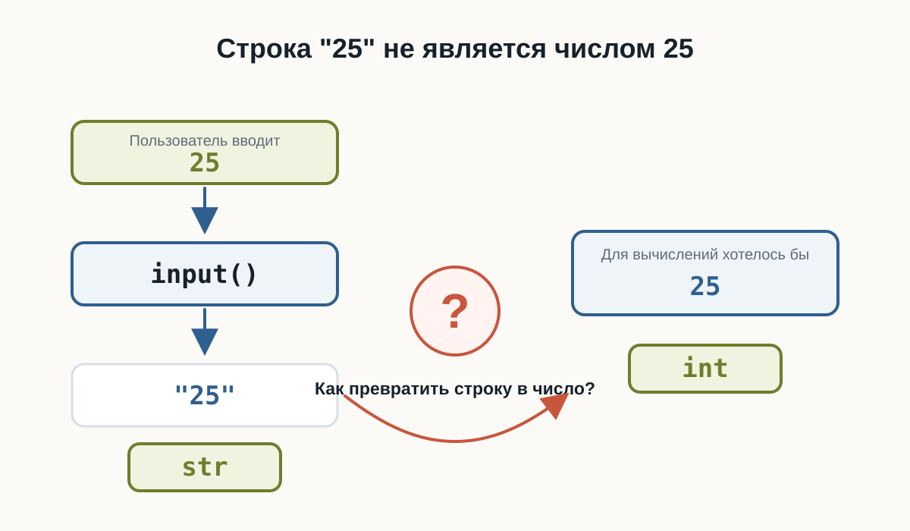

# 3.3 Ввод данных  {.unnumbered}

::: {.callout-important}
Главный вопрос главы:

**Как программа получает данные от пользователя?**
:::

До сих пор наши программы работали только с данными, которые мы заранее записывали в коде.

Например:

```python
name = "Анна"
age = 25

print(name)
print(age)
```

Такая программа всегда использует одни и те же значения.

Но реальные программы часто должны взаимодействовать с человеком.

Например:

- спросить имя;
- получить возраст;
- узнать город;
- попросить ввести поисковый запрос;
- получить ответ на вопрос.

Для этого программе нужен способ **получать данные во время выполнения**.

В Python для этого есть функция `input()`.

---

## Первая интерактивная программа

Создадим программу:

::: {.content-visible when-format="html"}
::: {.python-playground data-source="../examples/chapter10/hello_input.py" data-title="Первая интерактивная программа"}
:::
:::

::: {.content-visible when-format="pdf"}
```python

```
:::

После запуска программа остановится и будет ждать ввода.

В терминале появится:

```text
Как вас зовут?
```

Если пользователь введёт:

```text
Анна
```

программа продолжит работу:

```text
Привет, Анна
```

Теперь результат зависит не только от кода.

Он зависит ещё и от данных, которые ввёл пользователь.

Это наша первая по-настоящему **интерактивная программа**.

---

## Как работает `input()`

Рассмотрим строку:

```python
name = input("Как вас зовут? ")
```

Здесь происходит несколько действий.

Сначала Python выполняет:

```python
input("Как вас зовут? ")
```

Функция показывает текст:

```text
Как вас зовут?
```

и ждёт ответа пользователя.

Пользователь вводит, например:

```text
Анна
```

После этого `input()` возвращает введённое значение.

Получается примерно такая последовательность:

```text
Программа задаёт вопрос
        ↓
Пользователь вводит данные
        ↓
input() получает данные
        ↓
Возвращает значение
        ↓
Значение сохраняется в переменной
```

В нашем случае:

```python
name = input("Как вас зовут? ")
```

после ввода можно мысленно представить как:

```python
name = "Анна"
```

{fig-alt="Программа вызывает input, пользователь вводит Анна, input возвращает строку Анна, значение сохраняется в переменной name"}

---

## Текст внутри `input()`

Текст:

```python
"Как вас зовут? "
```

называется **приглашением ко вводу**.

Он объясняет пользователю, какие данные ожидает программа.

Например:

```python
city = input("В каком городе вы живёте? ")
```

или:

```python
language = input("Какой язык программирования вы изучаете? ")
```

Без приглашения тоже можно написать:

```python
name = input()
```

Программа будет работать.

Но пользователь не поймёт, что именно нужно вводить.

Поэтому приглашение обычно делает программу понятнее.

---

## Значение нужно сохранить

Результат `input()` можно сохранить в переменной:

```python
name = input("Введите имя: ")
```

Теперь введённое значение связано с именем:

```text
name
```

и его можно использовать дальше:

```python
print("Привет,", name)
```

Например, пользователь вводит:

```text
Максим
```

и программа выводит:

```text
Привет, Максим
```

Переменная позволяет использовать полученные данные столько раз, сколько потребуется.

```python
name = input("Введите имя: ")

print("Привет,", name)
print("Рад познакомиться,", name)
```

---

## Попробуйте сами

::: {.callout-tip title="Попробуйте сами"}
Создайте файл:

```text
greeting.py
```

Напишите:

```python
name = input("Как вас зовут? ")

print("Привет,", name)
```

Запустите программу несколько раз и каждый раз вводите другое имя.

Посмотрите, как меняется результат.

Затем измените приветствие самостоятельно.
:::

---

## Программа может задавать несколько вопросов

`input()` можно использовать несколько раз.

Например:

::: {.content-visible when-format="html"}
::: {.python-playground data-source="../examples/chapter10/multiple_inputs.py" data-title="Несколько вопросов подряд"}
:::
:::

::: {.content-visible when-format="pdf"}
```python

```
:::

Программа сначала остановится на первом `input()`.

После ответа перейдёт ко второму.

Пример работы:

```text
Как вас зовут? Анна
Где вы живёте? Казань

Имя: Анна
Город: Казань
```

Инструкции по-прежнему выполняются сверху вниз.

Если программа встретила `input()`, она ждёт пользователя и только после ввода продолжает выполнение.

---

## `input()` возвращает значение

В предыдущих главах мы уже использовали функции.

Например:

```python
print("Привет")
```

Но между `print()` и `input()` есть важное различие.

`print()` показывает данные пользователю.

```text
программа → пользователь
```

А `input()` получает данные от пользователя.

```text
пользователь → программа
```

Можно представить их как два направления взаимодействия:

```text
             print()
Программа ───────────→ Пользователь

Программа ←─────────── Пользователь
             input()
```

Это две базовые операции общения программы с человеком:

- вывести информацию;
- получить информацию.

{fig-alt="print передаёт информацию пользователю, input получает информацию от пользователя"}

---

## Какой тип возвращает `input()`

Теперь вспомним предыдущую главу.

Мы знаем, что каждое значение Python имеет тип.

Попробуем проверить результат `input()`:

```python
name = input("Введите имя: ")

print(type(name))
```

Если пользователь введёт:

```text
Анна
```

получим:

```text
<class 'str'>
```

Это ожидаемо.

Имя — текст.

Но теперь попробуем другое.

```python
age = input("Сколько вам лет? ")

print(type(age))
```

Введите:

```text
25
```

Результат:

```text
<class 'str'>
```

Это уже интереснее.

Мы ввели число:

```text
25
```

но Python получил значение типа:

```text
str
```

---

## `input()` всегда возвращает строку

Это одно из главных правил этой главы:

> **`input()` всегда возвращает строку.**

Неважно, что ввёл пользователь.

Если он введёт:

```text
Анна
```

получим строку.

Если введёт:

```text
25
```

тоже получим строку.

Если введёт:

```text
3.14
```

снова получим строку.

Условно:

```text
Пользователь вводит     Python получает

Анна                     "Анна"
25                       "25"
3.14                     "3.14"
True                     "True"
```

Все эти значения имеют тип:

```text
str
```

{fig-alt="Вводы Анна, 25, 3.14 и True после input становятся строками с типом str"}

---

## Почему Python делает именно так

Когда пользователь печатает символы на клавиатуре, Python не пытается угадывать их смысл.

Например:

```text
007
```

Что это?

Число семь?

Код пользователя?

Часть номера телефона?

Текстовый идентификатор?

Python не знает.

Поэтому `input()` использует простое и предсказуемое правило:

> Всё, что ввёл пользователь, сначала считается текстом.

А уже программист решает, что с этими данными делать дальше.

---

## Проверим разные значения

Создадим программу:

::: {.content-visible when-format="html"}
::: {.python-playground data-source="../examples/chapter10/check_input_type.py" data-title="Проверка результата input()"}
:::
:::

::: {.content-visible when-format="pdf"}
```python

```
:::

Запустите её несколько раз.

Введите:

```text
Python
```

затем:

```text
42
```

затем:

```text
3.14
```

затем:

```text
True
```

Во всех случаях `type()` покажет:

```text
<class 'str'>
```

::: {.callout-tip title="Эксперимент"}
До запуска программы попробуйте предположить тип результата.

Введите по очереди:

```text
100
-5
0
3.14
False
None
Python
```

После каждого запуска проверяйте результат `type()`.

Что общего у всех результатов?
:::

---

## Строка `"25"` — не число `25`

В предыдущей главе мы уже встречали:

```python
25
```

и:

```python
"25"
```

Первое значение имеет тип:

```text
int
```

Второе:

```text
str
```

После:

```python
age = input("Сколько вам лет? ")
```

если пользователь введёт:

```text
25
```

в переменной `age` окажется не число:

```python
25
```

а строка:

```python
"25"
```

На экране они выглядят одинаково.

Но для Python это разные значения.

---

## Почему это важно

Пока мы просто выводим полученное значение, проблемы нет:

```python
age = input("Сколько вам лет? ")

print("Ваш возраст:", age)
```

Это работает.

Но попробуем выполнить вычисление.

::: {.content-visible when-format="html"}
::: {.python-playground data-source="../examples/chapter10/string_number_problem.py" data-title="Ошибка при сложении строки и числа"}
:::
:::

::: {.content-visible when-format="pdf"}
```python

```
:::

Предположим, пользователь ввёл:

```text
25
```

Можно ожидать:

```text
26
```

Но программа завершится ошибкой.

Почему?

Потому что фактически Python пытается выполнить:

```python
"25" + 1
```

Слева находится:

```text
str
```

справа:

```text
int
```

Эти типы нельзя таким образом сложить.

---

## Ошибка снова помогает нам

Мы можем увидеть ошибку:

```text
TypeError
```

Мы уже встречали её в предыдущей главе.

Теперь становится понятно, почему она особенно важна при работе с пользовательским вводом.

Пользователь вводит:

```text
25
```

но программа получает:

```python
"25"
```

Если нам действительно нужно число, строку придётся сначала превратить в число.

Но этим мы займёмся в следующей главе.

---

## Не спешите исправлять пример

Возможно, вы уже знаете, что можно написать что-то вроде:

```python
int(...)
```

Пока не будем этого делать.

Сейчас важно хорошо понять саму проблему.

Рассмотрим:

```python
age = input("Сколько вам лет? ")
```

После ввода `25`:

```text
age → "25" → str
```

А для арифметики нам нужно:

```text
age → 25 → int
```

Между этими двумя состояниями должно произойти **преобразование данных**.

Именно этому будет посвящена следующая глава.

{fig-alt="input возвращает строку 25, а для вычислений нужно число 25; между ними вопрос о преобразовании"}

---

## Ввод и вывод вместе

Теперь мы можем написать небольшую программу, которая действительно взаимодействует с пользователем.

::: {.content-visible when-format="html"}
::: {.python-playground data-source="../examples/chapter10/profile.py" data-title="Анкета пользователя"}
:::
:::

::: {.content-visible when-format="pdf"}
```python

```
:::

Пример выполнения:

```text
Как вас зовут? Анна
Ваш город? Казань
Ваша профессия? Разработчик
Какой язык вы изучаете? Python

Профиль
Имя: Анна
Город: Казань
Профессия: Разработчик
Изучает: Python
```

Обратите внимание:

сама программа одна и та же.

Но результат может быть разным при каждом запуске.

Именно ввод данных делает программу интерактивной.

---

## Практика: небольшая анкета

Создайте файл:

```text
profile.py
```

Программа должна спросить:

- имя;
- город;
- профессию;
- язык программирования, который изучает пользователь.

После этого вывести небольшой профиль.

Например:

```text
Как вас зовут? Алексей
Ваш город? Москва
Ваша профессия? Дизайнер
Какой язык вы изучаете? Python

Профиль
Имя: Алексей
Город: Москва
Профессия: Дизайнер
Изучает: Python
```

Не копируйте готовый результат буквально.

Попробуйте самостоятельно придумать:

- тексты вопросов;
- названия переменных;
- формат результата.

---

## Практика: предскажите результат

Рассмотрите программу:

```python
value = input("Введите значение: ")

print(value)
print(type(value))
```

Пользователь вводит:

```text
100
```

Что выведет:

```python
type(value)
```

Выберите ответ:

```text
int
float
str
bool
```

::: {.callout-note title="Ответ" collapse="true"}
Правильный ответ:

```text
str
```

`input()` всегда возвращает строку.

Поэтому введённое `100` внутри программы становится:

```python
"100"
```
:::

---

## Практика: найдите проблему

Что произойдёт здесь?

```python
year = input("Введите текущий год: ")

print(year + 1)
```

Предположим, пользователь вводит:

```text
2026
```

Подумайте:

1. какого типа будет `year`;
2. выполнится ли `year + 1`;
3. если нет — почему.

::: {.callout-note title="Ответ" collapse="true"}
`year` будет иметь тип:

```text
str
```

Фактически программа попытается выполнить:

```python
"2026" + 1
```

Python не может сложить `str` и `int`, поэтому возникнет:

```text
TypeError
```

Чтобы выполнить арифметику, сначала потребуется преобразовать введённую строку в число.
:::

---

## Практика: что хранится в переменных

Рассмотрите:

```python
first_name = input("Имя: ")
age = input("Возраст: ")
height = input("Рост: ")
```

Пользователь вводит:

```text
Анна
25
1.68
```

Определите тип:

```python
first_name
age
height
```

до запуска программы.

::: {.callout-note title="Ответ" collapse="true"}
Все три значения имеют тип:

```text
str
```

Получается:

```text
first_name → "Анна" → str
age        → "25"   → str
height     → "1.68" → str
```

`input()` не пытается определить, является введённый текст числом.
:::

---

## Задача: персональное приветствие

Напишите программу, которая спрашивает:

```text
Имя
Город
```

и выводит сообщение примерно такого вида:

```text
Привет, Анна!
Казань — отличный город.
```

Попробуйте решить задачу самостоятельно.

::: {.callout-note title="Возможное решение" collapse="true"}
Один из вариантов:

```python
name = input("Как вас зовут? ")
city = input("В каком городе вы живёте? ")

print("Привет,", name)
print(city, "— отличный город.")
```

Это не единственное правильное решение.

Текст сообщений и имена переменных могут отличаться.
:::

---

## Задача: мини-интервью

Напишите программу, которая задаёт пользователю минимум четыре вопроса.

Например:

- имя;
- профессия;
- любимая технология;
- цель обучения.

После ввода программа должна вывести все ответы в удобном виде.

Сначала попробуйте решить задачу самостоятельно.

::: {.callout-note title="Возможное решение" collapse="true"}
Например:

```python
name = input("Как вас зовут? ")
profession = input("Ваша профессия? ")
technology = input("Любимая технология? ")
goal = input("Что вы хотите изучить? ")

print()
print("Мини-интервью")
print("Имя:", name)
print("Профессия:", profession)
print("Любимая технология:", technology)
print("Цель:", goal)
```

Ваша программа может выглядеть иначе.

Главное — самостоятельно использовать несколько вызовов `input()` и сохранить полученные значения в переменных.
:::

---

## Задача со звёздочкой

Пользователь вводит:

```text
10
```

Программа:

::: {.content-visible when-format="html"}
::: {.python-playground data-source="../examples/chapter10/double_input.py" data-title="Сложение строки с самой собой"}
:::
:::

::: {.content-visible when-format="pdf"}
```python

```
:::

Какой результат появится?

Подумайте до запуска.

::: {.callout-note title="Ответ" collapse="true"}
Результат:

```text
1010
```

Почему?

После `input()` значение имеет вид:

```python
"10"
```

Поэтому Python выполняет:

```python
"10" + "10"
```

Для строк оператор `+` означает объединение:

```text
"10" + "10" → "1010"
```

Это ещё раз показывает, почему тип данных имеет значение.
:::

---

## Что важно запомнить

`input()` позволяет программе получать данные от пользователя.

Например:

```python
name = input("Введите имя: ")
```

Основная схема выглядит так:

```text
Пользователь
     ↓
вводит данные
     ↓
input()
     ↓
возвращает строку
     ↓
переменная
     ↓
программа использует значение
```

Главные правила этой главы:

1. `input()` останавливает программу и ждёт пользователя.
2. Текст внутри `input()` объясняет, что нужно ввести.
3. Результат `input()` можно сохранить в переменной.
4. `input()` всегда возвращает `str`.
5. Даже введённые числа сначала становятся строками.
6. Поэтому перед вычислениями иногда понадобится изменить тип данных.

И самое важное:

> **Ввод данных превращает программу из заранее заданной последовательности действий в программу, которая может реагировать на пользователя.**

---

## Что дальше?

Теперь наша программа умеет получать данные.

Но появилась новая проблема.

Пользователь вводит:

```text
25
```

а Python получает:

```python
"25"
```

Что делать, если нам действительно нужно число?

Следующий главный вопрос:

**Как превратить значение одного типа в значение другого типа?**

Этому посвящена следующая глава:

**«Преобразование типов».**
