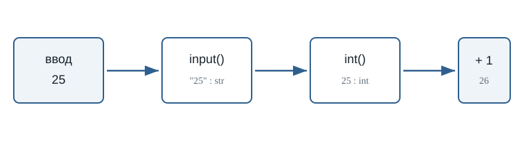
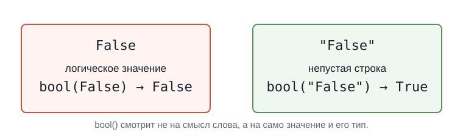
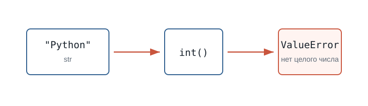

---
pagetitle: "Преобразование типов в Python: int(), float(), str(), bool()"
description: "Преобразование типов в Python: int(), float(), str(), bool(), ввод чисел через input(), ошибки преобразования и практические примеры для новичков."
keywords:
  - преобразование типов Python
  - int Python
  - float Python
  - str Python
  - bool Python
  - ValueError
number-sections: true
---

# 3.4 Преобразование типов {.unnumbered}

::: {.callout-important}
Главный вопрос главы:

**Как превратить значение одного типа в значение другого типа?**
:::

В предыдущей главе мы столкнулись с важной проблемой.

Пользователь вводит:

```text
25
```

Но `input()` возвращает:

```python
"25"
```

То есть не число:

```text
25 → int
```

а строку:

```text
"25" → str
```

Пока мы просто выводим значение, это не мешает:

```python
age = input("Сколько вам лет? ")

print("Ваш возраст:", age)
```

Но как только появляется арифметика, возникает проблема:

```python
age = input("Сколько вам лет? ")

print(age + 1)
```

Если пользователь введёт:

```text
25
```

Python фактически попытается выполнить:

```python
"25" + 1
```

Слева находится `str`, справа — `int`.

Поэтому программа завершится с ошибкой `TypeError`.

Чтобы выполнить вычисление, нам нужно превратить строку:

```python
"25"
```

в число:

```python
25
```

Именно для этого в Python используется **преобразование типов**.

---

## Что такое преобразование типов

Преобразование типов позволяет получить значение одного типа на основе значения другого типа.

Например:

```text
"25" → 25
 str     int
```

или:

```text
"3.14" → 3.14
  str      float
```

или наоборот:

```text
25 → "25"
int    str
```

Для этого Python предоставляет специальные функции.

Основные из них:

```python
int()
float()
str()
bool()
```

Каждая функция пытается создать значение определённого типа.

Например:

```python
int("25")
```

возвращает:

```python
25
```

Теперь это уже настоящее целое число.

---

## Первое преобразование

Вернёмся к нашей программе:

```python
age = input("Сколько вам лет? ")
```

После ввода `25`:

```text
age → "25" → str
```

Попробуем преобразовать значение:

```python
age = int(age)
```

Теперь:

```text
age → 25 → int
```

Проверим:

::: {.content-visible when-format="html"}
::: {.python-playground data-source="../examples/chapter11/input-to-int.py" data-title="input() и int()"}
:::
:::

::: {.content-visible when-format="pdf"}
```python

```
:::

Если пользователь введёт:

```text
25
```

получим:

```text
<class 'str'>
<class 'int'>
```

Тип значения действительно изменился.

::: {.callout-tip title="Обратите внимание"}
Можно читать:

```python
int(age)
```

примерно так:

> «Получить целое число из значения `age`».
:::

---

## Функция `int()`

Функция `int()` используется для получения целого числа.

Например:

::: {.content-visible when-format="html"}
::: {.python-playground data-source="../examples/chapter11/string-to-int.py" data-title="Строка превращается в число"}
:::
:::

::: {.content-visible when-format="pdf"}
```python

```
:::

Результат:

```text
42
<class 'int'>
```

До преобразования:

```text
"42" → str
```

После:

```text
42 → int
```

На экране значения выглядят почти одинаково.

Но для Python это разные типы данных.

И теперь с числом можно выполнять арифметические операции:

```python
number = int("42")

print(number + 8)
```

Результат:

```text
50
```

---

## Исправляем программу с возрастом

Теперь мы можем решить проблему из предыдущей главы.

Было:

```python
age = input("Сколько вам лет? ")

print(age + 1)
```

Эта программа не работает, потому что `age` содержит строку.

Добавим преобразование:

```python
age = input("Сколько вам лет? ")
age = int(age)

print(age + 1)
```

Пример работы:

```text
Сколько вам лет? 25
26
```

Теперь последовательность выглядит так:

```text
Пользователь вводит
        ↓
       25
        ↓
     input()
        ↓
      "25"
        ↓
       str
        ↓
     int()
        ↓
       25
        ↓
       int
        ↓
    вычисление
```

Это одна из самых распространённых схем при работе с пользовательским вводом.

{fig-alt="Пользователь вводит 25, input возвращает строку 25, int создает целое число 25, затем программа вычисляет 25 плюс 1"}

---

## Преобразование можно выполнить сразу

Мы написали:

```python
age = input("Сколько вам лет? ")
age = int(age)
```

Но эти действия можно объединить:

```python
age = int(input("Сколько вам лет? "))
```

Разберём выражение изнутри.

Сначала выполняется:

```python
input("Сколько вам лет? ")
```

Пользователь вводит:

```text
25
```

`input()` возвращает:

```python
"25"
```

Затем выполняется:

```python
int("25")
```

и получается:

```python
25
```

И только после этого значение сохраняется:

```text
age → 25 → int
```

::: {.callout-note title="Два варианта"}
Эти программы делают одно и то же:

```python
age = input("Сколько вам лет? ")
age = int(age)
```

и:

```python
age = int(input("Сколько вам лет? "))
```

Второй вариант короче.

Первый иногда удобнее для начинающих, потому что хорошо показывает каждый шаг.
:::

---

## Попробуйте сами

::: {.callout-tip title="Попробуйте сами"}
Создайте программу:

```python
number = int(input("Введите число: "))

print("Вы ввели:", number)
print("Тип:", type(number))
print("Следующее число:", number + 1)
```

Запустите её несколько раз.

Введите:

```text
10
```

затем:

```text
100
```

затем:

```text
-5
```

Перед каждым запуском попробуйте предсказать результат.
:::

---

## `int()` работает не с любой строкой

Рассмотрим:

```python
number = int("25")
```

Это работает.

Python понимает, как строку:

```python
"25"
```

превратить в целое число:

```python
25
```

Но попробуем:

```python
number = int("Python")
```

Что должно получиться?

Python не может превратить слово:

```text
Python
```

в целое число.

Поэтому возникнет ошибка:

```text
ValueError
```

То же самое произойдёт, если пользователь введёт текст там, где программа ожидает число:

```python
age = int(input("Сколько вам лет? "))
```

и пользователь введёт:

```text
двадцать пять
```

Python попытается выполнить:

```python
int("двадцать пять")
```

и не сможет выполнить преобразование.

::: {.callout-warning title="Преобразование должно иметь смысл"}
Функция `int()` не превращает любой текст в число.

Работает:

```python
int("25")
int("-10")
int("0")
```

Не работает:

```python
int("Python")
int("пять")
int("hello")
```
:::

---

## Дробные числа и `float()`

До сих пор мы работали с целыми числами.

Но пользователь может ввести:

```text
3.14
```

После `input()` мы снова получим строку:

```python
"3.14"
```

Попробуем:

```python
number = int("3.14")
```

Такое преобразование не сработает.

`3.14` — не целое число.

Для дробных чисел используется функция:

```python
float()
```

Например:

```python
number = float("3.14")

print(number)
print(type(number))
```

Результат:

```text
3.14
<class 'float'>
```

Получается:

```text
"3.14" → 3.14
  str     float
```

---

## `float()` вместе с `input()`

Предположим, программа спрашивает рост пользователя:

```python
height = input("Введите рост в метрах: ")
```

Пользователь вводит:

```text
1.75
```

Но программа получает:

```python
"1.75"
```

Для вычислений нужно преобразовать значение:

```python
height = float(height)
```

Или сразу:

```python
height = float(input("Введите рост в метрах: "))
```

Теперь:

```text
height → 1.75 → float
```

Например:

::: {.content-visible when-format="html"}
::: {.python-playground data-source="../examples/chapter11/input-to-float.py" data-title="input() и float()"}
:::
:::

::: {.content-visible when-format="pdf"}
```python

```
:::

---

## Когда использовать `int()`, а когда `float()`

Если программа ожидает целое число, обычно используется:

```python
int()
```

Например:

```python
age = int(input("Возраст: "))
year = int(input("Год: "))
count = int(input("Количество: "))
```

Если значение может содержать дробную часть:

```python
float()
```

Например:

```python
height = float(input("Рост: "))
weight = float(input("Вес: "))
price = float(input("Цена: "))
temperature = float(input("Температура: "))
```

Можно представить так:

```text
целое значение
      ↓
    int()

дробное значение
      ↓
   float()
```

::: {.callout-tip title="Как выбрать тип"}
Спросите себя:

**Может ли у этого значения быть дробная часть?**

Если нет:

```python
int()
```

Если да:

```python
float()
```
:::

---

## Пример: стоимость покупки

Напишем программу, которая спрашивает цену товара и количество.

::: {.content-visible when-format="html"}
::: {.python-playground data-source="../examples/chapter11/shop-total.py" data-title="Стоимость покупки"}
:::
:::

::: {.content-visible when-format="pdf"}
```python

```
:::

Пример работы:

```text
Цена товара: 12.5
Количество: 4
Стоимость: 50.0
```

Здесь используются два разных преобразования:

```text
"12.5" → 12.5 → float
"4"    → 4    → int
```

После преобразования Python может выполнить умножение.

---

## Преобразование `float` в `int`

`int()` умеет работать не только со строками.

Например:

::: {.content-visible when-format="html"}
::: {.python-playground data-source="../examples/chapter11/float-to-int.py" data-title="float превращается в int"}
:::
:::

::: {.content-visible when-format="pdf"}
```python

```
:::

Результат:

```text
5
```

Дробная часть исчезла.

Ещё примеры:

```python
print(int(3.9))
print(int(7.2))
print(int(-4.8))
```

Результат:

```text
3
7
-4
```

::: {.callout-warning title="Это не округление"}
`int()` не округляет число.

Например:

```python
int(9.99)
```

даёт:

```text
9
```

а не:

```text
10
```

При преобразовании `float` в `int` дробная часть отбрасывается.
:::

---

## Преобразование `int` в `float`

Можно выполнить и обратное преобразование:

```python
number = 10

result = float(number)

print(result)
print(type(result))
```

Результат:

```text
10.0
<class 'float'>
```

Получается:

```text
10 → 10.0
int   float
```

Значение по-прежнему представляет десять, но его тип изменился.

---

## Функция `str()`

До сих пор мы превращали строки в числа.

Но можно сделать наоборот.

Функция:

```python
str()
```

преобразует значение в строку.

Например:

```python
age = 25

text = str(age)

print(text)
print(type(text))
```

Результат:

```text
25
<class 'str'>
```

Получается:

```text
25 → "25"
int    str
```

---

## Зачем превращать число в строку

Рассмотрим:

```python
age = 25

message = "Возраст: " + age
```

Такой код вызовет ошибку.

Python видит:

```text
str + int
```

Но если преобразовать число:

```python
age = 25

message = "Возраст: " + str(age)

print(message)
```

получим:

```text
Возраст: 25
```

Теперь Python фактически выполняет:

```python
"Возраст: " + "25"
```

То есть:

```text
str + str
```

Это допустимая операция.

::: {.callout-note title="С print() обычно проще"}
Если вы просто выводите значения через запятую:

```python
age = 25

print("Возраст:", age)
```

вызывать `str()` не требуется.

`print()` умеет выводить значения разных типов.
:::

---

## Функция `bool()`

Ещё одна функция преобразования:

```python
bool()
```

Она создаёт логическое значение:

```python
True
```

или:

```python
False
```

Например:

```python
print(bool(1))
print(bool(0))
```

Результат:

```text
True
False
```

Для чисел правило можно начать понимать так:

```text
0        → False
не 0     → True
```

Например:

```python
print(bool(0))
print(bool(5))
print(bool(-10))
print(bool(3.14))
```

Результат:

```text
False
True
True
True
```

---

## Строки и `bool()`

Пустая строка преобразуется в:

```python
False
```

Например:

```python
print(bool(""))
```

Результат:

```text
False
```

Непустая строка:

```python
print(bool("Python"))
```

даёт:

```text
True
```

То есть:

```text
""        → False
"Python"  → True
```

Но здесь есть важная особенность.

Рассмотрим:

```python
print(bool("False"))
```

Какой будет результат?

```text
True
```

Почему?

Потому что строка:

```python
"False"
```

не пустая.

Python в данном случае не пытается понять значение написанного слова.

::: {.callout-warning title="Не путайте текст и логическое значение"}
Это разные значения:

```python
False
```

и:

```python
"False"
```

Первое имеет тип:

```text
bool
```

Второе:

```text
str
```

Поэтому:

```python
bool(False)
```

даёт `False`, а:

```python
bool("False")
```

даёт `True`.
:::

{fig-alt="False без кавычек является логическим значением, а строка False в кавычках является непустой строкой, поэтому bool от нее дает True"}

---

## Тип до и после преобразования

Функция `type()` помогает увидеть результат преобразования.

Например:

```python
value = "100"

print(type(value))

value = int(value)

print(type(value))
```

Результат:

```text
<class 'str'>
<class 'int'>
```

Можно экспериментировать:

::: {.content-visible when-format="html"}
::: {.python-playground data-source="../examples/chapter11/type-conversion-check.py" data-title="int(), float(), str(), bool() создают значения разных типов"}
:::
:::

::: {.content-visible when-format="pdf"}
```python

```
:::

Так хорошо видно, как значение последовательно получает разные типы.

---

## Преобразование не всегда возможно

Мы уже видели:

```python
int("Python")
```

Такое преобразование невозможно.

То же относится к `float()`:

```python
float("hello")
```

Python не знает, какое число должно соответствовать слову `"hello"`.

Поэтому возникает `ValueError`.

Запустите пример и посмотрите на сообщение об ошибке:

::: {.content-visible when-format="html"}
::: {.python-playground data-source="../examples/chapter11/conversion-error.py" data-title="Намеренная ошибка преобразования"}
:::
:::

::: {.content-visible when-format="pdf"}
```python

```
:::

Попробуйте заменить `"Python"` на `"12.8"`.

Это тоже приведёт к `ValueError`, потому что строка `"12.8"` описывает дробное число, а не целое.

{fig-alt="Строка Python передается в int, но ее нельзя представить как целое число, поэтому возникает ValueError"}

При работе с пользовательским вводом это особенно важно.

Программа может ожидать:

```text
Введите возраст: 25
```

но пользователь способен написать:

```text
Введите возраст: двадцать пять
```

На этом этапе нашего курса достаточно помнить:

> Преобразование работает только тогда, когда исходное значение можно представить в нужном типе.

Позже мы научимся обрабатывать неправильный пользовательский ввод.

---

## Попробуйте предсказать результат

Не запускайте код сразу.

Сначала попробуйте определить результат самостоятельно.

```python
a = int("10")
b = float("2.5")

print(a)
print(b)
print(a + b)
```

::: {.callout-note title="Ответ" collapse="true"}
Получим:

```text
10
2.5
12.5
```

`a` имеет тип `int`, а `b` — `float`.

Python может выполнять арифметические операции с этими числовыми типами.
:::

---

## Что важно запомнить

Преобразование типов позволяет получить значение одного типа из значения другого типа.

Основные функции:

```text
int()    → целое число
float()  → дробное число
str()    → строка
bool()   → логическое значение
```

Особенно часто преобразование используется после `input()`:

```python
age = int(input("Возраст: "))
```

или:

```python
price = float(input("Цена: "))
```

Главная схема:

```text
Пользователь
     ↓
   input()
     ↓
    str
     ↓
преобразование
     ↓
нужный тип
     ↓
вычисления
```

И самое важное:

> **Тип значения должен соответствовать тому, что программа собирается с этим значением делать.**

Если нужно считать — обычно требуется число.

Если нужно работать с текстом — строка.

Если значение пришло через `input()`, сначала помните:

```text
input() → str
```

и только затем решайте, требуется ли преобразование.

---

## Что дальше?

Теперь мы умеем получать данные пользователя:

```python
input()
```

и превращать их в нужный тип:

```python
int()
float()
str()
bool()
```

Теперь программа может не только получать данные, но и готовить их к настоящим вычислениям.

Например:

```python
price = float(input("Цена: "))
count = int(input("Количество: "))

print("Итого:", price * count)
```

Следующий главный вопрос:

**Как Python выполняет арифметические операции?**

Этому посвящена следующая глава:

**«Арифметические операции».**

---

### Практические задания

**Задание 1. Возраст через год**

Напишите программу, которая спрашивает возраст пользователя и выводит, сколько ему будет через год.

Пример:

```text
Сколько вам лет? 25
Через год вам будет: 26
```

::: {.callout-note title="Ответ" collapse="true"}

```python
age = int(input("Сколько вам лет? "))

print("Через год вам будет:", age + 1)
```

:::

---

**Задание 2. Два числа**

Пользователь вводит два целых числа.

Программа должна вывести их сумму.

Пример:

```text
Первое число: 10
Второе число: 7
Сумма: 17
```

::: {.callout-note title="Ответ" collapse="true"}

```python
first = int(input("Первое число: "))
second = int(input("Второе число: "))

print("Сумма:", first + second)
```

:::

---

**Задание 3. Цена покупки**

Пользователь вводит цену одного товара и количество товаров.

Цена может быть дробной.

Вычислите общую стоимость.

Пример:

```text
Цена: 12.5
Количество: 4
Итого: 50.0
```

::: {.callout-note title="Ответ" collapse="true"}

```python
price = float(input("Цена: "))
count = int(input("Количество: "))

total = price * count

print("Итого:", total)
```

:::

---

**Задание 4. Предскажите типы**

Не запускайте программу сразу.

```python
a = int("15")
b = float("15")
c = str(15)
d = bool(15)
```

Определите тип каждой переменной.

::: {.callout-note title="Ответ" collapse="true"}

```text
a → int
b → float
c → str
d → bool
```

Значения:

```python
a == 15
b == 15.0
c == "15"
d == True
```

:::

---

**Задание 5. Найдите ошибку**

Почему эта программа не работает?

```python
temperature = input("Температура: ")

print(temperature + 5)
```

Исправьте её так, чтобы пользователь мог вводить дробную температуру.

::: {.callout-note title="Ответ" collapse="true"}

`input()` возвращает строку.

Поэтому Python пытается выполнить операцию примерно такого вида:

```python
"20.5" + 5
```

Нужно преобразовать ввод в `float`:

```python
temperature = float(input("Температура: "))

print(temperature + 5)
```

:::

---

**Задание 6. Задача со звёздочкой**

Что произойдёт при выполнении программы?

```python
value = "12.8"

number = int(value)

print(number)
```

Сначала попробуйте ответить без запуска.

::: {.callout-note title="Ответ" collapse="true"}

Программа завершится с `ValueError`.

Строку:

```python
"12.8"
```

нельзя напрямую преобразовать через:

```python
int("12.8")
```

потому что она содержит запись дробного числа.

Можно сначала получить `float`:

```python
value = "12.8"

number = int(float(value))

print(number)
```

Результат:

```text
12
```

При преобразовании `12.8` из `float` в `int` дробная часть отбрасывается.

:::
