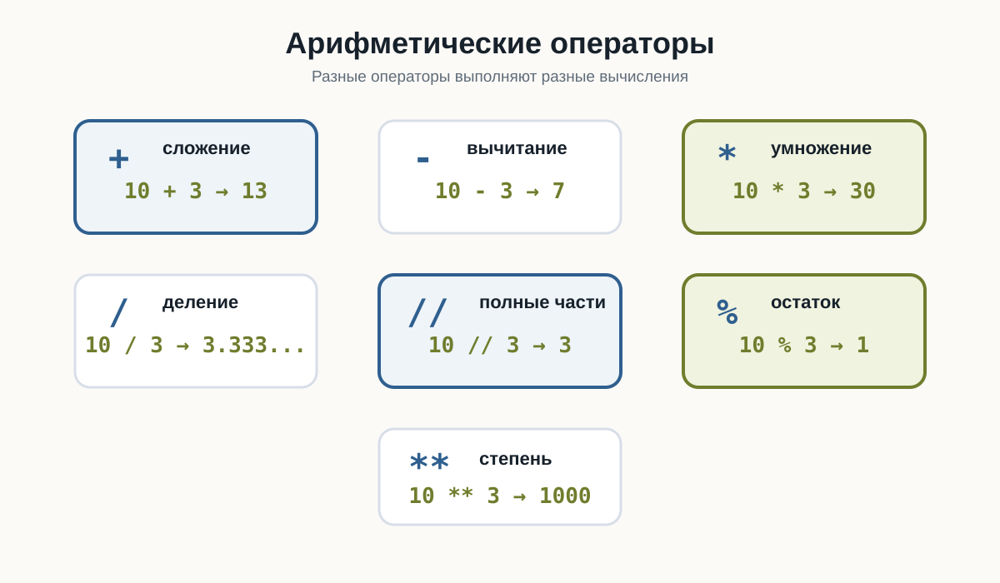
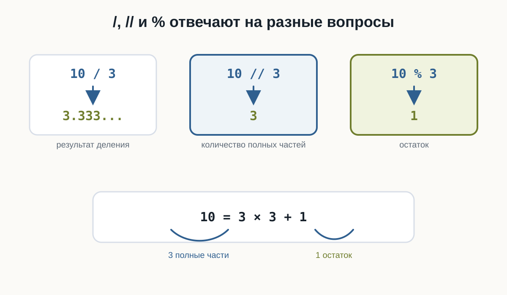
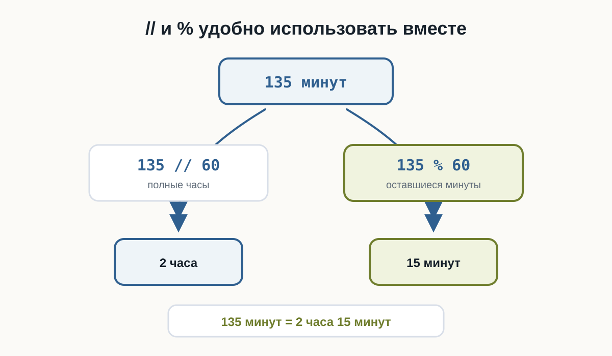
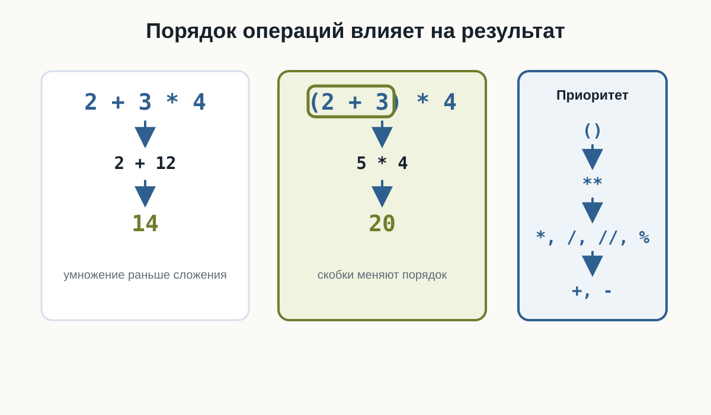
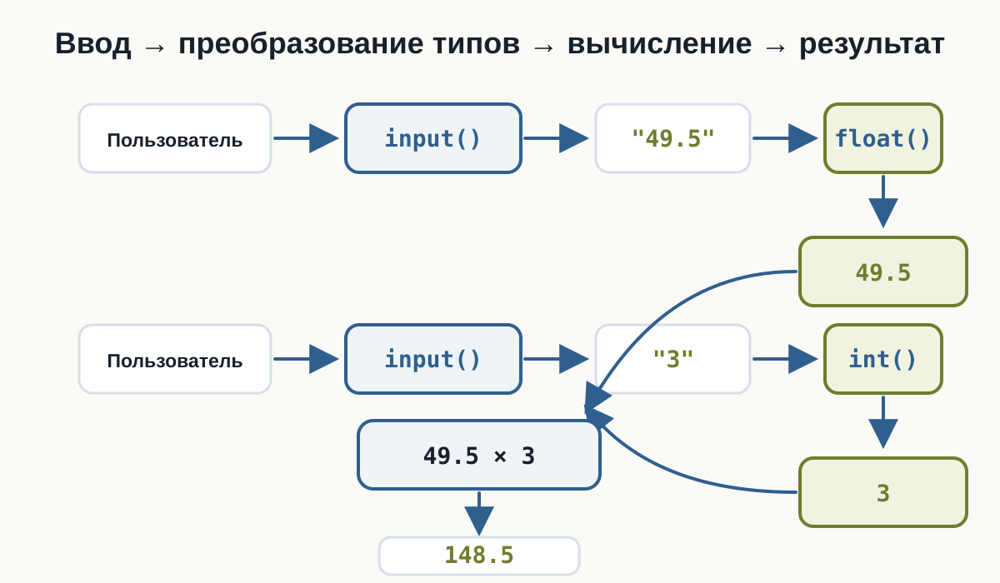

# 3.5 Арифметические операции {.unnumbered}

::: {.callout-important}
Главный вопрос главы:

**Как Python выполняет вычисления с числами?**
:::

В предыдущих главах мы научились хранить числа в переменных:

```python
price = 120
quantity = 3
```

получать их от пользователя:

```python
age = input("Сколько вам лет? ")
```

и превращать строки в числа:

```python
age = int(age)
```

Теперь можно использовать эти значения для вычислений.

Например:

```python
price = 120
quantity = 3

total = price * quantity

print(total)
```

Результат:

```text
360
```

Здесь Python выполнил **арифметическую операцию** — умножение.

Но умножение — только одна из доступных операций.

Python умеет складывать, вычитать, умножать, делить, находить остаток от деления, возводить числа в степень и выполнять другие вычисления.

---

## Основные арифметические операторы

Для вычислений Python использует специальные символы — **арифметические операторы**.

Основные из них:

| Оператор | Операция | Пример | Результат |
|---|---|---|---|
| `+` | сложение | `10 + 3` | `13` |
| `-` | вычитание | `10 - 3` | `7` |
| `*` | умножение | `10 * 3` | `30` |
| `/` | обычное деление | `10 / 3` | `3.333...` |
| `//` | целочисленное деление | `10 // 3` | `3` |
| `%` | остаток от деления | `10 % 3` | `1` |
| `**` | возведение в степень | `10 ** 3` | `1000` |

Начнём с самых привычных операций.

{fig-alt="Карточки показывают семь арифметических операторов Python: сложение, вычитание, умножение, обычное деление, целочисленное деление, остаток от деления и возведение в степень"}

---

## Сложение

Оператор `+` складывает числа:

```python
print(10 + 5)
```

Результат:

```text
15
```

Можно складывать значения переменных:

```python
apples = 5
oranges = 3

fruits = apples + oranges

print(fruits)
```

Результат:

```text
8
```

Или сохранить результат вычисления в новую переменную:

```python
salary = 80000
bonus = 15000

total = salary + bonus

print(total)
```

Результат:

```text
95000
```

Общая схема:

```text
значение + значение
        ↓
     результат
```

---

## Вычитание

Оператор `-` выполняет вычитание:

```python
print(10 - 3)
```

Результат:

```text
7
```

Например, можно вычислить оставшуюся сумму:

```python
money = 1000
spent = 350

remaining = money - spent

print(remaining)
```

Результат:

```text
650
```

---

## Умножение

Для умножения используется оператор `*`:

```python
print(6 * 4)
```

Результат:

```text
24
```

Например, стоимость нескольких одинаковых товаров:

```python
price = 150
quantity = 4

total = price * quantity

print(total)
```

Результат:

```text
600
```

Теперь мы можем соединить это с пользовательским вводом:

```python
price = float(input("Цена товара: "))
quantity = int(input("Количество: "))

total = price * quantity

print("Итого:", total)
```

Пример работы:

```text
Цена товара: 49.5
Количество: 3
Итого: 148.5
```

Здесь используются сразу несколько уже знакомых элементов:

```text
input()
   ↓
преобразование типов
   ↓
числа
   ↓
умножение
   ↓
результат
```

---

## Обычное деление

Для деления используется оператор `/`:

```python
print(10 / 2)
```

Результат:

```text
5.0
```

Обратите внимание: результат имеет дробный тип `float`.

Проверим:

```python
result = 10 / 2

print(result)
print(type(result))
```

Результат:

```text
5.0
<class 'float'>
```

Даже если числа делятся без остатка, оператор `/` возвращает `float`.

Например:

```python
print(8 / 4)
print(20 / 5)
```

Результат:

```text
2.0
4.0
```

::: {.callout-note title="Важно"}

Оператор `/` выполняет обычное деление и возвращает результат типа `float`.

```python
10 / 2
```

даёт:

```text
5.0
```

а не:

```text
5
```

:::

---

## Деление может давать дробный результат

Если одно число не делится на другое без остатка:

```python
print(10 / 4)
```

получим:

```text
2.5
```

Например, можно разделить общий счёт между несколькими людьми:

```python
total = 1500
people = 4

per_person = total / people

print(per_person)
```

Результат:

```text
375.0
```

---

## Деление на ноль

Попробуем:

```python
print(10 / 0)
```

Такое вычисление невозможно.

Python остановит программу и сообщит об ошибке:

```text
ZeroDivisionError
```

Проверьте это в playground: ошибка сделана намеренно. Замените `0` на другое число и запустите код снова.

::: {.content-visible when-format="html"}
::: {.python-playground data-source="../examples/chapter12/zero-division.py" data-title="Деление на ноль"}
:::
:::

::: {.content-visible when-format="pdf"}
```python

```
:::

::: {.callout-warning title="На ноль делить нельзя"}

Это относится не только к `/`.

Следующие выражения также приводят к `ZeroDivisionError`:

```python
10 / 0
10 // 0
10 % 0
```

Позже мы научимся проверять данные до выполнения подобных операций.

:::

---

## Целочисленное деление

Кроме обычного `/`, в Python существует оператор:

```python
//
```

Он выполняет **целочисленное деление**.

Сравним:

```python
print(10 / 3)
print(10 // 3)
```

Результат:

```text
3.3333333333333335
3
```

При обычном делении:

```text
10 / 3 → 3.333...
```

При целочисленном:

```text
10 // 3 → 3
```

Можно представить это так:

```text
10 = 3 × 3 + 1
     └───┘
   целая часть
```

Оператор `//` показывает, сколько **полных раз** делитель помещается в делимом.

Например:

```python
print(17 // 5)
```

Результат:

```text
3
```

Потому что в `17` помещаются три полные пятёрки:

```text
5 + 5 + 5 = 15
```

и ещё остаётся `2`.

::: {.callout-warning title="Не путайте // с int()"}

Для положительных чисел результаты иногда выглядят одинаково:

```python
int(10 / 3)   # 3
10 // 3       # 3
```

Но это разные операции.

Особенно это заметно на отрицательных числах:

```python
print(int(-10 / 3))
print(-10 // 3)
```

Результат:

```text
-3
-4
```

`int()` отбрасывает дробную часть в направлении нуля.

Оператор `//` выполняет деление с округлением вниз.

:::

---

## Остаток от деления

Оператор `%` возвращает **остаток от деления**.

Например:

```python
print(10 % 3)
```

Результат:

```text
1
```

Почему?

Число `10` можно представить так:

```text
10 = 3 × 3 + 1
             ↑
           остаток
```

Ещё несколько примеров:

```python
print(15 % 4)
print(20 % 6)
print(8 % 2)
```

Результат:

```text
3
2
0
```

Если число делится без остатка, `%` возвращает `0`.

Сравните `/`, `//` и `%` на одних и тех же числах:

::: {.content-visible when-format="html"}
::: {.python-playground data-source="../examples/chapter12/division-types.py" data-title="/, // и %"}
:::
:::

::: {.content-visible when-format="pdf"}
```python

```
:::

{fig-alt="Обычное деление 10 делить на 3 дает 3.333, целочисленное деление дает 3 полные части, остаток от деления дает 1; вместе это записывается как 10 равно 3 умножить на 3 плюс 1"}

---

## Зачем нужен остаток от деления

Оператор `%` часто используется, когда нужно узнать, делится ли число на другое число без остатка.

Например:

```python
print(10 % 2)
```

Результат:

```text
0
```

А:

```python
print(11 % 2)
```

даёт:

```text
1
```

Получается:

```text
10 % 2 → 0
11 % 2 → 1
```

Позже это позволит проверять, является ли число чётным.

Но `%` полезен не только для этого.

Например, переведём минуты в часы и оставшиеся минуты.

Пусть есть:

```python
minutes = 135
```

Полные часы:

```python
hours = minutes // 60
```

Оставшиеся минуты:

```python
remaining_minutes = minutes % 60
```

Полная программа:

```python
minutes = 135

hours = minutes // 60
remaining_minutes = minutes % 60

print("Часы:", hours)
print("Минуты:", remaining_minutes)
```

Результат:

```text
Часы: 2
Минуты: 15
```

::: {.content-visible when-format="html"}
::: {.python-playground data-source="../examples/chapter12/minutes-converter.py" data-title="Минуты в часы и минуты"}
:::
:::

::: {.content-visible when-format="pdf"}
```python

```
:::

Здесь `//` и `%` удобно работают вместе:

```text
135 минут
    ↓
135 // 60 → 2 часа
135 % 60  → 15 минут
```

{fig-alt="135 минут делятся на 60 с помощью оператора // и дают 2 часа, а оператор % показывает остаток 15 минут; итог 135 минут равно 2 часа 15 минут"}

---

## Возведение в степень

Оператор `**` используется для возведения числа в степень.

Например:

```python
print(2 ** 3)
```

Результат:

```text
8
```

Потому что:

```text
2³ = 2 × 2 × 2 = 8
```

Ещё примеры:

```python
print(5 ** 2)
print(10 ** 3)
```

Результат:

```text
25
1000
```

Квадрат числа можно вычислить так:

```python
number = 7

square = number ** 2

print(square)
```

Результат:

```text
49
```

---

## Несколько операций в одном выражении

Python позволяет использовать несколько арифметических операций сразу:

```python
result = 2 + 3 * 4

print(result)
```

Какой результат получится?

Можно предположить:

```text
20
```

если сначала выполнить:

```text
2 + 3
```

а затем умножить на `4`.

Но Python выведет:

```text
14
```

Почему?

Потому что операции имеют **приоритет**.

Сначала выполняется умножение:

```text
3 * 4 → 12
```

затем сложение:

```text
2 + 12 → 14
```

---

## Приоритет операций

В выражениях Python не всегда выполняет операции просто слева направо.

У разных операций есть разный приоритет.

Для операций этой главы удобно помнить следующий порядок:

```text
()
↓
**
↓
*, /, //, %
↓
+, -
```

Сначала выполняются выражения в скобках.

Затем — возведение в степень.

После этого:

```text
*
/
//
%
```

И только потом:

```text
+
-
```

Например:

```python
print(2 + 3 * 4)
```

Результат:

```text
14
```

А здесь:

```python
print((2 + 3) * 4)
```

результат уже другой:

```text
20
```

Скобки заставили Python сначала выполнить:

```text
2 + 3
```

Попробуйте изменить выражения и посмотреть, как меняется результат:

::: {.content-visible when-format="html"}
::: {.python-playground data-source="../examples/chapter12/operator-precedence.py" data-title="Приоритет операций"}
:::
:::

::: {.content-visible when-format="pdf"}
```python

```
:::

{fig-alt="Выражение 2 плюс 3 умножить на 4 дает 14, потому что сначала выполняется умножение; выражение в скобках 2 плюс 3 умножить на 4 дает 20, потому что скобки меняют порядок вычислений"}

---

## Скобки делают вычисления понятнее

Скобки полезны не только для изменения порядка операций.

Они помогают человеку быстрее понять выражение.

Например:

```python
total = price * quantity + delivery
```

можно написать:

```python
total = (price * quantity) + delivery
```

Результат будет тем же.

Но второй вариант явно показывает:

1. сначала вычисляется стоимость товаров;
2. затем добавляется доставка.

::: {.callout-tip title="Используйте скобки для ясности"}

Не обязательно запоминать все правила приоритета наизусть.

Если порядок вычислений может быть непонятен, используйте скобки:

```python
average = (first + second + third) / 3
```

Так код легче читать и проверять.

:::

---

## Операции одинакового приоритета

Большинство операций одного уровня выполняются слева направо.

Например:

```python
print(20 / 5 * 2)
```

Сначала:

```text
20 / 5 → 4.0
```

затем:

```text
4.0 * 2 → 8.0
```

Результат:

```text
8.0
```

Ещё пример:

```python
print(20 - 5 + 2)
```

Получаем:

```text
17
```

То есть:

```text
20 - 5 → 15
15 + 2 → 17
```

---

## Особенность оператора `**`

Возведение в степень имеет важную особенность.

Рассмотрим:

```python
print(2 ** 3 ** 2)
```

Python интерпретирует это как:

```python
2 ** (3 ** 2)
```

Сначала:

```text
3 ** 2 → 9
```

затем:

```text
2 ** 9 → 512
```

Результат:

```text
512
```

::: {.callout-note title="Для сложных выражений лучше использовать скобки"}

Даже если вы знаете правила приоритета, явная запись часто понятнее:

```python
2 ** (3 ** 2)
```

или:

```python
(2 ** 3) ** 2
```

Эти выражения дают разные результаты, и скобки сразу показывают намерение программиста.

:::

---

## Вычисления с int и float

В одном выражении могут участвовать `int` и `float`.

Например:

```python
result = 10 + 2.5

print(result)
print(type(result))
```

Результат:

```text
12.5
<class 'float'>
```

Ещё пример:

```python
price = 12.5
quantity = 4

total = price * quantity

print(total)
print(type(total))
```

Результат:

```text
50.0
<class 'float'>
```

Если в вычислении участвует дробное число, результат часто также становится `float`.

---

## Вычисления с пользовательским вводом

Теперь объединим несколько изученных тем.

Напишем простой калькулятор стоимости покупки:

::: {.content-visible when-format="html"}
::: {.python-playground data-source="../examples/chapter12/shopping-calculator.py" data-title="Калькулятор покупки"}
:::
:::

::: {.content-visible when-format="pdf"}
```python

```
:::

Пример работы:

```text
Цена товара: 250
Количество: 3
Стоимость доставки: 150
Итого: 900.0
```

В этой небольшой программе уже есть:

```text
input()
    ↓
преобразование типов
    ↓
переменные
    ↓
арифметические операции
    ↓
результат
```

{fig-alt="Пользователь вводит 49.5 и 3, input возвращает строки, float создает число 49.5, int создает число 3, затем Python вычисляет 49.5 умножить на 3 и получает 148.5"}

Мы постепенно начинаем соединять отдельные конструкции Python в полноценные программы.

---

## Попробуйте сами

::: {.callout-tip title="Эксперимент"}

Создайте программу:

::: {.content-visible when-format="html"}
::: {.python-playground data-source="../examples/chapter12/basic-arithmetic.py" data-title="Основные арифметические операции"}
:::
:::

::: {.content-visible when-format="pdf"}
```python

```
:::

Перед запуском попробуйте самостоятельно предсказать каждый результат.

Затем измените:

```python
a = 17
b = 5
```

на другие числа и посмотрите, как изменятся результаты.

Особенно сравните:

```python
a / b
a // b
a % b
```

:::

---

## Что важно запомнить

Python поддерживает основные арифметические операции:

```text
+   сложение
-   вычитание
*   умножение
/   обычное деление
//  целочисленное деление
%   остаток от деления
**  возведение в степень
```

Особенно важно различать три операции:

```text
10 / 3  → 3.333...
10 // 3 → 3
10 % 3  → 1
```

Они отвечают на разные вопросы:

```text
/   → какой результат деления?

//  → сколько полных частей помещается?

%   → что осталось?
```

При нескольких операциях Python учитывает их приоритет:

```text
()
↓
**
↓
*, /, //, %
↓
+, -
```

Скобки позволяют явно задать нужный порядок:

```python
(2 + 3) * 4
```

И самое важное:

> **Арифметическое выражение — это способ получить новое значение из уже известных числовых значений.**

---

### Практические задания

**Задание 1. Четыре операции**

Пользователь вводит два числа.

Выведите:

- их сумму;
- разность;
- произведение;
- результат деления.

Пример:

```text
Первое число: 10
Второе число: 4

Сумма: 14.0
Разность: 6.0
Произведение: 40.0
Деление: 2.5
```

::: {.callout-note title="Ответ" collapse="true"}

```python
a = float(input("Первое число: "))
b = float(input("Второе число: "))

print("Сумма:", a + b)
print("Разность:", a - b)
print("Произведение:", a * b)
print("Деление:", a / b)
```

:::

---

**Задание 2. Площадь прямоугольника**

Пользователь вводит длину и ширину прямоугольника.

Вычислите его площадь.

Пример:

```text
Длина: 5
Ширина: 3
Площадь: 15.0
```

::: {.callout-note title="Ответ" collapse="true"}

```python
length = float(input("Длина: "))
width = float(input("Ширина: "))

area = length * width

print("Площадь:", area)
```

:::

---

**Задание 3. Среднее значение**

Пользователь вводит три числа.

Вычислите их среднее арифметическое.

Пример:

```text
Первое число: 10
Второе число: 20
Третье число: 30
Среднее: 20.0
```

::: {.callout-note title="Ответ" collapse="true"}

```python
a = float(input("Первое число: "))
b = float(input("Второе число: "))
c = float(input("Третье число: "))

average = (a + b + c) / 3

print("Среднее:", average)
```

Скобки здесь важны:

```python
(a + b + c) / 3
```

Сначала складываются три числа, затем результат делится на `3`.

:::

---

**Задание 4. Часы и минуты**

Пользователь вводит количество минут.

Переведите его в часы и оставшиеся минуты.

Пример:

```text
Количество минут: 135
Часы: 2
Минуты: 15
```

::: {.callout-note title="Ответ" collapse="true"}

```python
minutes = int(input("Количество минут: "))

hours = minutes // 60
remaining_minutes = minutes % 60

print("Часы:", hours)
print("Минуты:", remaining_minutes)
```

`//` находит количество полных часов, а `%` — оставшиеся минуты.

:::

---

**Задание 5. Предскажите результат**

Не запускайте код сразу.

Определите результаты:

```python
print(2 + 3 * 4)
print((2 + 3) * 4)
print(17 // 5)
print(17 % 5)
print(2 ** 4)
```

::: {.callout-note title="Ответ" collapse="true"}

Результат:

```text
14
20
3
2
16
```

В первом выражении умножение выполняется раньше сложения:

```text
2 + 3 * 4
    ↓
2 + 12
    ↓
14
```

Во втором порядок изменяют скобки:

```text
(2 + 3) * 4
    ↓
5 * 4
  ↓
20
```

:::

---

**Задание 6. Найдите проблему**

Что произойдёт здесь?

```python
number = 10

result = number / 0

print(result)
```

Почему?

::: {.callout-note title="Ответ" collapse="true"}

Программа завершится с ошибкой:

```text
ZeroDivisionError
```

На ноль делить нельзя.

Ошибка возникает при выполнении:

```python
10 / 0
```

:::

---

**Задание 7. Задача со звёздочкой**

Пользователь вводит количество секунд.

Переведите его в:

- полные минуты;
- оставшиеся секунды.

Например:

```text
Количество секунд: 145
Минуты: 2
Секунды: 25
```

Попробуйте решить задачу с помощью `//` и `%`.

::: {.callout-note title="Ответ" collapse="true"}

```python
seconds = int(input("Количество секунд: "))

minutes = seconds // 60
remaining_seconds = seconds % 60

print("Минуты:", minutes)
print("Секунды:", remaining_seconds)
```

Для `145`:

```text
145 // 60 → 2
145 % 60  → 25
```

Поэтому:

```text
145 секунд = 2 минуты 25 секунд
```

:::

---

## Что дальше?

Теперь программа умеет:

- хранить данные в переменных;
- различать типы данных;
- получать данные через `input()`;
- преобразовывать строки в числа;
- выполнять вычисления.

Например:

```python
price = float(input("Цена: "))
quantity = int(input("Количество: "))

total = price * quantity

print("Итого:", total)
```

Но пока программа выполняет одни и те же действия независимо от результата вычислений.

Что если нужно сделать так:

```text
если пользователь совершеннолетний → показать одно сообщение
иначе → другое
```

Или:

```text
если пароль правильный → продолжить
иначе → сообщить об ошибке
```

Для этого программе нужно научиться **сравнивать значения и принимать решения**.

Следующий главный вопрос:

**Как Python сравнивает значения?**

Этому посвящена следующая глава:

**«Сравнение значений».**
