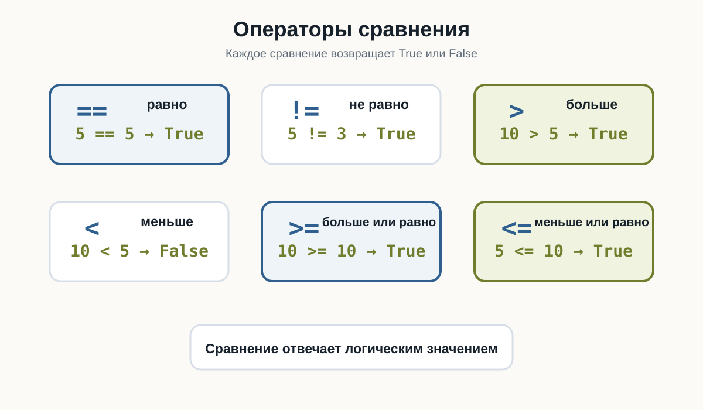
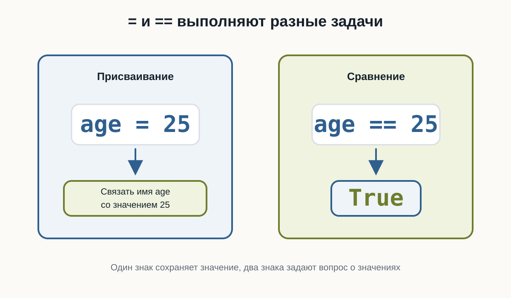
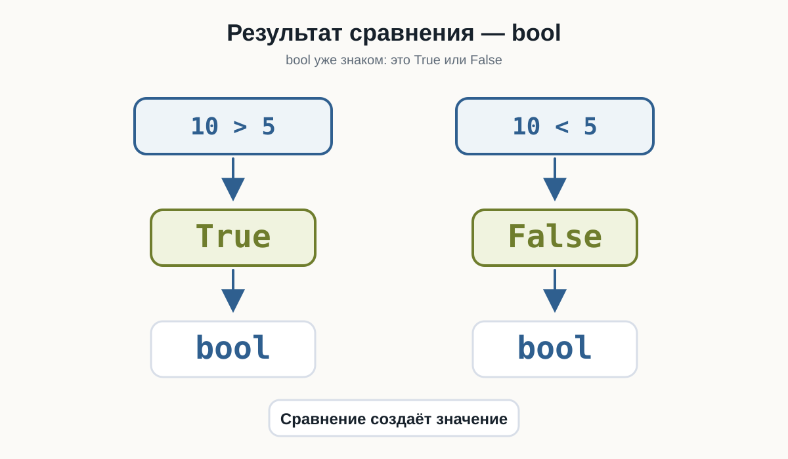
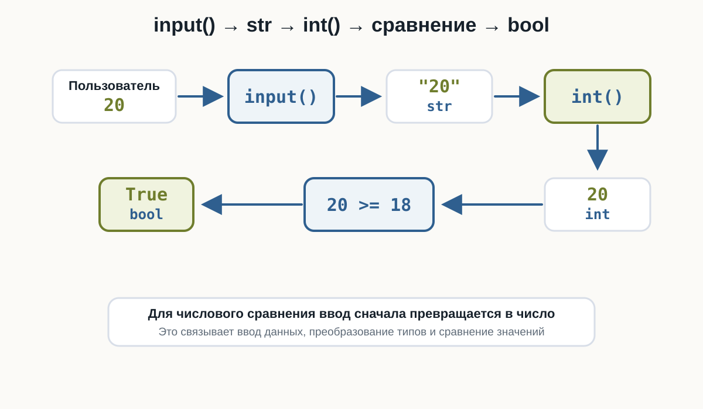
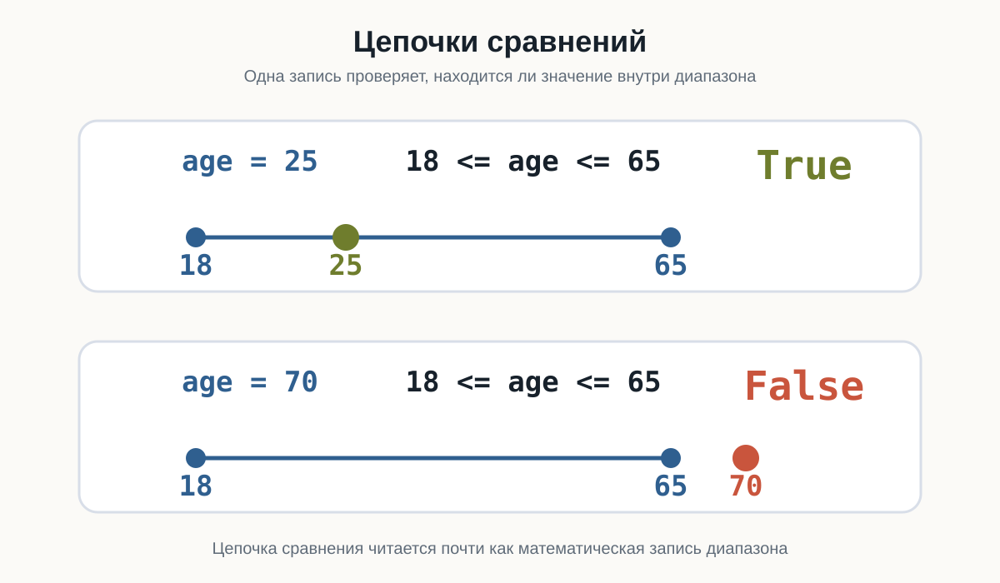

---
pagetitle: "Сравнение значений в Python: ==, !=, >, <"
description: "Сравнение значений в Python: операторы ==, !=, >, <, >=, <=, логические результаты True и False и типичные ошибки начинающих."
keywords:
  - сравнение Python
  - операторы сравнения
  - True False Python
  - равенство Python
  - логические значения
number-sections: true
---

# 3.6 Сравнение значений {.unnumbered}

::: {.callout-important}
Главный вопрос главы:

**Как программа сравнивает значения и получает ответ `True` или `False`?**
:::

В предыдущей главе мы научились выполнять арифметические операции:

```python
price = 120
quantity = 3

total = price * quantity
```

Теперь программа умеет получать числа, преобразовывать их и выполнять вычисления.

Но часто вычислить значение недостаточно.

Программе нужно уметь отвечать на вопросы:

```text
Возраст больше 18?
Цена меньше 1000?
Пароли одинаковые?
Количество не равно нулю?
```

Для этого используются **операторы сравнения**.

Результат любого сравнения — логическое значение:

```python
True
```

или:

```python
False
```

---

## Первое сравнение

Рассмотрим:

```python
print(10 > 5)
```

Результат:

```text
True
```

Python проверил:

```text
10 больше 5?
```

Ответ:

```text
да → True
```

Теперь изменим выражение:

```python
print(10 < 5)
```

Результат:

```text
False
```

То есть сравнение можно представить так:

```text
значение
   ↓
сравнение
   ↓
True или False
```

---

## Операторы сравнения

В Python используются следующие основные операторы:

| Оператор | Значение | Пример | Результат |
|---|---|---|---|
| `==` | равно | `5 == 5` | `True` |
| `!=` | не равно | `5 != 3` | `True` |
| `>` | больше | `10 > 5` | `True` |
| `<` | меньше | `10 < 5` | `False` |
| `>=` | больше или равно | `10 >= 10` | `True` |
| `<=` | меньше или равно | `5 <= 10` | `True` |

Главная идея:

```text
сравнение
   ↓
bool
   ↓
True / False
```

Попробуйте изменить значения `a` и `b` и посмотреть, как меняются ответы:

::: {.content-visible when-format="html"}
::: {.python-playground data-source="../examples/chapter13/basic-comparisons.py" data-title="Основные операторы сравнения"}
:::
:::

::: {.content-visible when-format="pdf"}
```python

```
:::

{fig-alt="Карточки показывают операторы равно, не равно, больше, меньше, больше или равно, меньше или равно; каждый пример возвращает True или False"}

---

## Равенство

Для проверки равенства используется оператор:

```python
==
```

Например:

```python
print(5 == 5)
```

Результат:

```text
True
```

А:

```python
print(5 == 7)
```

даёт:

```text
False
```

Можно сравнивать значения переменных:

```python
first = 10
second = 10

print(first == second)
```

Результат:

```text
True
```

---

## `=` и `==` — разные вещи

Это одна из самых важных деталей.

Один знак:

```python
=
```

используется для присваивания:

```python
age = 25
```

Два знака:

```python
==
```

используются для сравнения:

```python
age == 25
```

То есть:

```text
=   → сохранить значение

==  → сравнить значения
```

::: {.callout-warning title="Не путайте = и =="}

Это разные операции.

```python
age = 25
```

связывает имя `age` со значением `25`.

А:

```python
age == 25
```

проверяет, равно ли значение `age` числу `25`.

Результатом второго выражения будет:

```python
True
```

или:

```python
False
```

:::

В этом примере видно, что присваивание сохраняет значение, а сравнение задаёт вопрос:

::: {.content-visible when-format="html"}
::: {.python-playground data-source="../examples/chapter13/assignment-vs-equality.py" data-title="Присваивание и сравнение"}
:::
:::

::: {.content-visible when-format="pdf"}
```python

```
:::

{fig-alt="Слева age равно 25 связывает имя age со значением 25; справа age равно равно 25 выполняет сравнение и возвращает True"}

---

## Неравенство

Для проверки того, что значения **не равны**, используется:

```python
!=
```

Например:

```python
print(10 != 5)
```

Результат:

```text
True
```

Потому что `10` действительно не равно `5`.

Но:

```python
print(10 != 10)
```

даёт:

```text
False
```

---

## Больше и меньше

Для сравнения чисел используются:

```python
>
<
```

Например:

```python
print(10 > 3)
print(10 < 3)
```

Результат:

```text
True
False
```

Можно читать буквально:

```text
10 > 3
```

как:

> 10 больше 3?

А:

```text
10 < 3
```

как:

> 10 меньше 3?

---

## Больше или равно

Оператор:

```python
>=
```

проверяет сразу два варианта:

```text
больше
или
равно
```

Например:

```python
print(10 >= 5)
print(10 >= 10)
print(10 >= 15)
```

Результат:

```text
True
True
False
```

То есть выражение:

```python
10 >= 10
```

возвращает `True`, потому что значения равны.

---

## Меньше или равно

Оператор:

```python
<=
```

работает похожим образом.

Например:

```python
print(5 <= 10)
print(5 <= 5)
print(5 <= 3)
```

Результат:

```text
True
True
False
```

---

## Результат сравнения имеет тип bool

Сравнение не просто выводит слова `True` и `False`.

Оно действительно создаёт значение типа `bool`.

Проверим:

```python
result = 10 > 5

print(result)
print(type(result))
```

Результат:

```text
True
<class 'bool'>
```

Получается:

```text
10 > 5
  ↓
True
  ↓
bool
```

Это важно, потому что позже программа сможет использовать такой результат для принятия решений.

Проверьте тип результата сравнения:

::: {.content-visible when-format="html"}
::: {.python-playground data-source="../examples/chapter13/comparison-result-type.py" data-title="Результат сравнения имеет тип bool"}
:::
:::

::: {.content-visible when-format="pdf"}
```python

```
:::

{fig-alt="Сравнение 10 больше 5 возвращает True типа bool, а сравнение 10 меньше 5 возвращает False типа bool"}

---

## Сравнение переменных

Сравнивать можно не только числа, записанные прямо в коде.

Например:

```python
age = 25
limit = 18

print(age > limit)
```

Результат:

```text
True
```

Или:

```python
price = 1200
budget = 1000

print(price <= budget)
```

Результат:

```text
False
```

Такие выражения уже похожи на реальные вопросы программы:

```text
Возраст подходит?
Цена помещается в бюджет?
Количество достигло лимита?
```

---

## Сравнение после input()

Теперь объединим тему с пользовательским вводом.

Например:

```python
age = int(input("Введите возраст: "))

print(age >= 18)
```

Если пользователь введёт:

```text
20
```

результат:

```text
True
```

Если:

```text
15
```

результат:

```text
False
```

Здесь происходит знакомая цепочка:

```text
пользователь вводит "20"
        ↓
      input()
        ↓
      "20"
        ↓
      int()
        ↓
       20
        ↓
    20 >= 18
        ↓
      True
```

Запустите пример несколько раз и введите `15`, `18` и `20`:

::: {.content-visible when-format="html"}
::: {.python-playground data-source="../examples/chapter13/age-comparison.py" data-title="Сравнение возраста после input()"}
:::
:::

::: {.content-visible when-format="pdf"}
```python

```
:::

{fig-alt="Пользователь вводит 20, input возвращает строку 20, int создаёт число 20, затем сравнение 20 больше или равно 18 возвращает True типа bool"}

---

## Сравнение строк

Сравнивать можно не только числа.

Например:

```python
print("Python" == "Python")
```

Результат:

```text
True
```

А:

```python
print("Python" == "python")
```

даёт:

```text
False
```

Для Python это разные строки.

Почему?

Потому что отличается регистр букв:

```text
Python
python
```

---

## Регистр имеет значение

Рассмотрим:

```python
password = "Python123"

print(password == "Python123")
print(password == "python123")
```

Результат:

```text
True
False
```

::: {.callout-note title="Строки сравниваются точно"}

При сравнении строк учитываются символы и их регистр.

```python
"Python" == "python"
```

даёт:

```text
False
```

То же относится к пробелам:

```python
"Python" == "Python "
```

тоже:

```text
False
```

:::

Проверьте сравнение строк с разным регистром:

::: {.content-visible when-format="html"}
::: {.python-playground data-source="../examples/chapter13/string-comparison.py" data-title="Сравнение строк"}
:::
:::

::: {.content-visible when-format="pdf"}
```python

```
:::

---

## Сравнение строк с помощью > и <

Python позволяет использовать с некоторыми строками и операторы:

```python
>
<
```

Например:

```python
print("apple" < "banana")
```

Результат:

```text
True
```

Строки сравниваются последовательно по символам.

Но на этом этапе курса не нужно запоминать внутренние правила такого сравнения.

Для начала достаточно уверенно использовать со строками:

```python
==
!=
```

Именно они чаще всего нужны для проверки пользовательских значений.

---

## Сравнение разных числовых типов

`int` и `float` можно сравнивать между собой.

Например:

```python
print(10 == 10.0)
```

Результат:

```text
True
```

Хотя типы разные:

```python
print(type(10))
print(type(10.0))
```

Результат:

```text
<class 'int'>
<class 'float'>
```

Python сравнивает числовые значения:

```text
10
10.0
```

Они представляют одно и то же число.

---

## Значение и тип — не одно и то же

Рассмотрим:

```python
10 == 10.0
```

Результат:

```text
True
```

Но:

```python
type(10) == type(10.0)
```

Результат:

```text
False
```

Почему?

Потому что:

```text
10    → int
10.0  → float
```

Значения равны по числовому смыслу, но типы отличаются.

::: {.callout-tip title="Сравнение отвечает на конкретный вопрос"}

Выражение:

```python
10 == 10.0
```

спрашивает:

> равны ли значения?

А:

```python
type(10) == type(10.0)
```

спрашивает:

> одинаковы ли их типы?

Это разные вопросы.
:::

---

## Сначала вычисление, потом сравнение

В сравнении можно использовать арифметические выражения.

Например:

```python
print(2 + 3 == 5)
```

Результат:

```text
True
```

Сначала Python вычисляет:

```text
2 + 3
```

Получается:

```text
5
```

Затем выполняет:

```text
5 == 5
```

и получает:

```text
True
```

Ещё пример:

```python
print(10 * 2 > 15)
```

Сначала:

```text
10 * 2 → 20
```

Затем:

```text
20 > 15
```

Результат:

```text
True
```

---

## Приоритет арифметики и сравнения

Арифметические операции выполняются раньше сравнений.

Например:

```python
print(5 + 5 > 8)
```

Python сначала вычисляет:

```text
5 + 5 → 10
```

а затем:

```text
10 > 8
```

Результат:

```text
True
```

Можно записать явно:

```python
print((5 + 5) > 8)
```

Результат тот же.

Скобки здесь необязательны, но могут сделать выражение понятнее.

Проверьте несколько выражений, где сначала выполняется арифметика:

::: {.content-visible when-format="html"}
::: {.python-playground data-source="../examples/chapter13/calculation-and-comparison.py" data-title="Сначала вычисление, потом сравнение"}
:::
:::

::: {.content-visible when-format="pdf"}
```python

```
:::

---

## Можно сохранить результат сравнения

Результат сравнения можно сохранить в переменной:

```python
age = 20

is_adult = age >= 18

print(is_adult)
```

Результат:

```text
True
```

Обратите внимание на имя:

```python
is_adult
```

Оно хорошо описывает логическое значение.

Такие имена часто начинаются с:

```text
is_
has_
can_
```

Например:

```python
is_adult = age >= 18
has_access = password == "Python123"
can_buy = money >= price
```

Пока это просто переменные типа `bool`.

В следующей теме мы начнём использовать их для управления поведением программы.

---

## Несколько полезных примеров

Проверка возраста:

```python
age = 21

is_adult = age >= 18

print(is_adult)
```

Проверка бюджета:

```python
price = 800
budget = 1000

can_buy = price <= budget

print(can_buy)
```

Проверка пароля:

```python
password = "python"

is_correct = password == "python"

print(is_correct)
```

Проверка количества:

```python
count = 0

is_empty = count == 0

print(is_empty)
```

Все эти примеры имеют одну общую схему:

```text
данные
  ↓
сравнение
  ↓
True / False
```

---

## Попробуйте сами

::: {.callout-tip title="Эксперимент"}

Создайте программу:

```python
a = 10
b = 5

print(a == b)
print(a != b)
print(a > b)
print(a < b)
print(a >= b)
print(a <= b)
```

Перед запуском попробуйте предсказать каждый результат.

Затем измените:

```python
a = 10
b = 5
```

например на:

```python
a = 5
b = 5
```

Посмотрите, какие результаты изменятся.

:::

---

## Типичная ошибка: сравнение строки и числа

Вспомним `input()`:

```python
age = input("Введите возраст: ")
```

Если пользователь введёт:

```text
18
```

переменная будет содержать:

```python
"18"
```

То есть `str`.

Поэтому перед числовым сравнением обычно нужно выполнить преобразование:

```python
age = int(input("Введите возраст: "))

print(age >= 18)
```

Это корректно.

::: {.callout-warning title="Сначала нужный тип, потом сравнение"}

Если данные должны быть числом, сначала преобразуйте результат `input()`:

```python
age = int(input("Введите возраст: "))
```

и только затем сравнивайте:

```python
age >= 18
```

Не забывайте:

```text
input() → str
```

:::

---

## Цепочки сравнений

В Python можно записать несколько сравнений в одном выражении.

Например:

```python
age = 25

print(18 <= age <= 65)
```

Результат:

```text
True
```

Такое выражение можно прочитать:

```text
18 <= age <= 65
```

как:

> `age` находится между 18 и 65 включительно.

Другой пример:

```python
temperature = 20

print(0 <= temperature <= 30)
```

Результат:

```text
True
```

::: {.callout-note title="Цепочки сравнений"}

Python позволяет писать:

```python
0 <= value <= 100
```

Это компактный способ проверить, находится ли значение внутри диапазона.

Пока достаточно понимать саму запись. Позже такие выражения будут особенно полезны в условиях.
:::

Измените `age` или `temperature` и посмотрите, когда результат станет `False`:

::: {.content-visible when-format="html"}
::: {.python-playground data-source="../examples/chapter13/comparison-chain.py" data-title="Цепочки сравнений"}
:::
:::

::: {.content-visible when-format="pdf"}
```python

```
:::

{fig-alt="При age равном 25 значение находится между 18 и 65, поэтому 18 меньше или равно age меньше или равно 65 даёт True; при age равном 70 значение вне диапазона, поэтому результат False"}

---

## Что важно запомнить

Основные операторы сравнения:

```text
==  равно
!=  не равно
>   больше
<   меньше
>=  больше или равно
<=  меньше или равно
```

Любое сравнение возвращает:

```python
True
```

или:

```python
False
```

То есть результат имеет тип:

```text
bool
```

Важно различать:

```text
=   присваивание
==  сравнение
```

Сравнивать можно:

- числа;
- строки;
- значения переменных;
- результаты вычислений.

Например:

```python
age >= 18
price <= budget
password == "python"
count != 0
```

И самое важное:

> **Сравнение превращает вопрос о значениях в логический ответ `True` или `False`.**

### Практические задания

**Задание 1. Больше ли число?**

Пользователь вводит число.

Проверьте, больше ли оно `10`.

Пример:

```text
Введите число: 15
True
```

::: {.callout-note title="Ответ" collapse="true"}

```python
number = float(input("Введите число: "))

print(number > 10)
```

:::

---

**Задание 2. Равны ли числа?**

Пользователь вводит два числа.

Выведите результат проверки, равны ли они.

Пример:

```text
Первое число: 10
Второе число: 10
True
```

::: {.callout-note title="Ответ" collapse="true"}

```python
first = float(input("Первое число: "))
second = float(input("Второе число: "))

print(first == second)
```

:::

---

**Задание 3. Проверка возраста**

Пользователь вводит возраст.

Проверьте, достиг ли он `18` лет.

Пример:

```text
Возраст: 20
True
```

::: {.callout-note title="Ответ" collapse="true"}

```python
age = int(input("Возраст: "))

print(age >= 18)
```

:::

---

**Задание 4. Проверка пароля**

Дан правильный пароль:

```python
correct_password = "python123"
```

Попросите пользователя ввести пароль и выведите результат сравнения.

Пример:

```text
Введите пароль: python123
True
```

::: {.callout-note title="Ответ" collapse="true"}

```python
correct_password = "python123"

password = input("Введите пароль: ")

print(password == correct_password)
```

:::

---

**Задание 5. Помещается ли покупка в бюджет?**

Пользователь вводит:

- стоимость товара;
- свой бюджет.

Проверьте, хватает ли бюджета на покупку.

Пример:

```text
Стоимость товара: 750
Бюджет: 1000
True
```

::: {.callout-note title="Ответ" collapse="true"}

```python
price = float(input("Стоимость товара: "))
budget = float(input("Бюджет: "))

print(price <= budget)
```

:::

---

**Задание 6. Предскажите результат**

Не запускайте код сразу.

Определите результаты:

```python
print(10 == 10)
print(10 != 10)
print(5 > 3)
print(5 <= 5)
print(10 == 10.0)
print("Python" == "python")
```

::: {.callout-note title="Ответ" collapse="true"}

Результаты:

```text
True
False
True
True
True
False
```

`10 == 10.0` возвращает `True`, потому что числовые значения равны.

А:

```python
"Python" == "python"
```

возвращает `False`, потому что строки отличаются регистром.

:::

---

**Задание 7. Сначала вычисление, потом сравнение**

Какой результат будет у каждого выражения?

```python
print(2 + 3 == 5)
print(10 * 2 > 25)
print((4 + 6) <= 10)
print(20 / 2 == 10)
```

::: {.callout-note title="Ответ" collapse="true"}

Результат:

```text
True
False
True
True
```

Сначала Python выполняет арифметическую операцию, затем сравнивает полученное значение.

:::

---

**Задание 8. Задача со звёздочкой**

Пользователь вводит число.

Проверьте, находится ли оно в диапазоне от `0` до `100` включительно.

Пример:

```text
Введите число: 75
True
```

Используйте цепочку сравнений.

::: {.callout-note title="Ответ" collapse="true"}

```python
number = float(input("Введите число: "))

print(0 <= number <= 100)
```

Например:

```text
75 → True
0 → True
100 → True
120 → False
-5 → False
```

:::

---

## Что дальше?

Теперь программа умеет не только вычислять значения, но и задавать вопросы:

```python
age >= 18
```

```python
password == "python"
```

```python
price <= budget
```

Пока Python только получает результат:

```text
True
```

или:

```text
False
```

Но следующий шаг намного интереснее.

Мы хотим, чтобы программа могла сделать так:

```text
если результат True
    выполнить одно действие

если False
    выполнить другое
```

То есть программа должна научиться **принимать решения**.

Для этого в Python используются условные конструкции.

Следующая глава: **Условия**.
