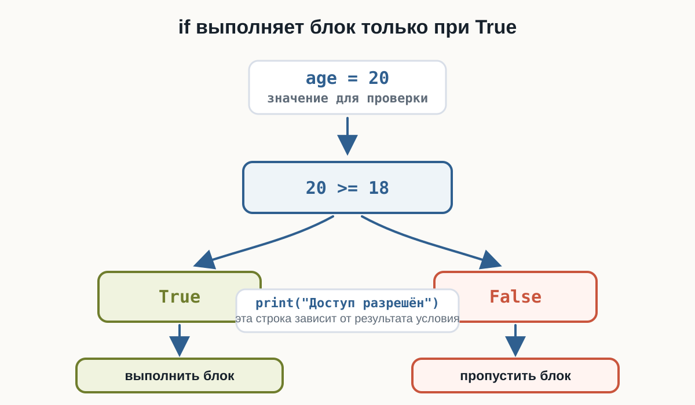
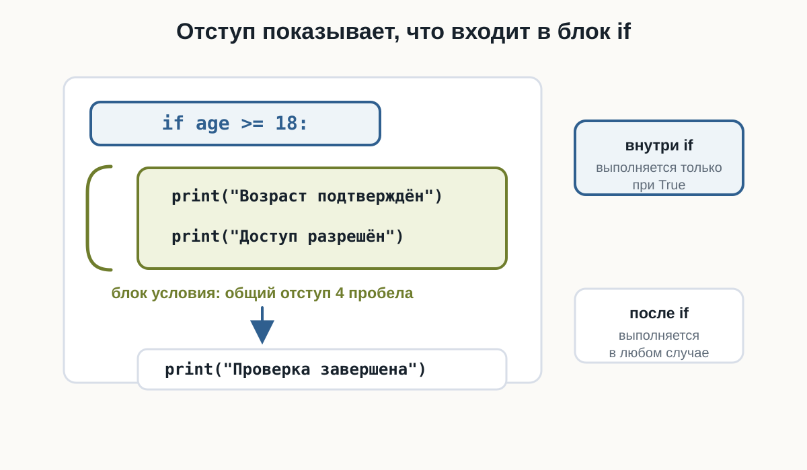
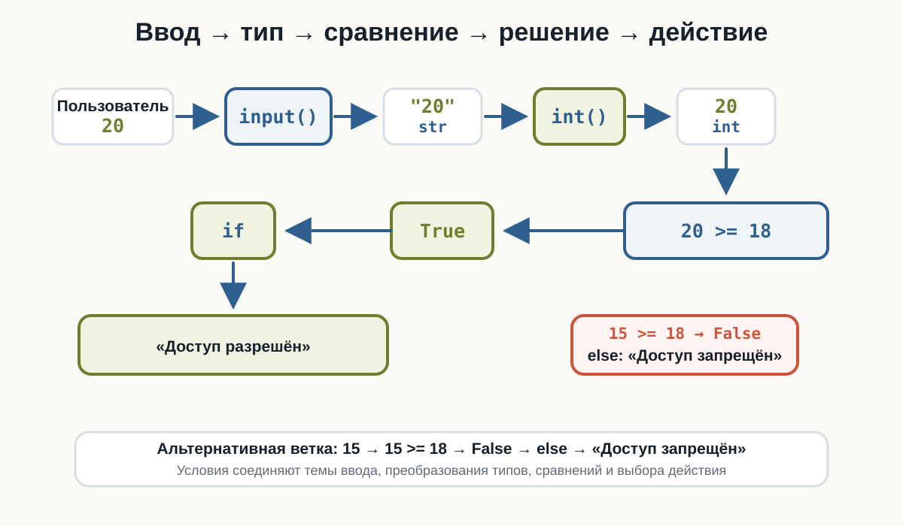
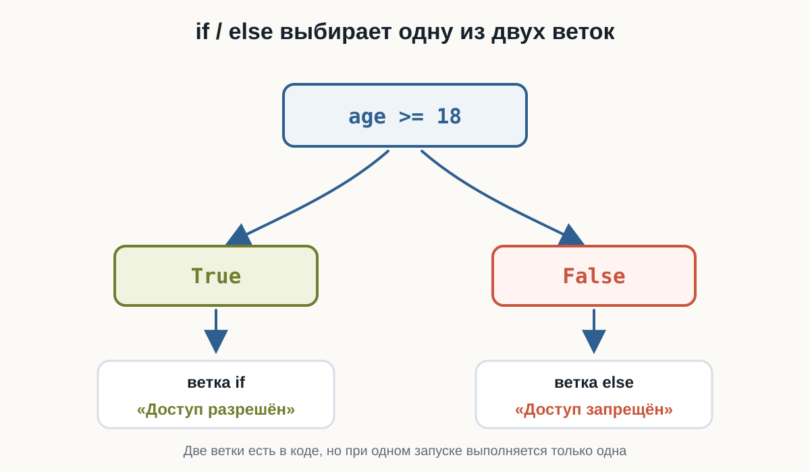
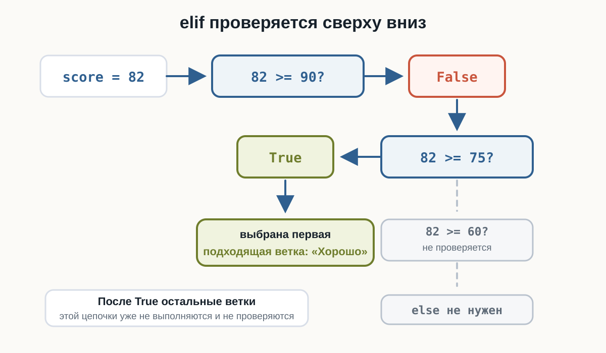

---
pagetitle: "Условия в Python: if, else и elif"
description: "Условия в Python для начинающих: if, else, elif, отступы, блоки кода, проверки после input() и выбор действий в программе."
keywords:
  - условия Python
  - if Python
  - else Python
  - elif Python
  - отступы Python
  - ветвление программы
number-sections: true
---

# 3.7 Условия  {.unnumbered}

::: {.callout-important}
Главный вопрос главы:

**Как сделать так, чтобы программа выполняла разные действия в зависимости от ситуации?**
:::

В предыдущей главе мы научились сравнивать значения:

```python
age >= 18
```

```python
price <= budget
```

```python
password == "python"
```

Каждое такое выражение возвращает:

```python
True
```

или:

```python
False
```

Но пока программа только получает этот результат.

Например:

```python
age = 20

print(age >= 18)
```

Результат:

```text
True
```

Гораздо интереснее сделать так:

```text
если возраст не меньше 18
    вывести "Доступ разрешён"
```

Именно для этого в Python используются **условия**.

---

## Первая условная конструкция

Начнём с простого примера:

```python
age = 20

if age >= 18:
    print("Доступ разрешён")
```

::: {.content-visible when-format="html"}
::: {.python-playground data-source="../examples/chapter14/first-if.py" data-title="Первый if"}
:::
:::

::: {.content-visible when-format="pdf"}
```python

```
:::

Результат:

```text
Доступ разрешён
```

Здесь появилась новая конструкция:

```python
if
```

Слово `if` можно перевести как:

> **если**

Поэтому код:

```python
if age >= 18:
    print("Доступ разрешён")
```

можно прочитать почти как обычное предложение:

> Если `age` больше или равно `18`, вывести «Доступ разрешён».

---

## Как работает if

Рассмотрим:

```python
age = 20

if age >= 18:
    print("Доступ разрешён")
```

Python сначала вычисляет условие:

```python
age >= 18
```

То есть:

```python
20 >= 18
```

Результат:

```python
True
```

Так как условие истинно, Python выполняет:

```python
print("Доступ разрешён")
```

{fig-alt="Значение age равно 20, сравнение 20 больше или равно 18 даёт True, поэтому блок if выполняется; при False блок был бы пропущен"}

---

## Что произойдёт при False

Изменим возраст:

```python
age = 15

if age >= 18:
    print("Доступ разрешён")
```

Теперь условие:

```python
age >= 18
```

превращается в:

```python
15 >= 18
```

Результат:

```text
False
```

Поэтому строка:

```python
print("Доступ разрешён")
```

не выполняется.

Программа просто идёт дальше.

Например:

```python
age = 15

print("Проверяем возраст")

if age >= 18:
    print("Доступ разрешён")

print("Проверка завершена")
```

Результат:

```text
Проверяем возраст
Проверка завершена
```

Строка внутри `if` была пропущена.

---

## Синтаксис if

Условная конструкция начинается с:

```python
if
```

Затем записывается условие:

```python
if age >= 18
```

После условия обязательно ставится двоеточие:

```python
if age >= 18:
```

Следующая строка записывается с отступом:

```python
if age >= 18:
    print("Доступ разрешён")
```

Общая форма:

```python
if условие:
    действие
```

::: {.callout-warning title="Не забывайте двоеточие"}

После условия ставится:

```python
:
```

Правильно:

```python
if age >= 18:
    print("Доступ разрешён")
```

Неправильно:

```python
if age >= 18
    print("Доступ разрешён")
```

Без двоеточия Python сообщит о синтаксической ошибке.
:::

---

## Отступ — часть синтаксиса Python

Посмотрите ещё раз:

```python
if age >= 18:
    print("Доступ разрешён")
```

Перед `print()` есть отступ.

Он показывает, что эта команда относится к `if`.

Без отступа:

```python
if age >= 18:
print("Доступ разрешён")
```

код записан неправильно.

В Python отступы — не просто оформление.

Они определяют структуру программы.

::: {.callout-important title="Отступы имеют значение"}

Внутри `if` обычно используется отступ в **4 пробела**:

```python
if condition:
    print("Эта строка находится внутри if")
```

Код без отступа уже находится за пределами этого блока:

```python
if condition:
    print("Внутри if")

print("После if")
```
:::

{fig-alt="Две строки print с отступом входят в блок if, а строка print без отступа находится после условия и выполняется отдельно"}

---

## Блок кода

Внутри условия может находиться не одна команда, а несколько.

Например:

```python
age = 20

if age >= 18:
    print("Возраст подтверждён")
    print("Доступ разрешён")
    print("Добро пожаловать!")

print("Программа завершена")
```

Если условие `True`, выполняются все три строки с одинаковым отступом.

Можно представить:

```text
if условие:
    ├── команда 1
    ├── команда 2
    └── команда 3

следующая команда
```

Несколько строк с одинаковым отступом образуют **блок кода**.

---

## Условие после input()

Теперь объединим `if` с пользовательским вводом.

```python
age = int(input("Введите возраст: "))

if age >= 18:
    print("Доступ разрешён")
```

Если пользователь введёт:

```text
20
```

получим:

```text
Введите возраст: 20
Доступ разрешён
```

Если пользователь введёт:

```text
15
```

сообщение не появится.

Здесь соединяются уже знакомые конструкции:

```text
пользователь
    ↓
 input()
    ↓
   str
    ↓
  int()
    ↓
сравнение
    ↓
True / False
    ↓
   if
    ↓
действие
```

Теперь результат сравнения действительно начинает влиять на поведение программы.

{fig-alt="Пользователь вводит 20, input возвращает строку 20, int создаёт число 20, сравнение 20 больше или равно 18 даёт True, if выводит Доступ разрешён; для 15 срабатывает else и выводится Доступ запрещён"}

---

## Ветка else

Часто одного `if` недостаточно.

Например, мы хотим:

```text
если возраст >= 18
    вывести "Доступ разрешён"

иначе
    вывести "Доступ запрещён"
```

Для второй ветки используется:

```python
else
```

Пример:

```python
age = int(input("Введите возраст: "))

if age >= 18:
    print("Доступ разрешён")
else:
    print("Доступ запрещён")
```

::: {.content-visible when-format="html"}
::: {.python-playground data-source="../examples/chapter14/if-else.py" data-title="if / else для проверки возраста"}
:::
:::

::: {.content-visible when-format="pdf"}
```python

```
:::

Если пользователь введёт:

```text
20
```

результат:

```text
Доступ разрешён
```

Если:

```text
15
```

результат:

```text
Доступ запрещён
```

---

## Как работает if...else

Конструкцию можно представить так:

{fig-alt="Условие age больше или равно 18 даёт True или False; при True выполняется ветка if с сообщением Доступ разрешён, при False выполняется ветка else с сообщением Доступ запрещён"}

В коде:

```python
if condition:
    действие_если_true
else:
    действие_если_false
```

Важно:

> Из двух веток выполняется только одна.

Если условие `True` — выполняется `if`.

Если `False` — выполняется `else`.

---

## Пример с паролем

Рассмотрим простой пример:

```python
correct_password = "python123"
password = input("Введите пароль: ")

if password == correct_password:
    print("Пароль верный")
else:
    print("Пароль неверный")
```

::: {.content-visible when-format="html"}
::: {.python-playground data-source="../examples/chapter14/password-check.py" data-title="Проверка пароля"}
:::
:::

::: {.content-visible when-format="pdf"}
```python

```
:::

Если пользователь введёт:

```text
python123
```

сравнение:

```python
password == correct_password
```

даст:

```python
True
```

и программа выведет:

```text
Пароль верный
```

Другой пароль даст `False`, поэтому выполнится ветка `else`.

---

## Пример с бюджетом

Условия могут использовать результаты числовых сравнений.

```python
price = float(input("Цена товара: "))
budget = float(input("Ваш бюджет: "))

if budget >= price:
    print("Покупку можно совершить")
else:
    print("Недостаточно денег")
```

Пример:

```text
Цена товара: 750
Ваш бюджет: 1000
Покупку можно совершить
```

А при:

```text
Цена товара: 1200
Ваш бюджет: 1000
Недостаточно денег
```

В этой же схеме можно не только выбрать сообщение, но и вычислить остаток:

::: {.content-visible when-format="html"}
::: {.python-playground data-source="../examples/chapter14/purchase-check.py" data-title="Проверка покупки и остаток денег"}
:::
:::

::: {.content-visible when-format="pdf"}
```python

```
:::

---

## Несколько вариантов: elif

Иногда двух вариантов недостаточно.

Например, программа оценивает температуру:

```text
выше 25     → Жарко
выше 10     → Тепло
иначе       → Холодно
```

Для дополнительных условий используется:

```python
elif
```

Пример:

```python
temperature = 18

if temperature > 25:
    print("Жарко")
elif temperature > 10:
    print("Тепло")
else:
    print("Холодно")
```

::: {.content-visible when-format="html"}
::: {.python-playground data-source="../examples/chapter14/temperature-elif.py" data-title="Температура и elif"}
:::
:::

::: {.content-visible when-format="pdf"}
```python

```
:::

Результат:

```text
Тепло
```

---

## Как работает elif

Python проверяет условия сверху вниз.

Для программы:

```python
temperature = 18

if temperature > 25:
    print("Жарко")
elif temperature > 10:
    print("Тепло")
else:
    print("Холодно")
```

сначала проверяется:

```python
temperature > 25
```

То есть:

```text
18 > 25 → False
```

Python переходит к следующему условию:

```python
temperature > 10
```

Получается:

```text
18 > 10 → True
```

Поэтому выполняется:

```python
print("Тепло")
```

После этого остальные ветки этой конструкции уже не проверяются.

Общая схема:

{fig-alt="Для score 82 проверка 82 больше или равно 90 даёт False, проверка 82 больше или равно 75 даёт True, поэтому выбирается Хорошо и остальные ветки не проверяются"}

---

## Порядок условий имеет значение

Рассмотрим:

```python
score = 95

if score >= 60:
    print("Зачёт")
elif score >= 90:
    print("Отличный результат")
```

Какой текст появится?

```text
Зачёт
```

Почему не:

```text
Отличный результат
```

Потому что первое условие:

```python
score >= 60
```

уже равно `True`.

После выполнения этой ветки Python не проверяет следующий `elif`.

Если нам нужны категории, более строгую проверку следует поставить раньше:

```python
score = 95

if score >= 90:
    print("Отличный результат")
elif score >= 60:
    print("Зачёт")
else:
    print("Незачёт")
```

Теперь результат:

```text
Отличный результат
```

::: {.callout-warning title="Проверки идут сверху вниз"}

В цепочке:

```python
if ...
elif ...
elif ...
else ...
```

Python выбирает **первую подходящую ветку**.

Поэтому порядок условий может изменить результат программы.
:::

---

## elif может быть несколько

В одной конструкции может быть несколько `elif`.

Например:

```python
score = int(input("Введите балл: "))

if score >= 90:
    print("Отлично")
elif score >= 75:
    print("Хорошо")
elif score >= 60:
    print("Зачёт")
else:
    print("Незачёт")
```

::: {.content-visible when-format="html"}
::: {.python-playground data-source="../examples/chapter14/score-grades.py" data-title="Оценка результата"}
:::
:::

::: {.content-visible when-format="pdf"}
```python

```
:::

Например:

```text
Введите балл: 82
Хорошо
```

Python проверяет:

```text
82 >= 90 → False
82 >= 75 → True
```

После этого нужная ветка найдена.

---

## else не содержит условия

Обратите внимание:

```python
else:
```

не содержит никакого сравнения.

Мы не пишем:

```python
else age < 18:
```

Правильно:

```python
if age >= 18:
    print("Совершеннолетний")
else:
    print("Несовершеннолетний")
```

`else` означает:

> если ни одна предыдущая подходящая проверка не сработала.

---

## elif и else не всегда обязательны

Можно использовать только `if`:

```python
if temperature < 0:
    print("На улице мороз")
```

Можно использовать:

```python
if ...
else ...
```

Например:

```python
if age >= 18:
    print("Доступ разрешён")
else:
    print("Доступ запрещён")
```

Или:

```python
if ...
elif ...
else ...
```

Например:

```python
if score >= 90:
    print("Отлично")
elif score >= 60:
    print("Зачёт")
else:
    print("Незачёт")
```

Выбор зависит от количества вариантов поведения программы.

---

## Условием уже может быть bool

После `if` не обязательно писать сравнение непосредственно.

Можно заранее сохранить результат:

```python
age = 20

is_adult = age >= 18

if is_adult:
    print("Доступ разрешён")
```

Переменная:

```python
is_adult
```

содержит:

```python
True
```

Поэтому Python выполняет блок.

Это связывает текущую тему с типом `bool`, который мы изучали раньше.

```text
age >= 18
    ↓
  True
    ↓
is_adult
    ↓
   if
```

---

## Код после условия

Код без отступа выполняется после всей условной конструкции.

Например:

```python
age = 15

if age >= 18:
    print("Доступ разрешён")
else:
    print("Доступ запрещён")

print("Проверка завершена")
```

Результат:

```text
Доступ запрещён
Проверка завершена
```

Последний `print()` не относится ни к `if`, ни к `else`.

Поэтому он выполняется в любом случае.

Сравните:

```python
if condition:
    print("Внутри if")

print("После if")
```

Отступ визуально показывает структуру программы.

---

## Вложенные условия

Внутри одного `if` можно разместить другой `if`.

Например:

```python
age = 20
has_ticket = True

if age >= 18:
    print("Возраст подходит")

    if has_ticket:
        print("Билет есть")
        print("Можно войти")
```

Второй `if` выполняется только после того, как программа попала внутрь первого блока.

Структура выглядит так:

```text
if первое условие:
    действие

    if второе условие:
        действие
```

Каждый новый уровень вложенности получает дополнительный отступ.

::: {.callout-note title="Не усложняйте вложенность без необходимости"}

Вложенные условия полезны, когда вторая проверка действительно зависит от первой.

Но большое количество вложенных `if` быстро делает код трудным для чтения.

Пока используйте вложенность только в простых и очевидных случаях.
:::

---

## Пример: билет в кино

Напишем небольшую интерактивную программу:

```python
age = int(input("Введите возраст: "))

if age < 6:
    price = 0
elif age < 18:
    price = 300
else:
    price = 500

print("Стоимость билета:", price)
```

::: {.content-visible when-format="html"}
::: {.python-playground data-source="../examples/chapter14/ticket-price.py" data-title="Стоимость билета"}
:::
:::

::: {.content-visible when-format="pdf"}
```python

```
:::

Пример:

```text
Введите возраст: 12
Стоимость билета: 300
```

Здесь условие не только выбирает сообщение.

Оно определяет значение переменной:

```python
price
```

Это важный шаг: разные ветки программы могут выполнять разные вычисления.

---

## Пример: положительное, отрицательное или ноль

Условия позволяют классифицировать значение.

```python
number = float(input("Введите число: "))

if number > 0:
    print("Положительное число")
elif number < 0:
    print("Отрицательное число")
else:
    print("Ноль")
```

::: {.content-visible when-format="html"}
::: {.python-playground data-source="../examples/chapter14/positive-negative-zero.py" data-title="Положительное, отрицательное или ноль"}
:::
:::

::: {.content-visible when-format="pdf"}
```python

```
:::

Для:

```text
Введите число: -5
```

результат:

```text
Отрицательное число
```

Для:

```text
Введите число: 0
```

результат:

```text
Ноль
```

Здесь три возможных пути:

```text
number > 0
    ↓
положительное

number < 0
    ↓
отрицательное

иначе
    ↓
ноль
```

---

## Попробуйте сами

::: {.callout-tip title="Эксперимент"}

Запустите программу с разными значениями `score`:

```python
score = 75

if score >= 90:
    print("Отлично")
elif score >= 75:
    print("Хорошо")
elif score >= 60:
    print("Зачёт")
else:
    print("Незачёт")
```

Попробуйте:

```text
100
90
89
75
74
60
59
0
```

Перед каждым запуском сначала предскажите, какая ветка выполнится.

Особенно обратите внимание на граничные значения:

```text
90
75
60
```
:::

---

## Типичные ошибки

При работе с условиями начинающие часто сталкиваются с несколькими ошибками.

### Пропущено двоеточие

Неправильно:

```python
if age >= 18
    print("Доступ разрешён")
```

Правильно:

```python
if age >= 18:
    print("Доступ разрешён")
```

### Нет отступа

Неправильно:

```python
if age >= 18:
print("Доступ разрешён")
```

Правильно:

```python
if age >= 18:
    print("Доступ разрешён")
```

### Перепутаны = и ==

Для сравнения:

```python
password == "python"
```

а не:

```python
password = "python"
```

### Неправильный порядок elif

Если более широкое условие поставить раньше более строгого:

```python
if score >= 60:
    print("Зачёт")
elif score >= 90:
    print("Отлично")
```

ветка `score >= 90` никогда не будет выбрана для значения `95`.

Правильнее:

```python
if score >= 90:
    print("Отлично")
elif score >= 60:
    print("Зачёт")
```

---

## Что важно запомнить

Условные конструкции позволяют программе выбирать, какой код выполнять.

Основная форма:

```python
if условие:
    действие
```

Два варианта:

```python
if условие:
    действие_1
else:
    действие_2
```

Несколько вариантов:

```python
if условие_1:
    действие_1
elif условие_2:
    действие_2
else:
    действие_3
```

Главная цепочка:

```text
данные
  ↓
сравнение
  ↓
True / False
  ↓
if
  ↓
выбор действия
```

Важно помнить:

```text
if    → если

elif  → иначе если

else  → иначе
```

Также:

- после `if`, `elif` и `else` ставится `:`;
- блоки кода обозначаются отступами;
- Python проверяет ветки сверху вниз;
- в цепочке `if / elif / else` выполняется первая подходящая ветка;
- `else` выполняется, если предыдущие условия не подошли.

И самое важное:

> **Условия превращают программу из последовательности команд в программу, которая может выбирать своё поведение.**

---

### Практические задания

**Задание 1. Положительное число**

Пользователь вводит число.

Если оно больше `0`, выведите:

```text
Число положительное
```

Если число равно `0` или меньше, ничего выводить не нужно.

::: {.callout-note title="Ответ" collapse="true"}

```python
number = float(input("Введите число: "))

if number > 0:
    print("Число положительное")
```

:::

---

**Задание 2. Совершеннолетие**

Пользователь вводит возраст.

Если возраст не меньше `18`, выведите:

```text
Доступ разрешён
```

Иначе:

```text
Доступ запрещён
```

::: {.callout-note title="Ответ" collapse="true"}

```python
age = int(input("Введите возраст: "))

if age >= 18:
    print("Доступ разрешён")
else:
    print("Доступ запрещён")
```

:::

---

**Задание 3. Проверка пароля**

Правильный пароль:

```python
correct_password = "python123"
```

Попросите пользователя ввести пароль.

Если он совпадает с правильным, выведите:

```text
Добро пожаловать
```

Иначе:

```text
Неверный пароль
```

::: {.callout-note title="Ответ" collapse="true"}

```python
correct_password = "python123"
password = input("Введите пароль: ")

if password == correct_password:
    print("Добро пожаловать")
else:
    print("Неверный пароль")
```

:::

---

**Задание 4. Больше из двух чисел**

Пользователь вводит два разных числа.

Выведите большее из них.

Пример:

```text
Первое число: 10
Второе число: 25
Большее число: 25.0
```

::: {.callout-note title="Ответ" collapse="true"}

```python
first = float(input("Первое число: "))
second = float(input("Второе число: "))

if first > second:
    print("Большее число:", first)
else:
    print("Большее число:", second)
```

:::

---

**Задание 5. Температура**

Пользователь вводит температуру.

Выведите:

```text
Жарко
```

если температура выше `25`.

Выведите:

```text
Тепло
```

если температура выше `10`, но не выше `25`.

В остальных случаях:

```text
Холодно
```

::: {.callout-note title="Ответ" collapse="true"}

```python
temperature = float(input("Введите температуру: "))

if temperature > 25:
    print("Жарко")
elif temperature > 10:
    print("Тепло")
else:
    print("Холодно")
```

:::

---

**Задание 6. Оценка результата**

Пользователь вводит количество баллов от `0` до `100`.

Выведите:

```text
Отлично
```

если балл не меньше `90`.

```text
Хорошо
```

если балл не меньше `75`.

```text
Зачёт
```

если балл не меньше `60`.

В остальных случаях:

```text
Незачёт
```

::: {.callout-note title="Ответ" collapse="true"}

```python
score = int(input("Введите балл: "))

if score >= 90:
    print("Отлично")
elif score >= 75:
    print("Хорошо")
elif score >= 60:
    print("Зачёт")
else:
    print("Незачёт")
```

Порядок условий здесь важен.

Сначала проверяются самые высокие границы:

```text
90
↓
75
↓
60
```

:::

---

**Задание 7. Найдите ошибку**

Почему программа работает неправильно для `score = 95`?

```python
score = 95

if score >= 60:
    print("Зачёт")
elif score >= 90:
    print("Отлично")
else:
    print("Незачёт")
```

Исправьте её.

::: {.callout-note title="Ответ" collapse="true"}

Python проверяет условия сверху вниз.

Для:

```python
score = 95
```

первое условие:

```python
score >= 60
```

уже равно `True`.

Поэтому Python выполняет эту ветку и больше не проверяет `elif`.

Нужно поменять условия местами:

```python
score = 95

if score >= 90:
    print("Отлично")
elif score >= 60:
    print("Зачёт")
else:
    print("Незачёт")
```

Теперь результат:

```text
Отлично
```

:::

---

**Задание 8. Положительное, отрицательное или ноль**

Пользователь вводит число.

Программа должна вывести одно из трёх сообщений:

```text
Положительное число
Отрицательное число
Ноль
```

::: {.callout-note title="Ответ" collapse="true"}

```python
number = float(input("Введите число: "))

if number > 0:
    print("Положительное число")
elif number < 0:
    print("Отрицательное число")
else:
    print("Ноль")
```

:::

---

**Задание 9. Стоимость билета**

Пользователь вводит возраст.

Стоимость билета:

```text
до 6 лет       → 0
от 6 до 17     → 300
18 и старше    → 500
```

Определите стоимость и выведите её.

::: {.callout-note title="Ответ" collapse="true"}

```python
age = int(input("Введите возраст: "))

if age < 6:
    price = 0
elif age < 18:
    price = 300
else:
    price = 500

print("Стоимость билета:", price)
```

Обратите внимание: после того как первое условие:

```python
age < 6
```

оказалось `False`, во второй ветке уже известно, что возраст не меньше `6`.

Поэтому достаточно проверить:

```python
age < 18
```

:::

---

**Задание 10. Задача со звёздочкой**

Напишите программу проверки покупки.

Пользователь вводит:

- цену товара;
- количество денег.

Если денег больше или столько же, сколько стоит товар:

1. вывести:

```text
Покупка возможна
```

2. вычислить остаток денег;
3. вывести остаток.

Иначе вывести:

```text
Недостаточно денег
```

Пример:

```text
Цена товара: 750
Ваши деньги: 1000
Покупка возможна
Остаток: 250.0
```

::: {.callout-note title="Ответ" collapse="true"}

```python
price = float(input("Цена товара: "))
money = float(input("Ваши деньги: "))

if money >= price:
    remaining = money - price

    print("Покупка возможна")
    print("Остаток:", remaining)
else:
    print("Недостаточно денег")
```

Здесь объединяются сразу несколько изученных тем:

```text
input()
↓
float()
↓
сравнение
↓
if / else
↓
арифметика
↓
результат
```

:::

---

## Что дальше?

Теперь наши программы уже могут реагировать на данные:

```python
age = int(input("Возраст: "))

if age >= 18:
    print("Доступ разрешён")
else:
    print("Доступ запрещён")
```

Но реальные решения часто зависят сразу от нескольких требований.

Например:

```text
возраст не меньше 18
И
билет куплен
```

или:

```text
пользователь администратор
ИЛИ
пользователь владелец
```

Чтобы объединять несколько условий, понадобятся **логические операторы**.

Они позволят строить более сложные проверки из уже знакомых значений `True` и `False`.

Следующая глава: **Логические операции**.
