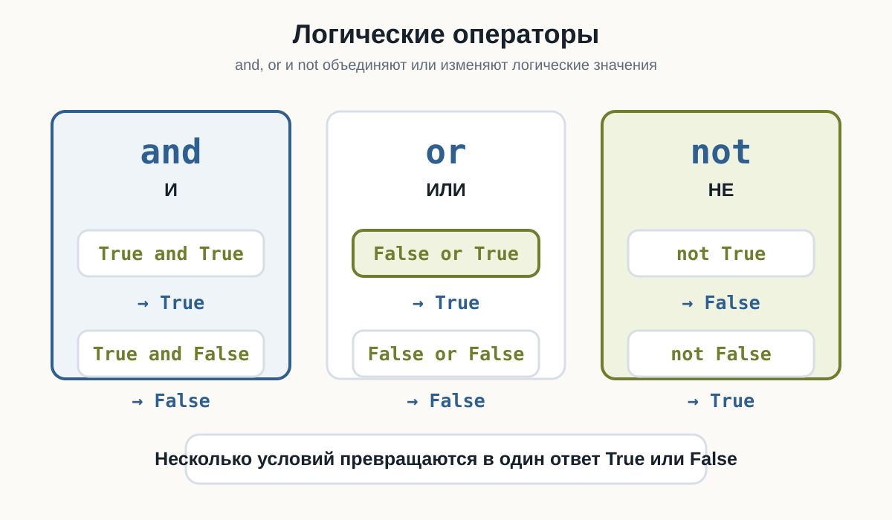
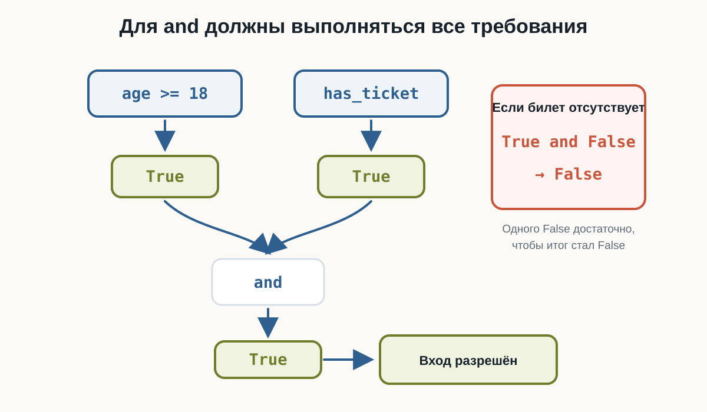
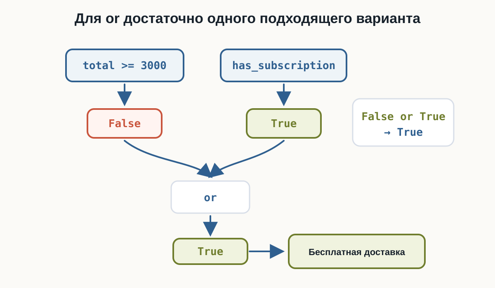
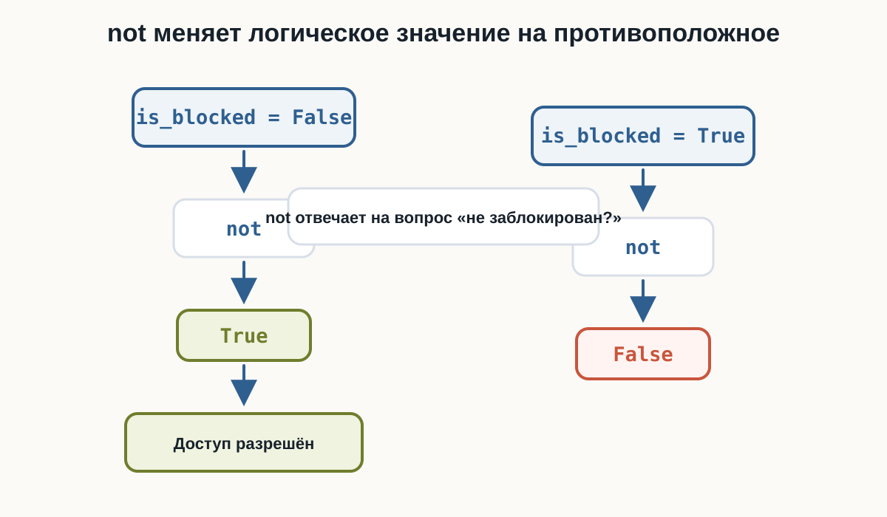
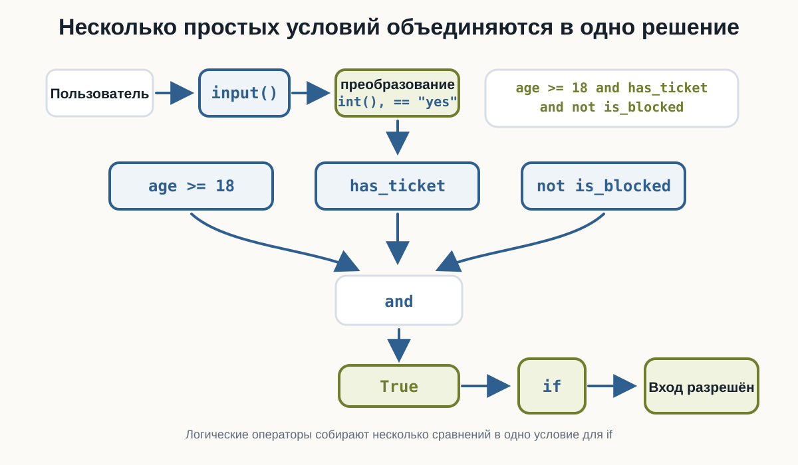

---
pagetitle: "Логические операции в Python: and, or, not"
description: "Логические операции в Python: and, or, not, объединение нескольких условий, приоритет операторов и практические проверки доступа."
keywords:
  - логические операции Python
  - and Python
  - or Python
  - not Python
  - булева логика
  - условия Python
number-sections: true
---

# 3.8 Логические операции  {.unnumbered}

::: {.callout-important}
Главный вопрос главы:

**Как объединять несколько условий в одно выражение?**
:::

В предыдущих главах мы научились получать логический ответ:

```python
age >= 18
password == "python123"
total >= 3000
```

Каждое сравнение возвращает `True` или `False`.

Но реальные решения часто зависят не от одного вопроса, а от нескольких сразу:

```text
возраст подходит
и
билет есть
```

или:

```text
сумма заказа большая
или
есть подписка
```

Для таких случаев в Python используются **логические операторы**.

---

## Три логических оператора

В этой главе нужны три слова:

```python
and
or
not
```

Их можно читать почти как обычные русские слова:

```text
and -> и
or  -> или
not -> не
```

Они работают с логическими значениями `True` и `False` и помогают получить один итоговый ответ.

{fig-alt="Три карточки показывают логические операторы: and даёт True только для True and True, or даёт True если хотя бы одно значение True, not меняет True на False и False на True"}

Проверьте базовые сочетания `and`, `or` и `not` в playground ниже. В HTML можно менять значения и запускать код снова.

---

## Как работает `and`

Оператор `and` означает:

> оба условия должны быть истинными.

Например:

```python
age >= 18 and has_ticket
```

Такое выражение можно прочитать:

> возраст не меньше 18 **и** билет есть.

Если хотя бы одно условие равно `False`, весь результат тоже будет `False`.

::: {.content-visible when-format="html"}
::: {.python-playground data-source="../examples/chapter15/and-basics.py" data-title="Основы and"}
:::
:::

::: {.content-visible when-format="pdf"}
```{.python filename="and-basics.py"}

```
:::

Результаты для `and`:

```text
True and True   -> True
True and False  -> False
False and True  -> False
False and False -> False
```

Главная идея:

> `and` возвращает `True` только тогда, когда оба значения `True`.

{fig-alt="Сравнение age больше или равно 18 даёт True, переменная has_ticket даёт True, оба значения сходятся в and, результат True ведёт к действию Вход разрешён; рядом показано, что True and False даёт False"}

---

## `and` внутри условия

Теперь соединим `and` с `if`.

Пользователь вводит возраст и отвечает, есть ли билет:

::: {.content-visible when-format="html"}
::: {.python-playground data-source="../examples/chapter15/event-access.py" data-title="Вход по возрасту и билету"}
:::
:::

::: {.content-visible when-format="pdf"}
```{.python filename="event-access.py"}

```
:::

Проверьте несколько вариантов:

```text
20 / yes -> Вход разрешён
20 / no  -> Вход запрещён
16 / yes -> Вход запрещён
16 / no  -> Вход запрещён
```

Условие:

```python
age >= 18 and has_ticket
```

становится `True` только в первом случае.

---

## Как работает `or`

Оператор `or` означает:

> достаточно, чтобы истинным было хотя бы одно условие.

Например:

```python
is_admin or is_owner
```

Можно прочитать так:

> пользователь администратор **или** пользователь владелец.

::: {.content-visible when-format="html"}
::: {.python-playground data-source="../examples/chapter15/or-basics.py" data-title="Основы or"}
:::
:::

::: {.content-visible when-format="pdf"}
```{.python filename="or-basics.py"}

```
:::

Результаты для `or`:

```text
True or True    -> True
True or False   -> True
False or True   -> True
False or False  -> False
```

Главная идея:

> `or` возвращает `True`, если хотя бы одно значение `True`.

{fig-alt="Сравнение total больше или равно 3000 даёт False, переменная has_subscription даёт True, оба значения сходятся в or, результат True ведёт к действию Бесплатная доставка"}

---

## `or` внутри условия

Представим интернет-магазин.

Доставка бесплатная, если:

```text
сумма заказа не меньше 3000
или
есть подписка
```

::: {.content-visible when-format="html"}
::: {.python-playground data-source="../examples/chapter15/free-delivery.py" data-title="Бесплатная доставка"}
:::
:::

::: {.content-visible when-format="pdf"}
```{.python filename="free-delivery.py"}

```
:::

Проверьте:

```text
3500 / no  -> Доставка бесплатная
1500 / yes -> Доставка бесплатная
1500 / no  -> Доставка платная
```

В первых двух случаях хотя бы одно условие истинно.

---

## Как работает `not`

Оператор `not` меняет логическое значение на противоположное:

```python
not True
not False
```

::: {.content-visible when-format="html"}
::: {.python-playground data-source="../examples/chapter15/not-basics.py" data-title="Основы not"}
:::
:::

::: {.content-visible when-format="pdf"}
```{.python filename="not-basics.py"}

```
:::

Результаты:

```text
not True  -> False
not False -> True
```

Это удобно, когда имя переменной описывает запрет или блокировку:

```python
is_blocked = False

not is_blocked
```

Такое выражение можно прочитать:

> пользователь не заблокирован.

{fig-alt="Переменная is_blocked равна False, оператор not превращает её в True и доступ разрешён; рядом is_blocked равна True, оператор not превращает её в False"}

---

## Сравнение, `and`, `not` и `if`

Проверим пароль и блокировку пользователя.

Для входа нужно:

```text
пароль правильный
и
пользователь не заблокирован
```

::: {.content-visible when-format="html"}
::: {.python-playground data-source="../examples/chapter15/login-check.py" data-title="Пароль и блокировка"}
:::
:::

::: {.content-visible when-format="pdf"}
```{.python filename="login-check.py"}

```
:::

Условие:

```python
password == correct_password and not is_blocked
```

состоит из трёх знакомых частей:

- сравнение `password == correct_password`;
- объединение через `and`;
- обращение значения через `not`.

Если пароль правильный и `is_blocked` равен `False`, вход выполнится.

---

## Приоритет логических операций

У логических операторов есть порядок вычисления:

```text
not
and
or
```

Сначала выполняется `not`, затем `and`, затем `or`.

::: {.content-visible when-format="html"}
::: {.python-playground data-source="../examples/chapter15/logical-priority.py" data-title="Приоритет not, and и or"}
:::
:::

::: {.content-visible when-format="pdf"}
```{.python filename="logical-priority.py"}

```
:::

Разберём результаты:

```python
True or False and False
```

сначала считается `False and False`, поэтому итог:

```text
True
```

А здесь скобки меняют смысл:

```python
(True or False) and False
```

Сначала считается `True or False`, затем результат объединяется с `False`, поэтому итог:

```text
False
```

Главное правило:

> Если выражение можно понять по-разному, используйте скобки.

---

## Сложное условие лучше разделять

Логическое выражение может быстро стать длинным.

Например:

```python
is_admin or (is_owner and not is_blocked)
```

Его можно прочитать так:

> доступ есть, если пользователь администратор или если он владелец и не заблокирован.

::: {.content-visible when-format="html"}
::: {.python-playground data-source="../examples/chapter15/complex-access.py" data-title="Сложное условие доступа"}
:::
:::

::: {.content-visible when-format="pdf"}
```{.python filename="complex-access.py"}

```
:::

Здесь скобки помогают явно показать, что `not is_blocked` относится к владельцу:

```python
is_owner and not is_blocked
```

А имя `can_access` сохраняет итог:

```python
can_access = is_admin or (is_owner and not is_blocked)
```

{fig-alt="Пользователь вводит данные, input получает строки, затем данные преобразуются, несколько сравнений объединяются через and и not в один результат True, после чего if выбирает действие Вход разрешён"}

---

## Короткое вычисление

Python не всегда вычисляет всё выражение до конца.

Для `and`:

```text
False and ...
```

итог уже известен: он будет `False`.

Для `or`:

```text
True or ...
```

итог уже известен: он будет `True`.

На этом этапе достаточно понимать саму идею: Python может остановиться, когда результат уже ясен.

---

## Что важно запомнить

`and` требует, чтобы все условия были истинными:

```python
age >= 18 and has_ticket
```

`or` требует, чтобы истинным было хотя бы одно условие:

```python
total >= 3000 or has_subscription
```

`not` меняет логическое значение на противоположное:

```python
not is_blocked
```

Приоритет логических операций:

```text
not
and
or
```

Скобки помогают читать сложные выражения:

```python
is_admin or (is_owner and not is_blocked)
```

Главная цепочка этой главы:

```text
условие 1
условие 2
  ↓
and / or / not
  ↓
одно логическое решение
  ↓
if
  ↓
действие
```

---

### Практические задания

**Задание 1. Вход на мероприятие**

Пользователь вводит возраст и отвечает, есть ли билет.

Разрешите вход только если возраст не меньше `18` и билет есть.

::: {.callout-note title="Ответ" collapse="true"}

```python
age = int(input("Возраст: "))
has_ticket = input("Есть билет? yes/no: ") == "yes"

if age >= 18 and has_ticket:
    print("Вход разрешён")
else:
    print("Вход запрещён")
```

:::

---

**Задание 2. Бесплатная доставка**

Пользователь вводит сумму заказа и отвечает, есть ли подписка.

Доставка бесплатная, если сумма не меньше `3000` или есть подписка.

::: {.callout-note title="Ответ" collapse="true"}

```python
total = float(input("Сумма заказа: "))
has_subscription = input("Есть подписка? yes/no: ") == "yes"

if total >= 3000 or has_subscription:
    print("Доставка бесплатная")
else:
    print("Доставка платная")
```

:::

---

**Задание 3. Пользователь не заблокирован**

Дана переменная:

```python
is_blocked = False
```

Выведите `True`, если пользователь не заблокирован.

::: {.callout-note title="Ответ" collapse="true"}

```python
is_blocked = False

print(not is_blocked)
```

:::

---

**Задание 4. Проверка входа**

Пользователь вводит пароль.

Вход разрешён, если пароль равен `"python123"` и пользователь не заблокирован.

::: {.callout-note title="Ответ" collapse="true"}

```python
correct_password = "python123"

password = input("Введите пароль: ")
is_blocked = False

if password == correct_password and not is_blocked:
    print("Вход выполнен")
else:
    print("Вход запрещён")
```

:::

---

**Задание 5. Предскажите результат**

Не запускайте код сразу.

Определите результаты:

```python
print(True and False)
print(False or True)
print(not True)
print(True or False and False)
print((True or False) and False)
```

::: {.callout-note title="Ответ" collapse="true"}

Результат:

```text
False
True
False
True
False
```

В выражении:

```python
True or False and False
```

сначала выполняется `and`, поэтому итог остаётся `True`.

:::

---

**Задание 6. Доступ к файлу**

Даны переменные:

```python
is_admin = False
is_owner = True
is_blocked = False
```

Создайте переменную `can_access`.

Доступ есть, если пользователь администратор или если он владелец и не заблокирован.

::: {.callout-note title="Ответ" collapse="true"}

```python
is_admin = False
is_owner = True
is_blocked = False

can_access = is_admin or (is_owner and not is_blocked)

print(can_access)
```

Если изменить:

```python
is_blocked = True
```

при `is_admin = False`, результат станет `False`.

:::

---

## Что дальше?

Теперь программа умеет объединять несколько условий в одно решение.

Следующий шаг:

```text
повторять действие,
пока условие остаётся истинным
```

Для этого используются циклы. Они будут отдельной темой.
