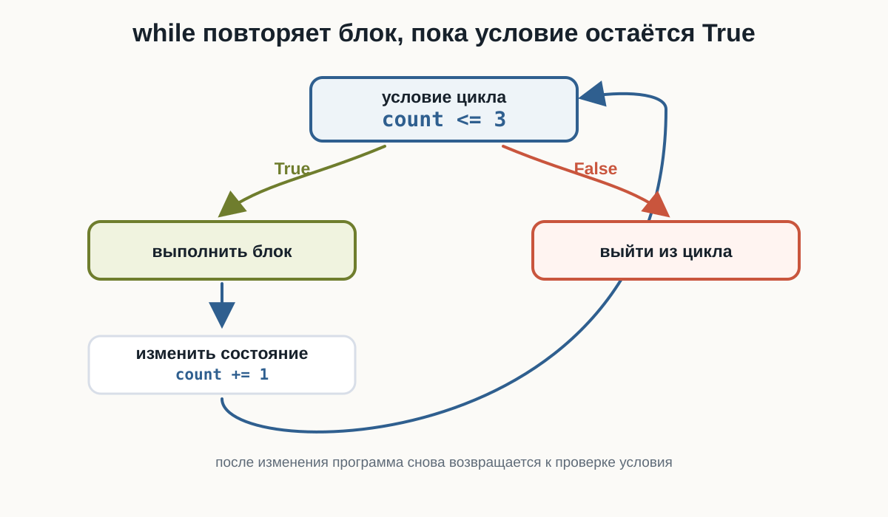
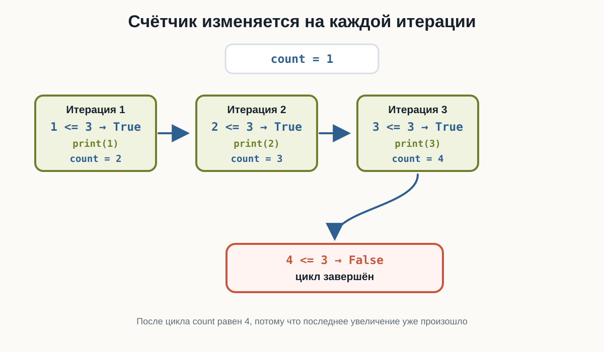
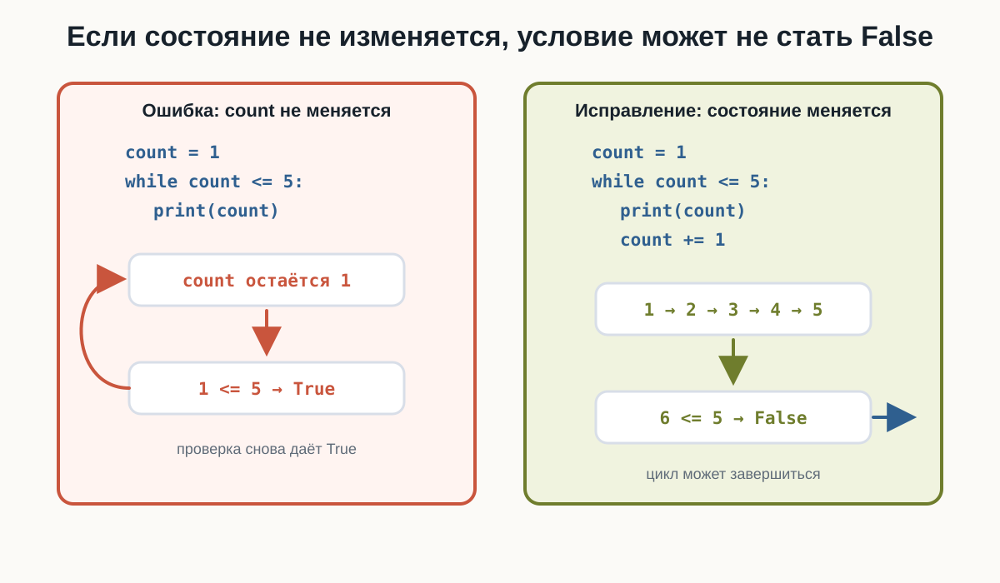
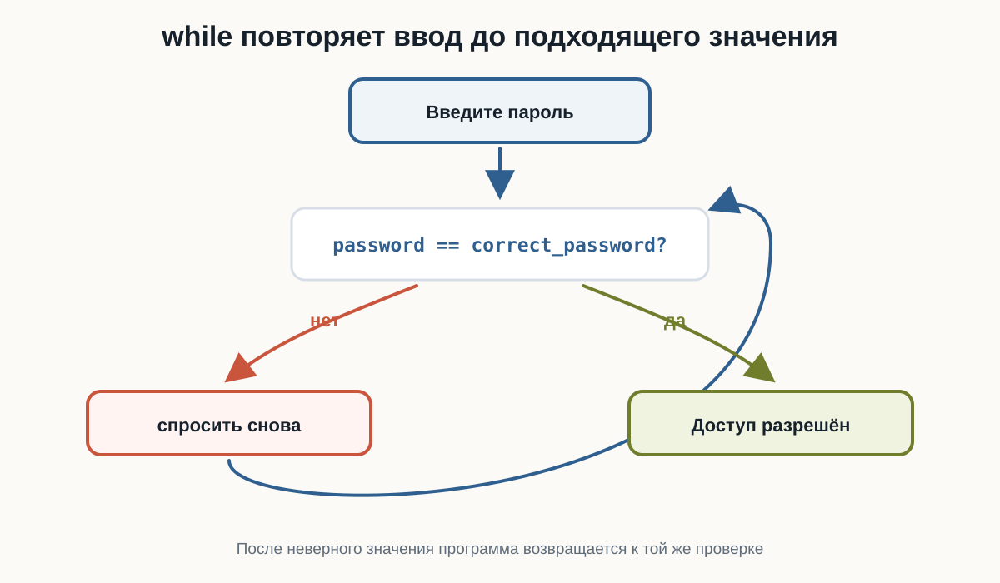
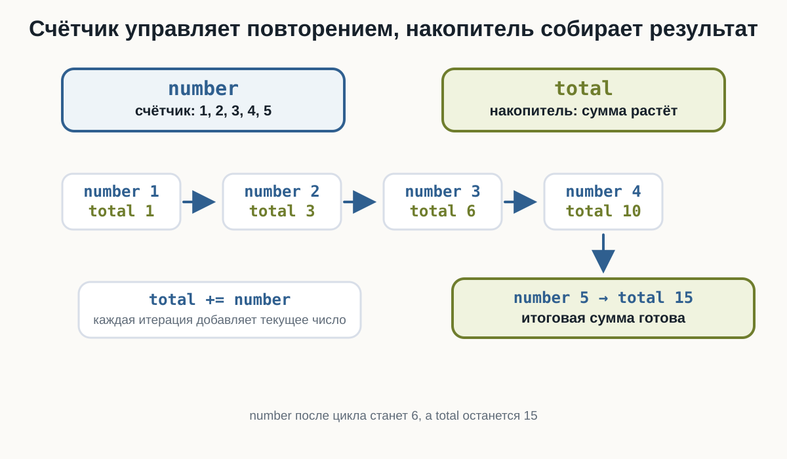

# # 3.9 Цикл while   {.unnumbered}

::: {.callout-important}
Главный вопрос главы:

**Как заставить программу повторять действия, пока выполняется условие?**
:::

В предыдущих главах мы научились задавать программе вопросы:

```python
age >= 18
password == "python123"
number > 0
```

Каждое такое выражение даёт логический результат:

```python
True
```

или:

```python
False
```

Условия позволяют выбрать действие один раз. Но иногда одного выбора недостаточно.

Например:

```text
пока пароль неверный
    спрашивать пароль снова
```

или:

```text
пока число не дошло до 5
    вывести число
    увеличить число
```

Для таких ситуаций в Python используется цикл `while`.

---

## Зачем программе повторять действия

Представьте программу, которая должна вывести приветствие три раза.

Без цикла можно написать:

```python
print("Привет")
print("Привет")
print("Привет")
```

Такой код работает, но в нём есть проблема: количество повторений зашито вручную.

Если нужно не три, а тридцать раз, код быстро станет неудобным.

Цикл позволяет описать повторение как правило:

```text
пока условие истинно
    выполняй блок команд
```

В Python это записывается так:

```python
while условие:
    действие
```

Слово `while` можно читать как:

> **пока**

---

## Первый цикл while

Начнём с простого примера:

```python
count = 1

while count <= 3:
    print("Привет")
    count += 1
```

::: {.content-visible when-format="html"}
::: {.python-playground data-source="../examples/chapter16/first-while.py" data-title="Первый цикл while"}
:::
:::

::: {.content-visible when-format="pdf"}
```{.python filename="first-while.py"}

```
:::

Результат:

```text
Привет
Привет
Привет
```

Здесь есть три важные части:

- `count = 1` задаёт начальное значение;
- `while count <= 3:` проверяет условие;
- `count += 1` изменяет значение после каждой итерации.

**Итерация** — это одно выполнение тела цикла.

В этом примере тело цикла выполняется три раза.

Попробуйте в HTML-версии изменить:

- начальное значение `count`;
- границу `3`;
- шаг `count += 1`.

---

## Как работает while

Цикл `while` проверяет условие **до** выполнения тела цикла.

Общая схема такая:

```text
проверить условие
если True:
    выполнить тело цикла
    вернуться к условию
если False:
    выйти из цикла
```

{fig-alt="Цикл while сначала проверяет условие. Если результат True, выполняется блок, затем изменяется состояние и программа возвращается к условию. Если результат False, программа выходит из цикла."}

Важно:

> `while` повторяет блок, пока условие остаётся `True`.

Если условие сразу равно `False`, тело цикла не выполнится ни разу.

Например:

```python
count = 10

while count < 5:
    print(count)
    count += 1
```

Здесь `10 < 5` сразу даёт `False`, поэтому `print(count)` не выполнится.

---

## Счётчик в цикле

Часто внутри `while` используется счётчик.

Счётчик — это переменная, которая помогает управлять количеством повторений.

```python
number = 1

while number <= 5:
    print(number)
    number += 1

print("После цикла number =", number)
```

::: {.content-visible when-format="html"}
::: {.python-playground data-source="../examples/chapter16/count-up.py" data-title="Счётчик от 1 до 5"}
:::
:::

::: {.content-visible when-format="pdf"}
```{.python filename="count-up.py"}

```
:::

Результат:

```text
1
2
3
4
5
После цикла number = 6
```

Сначала `number` равен `1`.

После каждой итерации выполняется строка:

```python
number += 1
```

Она увеличивает `number` на `1`.

Когда `number` становится равен `6`, условие:

```python
number <= 5
```

становится `False`, и цикл завершается.

{fig-alt="Счётчик count начинается с 1. Проверки 1 меньше или равно 3, 2 меньше или равно 3 и 3 меньше или равно 3 дают True. После увеличения count становится 4, проверка 4 меньше или равно 3 даёт False, и цикл завершается."}

---

## Граница включается или не включается

Сравнение в условии определяет, попадёт ли граничное значение в цикл.

Если написать:

```python
while count < 5:
```

цикл выполняется, пока `count` меньше `5`. Само значение `5` уже не подходит.

Если написать:

```python
while count <= 5:
```

значение `5` подходит, потому что условие означает «меньше или равно».

Разница между `<` и `<=` особенно важна в циклах, потому что она меняет количество итераций.

---

## Обратный счёт

Счётчик не обязан увеличиваться.

Он может двигаться в обратную сторону:

```python
count = 5

while count >= 1:
    print(count)
    count -= 1

print("Старт!")
```

::: {.content-visible when-format="html"}
::: {.python-playground data-source="../examples/chapter16/countdown.py" data-title="Обратный счёт"}
:::
:::

::: {.content-visible when-format="pdf"}
```{.python filename="countdown.py"}

```
:::

Результат:

```text
5
4
3
2
1
Старт!
```

Здесь условие:

```python
count >= 1
```

остаётся истинным для `5`, `4`, `3`, `2` и `1`.

После каждой итерации выполняется:

```python
count -= 1
```

Когда `count` становится равен `0`, условие `0 >= 1` даёт `False`.

---

## Бесконечный цикл

У цикла `while` есть важная опасность: условие может никогда не стать `False`.

Например:

```python
count = 1

# ВНИМАНИЕ: этот цикл бесконечный, потому что count не изменяется.
while count <= 5:
    print(count)
```

::: {.content-visible when-format="html"}
```{.python filename="infinite-loop.py"}

```
:::

::: {.content-visible when-format="pdf"}
```{.python filename="infinite-loop.py"}

```
:::

В этом коде `count` всегда остаётся равен `1`.

Проверка:

```python
count <= 5
```

каждый раз превращается в:

```python
1 <= 5
```

Результат снова `True`, поэтому цикл продолжает выполняться.

{fig-alt="Слева показан ошибочный цикл: count остаётся 1, поэтому условие 1 меньше или равно 5 снова даёт True. Справа показан исправленный цикл, где count увеличивается через count плюс равно 1 и условие в итоге становится False."}

Чтобы цикл завершился, состояние должно изменяться так, чтобы условие когда-нибудь стало `False`.

Правильный вариант:

```python
count = 1

while count <= 5:
    print(count)
    count += 1
```

В HTML-версии бесконечный пример оставлен статическим. Текущий playground не имеет безопасного прерывания синхронного бесконечного цикла, поэтому такой код нельзя предлагать к запуску.

---

## while и пользовательский ввод

`while` полезен, когда программа должна повторять ввод до подходящего значения.

Например, можно спрашивать пароль, пока пользователь не введёт правильный:

```python
correct_password = "python123"

password = input("Введите пароль: ")

while password != correct_password:
    print("Неверный пароль")
    password = input("Попробуйте ещё раз: ")

print("Доступ разрешён")
```

::: {.content-visible when-format="html"}
::: {.python-playground data-source="../examples/chapter16/password-loop.py" data-title="Повторный ввод пароля"}
:::
:::

::: {.content-visible when-format="pdf"}
```{.python filename="password-loop.py"}

```
:::

Попробуйте ввести несколько неправильных паролей, а затем:

```text
python123
```

Цикл повторяется, пока условие:

```python
password != correct_password
```

равно `True`.

Когда пароль совпадает с правильным, условие становится `False`, и программа выходит из цикла.

{fig-alt="Пользователь вводит пароль, затем программа проверяет, равен ли password правильному паролю. При ответе нет программа спрашивает снова и возвращается к проверке. При ответе да выводится Доступ разрешён."}

---

## Повторная проверка данных

Та же идея работает не только с паролем.

Например, программа может требовать положительное число:

```python
number = float(input("Введите положительное число: "))

while number <= 0:
    print("Нужно число больше нуля")
    number = float(input("Попробуйте ещё раз: "))

print("Принято:", number)
```

::: {.content-visible when-format="html"}
::: {.python-playground data-source="../examples/chapter16/positive-input.py" data-title="Ввод положительного числа"}
:::
:::

::: {.content-visible when-format="pdf"}
```{.python filename="positive-input.py"}

```
:::

Проверьте последовательность:

```text
-5
0
10
```

Для `-5` и `0` условие `number <= 0` истинно, поэтому программа просит ввести число снова.

Для `10` условие становится ложным, и цикл завершается.

---

## Накопитель

В циклах часто встречается ещё одна роль переменной: накопитель.

Счётчик управляет повторением.

Накопитель собирает результат.

Например, найдём сумму чисел от `1` до `5`:

```python
number = 1
total = 0

while number <= 5:
    total += number
    number += 1

print("Сумма:", total)
```

::: {.content-visible when-format="html"}
::: {.python-playground data-source="../examples/chapter16/sum-numbers.py" data-title="Сумма чисел от 1 до 5"}
:::
:::

::: {.content-visible when-format="pdf"}
```{.python filename="sum-numbers.py"}

```
:::

Результат:

```text
Сумма: 15
```

Здесь:

- `number` — счётчик;
- `total` — накопитель.

На каждой итерации выполняется:

```python
total += number
```

Это значит: прибавить текущее значение `number` к сумме.

{fig-alt="Переменная number выступает счётчиком и принимает значения 1, 2, 3, 4, 5. Переменная total выступает накопителем и после прибавлений получает значения 1, 3, 6, 10 и 15."}

После цикла:

```python
number == 6
total == 15
```

---

## Повторный ввод и накопитель

Теперь объединим три идеи:

- повторный `input()`;
- счётчик;
- накопитель.

Программа спросит три числа и найдёт их сумму:

```python
count = 1
total = 0

while count <= 3:
    number = float(input("Введите число: "))
    total += number
    count += 1

print("Сумма:", total)
```

::: {.content-visible when-format="html"}
::: {.python-playground data-source="../examples/chapter16/input-sum.py" data-title="Сумма трёх введённых чисел"}
:::
:::

::: {.content-visible when-format="pdf"}
```{.python filename="input-sum.py"}

```
:::

Проверьте ввод:

```text
10
20
5
```

Результат:

```text
Сумма: 35.0
```

---

## Шаг счётчика

Счётчик можно изменять не только на `1`.

Например:

```python
number = 1

while number <= 5:
    print(number)
    number += 2
```

Результат:

```text
1
3
5
```

Такой цикл завершается, потому что `number` всё равно движется к значению, при котором условие станет `False`.

Важно проверять направление изменения.

Если условие ждёт, что число станет больше границы, счётчик должен увеличиваться.

Если условие ждёт, что число станет меньше границы, счётчик должен уменьшаться.

---

## Что важно запомнить

`while` повторяет блок, пока условие истинно:

```python
while условие:
    тело_цикла
```

Условие проверяется до первой итерации.

Поэтому цикл может не выполниться ни разу.

Тело цикла записывается с отступом.

Внутри цикла обычно должно изменяться состояние программы:

```python
count += 1
```

или:

```python
count -= 1
```

Если состояние не меняется, условие может никогда не стать `False`.

Счётчик управляет повторением.

Накопитель собирает результат.

Главная цепочка этой главы:

```text
условие
  ↓
True
  ↓
выполнить действие
  ↓
изменить состояние
  ↓
вернуться к условию
```

---

### Практические задания

**Задание 1. Три приветствия**

Напишите цикл `while`, который выводит:

```text
Привет
```

три раза.

::: {.callout-note title="Ответ" collapse="true"}

```python
count = 1

while count <= 3:
    print("Привет")
    count += 1
```

:::

---

**Задание 2. Числа от 1 до 5**

Выведите числа от `1` до `5` с помощью `while`.

::: {.callout-note title="Ответ" collapse="true"}

```python
number = 1

while number <= 5:
    print(number)
    number += 1
```

:::

---

**Задание 3. Обратный счёт**

Выведите числа от `5` до `1`, а затем строку:

```text
Старт!
```

::: {.callout-note title="Ответ" collapse="true"}

```python
count = 5

while count >= 1:
    print(count)
    count -= 1

print("Старт!")
```

:::

---

**Задание 4. Положительное число**

Попросите пользователя ввести положительное число.

Пока число меньше или равно `0`, выводите:

```text
Нужно число больше нуля
```

и спрашивайте снова.

::: {.callout-note title="Ответ" collapse="true"}

```python
number = float(input("Введите положительное число: "))

while number <= 0:
    print("Нужно число больше нуля")
    number = float(input("Попробуйте ещё раз: "))

print("Принято:", number)
```

:::

---

**Задание 5. Сумма от 1 до 5**

С помощью `while` найдите сумму чисел:

```text
1 + 2 + 3 + 4 + 5
```

::: {.callout-note title="Ответ" collapse="true"}

```python
number = 1
total = 0

while number <= 5:
    total += number
    number += 1

print("Сумма:", total)
```

:::

---

**Задание 6. Сумма трёх чисел**

Попросите пользователя ввести три числа и выведите их сумму.

Используйте `while`, счётчик и накопитель.

::: {.callout-note title="Ответ" collapse="true"}

```python
count = 1
total = 0

while count <= 3:
    number = float(input("Введите число: "))
    total += number
    count += 1

print("Сумма:", total)
```

:::

---

**Задание 7. Найдите ошибку**

Почему этот цикл не завершается?

```python
count = 1

while count <= 5:
    print(count)
```

Исправьте программу.

::: {.callout-note title="Ответ" collapse="true"}

Переменная `count` не изменяется внутри цикла.

Условие:

```python
count <= 5
```

всё время остаётся истинным.

Исправленный вариант:

```python
count = 1

while count <= 5:
    print(count)
    count += 1
```

:::

---

**Задание 8. Граница цикла**

Что выведет программа?

```python
count = 1

while count < 5:
    print(count)
    count += 1
```

Почему число `5` не выводится?

::: {.callout-note title="Ответ" collapse="true"}

Результат:

```text
1
2
3
4
```

Число `5` не выводится, потому что условие:

```python
count < 5
```

истинно только для чисел меньше `5`.

Когда `count` становится равен `5`, условие даёт `False`, и цикл завершается.

:::

---

## Что дальше?

Теперь программа умеет повторять действия, пока условие остаётся истинным.

Следующий шаг:

```text
повторение по условию
↓
перебор последовательности
```

Для этого используется цикл `for`.
