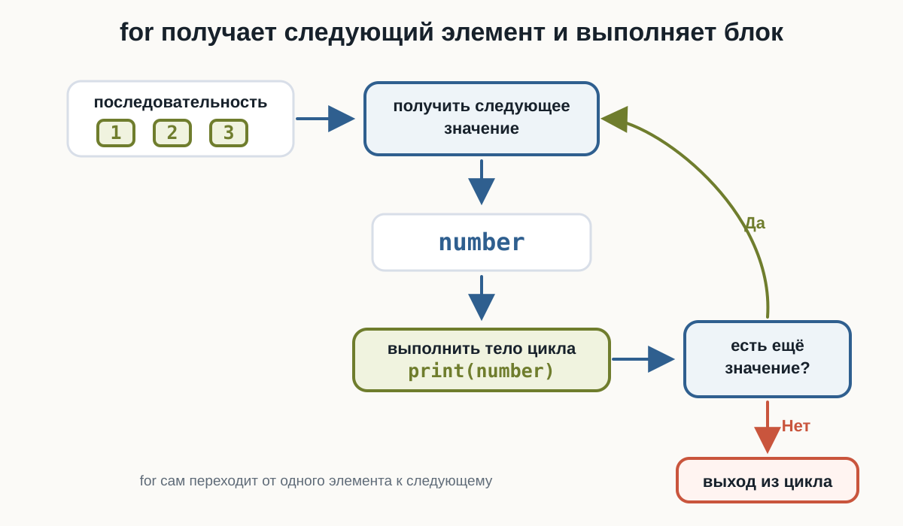
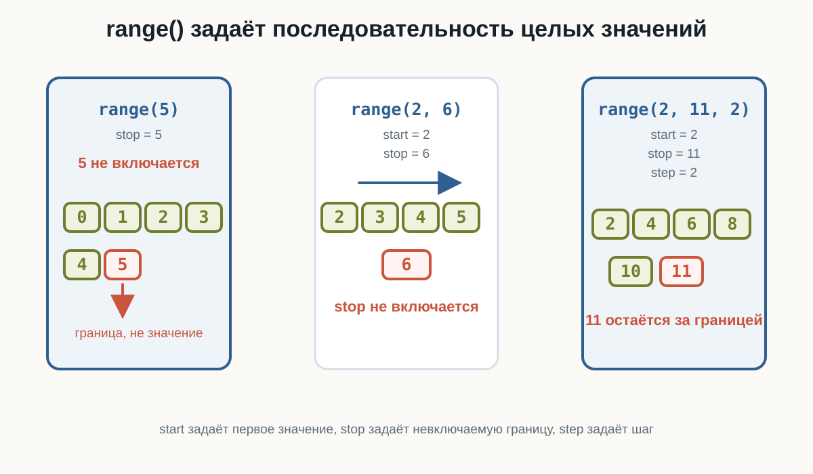
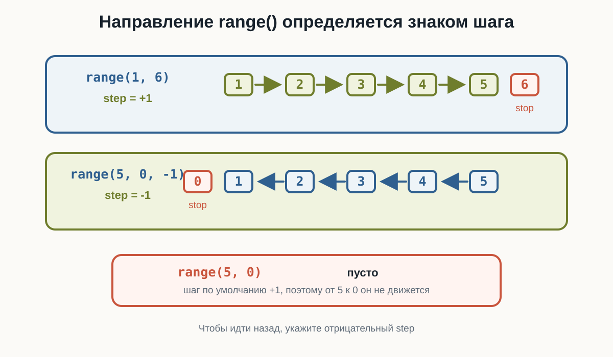
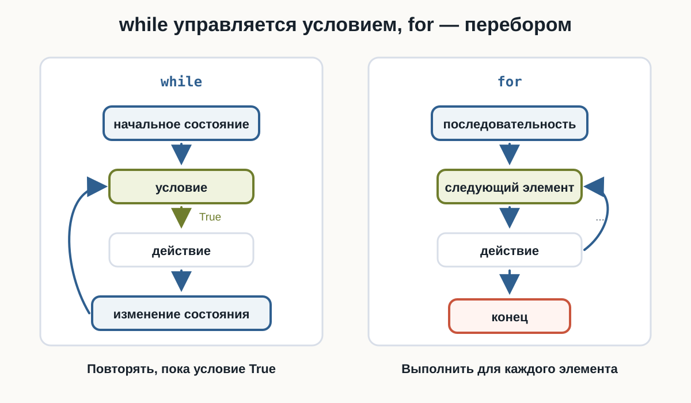
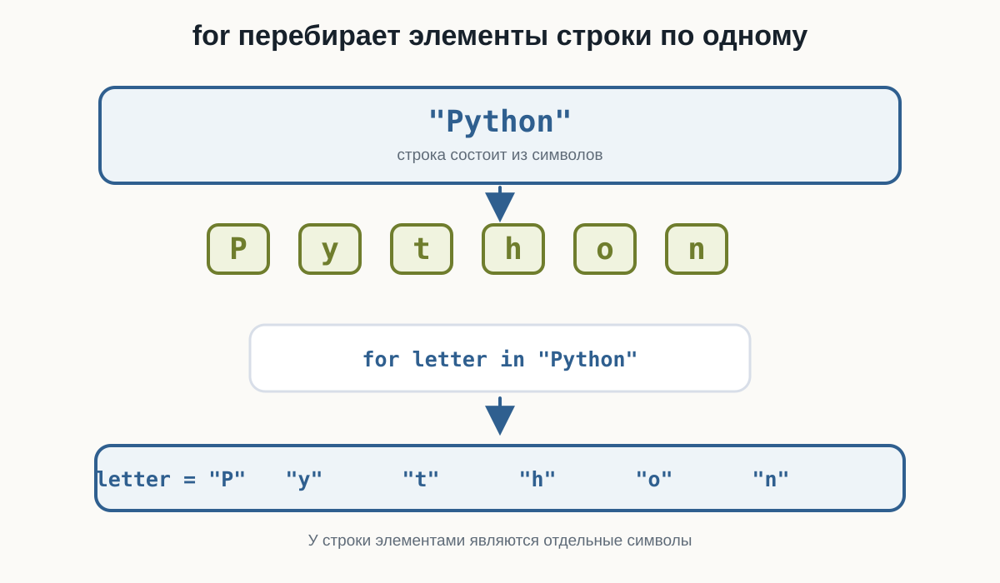

---
pagetitle: "Цикл for в Python: перебор и range()"
description: "Цикл for в Python для начинающих: перебор значений, range() со start, stop и step, отрицательный шаг, строки, условия внутри цикла, накопитель и практические примеры."
keywords:
  - for Python
  - цикл for
  - range Python
  - перебор строк
  - итерация Python
number-sections: true
---

# 3.10 Цикл for  {.unnumbered}

::: {.callout-important}
Главный вопрос главы:

**Как повторять действия для каждого элемента или значения последовательности?**
:::

В предыдущей главе мы познакомились с циклом `while`.

Например:

```python
number = 1

while number <= 5:
    print(number)
    number += 1
```

Результат:

```text
1
2
3
4
5
```

Здесь нам пришлось самостоятельно:

1. создать счётчик;
2. задать условие;
3. изменять счётчик внутри цикла.

Но во многих задачах мы заранее знаем, **какие значения нужно перебрать**.

Например:

```text
числа от 1 до 5
каждый символ строки
несколько повторений одного действия
```

Для таких случаев в Python существует цикл:

```python
for
```

---

## Первый цикл for

Начнём с простого примера:

```python
for number in range(1, 6):
    print(number)
```

::: {.content-visible when-format="html"}
::: {.python-playground data-source="../examples/chapter17/first-for.py" data-title="Первый цикл for"}
:::
:::

::: {.content-visible when-format="pdf"}
```{.python filename="first-for.py"}

```
:::

Результат:

```text
1
2
3
4
5
```

На первый взгляд здесь появились сразу несколько новых элементов:

```python
for
```

```python
in
```

```python
range()
```

Разберём их постепенно.

---

## Как читать цикл for

Код:

```python
for number in range(1, 6):
    print(number)
```

можно прочитать примерно так:

> Для каждого значения `number` из последовательности от `1` до `5` выполнить `print(number)`.

Во время работы `number` последовательно получает значения:

```text
1
2
3
4
5
```

Для каждого из них выполняется тело цикла.

---

## Как работает for

Рассмотрим:

```python
for number in range(1, 4):
    print(number)
```

`range(1, 4)` задаёт значения:

```text
1
2
3
```

Первая итерация:

```text
number = 1
```

Python выполняет:

```python
print(number)
```

Затем:

```text
number = 2
```

и блок выполняется снова.

После этого:

```text
number = 3
```

и выполняется третья итерация.

Когда значения заканчиваются, цикл завершается.

Общая схема:

{fig-alt="Цикл for получает следующее значение из последовательности, сохраняет его в переменной number, выполняет тело цикла и проверяет, есть ли ещё значение. Если значение есть, цикл переходит к следующему элементу. Если значений больше нет, программа выходит из цикла."}

---

## Переменная цикла

В конструкции:

```python
for number in range(1, 6):
```

`number` называется **переменной цикла**.

На каждой итерации она получает очередное значение.

Например:

```python
for number in range(1, 4):
    print("Текущее значение:", number)
```

Результат:

```text
Текущее значение: 1
Текущее значение: 2
Текущее значение: 3
```

Можно представить:

```text
итерация 1 → number = 1
итерация 2 → number = 2
итерация 3 → number = 3
```

Нам не нужно вручную писать:

```python
number += 1
```

Цикл `for` сам переходит к следующему значению.

---

## Что делает range()

В предыдущем примере использовалась функция:

```python
range()
```

Она задаёт последовательность целых чисел.

Например:

```python
range(1, 6)
```

соответствует значениям:

```text
1
2
3
4
5
```

Обратите внимание:

```text
6 не входит
```

Второе число задаёт границу, **до которой нужно идти, не включая её**.

::: {.callout-important title="Правая граница не входит"}

```python
range(1, 6)
```

даёт:

```text
1
2
3
4
5
```

но не `6`.

Это одно из самых важных правил `range()`.
:::

---

## range() с одним аргументом

Можно написать:

```python
range(5)
```

Это означает:

```text
0
1
2
3
4
```

Поэтому:

```python
for number in range(5):
    print(number)
```

выведет:

```text
0
1
2
3
4
```

Если начало не указано, Python начинает с:

```text
0
```

Получается:

```text
range(5)
↓
0, 1, 2, 3, 4
```

---

## range() с двумя аргументами

Запись:

```python
range(start, stop)
```

задаёт:

```text
начало
↓
...
↓
до stop, не включая stop
```

Например:

```python
for number in range(3, 8):
    print(number)
```

Результат:

```text
3
4
5
6
7
```

То есть:

```text
start = 3
stop = 8
```

Проверьте в HTML-версии две базовые формы `range()`: с одним аргументом и с двумя аргументами.

::: {.content-visible when-format="html"}
::: {.python-playground data-source="../examples/chapter17/range-basics.py" data-title="range() с одним и двумя аргументами"}
:::
:::

::: {.content-visible when-format="pdf"}
```{.python filename="range-basics.py"}

```
:::

---

## range() с шагом

У `range()` может быть третий аргумент:

```python
range(start, stop, step)
```

Он задаёт **шаг**.

Например:

```python
for number in range(2, 11, 2):
    print(number)
```

Результат:

```text
2
4
6
8
10
```

Здесь:

```text
start = 2
stop = 11
step = 2
```

Каждое следующее значение увеличивается на `2`.

{fig-alt="Схема показывает три формы range: range(5) задаёт значения 0, 1, 2, 3, 4; range(2, 6) задаёт значения 2, 3, 4, 5; range(2, 11, 2) задаёт значения 2, 4, 6, 8, 10. Значение stop в каждом случае выделено как граница, которая не включается."}

---

## Шаг может быть больше единицы

Например:

```python
for number in range(0, 21, 5):
    print(number)
```

Результат:

```text
0
5
10
15
20
```

Можно представить:

```text
0
↓ +5
5
↓ +5
10
↓ +5
15
↓ +5
20
```

Поменяйте в HTML-версии третий аргумент `range()` и посмотрите, как меняется шаг.

::: {.content-visible when-format="html"}
::: {.python-playground data-source="../examples/chapter17/range-step.py" data-title="range() с шагом"}
:::
:::

::: {.content-visible when-format="pdf"}
```{.python filename="range-step.py"}

```
:::

---

## Обратный отсчёт

Шаг может быть отрицательным.

Например:

```python
for number in range(5, 0, -1):
    print(number)

print("Старт!")
```

::: {.content-visible when-format="html"}
::: {.python-playground data-source="../examples/chapter17/countdown-for.py" data-title="Обратный отсчёт через for"}
:::
:::

::: {.content-visible when-format="pdf"}
```{.python filename="countdown-for.py"}

```
:::

Результат:

```text
5
4
3
2
1
Старт!
```

Здесь:

```text
start = 5
stop = 0
step = -1
```

Значение `0` снова не включается.

---

## Важно правильно задать направление

Рассмотрим:

```python
for number in range(5, 0):
    print(number)
```

Такой цикл ничего не выведет.

Почему?

По умолчанию шаг равен:

```text
+1
```

Но нам нужно двигаться:

```text
5 → 4 → 3 → 2 → 1
```

То есть вниз.

Поэтому нужен отрицательный шаг:

```python
range(5, 0, -1)
```

::: {.callout-warning title="Шаг должен соответствовать направлению"}

Если начало больше конца:

```python
range(5, 0)
```

а шаг положительный, значений не будет.

Для движения назад используйте отрицательный шаг:

```python
range(5, 0, -1)
```
:::

{fig-alt="Схема сравнивает движение вперёд в range(1, 6) со значениями 1, 2, 3, 4, 5 и шагом плюс 1, движение назад в range(5, 0, -1) со значениями 5, 4, 3, 2, 1 и шагом минус 1, а также пустой range(5, 0), где шаг по умолчанию плюс 1 не подходит для движения назад."}

---

## Повторение действия несколько раз

Иногда само значение переменной цикла не так важно.

Например, нужно вывести сообщение пять раз:

```python
for number in range(5):
    print("Изучаю Python")
```

Результат:

```text
Изучаю Python
Изучаю Python
Изучаю Python
Изучаю Python
Изучаю Python
```

`range(5)` задаёт пять значений для перебора:

```text
0
1
2
3
4
```

Поэтому тело выполняется пять раз.

---

## Отступы работают так же, как в if и while

Тело `for` определяется отступом:

```python
for number in range(3):
    print("Итерация")
    print(number)

print("Цикл завершён")
```

Результат:

```text
Итерация
0
Итерация
1
Итерация
2
Цикл завершён
```

Две строки:

```python
    print("Итерация")
    print(number)
```

принадлежат циклу.

А:

```python
print("Цикл завершён")
```

выполняется после цикла.

---

## for и while могут решать одну задачу

Рассмотрим `while`:

```python
number = 1

while number <= 5:
    print(number)
    number += 1
```

То же самое можно написать через `for`:

```python
for number in range(1, 6):
    print(number)
```

Результат в обоих случаях:

```text
1
2
3
4
5
```

Но `for` короче.

---

## Когда удобен while

`while` особенно удобен, когда мы не знаем заранее, сколько будет повторений.

Например:

```python
password = input("Введите пароль: ")

while password != "python123":
    password = input("Попробуйте ещё раз: ")
```

Мы не знаем:

```text
пользователь введёт пароль со второй попытки?
с пятой?
с десятой?
```

Количество повторений зависит от условия.

---

## Когда удобен for

`for` особенно удобен, когда известна последовательность, которую нужно перебрать.

Например:

```python
for number in range(1, 6):
    print(number)
```

Здесь заранее известны значения:

```text
1
2
3
4
5
```

Можно запомнить:

```text
while
→ повторять, пока условие True

for
→ выполнить для каждого значения
```

::: {.callout-tip title="while или for?"}

Используйте `while`, когда главное — **условие продолжения**.

Используйте `for`, когда главное — **перебор известных значений или элементов**.

:::

{fig-alt="Сравнительная схема показывает, что цикл while начинается с начального состояния, проверяет условие, выполняет действие, изменяет состояние и возвращается к условию. Цикл for начинает с последовательности, получает следующий элемент, выполняет действие и повторяет это до конца последовательности."}

---

## for умеет перебирать строку

`for` работает не только с `range()`.

Строка тоже содержит последовательность элементов — символов.

Например:

```python
for letter in "Python":
    print(letter)
```

Результат:

```text
P
y
t
h
o
n
```

На каждой итерации переменная:

```python
letter
```

получает следующий символ.

{fig-alt="Схема показывает строку Python как последовательность символов P, y, t, h, o, n. В цикле for letter in Python переменная letter по очереди получает каждый символ строки."}

---

## Как перебирается строка

Для:

```python
for letter in "Cat":
    print(letter)
```

происходит:

```text
итерация 1 → letter = "C"
итерация 2 → letter = "a"
итерация 3 → letter = "t"
```

После последнего символа цикл завершается.

Это показывает важную особенность `for`:

> `for` перебирает элементы некоторой последовательности по одному.

---

## Имя переменной цикла должно быть понятным

Технически можно написать:

```python
for x in "Python":
    print(x)
```

Но чаще понятнее:

```python
for letter in "Python":
    print(letter)
```

Для чисел:

```python
for number in range(5):
```

Для символов:

```python
for letter in "Python":
```

Хорошее имя помогает понять смысл цикла.

---

## Подсчёт количества итераций

Рассмотрим:

```python
for number in range(2, 8):
    print(number)
```

Значения:

```text
2
3
4
5
6
7
```

То есть цикл выполнит:

```text
6 итераций
```

Полезно уметь заранее определять:

- первое значение;
- последнее значение;
- шаг;
- количество итераций.

---

## Типичная ошибка с правой границей

Рассмотрим задачу:

> Вывести числа от `1` до `10`.

Можно ошибочно написать:

```python
for number in range(1, 10):
    print(number)
```

Результат закончится на:

```text
9
```

Потому что `10` не входит в `range(1, 10)`.

Правильно:

```python
for number in range(1, 11):
    print(number)
```

::: {.callout-warning title="Помните о stop"}

Чтобы получить:

```text
1, 2, 3, ..., 10
```

нужно:

```python
range(1, 11)
```

Значение `stop` не включается.
:::

---

## Сумма чисел с for

В предыдущей главе мы использовали накопитель:

```python
total = 0
```

С `for` он работает так же.

Например, найдём сумму чисел от `1` до `5`:

```python
total = 0

for number in range(1, 6):
    total += number

print("Сумма:", total)
```

::: {.content-visible when-format="html"}
::: {.python-playground data-source="../examples/chapter17/sum-with-for.py" data-title="Сумма чисел с for"}
:::
:::

::: {.content-visible when-format="pdf"}
```{.python filename="sum-with-for.py"}

```
:::

Результат:

```text
Сумма: 15
```

На каждой итерации:

```text
number = 1 → total = 1
number = 2 → total = 3
number = 3 → total = 6
number = 4 → total = 10
number = 5 → total = 15
```

---

## Накопитель внутри for

Здесь у переменных разные роли:

```python
number
```

получает очередное значение из `range()`.

А:

```python
total
```

сохраняет накопленный результат.

Код:

```python
total = 0

for number in range(1, 6):
    total += number
```

можно читать:

> Для каждого числа от 1 до 5 прибавить это число к общей сумме.

---

## Вычисления внутри цикла

Внутри `for` можно выполнять любые знакомые операции.

Например, вывести квадраты чисел:

```python
for number in range(1, 6):
    square = number ** 2

    print(number, "→", square)
```

Результат:

```text
1 → 1
2 → 4
3 → 9
4 → 16
5 → 25
```

---

## Условия внутри for

Внутри цикла можно использовать `if`.

Например:

```python
for number in range(1, 6):
    if number == 3:
        print("Нашли тройку")

    print(number)
```

Результат:

```text
1
2
Нашли тройку
3
4
5
```

На каждой итерации Python получает новое значение `number`, а затем может проверить его условием.

Общая схема:

```text
следующее значение
       ↓
      for
       ↓
      if
       ↓
проверить значение
       ↓
выполнить нужное действие
```

---

## Условие может зависеть от каждого значения

Например, определим, какие числа делятся на `2` без остатка:

```python
for number in range(1, 11):
    if number % 2 == 0:
        print(number)
```

::: {.content-visible when-format="html"}
::: {.python-playground data-source="../examples/chapter17/for-with-if.py" data-title="Условие внутри for"}
:::
:::

::: {.content-visible when-format="pdf"}
```{.python filename="for-with-if.py"}

```
:::

Результат:

```text
2
4
6
8
10
```

Мы уже знаем:

```python
number % 2 == 0
```

означает, что число делится на `2` без остатка.

Теперь эта проверка выполняется для каждого числа.

---

## Таблица умножения для одного числа

Цикл удобно использовать для повторяющихся вычислений.

Например:

```python
number = int(input("Введите число: "))

for multiplier in range(1, 11):
    result = number * multiplier

    print(number, "*", multiplier, "=", result)
```

::: {.content-visible when-format="html"}
::: {.python-playground data-source="../examples/chapter17/multiplication-table.py" data-title="Таблица умножения"}
:::
:::

::: {.content-visible when-format="pdf"}
```{.python filename="multiplication-table.py"}

```
:::

Если пользователь введёт:

```text
5
```

результат:

```text
5 * 1 = 5
5 * 2 = 10
5 * 3 = 15
5 * 4 = 20
5 * 5 = 25
5 * 6 = 30
5 * 7 = 35
5 * 8 = 40
5 * 9 = 45
5 * 10 = 50
```

Здесь `for` выполняет одно и то же вычисление с разными значениями `multiplier`.

---

## Повторный input() с for

Если заранее известно количество вводов, `for` тоже может быть удобнее `while`.

Например, пользователь должен ввести три числа:

```python
total = 0

for attempt in range(3):
    number = float(input("Введите число: "))
    total += number

print("Сумма:", total)
```

Цикл выполнится ровно:

```text
3 раза
```

---

## Переменная цикла после завершения

Рассмотрим:

```python
for number in range(1, 4):
    print(number)

print("Последнее значение:", number)
```

После цикла `number` содержит последнее полученное значение:

```text
3
```

Но обычно переменная цикла нужна прежде всего внутри самого перебора.

Не стоит строить программу вокруг её значения после завершения цикла без необходимости.

---

## range() задаёт числа по правилам

Полезно собрать основные формы `range()` вместе.

### Только stop

```python
range(5)
```

значения:

```text
0, 1, 2, 3, 4
```

### start и stop

```python
range(2, 6)
```

значения:

```text
2, 3, 4, 5
```

### start, stop и step

```python
range(2, 11, 2)
```

значения:

```text
2, 4, 6, 8, 10
```

### Отрицательный шаг

```python
range(5, 0, -1)
```

значения:

```text
5, 4, 3, 2, 1
```

---

## range() не включает stop

Это правило работает и для отрицательного шага.

Например:

```python
range(5, 0, -1)
```

не включает:

```text
0
```

А:

```python
range(5, -1, -1)
```

даст:

```text
5
4
3
2
1
0
```

Потому что правая граница теперь:

```text
-1
```

---

## Пустой range

Некоторые значения `range()` могут не содержать ни одного числа.

Например:

```python
for number in range(5, 1):
    print(number)
```

ничего не выведет.

По умолчанию Python пытается двигаться вверх:

```text
+1
```

Но начало:

```text
5
```

уже больше правой границы:

```text
1
```

Поэтому последовательность пуста.

---

## Не нужно изменять переменную цикла вручную

С `while` мы писали:

```python
number += 1
```

Но в `for` это обычно не требуется.

Правильно:

```python
for number in range(1, 6):
    print(number)
```

Не нужно добавлять:

```python
number += 1
```

для перехода к следующей итерации.

`for` сам получает следующее значение из `range()`.

::: {.callout-warning title="for сам управляет перебором"}

В цикле:

```python
for number in range(1, 6):
```

переменная `number` автоматически получает очередное значение.

Не нужно вручную увеличивать её, как счётчик `while`.
:::

---

## for — это не просто счётчик

Важно не воспринимать `for` только как сокращённый `while`.

Например:

```python
for letter in "Python":
    print(letter)
```

Здесь никакого числового счётчика вообще нет.

`for` получает **следующий элемент** последовательности.

Именно поэтому его удобно читать так:

```text
для каждого элемента
```

---

## Сравним while и for

Одна задача через `while`:

```python
number = 1

while number <= 5:
    print(number)
    number += 1
```

Через `for`:

```python
for number in range(1, 6):
    print(number)
```

В `while` мы управляем:

```text
начальным значением
условием
изменением
```

В `for` мы задаём:

```text
последовательность значений
```

а перебор выполняется автоматически.

---

## Попробуйте сами

::: {.callout-tip title="Эксперимент"}

Запустите:

```python
for number in range(1, 11):
    print(number)
```

Затем измените программу так, чтобы она выводила:

```text
0, 1, 2, 3, 4
```

затем:

```text
2, 4, 6, 8, 10
```

затем:

```text
10, 8, 6, 4, 2
```

Перед запуском определите:

- `start`;
- `stop`;
- `step`.
:::

---

## Типичные ошибки

### Неправильная правая граница

Задача:

```text
вывести 1..10
```

Ошибка:

```python
range(1, 10)
```

Правильно:

```python
range(1, 11)
```

### Неправильный шаг

Ошибка:

```python
range(5, 0, 1)
```

Для движения вниз нужен:

```python
range(5, 0, -1)
```

### Лишнее изменение переменной

Не нужно писать:

```python
for number in range(5):
    number += 1
```

чтобы цикл перешёл к следующему значению.

`for` делает это самостоятельно.

### Неправильный отступ

Неправильно:

```python
for number in range(5):
print(number)
```

Правильно:

```python
for number in range(5):
    print(number)
```

---

## Пошаговый разбор for

Рассмотрим:

```python
total = 0

for number in range(1, 4):
    total += number
```

Пошагово:

| Итерация | `number` | `total` до | `total` после |
|---|---:|---:|---:|
| 1 | 1 | 0 | 1 |
| 2 | 2 | 1 | 3 |
| 3 | 3 | 3 | 6 |

После этого значения в `range(1, 4)` заканчиваются.

Цикл завершается.

---

## Пример: сумма покупок

Допустим, пользователь должен ввести стоимость трёх покупок.

```python
total = 0

for purchase in range(3):
    price = float(input("Стоимость покупки: "))
    total += price

print("Общая сумма:", total)
```

::: {.content-visible when-format="html"}
::: {.python-playground data-source="../examples/chapter17/purchase-sum.py" data-title="Сумма трёх покупок"}
:::
:::

::: {.content-visible when-format="pdf"}
```{.python filename="purchase-sum.py"}

```
:::

Пример:

```text
Стоимость покупки: 100
Стоимость покупки: 250
Стоимость покупки: 50
Общая сумма: 400.0
```

Здесь нам заранее известно:

```text
нужно получить ровно 3 значения
```

Поэтому `for` подходит очень хорошо.

---

## Пример: символы слова

Пользователь вводит слово:

```python
word = input("Введите слово: ")

for letter in word:
    print(letter)
```

::: {.content-visible when-format="html"}
::: {.python-playground data-source="../examples/chapter17/string-iteration.py" data-title="Символы введённого слова"}
:::
:::

::: {.content-visible when-format="pdf"}
```{.python filename="string-iteration.py"}

```
:::

Например:

```text
Введите слово: Code
C
o
d
e
```

Количество итераций зависит от количества символов в строке.

Нам не нужно знать его заранее.

Сам `for` перебирает строку до конца.

---

## Что важно запомнить

Цикл `for` выполняет блок кода для каждого значения или элемента последовательности.

Основная форма:

```python
for переменная in последовательность:
    действие
```

Например:

```python
for number in range(1, 6):
    print(number)
```

На каждой итерации:

```text
следующее значение
↓
переменная цикла
↓
тело цикла
↓
следующее значение
```

Основные формы `range()`:

```text
range(stop)

range(start, stop)

range(start, stop, step)
```

Например:

```text
range(5)
→ 0, 1, 2, 3, 4

range(2, 6)
→ 2, 3, 4, 5

range(2, 11, 2)
→ 2, 4, 6, 8, 10

range(5, 0, -1)
→ 5, 4, 3, 2, 1
```

Важно:

> **Значение `stop` в `range()` не включается.**

`for` можно использовать не только с числами:

```python
for letter in "Python":
    print(letter)
```

Главное различие между циклами:

```text
while
→ повторять, пока условие True

for
→ выполнить для каждого элемента или значения
```

И самое важное:

> **`for` позволяет программе последовательно обработать все значения некоторой последовательности без ручного управления счётчиком.**

---

### Практические задания

**Задание 1. Числа от 1 до 10**

С помощью `for` выведите:

```text
1
2
3
4
5
6
7
8
9
10
```

::: {.callout-note title="Ответ" collapse="true"}

```python
for number in range(1, 11):
    print(number)
```

:::

---

**Задание 2. Пять сообщений**

Выведите строку:

```text
Изучаю Python
```

ровно пять раз.

::: {.callout-note title="Ответ" collapse="true"}

```python
for number in range(5):
    print("Изучаю Python")
```

Цикл выполнится пять раз, потому что:

```text
range(5)
→ 0, 1, 2, 3, 4
```

:::

---

**Задание 3. Чётные числа**

Выведите:

```text
2
4
6
8
10
```

Используйте шаг `range()`.

::: {.callout-note title="Ответ" collapse="true"}

```python
for number in range(2, 11, 2):
    print(number)
```

:::

---

**Задание 4. Обратный отсчёт**

Выведите:

```text
5
4
3
2
1
Старт!
```

::: {.callout-note title="Ответ" collapse="true"}

```python
for number in range(5, 0, -1):
    print(number)

print("Старт!")
```

:::

---

**Задание 5. Квадраты чисел**

Выведите квадраты чисел от `1` до `5`.

Пример:

```text
1 → 1
2 → 4
3 → 9
4 → 16
5 → 25
```

::: {.callout-note title="Ответ" collapse="true"}

```python
for number in range(1, 6):
    square = number ** 2

    print(number, "→", square)
```

:::

---

**Задание 6. Сумма от 1 до 10**

С помощью `for` вычислите:

```text
1 + 2 + 3 + ... + 10
```

::: {.callout-note title="Ответ" collapse="true"}

```python
total = 0

for number in range(1, 11):
    total += number

print("Сумма:", total)
```

Результат:

```text
Сумма: 55
```

:::

---

**Задание 7. Таблица умножения**

Пользователь вводит число.

Выведите таблицу умножения этого числа от `1` до `10`.

Например:

```text
Введите число: 3

3 * 1 = 3
3 * 2 = 6
3 * 3 = 9
...
3 * 10 = 30
```

::: {.callout-note title="Ответ" collapse="true"}

```python
number = int(input("Введите число: "))

for multiplier in range(1, 11):
    result = number * multiplier

    print(number, "*", multiplier, "=", result)
```

:::

---

**Задание 8. Символы строки**

Пользователь вводит слово.

Выведите каждый символ на отдельной строке.

::: {.callout-note title="Ответ" collapse="true"}

```python
word = input("Введите слово: ")

for letter in word:
    print(letter)
```

:::

---

**Задание 9. Сумма покупок**

Пользователь вводит стоимость `4` покупок.

Найдите общую сумму.

::: {.callout-note title="Ответ" collapse="true"}

```python
total = 0

for purchase in range(4):
    price = float(input("Стоимость покупки: "))
    total += price

print("Общая сумма:", total)
```

:::

---

**Задание 10. Найдите ошибку**

Нужно вывести числа:

```text
5
4
3
2
1
```

Но программа:

```python
for number in range(5, 0):
    print(number)
```

ничего не выводит.

Почему?

Исправьте её.

::: {.callout-note title="Ответ" collapse="true"}

По умолчанию `range()` использует шаг:

```text
+1
```

Но нам нужно идти от `5` вниз к `1`.

Поэтому требуется отрицательный шаг:

```python
for number in range(5, 0, -1):
    print(number)
```

Результат:

```text
5
4
3
2
1
```

:::

---

**Задание 11. Предскажите результат**

Не запускайте код сразу.

```python
for number in range(2, 9, 3):
    print(number)
```

Ответьте:

1. Какие числа будут выведены?
2. Сколько будет итераций?

::: {.callout-note title="Ответ" collapse="true"}

Значения:

```text
2
5
8
```

Потому что:

```text
2
↓ +3
5
↓ +3
8
↓ +3
11
```

`11` уже находится за границей `9`.

Поэтому цикл выполняет:

```text
3 итерации
```

:::

---

**Задание 12. Задача со звёздочкой**

Пользователь вводит число.

Выведите все числа от `1` до этого числа, которые делятся на `3` без остатка.

Например:

```text
Введите число: 15

3
6
9
12
15
```

Используйте `for`, `range()`, `%` и `if`.

::: {.callout-note title="Ответ" collapse="true"}

```python
limit = int(input("Введите число: "))

for number in range(1, limit + 1):
    if number % 3 == 0:
        print(number)
```

Здесь:

```python
limit + 1
```

используется потому, что правая граница `range()` не включается.

Для:

```text
limit = 15
```

нужно задать последовательность:

```python
range(1, 16)
```

чтобы число `15` тоже участвовало в переборе.

:::

---

## Что дальше?

Теперь программа умеет повторять действия для каждого значения или элемента последовательности.

Следующий шаг:

```text
перебор символов строки
↓
подробная работа со строками
```

Следующая глава: **Строки**.
