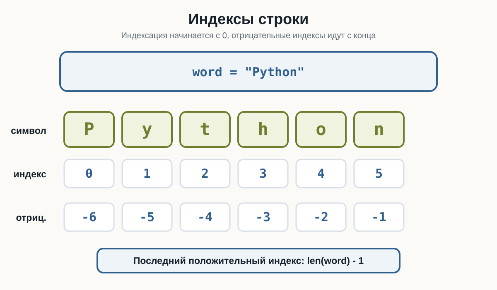
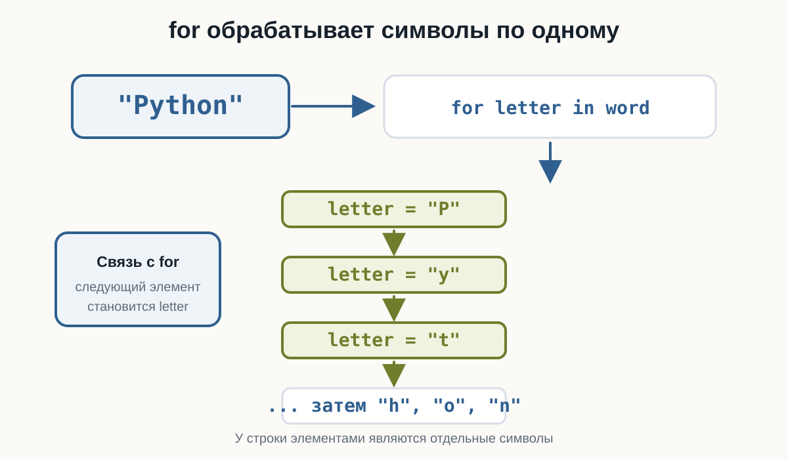
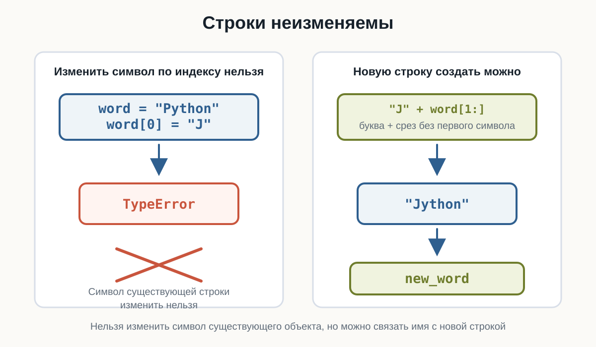
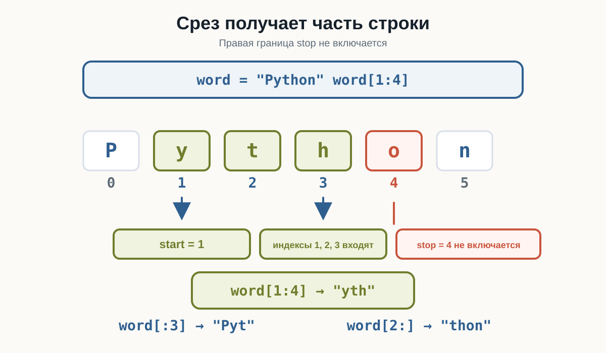
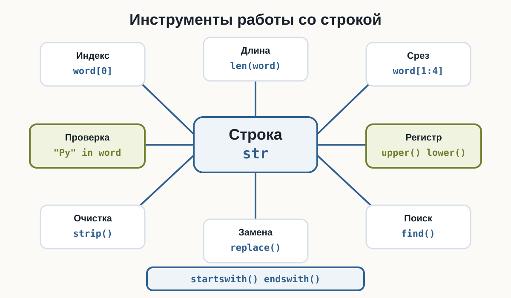

---
pagetitle: "Строки в Python: индексы, срезы и методы"
description: "Строки в Python для начинающих: тип str, символы, индексы, отрицательные индексы, len(), срезы, неизменяемость строк, in и not in, перебор через for и основные методы строк."
keywords:
  - строки Python
  - str Python
  - индексы строк
  - срезы Python
  - методы строк
  - len Python
number-sections: true
---

# 3.11 Строки {.unnumbered}

::: {.callout-important}
Главный вопрос главы:

**Как Python хранит текст и как работать с отдельными символами строки?**
:::

Со строками мы работаем почти с самого начала курса.

Например:

```python
name = "Анна"
city = "Москва"
language = "Python"
```

Функция `input()` тоже возвращает строку:

```python
name = input("Введите имя: ")
```

Мы уже сравнивали строки:

```python
password == "python123"
```

и даже перебирали их через `for`:

```python
for letter in "Python":
    print(letter)
```

Теперь разберём строки подробнее.

---

## Что такое строка

Строка — это значение типа:

```python
str
```

Она используется для хранения текста.

Например:

```python
language = "Python"

print(language)
print(type(language))
```

Результат:

```text
Python
<class 'str'>
```

Строка может содержать:

- буквы;
- цифры;
- пробелы;
- знаки препинания;
- специальные символы.

Например:

```python
text = "Python 3.14!"
```

Всё значение целиком имеет тип:

```text
str
```

---

## Строка состоит из символов

Рассмотрим:

```text
Python
```

Строка состоит из отдельных символов:

```text
P y t h o n
```

Можно представить её так:

```text
"P" "y" "t" "h" "o" "n"
```

Каждый символ занимает определённую позицию.

Именно поэтому Python позволяет получать отдельные символы строки.

---

## Индексы

Позиция символа называется **индексом**.

Но Python начинает считать не с `1`, а с:

```text
0
```

Для строки:

```text
Python
```

индексы выглядят так:

```text
символ:   P   y   t   h   o   n
индекс:   0   1   2   3   4   5
```

Поэтому первый символ имеет индекс:

```text
0
```

а не:

```text
1
```

::: {.callout-important title="Индексация начинается с нуля"}

Для строки:

```python
word = "Python"
```

первый символ:

```python
word[0]
```

второй:

```python
word[1]
```

третий:

```python
word[2]
```

Это правило встречается в Python очень часто.
:::

---

## Получение символа по индексу

Чтобы получить символ, после имени строки используются квадратные скобки:

```python
word = "Python"

print(word[0])
```

Результат:

```text
P
```

Другие примеры:

::: {.content-visible when-format="html"}
::: {.python-playground data-source="../examples/chapter18/string-indexing.py" data-title="Индексы строки начинаются с 0"}
:::
:::

::: {.content-visible when-format="pdf"}
```{.python filename="string-indexing.py"}

```
:::

Результат:

```text
P
y
t
n
```

---

## Индекс может храниться в переменной

Не обязательно писать число прямо внутри скобок.

Например:

```python
word = "Python"
index = 3

print(word[index])
```

Результат:

```text
h
```

Это особенно полезно, когда позиция вычисляется программой.

---

## Последний символ

Для строки:

```python
word = "Python"
```

последний символ имеет индекс:

```text
5
```

Можно написать:

```python
print(word[5])
```

Но для строки другой длины индекс будет уже другим.

Python предоставляет более удобный способ:

```python
print(word[-1])
```

Результат:

```text
n
```

Отрицательные индексы считаются с конца строки.

---

## Отрицательные индексы

Для строки:

```text
Python
```

можно представить:

```text
символ:    P   y   t   h   o   n
индекс:    0   1   2   3   4   5
отриц.:   -6  -5  -4  -3  -2  -1
```

Например:

::: {.content-visible when-format="html"}
::: {.python-playground data-source="../examples/chapter18/negative-indexing.py" data-title="Отрицательные индексы"}
:::
:::

::: {.content-visible when-format="pdf"}
```{.python filename="negative-indexing.py"}

```
:::

Результат:

```text
n
o
h
```

::: {.callout-tip title="Когда удобны отрицательные индексы"}

Если нужен последний символ строки, обычно проще написать:

```python
word[-1]
```

чем сначала вычислять длину строки.
:::

{fig-alt="Строка Python показана как шесть карточек с символами P, y, t, h, o, n. Под ними находятся положительные индексы 0, 1, 2, 3, 4, 5 и отрицательные индексы -6, -5, -4, -3, -2, -1."}

---

## Ошибка индекса

Что произойдёт здесь?

```python
word = "Python"

print(word[10])
```

В строке нет символа с индексом `10`.

Поэтому Python сообщит об ошибке:

```text
IndexError
```

::: {.callout-warning title="Индекс должен существовать"}

Для строки:

```python
"Python"
```

доступны положительные индексы:

```text
0..5
```

Попытка обратиться к несуществующей позиции приводит к:

```text
IndexError
```
:::

---

## Длина строки

Чтобы узнать количество символов, используется функция:

```python
len()
```

Например:

```python
word = "Python"

print(len(word))
```

Результат:

```text
6
```

Строка содержит шесть символов:

```text
P
y
t
h
o
n
```

---

## Пробел тоже является символом

Рассмотрим:

```python
text = "Hello Python"
```

Проверим длину:

```python
print(len(text))
```

Результат:

```text
12
```

Почему не `11`?

Потому что пробел между словами тоже является символом.

Можно представить:

```text
H e l l o _ P y t h o n
```

Здесь `_` условно показывает пробел.

---

## Пустая строка

Строка может вообще не содержать символов:

```python
text = ""
```

Её длина:

```python
print(len(text))
```

Результат:

```text
0
```

Такая строка называется **пустой строкой**.

Мы уже встречали её раньше:

```python
bool("")
```

даёт:

```text
False
```

Проверьте в HTML-версии три случая: обычное слово, строку с пробелом и пустую строку.

::: {.content-visible when-format="html"}
::: {.python-playground data-source="../examples/chapter18/string-length.py" data-title="Длина строки"}
:::
:::

::: {.content-visible when-format="pdf"}
```{.python filename="string-length.py"}

```
:::

---

## Последний индекс и длина строки

Если длина строки:

```python
len(word)
```

равна `6`, последний индекс равен:

```text
5
```

То есть:

```text
последний индекс = длина - 1
```

Например:

```python
word = "Python"

last_index = len(word) - 1

print(last_index)
print(word[last_index])
```

Результат:

```text
5
n
```

Хотя для последнего символа проще использовать:

```python
word[-1]
```

---

## Перебор строки через for

В предыдущей главе мы уже видели:

```python
for letter in "Python":
    print(letter)
```

Теперь понятно, что `for` получает каждый символ строки по очереди.

```text
"P"
↓
"y"
↓
"t"
↓
"h"
↓
"o"
↓
"n"
```

Полный пример:

::: {.content-visible when-format="html"}
::: {.python-playground data-source="../examples/chapter18/string-iteration.py" data-title="Перебор символов строки"}
:::
:::

::: {.content-visible when-format="pdf"}
```{.python filename="string-iteration.py"}

```
:::

Например:

```text
Введите слово: Python
P
y
t
h
o
n
```

{fig-alt="Схема показывает строку Python, конструкцию for letter in word и последовательное получение значений letter равных P, y, t, h, o и n."}

---

## Символ тоже является строкой

Рассмотрим:

```python
word = "Python"
letter = word[0]

print(letter)
print(type(letter))
```

Результат:

```text
P
<class 'str'>
```

В Python нет отдельного типа данных для одного символа.

Даже один символ имеет тип:

```text
str
```

То есть:

```python
"P"
```

— это строка длиной `1`.

---

## Проверка длины одного символа

Например:

```python
letter = "P"

print(len(letter))
```

Результат:

```text
1
```

Получается:

```text
""       → длина 0
"P"      → длина 1
"Python" → длина 6
```

---

## Объединение строк

Мы уже знаем, что оператор:

```python
+
```

для строк означает объединение.

Например:

```python
first_name = "Анна"
last_name = "Иванова"

full_name = first_name + last_name

print(full_name)
```

Результат:

```text
АннаИванова
```

Между строками нет пробела.

Его нужно добавить самостоятельно:

```python
full_name = first_name + " " + last_name

print(full_name)
```

Результат:

```text
Анна Иванова
```

---

## Строки можно умножать

Для строк оператор:

```python
*
```

может означать повторение.

Например:

```python
print("Python " * 3)
```

Результат:

```text
Python Python Python 
```

Другой пример:

```python
line = "-" * 20

print(line)
```

Результат:

```text
--------------------
```

Это удобно для простого текстового оформления.

---

## Строку нельзя изменить по индексу

Рассмотрим:

```python
word = "Python"

word[0] = "J"
```

Можно ожидать:

```text
Jython
```

Но Python сообщит об ошибке.

Строки в Python **неизменяемые**.

Это означает, что нельзя изменить отдельный символ существующей строки.

::: {.callout-important title="Строки неизменяемы"}

Можно получить символ:

```python
word[0]
```

но нельзя написать:

```python
word[0] = "J"
```

Чтобы получить другую строку, нужно создать новое значение.
:::

{fig-alt="Слева показано, что попытка выполнить word[0] = J для строки Python приводит к TypeError. Справа показано создание новой строки Jython выражением J плюс word[1:]."}

---

## Новую строку создать можно

Хотя изменить существующую строку нельзя, можно создать новую:

```python
word = "Python"

new_word = "J" + word[1:]

print(new_word)
```

Результат:

```text
Jython
```

Здесь появилась новая операция:

```python
word[1:]
```

Это **срез строки**.

Разберём его подробнее.

---

## Срез строки

Срез позволяет получить часть строки.

Синтаксис:

```python
text[start:stop]
```

Например:

```python
word = "Python"

print(word[0:3])
```

Результат:

```text
Pyt
```

Python берёт символы с индекса:

```text
0
```

до:

```text
3
```

но индекс `3` не включается.

Получается:

```text
0 → P
1 → y
2 → t
```

::: {.content-visible when-format="html"}
::: {.python-playground data-source="../examples/chapter18/string-slicing.py" data-title="Срезы строки"}
:::
:::

::: {.content-visible when-format="pdf"}
```{.python filename="string-slicing.py"}

```
:::

---

## Правая граница среза не включается

Это похоже на `range()`.

Для:

```python
word[0:3]
```

получаем символы:

```text
0
1
2
```

Индекс:

```text
3
```

уже не входит.

::: {.callout-note title="Похоже на range()"}

В:

```python
range(1, 5)
```

число `5` не включается.

В:

```python
text[1:5]
```

символ с индексом `5` тоже не включается.

И в `range()`, и в срезах правая граница `stop` не входит в результат.
:::

{fig-alt="Для строки Python показан срез word[1:4]. В результат входят символы с индексами 1, 2 и 3, получается yth. Индекс 4 отмечен как граница stop, которая не включается."}

---

## Срез с начала строки

Если `start` не указан:

```python
word[:3]
```

Python начинает с первого символа.

Например:

```python
word = "Python"

print(word[:3])
```

Результат:

```text
Pyt
```

Это то же самое, что:

```python
word[0:3]
```

---

## Срез до конца строки

Если не указан `stop`:

```python
word[2:]
```

Python берёт строку от указанного индекса до конца.

Например:

```python
word = "Python"

print(word[2:])
```

Результат:

```text
thon
```

---

## Копия всей строки

Можно написать:

```python
word[:]
```

Например:

```python
word = "Python"

print(word[:])
```

Результат:

```text
Python
```

---

## Отрицательные индексы в срезах

Отрицательные индексы можно использовать и в срезах.

Например:

```python
word = "Python"

print(word[:-1])
```

Результат:

```text
Pytho
```

То есть:

> взять всё, кроме последнего символа.

А:

```python
print(word[-3:])
```

даст:

```text
hon
```

---

## Срез с шагом

Как и `range()`, срез может иметь шаг:

```python
text[start:stop:step]
```

Например:

```python
word = "Python"

print(word[::2])
```

Результат:

```text
Pto
```

Берутся символы с шагом `2`:

```text
индекс 0 → P
индекс 2 → t
индекс 4 → o
```

---

## Строка в обратном порядке

Срез с отрицательным шагом позволяет идти справа налево.

Например:

::: {.content-visible when-format="html"}
::: {.python-playground data-source="../examples/chapter18/reverse-string.py" data-title="Строка в обратном порядке"}
:::
:::

::: {.content-visible when-format="pdf"}
```{.python filename="reverse-string.py"}

```
:::

Результат:

```text
nohtyP
```

Здесь шаг:

```text
-1
```

означает движение по строке в обратном направлении.

::: {.callout-tip title="Полезный приём"}

Запись:

```python
text[::-1]
```

возвращает строку в обратном порядке.

Например:

```python
"Python"[::-1]
```

даёт:

```text
nohtyP
```
:::

---

## Проверка наличия текста с in

Оператор:

```python
in
```

можно использовать для проверки наличия подстроки.

Например:

```python
text = "Изучаю Python"

print("Python" in text)
```

Результат:

```text
True
```

А:

```python
print("Java" in text)
```

даёт:

```text
False
```

---

## Проверка отсутствия с not in

Можно проверить и обратное:

```python
text = "Изучаю Python"

print("Java" not in text)
```

Результат:

```text
True
```

Получается:

```text
in
→ содержится?

not in
→ не содержится?
```

::: {.content-visible when-format="html"}
::: {.python-playground data-source="../examples/chapter18/string-membership.py" data-title="Проверка in и not in"}
:::
:::

::: {.content-visible when-format="pdf"}
```{.python filename="string-membership.py"}

```
:::

---

## in внутри if

Например:

```python
text = input("Введите сообщение: ")

if "Python" in text:
    print("В сообщении упоминается Python")
else:
    print("Python не найден")
```

Здесь оператор `in` возвращает `True` или `False`, а `if` использует этот результат.

---

## Регистр по-прежнему имеет значение

Рассмотрим:

```python
text = "Изучаю Python"

print("Python" in text)
print("python" in text)
```

Результат:

```text
True
False
```

Для Python:

```text
Python
```

и:

```text
python
```

— разные последовательности символов.

---

## Методы строк

Кроме операторов, строки имеют специальные операции, которые вызываются через точку.

Например:

```python
text.upper()
```

Такие операции называются **методами**.

Общая форма:

```python
строка.метод()
```

Познакомимся с несколькими часто используемыми методами.

::: {.content-visible when-format="html"}
::: {.python-playground data-source="../examples/chapter18/string-methods.py" data-title="Основные методы строк"}
:::
:::

::: {.content-visible when-format="pdf"}
```{.python filename="string-methods.py"}

```
:::

---

## upper()

Метод:

```python
upper()
```

создаёт строку в верхнем регистре.

Например:

```python
text = "Python"

result = text.upper()

print(result)
```

Результат:

```text
PYTHON
```

Исходная строка при этом не изменяется:

```python
print(text)
```

по-прежнему:

```text
Python
```

Это снова связано с неизменяемостью строк.

---

## lower()

Метод:

```python
lower()
```

создаёт строку в нижнем регистре:

```python
text = "PyThOn"

print(text.lower())
```

Результат:

```text
python
```

Это удобно, например, для сравнения пользовательского ввода:

```python
answer = input("Продолжить? yes/no: ")

if answer.lower() == "yes":
    print("Продолжаем")
```

Теперь сработают:

```text
yes
YES
Yes
YeS
```

---

## strip()

Пользователь иногда случайно вводит лишние пробелы:

```text
   Python   
```

Метод:

```python
strip()
```

убирает пробелы по краям строки.

Например:

```python
text = "   Python   "

print(text.strip())
```

Результат:

```text
Python
```

Пробелы внутри строки не удаляются.

---

## Несколько методов подряд

Методы можно применять последовательно.

Например:

```python
answer = input("Продолжить? ")

answer = answer.strip().lower()

print(answer)
```

Если пользователь введёт:

```text
   YES
```

результат:

```text
yes
```

Это полезно для нормализации пользовательского ввода.

---

## replace()

Метод:

```python
replace()
```

создаёт новую строку, заменяя один фрагмент другим.

Например:

```python
text = "Я изучаю Java"

new_text = text.replace("Java", "Python")

print(new_text)
```

Результат:

```text
Я изучаю Python
```

Исходная строка:

```python
text
```

при этом не изменяется.

---

## count()

Метод:

```python
count()
```

позволяет подсчитать количество вхождений.

Например:

```python
text = "banana"

print(text.count("a"))
```

Результат:

```text
3
```

А:

```python
print(text.count("na"))
```

даёт:

```text
2
```

---

## find()

Метод:

```python
find()
```

позволяет найти позицию подстроки.

Например:

```python
text = "Python"

print(text.find("t"))
```

Результат:

```text
2
```

Потому что:

```text
P → 0
y → 1
t → 2
```

Если фрагмент не найден:

```python
print(text.find("Java"))
```

результат:

```text
-1
```

::: {.callout-note title="find() и in отвечают на разные вопросы"}

```python
"Py" in text
```

отвечает:

> содержится ли фрагмент?

А:

```python
text.find("Py")
```

отвечает:

> с какого индекса начинается фрагмент?

Если нужна только проверка наличия, обычно понятнее использовать `in`.
:::

---

## startswith()

Метод:

```python
startswith()
```

проверяет, начинается ли строка с определённого текста.

Например:

```python
filename = "report.pdf"

print(filename.startswith("report"))
```

Результат:

```text
True
```

---

## endswith()

Метод:

```python
endswith()
```

проверяет окончание строки.

Например:

```python
filename = "report.pdf"

print(filename.endswith(".pdf"))
```

Результат:

```text
True
```

Так можно проверять, например, расширение файла.

---

## Методы возвращают новые значения

Рассмотрим:

```python
text = "Python"

text.upper()

print(text)
```

Результат:

```text
Python
```

Почему не:

```text
PYTHON
```

Потому что:

```python
text.upper()
```

создало новое значение, но мы его никуда не сохранили.

Нужно:

```python
text = text.upper()

print(text)
```

Теперь:

```text
PYTHON
```

::: {.callout-warning title="Методы обычно не изменяют исходную строку"}

Такой вызов:

```python
text.upper()
```

сам по себе не изменяет `text`.

Если новый результат нужен дальше, сохраните его:

```python
text = text.upper()
```

или:

```python
new_text = text.upper()
```
:::

---

## Подсчёт символов через for

Можно посчитать символы самостоятельно:

```python
text = "Python"
count = 0

for letter in text:
    count += 1

print(count)
```

Результат:

```text
6
```

Но для длины строки уже есть:

```python
len(text)
```

Такой цикл полезен не для замены `len()`, а для понимания того, как перебирается строка.

---

## Подсчёт определённого символа

Например:

::: {.content-visible when-format="html"}
::: {.python-playground data-source="../examples/chapter18/count-character.py" data-title="Подсчёт символа через for"}
:::
:::

::: {.content-visible when-format="pdf"}
```{.python filename="count-character.py"}

```
:::

Например:

```text
Введите текст: banana
Количество: 3
```

Это та же идея, что:

```python
text.count("a")
```

Но цикл показывает сам алгоритм подсчёта.

---

## Поиск символа внутри цикла

Например:

```python
word = "Python"

for letter in word:
    if letter == "t":
        print("Символ найден")
```

Когда `letter` становится:

```text
t
```

условие выполняется.

Позже мы научимся управлять циклом более гибко, когда нужный символ уже найден.

---

## Пример: количество гласных

Рассмотрим простой пример:

```python
word = input("Введите слово: ")
count = 0

for letter in word.lower():
    if letter in "aeiou":
        count += 1

print("Количество гласных:", count)
```

Например:

```text
Введите слово: Python
Количество гласных: 1
```

Здесь объединяются:

```text
input()
↓
строка
↓
lower()
↓
for
↓
in
↓
if
↓
счётчик
```

---

## Пример: проверка начала и конца

::: {.content-visible when-format="html"}
::: {.python-playground data-source="../examples/chapter18/filename-check.py" data-title="Проверка расширения файла"}
:::
:::

::: {.content-visible when-format="pdf"}
```{.python filename="filename-check.py"}

```
:::

Например:

```text
Введите имя файла: main.py
Python-файл
```

---

## Пример: нормализация ответа

Пользователь может написать:

```text
YES
Yes
 yes
   YES   
```

Можно привести ввод к единому виду:

::: {.content-visible when-format="html"}
::: {.python-playground data-source="../examples/chapter18/normalize-input.py" data-title="Нормализация ввода"}
:::
:::

::: {.content-visible when-format="pdf"}
```{.python filename="normalize-input.py"}

```
:::

Это один из самых практичных способов работы со строками пользовательского ввода.

---

## Что лучше: индекс или for

Если нужен конкретный символ:

```python
word[0]
```

удобно использовать индекс.

Если нужно обработать все символы:

```python
for letter in word:
```

обычно удобнее использовать `for`.

Например:

```python
print(word[0])
```

отвечает:

> какой первый символ?

А:

```python
for letter in word:
```

означает:

> обработать каждый символ.

---

## Что важно запомнить

Строка — это значение типа:

```text
str
```

Она состоит из символов.

Индексы начинаются с:

```text
0
```

Например:

```text
Python

P y t h o n
0 1 2 3 4 5
```

Отрицательные индексы идут с конца:

```text
-6 -5 -4 -3 -2 -1
```

Получение символа:

```python
word[0]
word[-1]
```

Длина строки:

```python
len(word)
```

Срез:

```python
word[start:stop]
```

или:

```python
word[start:stop:step]
```

Правая граница `stop` не включается.

Строки неизменяемые:

```python
word[0] = "J"
```

не работает.

Полезные операции:

```python
"text" + "text"
"text" * 3
"Py" in text
"Java" not in text
```

Полезные методы:

```python
upper()
lower()
strip()
replace()
count()
find()
startswith()
endswith()
```

И самое важное:

> **Строка — это последовательность символов, которую можно читать по индексам, получать частями и последовательно обрабатывать.**

{fig-alt="В центре схемы находится строка. Вокруг неё расположены основные инструменты главы: индекс word[0], длина len(word), срез word[1:4], проверка Py in word, методы upper, lower, strip, replace, find, startswith и endswith."}

---

### Практические задания

**Задание 1. Первый и последний символ**

Пользователь вводит слово.

Выведите:

- первый символ;
- последний символ.

::: {.callout-note title="Ответ" collapse="true"}

```python
word = input("Введите слово: ")

print("Первый символ:", word[0])
print("Последний символ:", word[-1])
```

:::

---

**Задание 2. Длина строки**

Пользователь вводит текст.

Выведите количество символов.

::: {.callout-note title="Ответ" collapse="true"}

```python
text = input("Введите текст: ")

print("Длина:", len(text))
```

Пробелы тоже учитываются как символы.

:::

---

**Задание 3. Первые три символа**

Пользователь вводит строку.

Выведите первые три символа с помощью среза.

::: {.callout-note title="Ответ" collapse="true"}

```python
text = input("Введите текст: ")

print(text[:3])
```

:::

---

**Задание 4. Строка без первого символа**

Пользователь вводит слово.

Выведите всё слово, кроме первого символа.

::: {.callout-note title="Ответ" collapse="true"}

```python
word = input("Введите слово: ")

print(word[1:])
```

:::

---

**Задание 5. Строка наоборот**

Пользователь вводит слово.

Выведите его в обратном порядке.

::: {.callout-note title="Ответ" collapse="true"}

```python
word = input("Введите слово: ")

print(word[::-1])
```

:::

---

**Задание 6. Проверка подстроки**

Пользователь вводит сообщение.

Проверьте, содержится ли в нём слово:

```text
Python
```

::: {.callout-note title="Ответ" collapse="true"}

```python
text = input("Введите сообщение: ")

print("Python" in text)
```

:::

---

**Задание 7. Нормализация ответа**

Пользователь отвечает на вопрос:

```text
Продолжить? yes/no:
```

Ответ может содержать пробелы и любой регистр.

Сделайте так, чтобы:

```text
YES
 yes
Yes
   YES
```

считались ответом `yes`.

::: {.callout-note title="Ответ" collapse="true"}

```python
answer = input("Продолжить? yes/no: ")

answer = answer.strip().lower()

if answer == "yes":
    print("Продолжаем")
else:
    print("Останавливаемся")
```

:::

---

**Задание 8. Подсчёт символа**

Пользователь вводит строку.

Подсчитайте, сколько раз в ней встречается буква:

```text
a
```

Используйте `count()`.

::: {.callout-note title="Ответ" collapse="true"}

```python
text = input("Введите текст: ")

print(text.count("a"))
```

:::

---

**Задание 9. Подсчёт символа через for**

Решите предыдущую задачу без `count()`.

Используйте `for` и `if`.

::: {.callout-note title="Ответ" collapse="true"}

```python
text = input("Введите текст: ")
count = 0

for letter in text:
    if letter == "a":
        count += 1

print(count)
```

:::

---

**Задание 10. Python-файл**

Пользователь вводит имя файла.

Проверьте, заканчивается ли оно на:

```text
.py
```

::: {.callout-note title="Ответ" collapse="true"}

```python
filename = input("Введите имя файла: ")

if filename.endswith(".py"):
    print("Python-файл")
else:
    print("Не Python-файл")
```

:::

---

**Задание 11. Найдите ошибку**

Почему этот код не работает?

```python
word = "Python"

word[0] = "J"

print(word)
```

::: {.callout-note title="Ответ" collapse="true"}

Строки в Python неизменяемые.

Нельзя изменить отдельный символ:

```python
word[0] = "J"
```

Можно создать новую строку:

```python
word = "Python"

new_word = "J" + word[1:]

print(new_word)
```

Результат:

```text
Jython
```

:::

---

**Задание 12. Предскажите результат**

Не запускайте код сразу.

```python
word = "Python"

print(word[0])
print(word[-1])
print(word[1:4])
print(word[:2])
print(word[2:])
print(word[::-1])
```

::: {.callout-note title="Ответ" collapse="true"}

Результат:

```text
P
n
yth
Py
thon
nohtyP
```

:::

---

**Задание 13. Задача со звёздочкой**

Пользователь вводит слово.

Подсчитайте количество гласных букв:

```text
a
e
i
o
u
```

Регистр учитывать не нужно.

Например:

```text
Введите слово: Education
Количество гласных: 5
```

::: {.callout-note title="Ответ" collapse="true"}

```python
word = input("Введите слово: ")

count = 0

for letter in word.lower():
    if letter in "aeiou":
        count += 1

print("Количество гласных:", count)
```

Здесь:

```python
word.lower()
```

приводит строку к нижнему регистру.

Затем цикл перебирает каждый символ.

Условие:

```python
letter in "aeiou"
```

проверяет, является ли символ одной из гласных.

:::

---

## Что дальше?

Теперь мы умеем подробно работать с текстом:

```text
строка
↓
символы
↓
индексы
↓
срезы
↓
for
↓
методы строк
```

В примерах этой главы код уже стал длиннее:

```python
answer = answer.strip().lower()
```

и:

```python
for letter in text:
    if letter == "a":
        count += 1
```

Следующий шаг:

```text
повторяющийся фрагмент кода
↓
отдельная команда со своим именем
↓
функция
```

В следующей главе разберём **функции**.
