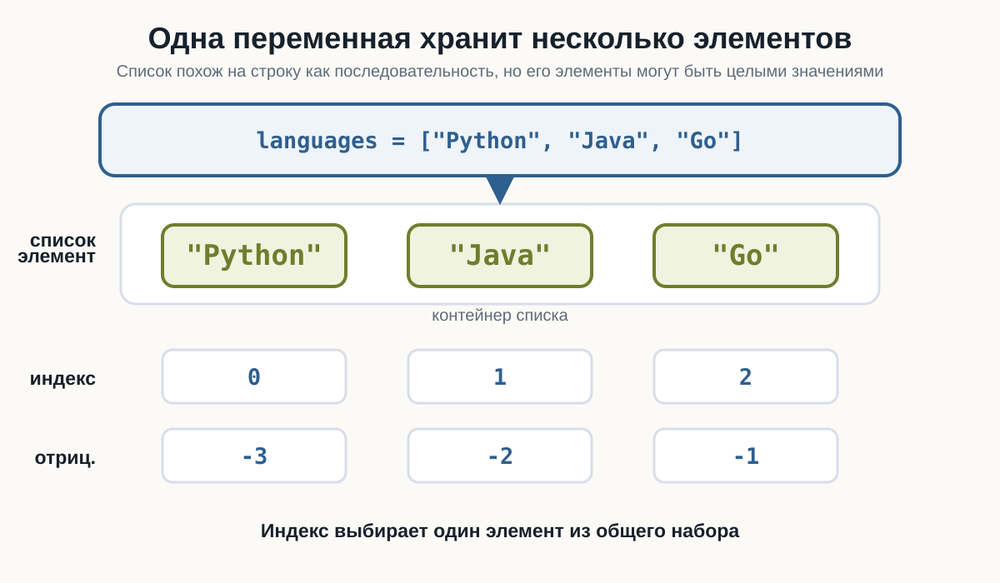
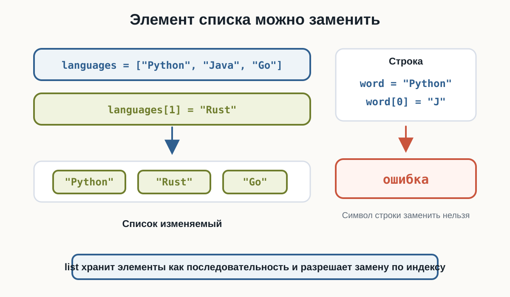
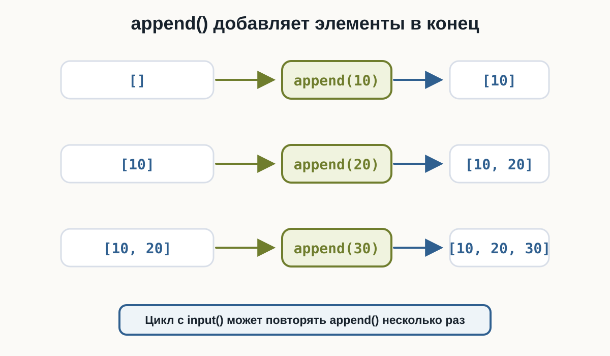
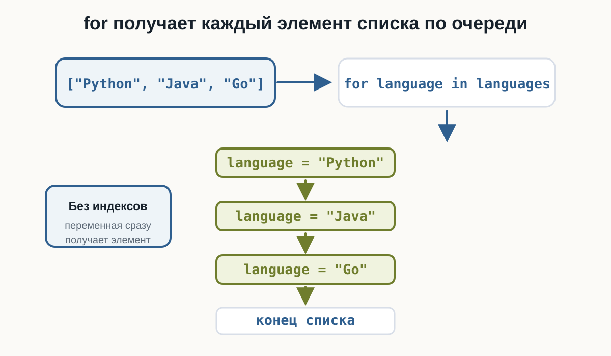
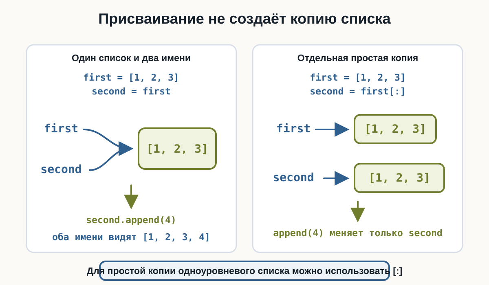

---
pagetitle: "Списки в Python: list, индексы и методы"
description: "Списки в Python для начинающих: создание list, элементы, индексы, отрицательные индексы, len(), изменяемость, append(), insert(), remove(), pop(), clear(), in, for, срезы, методы списков и простая копия через срез."
keywords:
  - списки Python
  - list Python
  - append Python
  - remove Python
  - pop Python
  - срезы списков
number-sections: true
---

# 3.12 Списки  {.unnumbered}

::: {.callout-important}
Главный вопрос главы:

**Как хранить несколько значений в одной переменной и работать с ними как с единым набором?**
:::

До сих пор одна переменная обычно хранила одно значение.

Например:

```python
name = "Анна"
age = 25
price = 199.9
```

Но часто программе нужно работать сразу с несколькими значениями.

Например:

```text
несколько имён
несколько цен
несколько результатов
несколько задач
несколько городов
```

Можно было бы создать много отдельных переменных:

```python
city1 = "Москва"
city2 = "Казань"
city3 = "Самара"
```

Но такой подход быстро становится неудобным.

В Python для хранения нескольких значений существует **список**.

---

## Первый список

Список создаётся с помощью квадратных скобок:

```python
cities = ["Москва", "Казань", "Самара"]
```

Здесь одна переменная:

```python
cities
```

содержит сразу три значения.

Выведем список:

```python
cities = ["Москва", "Казань", "Самара"]

print(cities)
```

Результат:

```text
['Москва', 'Казань', 'Самара']
```

---

## Тип list

Списки имеют тип:

```python
list
```

Проверим:

```python
cities = ["Москва", "Казань", "Самара"]

print(type(cities))
```

Результат:

```text
<class 'list'>
```

Получается:

```text
["Москва", "Казань", "Самара"]
              ↓
             list
```

В HTML-версии можно сразу проверить несколько списков: со строками, с числами и пустой список.

::: {.content-visible when-format="html"}
::: {.python-playground data-source="../examples/chapter19/list-basics.py" data-title="Первые списки"}
:::
:::

::: {.content-visible when-format="pdf"}
```{.python filename="list-basics.py"}

```
:::

---

## Элементы списка

Значения внутри списка называются **элементами**.

Например:

```python
numbers = [10, 20, 30]
```

Здесь три элемента:

```text
10
20
30
```

В списке:

```python
languages = ["Python", "Java", "Go"]
```

элементами являются строки.

Можно представить:

{fig-alt="Список languages показан как один контейнер с тремя элементами Python, Java и Go. Под элементами находятся положительные индексы 0, 1, 2 и отрицательные индексы -3, -2, -1. Схема подчёркивает, что одна переменная хранит несколько элементов."}

---

## В списке могут храниться числа

Например:

```python
prices = [100, 250, 79, 500]

print(prices)
```

Результат:

```text
[100, 250, 79, 500]
```

Или дробные числа:

```python
temperatures = [18.5, 20.1, 17.8]
```

---

## Список может содержать значения разных типов

Python позволяет написать:

```python
data = ["Анна", 25, 1.68, True]
```

Здесь находятся:

```text
str
int
float
bool
```

Такой список технически допустим.

Но в учебных и реальных программах часто удобнее, когда элементы списка имеют один общий смысл.

Например:

```python
prices = [100, 250, 79]
```

или:

```python
names = ["Анна", "Максим", "Олег"]
```

::: {.callout-tip title="Список лучше использовать для связанных значений"}

Технически список может содержать разные типы:

```python
["Анна", 25, True]
```

Но обычно понятнее хранить вместе значения, которые относятся к одной задаче:

```python
names = ["Анна", "Максим", "Олег"]
```

или:

```python
scores = [90, 75, 82]
```
:::

---

## Пустой список

Список может не содержать элементов:

```python
items = []
```

Это **пустой список**.

Проверим:

```python
items = []

print(items)
print(type(items))
```

Результат:

```text
[]
<class 'list'>
```

Пустой список часто используется как начало набора, который будет заполняться позже.

---

## Индексы списка

Как и строки, списки используют индексы.

Рассмотрим:

```python
languages = ["Python", "Java", "Go"]
```

Индексы:

```text
элемент:   Python   Java   Go
индекс:      0       1     2
```

Индексация снова начинается с:

```text
0
```

---

## Получение элемента по индексу

Например:

```python
languages = ["Python", "Java", "Go"]

print(languages[0])
```

Результат:

```text
Python
```

Другие примеры:

```python
print(languages[1])
print(languages[2])
```

Результат:

```text
Java
Go
```

---

## Отрицательные индексы

Списки поддерживают отрицательные индексы так же, как строки.

Например:

```python
languages = ["Python", "Java", "Go"]

print(languages[-1])
print(languages[-2])
```

Результат:

```text
Go
Java
```

Проверьте положительные и отрицательные индексы в playground.

::: {.content-visible when-format="html"}
::: {.python-playground data-source="../examples/chapter19/list-indexing.py" data-title="Индексы списка"}
:::
:::

::: {.content-visible when-format="pdf"}
```{.python filename="list-indexing.py"}

```
:::

Для списка:

```text
["Python", "Java", "Go"]
```

можно представить:

```text
индекс:       0       1      2
             Python  Java    Go
отриц.:      -3      -2     -1
```

---

## Ошибка индекса

Если обратиться к несуществующему элементу:

```python
languages = ["Python", "Java", "Go"]

print(languages[10])
```

возникнет:

```text
IndexError
```

Причина та же, что и со строками: такого индекса нет.

---

## Длина списка

Функция:

```python
len()
```

работает и со списками.

Например:

```python
languages = ["Python", "Java", "Go"]

print(len(languages))
```

Результат:

```text
3
```

Пустой список:

```python
items = []

print(len(items))
```

Результат:

```text
0
```

---

## Списки можно изменять

Здесь появляется важное отличие от строк.

Строки неизменяемые:

```python
word = "Python"
word[0] = "J"
```

не работает.

Но элемент списка изменить можно:

```python
languages = ["Python", "Java", "Go"]

languages[1] = "Rust"

print(languages)
```

Результат:

```text
['Python', 'Rust', 'Go']
```

::: {.content-visible when-format="html"}
::: {.python-playground data-source="../examples/chapter19/list-modification.py" data-title="Замена элемента списка"}
:::
:::

::: {.content-visible when-format="pdf"}
```{.python filename="list-modification.py"}

```
:::

{fig-alt="Слева показан список languages, где элемент Java с индексом 1 заменяется на Rust. Справа показана строка word, попытка word[0] = J и ошибка. Схема объясняет, что элемент списка можно заменить по индексу, а символ строки нельзя."}

::: {.callout-important title="Списки изменяемые"}

Строку нельзя изменить по индексу:

```python
word[0] = "J"
```

А список можно:

```python
languages[0] = "Rust"
```

Это одно из важных различий между `str` и `list`.
:::

---

## Изменение элемента

Например:

```python
prices = [100, 200, 300]

prices[1] = 250

print(prices)
```

Результат:

```text
[100, 250, 300]
```

Изменяется только выбранный элемент.

---

## append()

Чтобы добавить новый элемент в конец списка, используется метод:

```python
append()
```

Например:

```python
languages = ["Python", "Java"]

languages.append("Go")

print(languages)
```

Результат:

```text
['Python', 'Java', 'Go']
```

Можно представить:

```text
["Python", "Java"]
         ↓
   append("Go")
         ↓
["Python", "Java", "Go"]
```

---

## Добавление пользовательского значения

Например:

```python
names = []

name = input("Введите имя: ")

names.append(name)

print(names)
```

Если пользователь введёт:

```text
Анна
```

получим:

```text
['Анна']
```

---

## append() внутри цикла

Список особенно полезен вместе с циклами.

Например:

```python
numbers = []

for i in range(3):
    number = int(input("Введите число: "))
    numbers.append(number)

print(numbers)
```

Если пользователь введёт:

```text
10
20
30
```

результат:

```text
[10, 20, 30]
```

Здесь список постепенно заполняется.

Попробуйте изменить добавляемые языки и ввести свои числа.

::: {.content-visible when-format="html"}
::: {.python-playground data-source="../examples/chapter19/list-append.py" data-title="append() и ввод чисел"}
:::
:::

::: {.content-visible when-format="pdf"}
```{.python filename="list-append.py"}

```
:::

{fig-alt="Схема показывает пустой список, затем append(10), список с одним элементом 10, затем append(20), список 10 и 20, затем append(30), список 10, 20 и 30. Каждый новый элемент добавляется в конец списка."}

---

## insert()

Метод:

```python
insert()
```

позволяет добавить элемент в определённую позицию.

Например:

```python
languages = ["Python", "Go"]

languages.insert(1, "Java")

print(languages)
```

Результат:

```text
['Python', 'Java', 'Go']
```

Синтаксис:

```python
список.insert(индекс, значение)
```

---

## Разница между append() и insert()

`append()` добавляет в конец:

```python
items.append(value)
```

`insert()` добавляет в указанную позицию:

```python
items.insert(index, value)
```

Например:

```python
numbers = [10, 30]

numbers.append(40)
```

получим:

```text
[10, 30, 40]
```

А:

```python
numbers.insert(1, 20)
```

даст:

```text
[10, 20, 30, 40]
```

---

## Удаление по значению: remove()

Метод:

```python
remove()
```

удаляет элемент по его значению.

Например:

```python
languages = ["Python", "Java", "Go"]

languages.remove("Java")

print(languages)
```

Результат:

```text
['Python', 'Go']
```

---

## remove() удаляет первое совпадение

Рассмотрим:

```python
numbers = [10, 20, 10, 30]

numbers.remove(10)

print(numbers)
```

Результат:

```text
[20, 10, 30]
```

Удалилось только первое значение:

```text
10
```

---

## Если значения нет

Например:

```python
languages = ["Python", "Java"]

languages.remove("Go")
```

Такого элемента нет.

Python сообщит об ошибке:

```text
ValueError
```

Поэтому перед удалением иногда полезно сначала проверить:

```python
if "Go" in languages:
    languages.remove("Go")
```

---

## Удаление по индексу: pop()

Метод:

```python
pop()
```

может удалить элемент по индексу и вернуть его.

Например:

```python
languages = ["Python", "Java", "Go"]

removed = languages.pop(1)

print(removed)
print(languages)
```

Результат:

```text
Java
['Python', 'Go']
```

Проверьте удаление по индексу и удаление первого совпадающего значения.

::: {.content-visible when-format="html"}
::: {.python-playground data-source="../examples/chapter19/list-removal.py" data-title="pop() и remove()"}
:::
:::

::: {.content-visible when-format="pdf"}
```{.python filename="list-removal.py"}

```
:::

---

## pop() без индекса

Если индекс не указан:

```python
languages.pop()
```

удаляется последний элемент.

Например:

```python
languages = ["Python", "Java", "Go"]

removed = languages.pop()

print(removed)
print(languages)
```

Результат:

```text
Go
['Python', 'Java']
```

---

## clear()

Чтобы удалить все элементы:

```python
clear()
```

Например:

```python
numbers = [10, 20, 30]

numbers.clear()

print(numbers)
```

Результат:

```text
[]
```

Сам список остаётся существовать, но становится пустым.

---

## Проверка элемента с in

Оператор:

```python
in
```

работает и со списками.

Например:

```python
languages = ["Python", "Java", "Go"]

print("Python" in languages)
```

Результат:

```text
True
```

А:

```python
print("Rust" in languages)
```

даёт:

```text
False
```

---

## not in

Можно проверить отсутствие:

```python
languages = ["Python", "Java", "Go"]

print("Rust" not in languages)
```

Результат:

```text
True
```

Это удобно вместе с `if`:

```python
if "Python" in languages:
    print("Python найден")
```

---

## Перебор списка через for

`for` отлично подходит для списков.

Например:

```python
languages = ["Python", "Java", "Go"]

for language in languages:
    print(language)
```

Результат:

```text
Python
Java
Go
```

::: {.content-visible when-format="html"}
::: {.python-playground data-source="../examples/chapter19/list-iteration.py" data-title="Перебор списка"}
:::
:::

::: {.content-visible when-format="pdf"}
```{.python filename="list-iteration.py"}

```
:::

На каждой итерации:

```python
language
```

получает очередной элемент списка.

---

## Как for перебирает список

Можно представить:

```text
["Python", "Java", "Go"]
        ↓
      for
        ↓
language = "Python"
        ↓
language = "Java"
        ↓
language = "Go"
        ↓
      конец
```

Здесь не нужно использовать индексы.

{fig-alt="Схема показывает список Python, Java, Go, цикл for language in languages и последовательные значения переменной language: Python, Java, Go. Схема подчёркивает, что for получает элементы списка по очереди."}

---

## Когда индекс не нужен

Если нужно просто обработать каждый элемент:

```python
for language in languages:
    print(language)
```

обычно лучше перебирать сами значения.

Необязательно писать:

```python
for i in range(len(languages)):
    print(languages[i])
```

Такой вариант тоже возможен, но для простой обработки элементов он сложнее.

::: {.callout-tip title="Перебирайте элементы напрямую"}

Если индекс не нужен, обычно проще:

```python
for item in items:
    print(item)
```

чем:

```python
for i in range(len(items)):
    print(items[i])
```
:::

---

## Перебор по индексам

Иногда индекс действительно нужен.

Например:

```python
languages = ["Python", "Java", "Go"]

for i in range(len(languages)):
    print(i, languages[i])
```

Результат:

```text
0 Python
1 Java
2 Go
```

Здесь:

```python
range(len(languages))
```

даёт:

```text
0
1
2
```

---

## Изменение элементов по индексам

Если нужно изменить каждый элемент списка, индексы могут быть полезны.

Например:

```python
numbers = [1, 2, 3]

for i in range(len(numbers)):
    numbers[i] = numbers[i] * 2

print(numbers)
```

Результат:

```text
[2, 4, 6]
```

Здесь изменяется сам список.

---

## Срезы списков

Списки поддерживают срезы так же, как строки.

Например:

```python
numbers = [10, 20, 30, 40, 50]

print(numbers[1:4])
```

Результат:

```text
[20, 30, 40]
```

Правая граница снова не включается.

---

## Другие срезы

```python
numbers = [10, 20, 30, 40, 50]

print(numbers[:3])
print(numbers[2:])
print(numbers[-2:])
print(numbers[::-1])
```

Результат:

```text
[10, 20, 30]
[30, 40, 50]
[40, 50]
[50, 40, 30, 20, 10]
```

Поменяйте границы среза и проверьте, что `stop` не включается.

::: {.content-visible when-format="html"}
::: {.python-playground data-source="../examples/chapter19/list-slicing.py" data-title="Срезы списка"}
:::
:::

::: {.content-visible when-format="pdf"}
```{.python filename="list-slicing.py"}

```
:::

Правила очень похожи на строки.

---

## Срез создаёт новый список

Например:

```python
numbers = [10, 20, 30, 40]

part = numbers[1:3]

print(part)
```

Результат:

```text
[20, 30]
```

`part` — отдельный список.

---

## Объединение списков

Оператор:

```python
+
```

может объединять списки.

Например:

```python
first = [1, 2]
second = [3, 4]

result = first + second

print(result)
```

Результат:

```text
[1, 2, 3, 4]
```

---

## Повторение списка

Оператор:

```python
*
```

может повторять элементы списка.

Например:

```python
numbers = [1, 2]

print(numbers * 3)
```

Результат:

```text
[1, 2, 1, 2, 1, 2]
```

Это похоже на повторение строк:

```python
"Hi" * 3
```

---

## count()

Метод:

```python
count()
```

подсчитывает количество элементов с определённым значением.

Например:

```python
numbers = [10, 20, 10, 30, 10]

print(numbers.count(10))
```

Результат:

```text
3
```

---

## index()

Метод:

```python
index()
```

возвращает индекс первого совпадения.

Например:

```python
languages = ["Python", "Java", "Go"]

print(languages.index("Java"))
```

Результат:

```text
1
```

Если значения нет, возникнет:

```text
ValueError
```

---

## Сортировка списка

Метод:

```python
sort()
```

сортирует сам список.

Например:

```python
numbers = [30, 10, 20]

numbers.sort()

print(numbers)
```

Результат:

```text
[10, 20, 30]
```

---

## sort() изменяет список

Это отличается от многих методов строк.

Например:

```python
numbers = [3, 1, 2]

numbers.sort()

print(numbers)
```

Сам `numbers` теперь:

```text
[1, 2, 3]
```

::: {.callout-note title="Списки изменяемые"}

Методы списков часто изменяют сам список:

```python
append()
remove()
pop()
clear()
sort()
```

Это отличается от строк, где методы вроде:

```python
upper()
lower()
replace()
```

создают новые строковые значения.
:::

---

## Сортировка строк

Можно сортировать и список строк:

```python
names = ["Олег", "Анна", "Максим"]

names.sort()

print(names)
```

Python упорядочит строки согласно своим правилам сравнения.

На этом этапе достаточно понимать сам факт сортировки.

---

## reverse()

Метод:

```python
reverse()
```

изменяет порядок элементов на обратный.

Например:

```python
numbers = [1, 2, 3, 4]

numbers.reverse()

print(numbers)
```

Результат:

```text
[4, 3, 2, 1]
```

Соберём несколько методов в одном компактном примере.

::: {.content-visible when-format="html"}
::: {.python-playground data-source="../examples/chapter19/list-methods.py" data-title="count(), index(), sort() и reverse()"}
:::
:::

::: {.content-visible when-format="pdf"}
```{.python filename="list-methods.py"}

```
:::

Можно также использовать срез:

```python
numbers[::-1]
```

Но между этими подходами есть различие:

```python
reverse()
```

изменяет существующий список.

Срез создаёт новый список.

---

## sum()

Для списка чисел можно использовать:

```python
sum()
```

Например:

```python
numbers = [10, 20, 30]

print(sum(numbers))
```

Результат:

```text
60
```

Это короче, чем писать накопитель вручную.

---

## min() и max()

Функция:

```python
min()
```

находит минимальное значение.

```python
max()
```

— максимальное.

Например:

```python
numbers = [12, 5, 30, 8]

print(min(numbers))
print(max(numbers))
```

Результат:

```text
5
30
```

---

## Среднее значение

Отдельной встроенной функции среднего в этом базовом наборе нет.

Но можно вычислить:

```python
numbers = [10, 20, 30]

average = sum(numbers) / len(numbers)

print(average)
```

Результат:

```text
20.0
```

Здесь объединяются:

```text
sum()
len()
/
```

---

## Важный случай: пустой список

Рассмотрим:

```python
numbers = []

average = sum(numbers) / len(numbers)
```

Получается:

```text
0 / 0
```

Это приведёт к:

```text
ZeroDivisionError
```

Поэтому перед таким вычислением нужно убедиться, что список не пуст.

Например:

```python
numbers = []

if len(numbers) > 0:
    average = sum(numbers) / len(numbers)
    print(average)
else:
    print("Список пуст")
```

---

## bool списка

Мы уже знаем:

```python
bool("")
```

для пустой строки даёт:

```text
False
```

Со списками работает похожее правило.

Пустой список:

```python
bool([])
```

даёт:

```text
False
```

Непустой:

```python
bool([1, 2])
```

даёт:

```text
True
```

Поэтому позже можно встретить:

```python
if numbers:
    print("В списке есть элементы")
```

На текущем этапе можно читать это как:

> если список не пуст.

---

## Проверка пустого списка

Есть несколько понятных вариантов.

Например:

```python
if len(numbers) > 0:
    print("Список не пуст")
```

Или:

```python
if numbers:
    print("Список не пуст")
```

Второй вариант очень распространён в Python.

::: {.callout-tip title="Пустой список считается False"}

```python
[]
```

в логическом контексте считается `False`.

Поэтому:

```python
if items:
    print("Есть элементы")
```

выполнится только для непустого списка.
:::

---

## Создание списка из пользовательского ввода

Например, пользователь вводит три числа:

```python
numbers = []

for i in range(3):
    number = float(input("Введите число: "))
    numbers.append(number)

print(numbers)
```

Пример:

```text
Введите число: 10
Введите число: 20
Введите число: 30
[10.0, 20.0, 30.0]
```

Теперь все введённые значения сохранены и доступны после завершения цикла.

::: {.content-visible when-format="html"}
::: {.python-playground data-source="../examples/chapter19/build-list-input.py" data-title="Создание списка через input()"}
:::
:::

::: {.content-visible when-format="pdf"}
```{.python filename="build-list-input.py"}

```
:::

---

## Почему это лучше одного накопителя

В прошлых главах мы могли написать:

```python
total = 0

for i in range(3):
    number = float(input("Введите число: "))
    total += number
```

После цикла у нас есть только итоговая сумма.

Но если использовать список:

```python
numbers = []

for i in range(3):
    number = float(input("Введите число: "))
    numbers.append(number)
```

после цикла доступны **все значения**.

Например:

```python
print(numbers)
print(sum(numbers))
print(min(numbers))
print(max(numbers))
```

Список сохраняет данные для дальнейшей обработки.

---

## Пример: оценки

```python
scores = [85, 90, 72, 100, 88]

print("Количество:", len(scores))
print("Сумма:", sum(scores))
print("Минимум:", min(scores))
print("Максимум:", max(scores))

average = sum(scores) / len(scores)

print("Среднее:", average)
```

Это уже похоже на небольшую обработку набора данных.

::: {.content-visible when-format="html"}
::: {.python-playground data-source="../examples/chapter19/list-statistics.py" data-title="Статистика по списку чисел"}
:::
:::

::: {.content-visible when-format="pdf"}
```{.python filename="list-statistics.py"}

```
:::

---

## Пример: список покупок

```python
products = ["Хлеб", "Молоко", "Сыр"]

for product in products:
    print("-", product)
```

Результат:

```text
- Хлеб
- Молоко
- Сыр
```

Можно добавить новый товар:

```python
products.append("Кофе")
```

или удалить:

```python
products.remove("Молоко")
```

---

## Пример: поиск элемента

```python
products = ["Хлеб", "Молоко", "Сыр"]

product = input("Что ищем? ")

if product in products:
    print("Товар найден")
else:
    print("Такого товара нет")
```

::: {.content-visible when-format="html"}
::: {.python-playground data-source="../examples/chapter19/product-search.py" data-title="Поиск товара в списке"}
:::
:::

::: {.content-visible when-format="pdf"}
```{.python filename="product-search.py"}

```
:::

Здесь объединяются:

```text
input()
↓
список
↓
in
↓
True / False
↓
if
```

---

## Пример: фильтрация значений

Пока не будем создавать отдельный новый список, но можем вывести только подходящие значения.

Например:

```python
numbers = [3, 10, 7, 20, 2]

for number in numbers:
    if number >= 10:
        print(number)
```

Результат:

```text
10
20
```

Позже мы научимся сохранять такие выбранные значения в отдельный список более системно.

---

## Изменение списка во время перебора

Рассмотрим идею:

```python
numbers = [1, 2, 3, 4]
```

Можно захотеть удалять элементы прямо внутри:

```python
for number in numbers:
    ...
```

Но изменение размера списка во время его перебора может привести к неожиданному поведению.

На этом этапе лучше придерживаться простого правила:

::: {.callout-warning title="Не изменяйте размер списка во время перебора"}

Пока вы изучаете списки, избегайте конструкций вроде:

```python
for item in items:
    items.remove(item)
```

Перебор и одновременное удаление могут привести к пропуску элементов.

Сначала завершите перебор или используйте другой подход.
:::

---

## Копия списка

Рассмотрим:

```python
numbers = [1, 2, 3]

copy = numbers[:]

print(copy)
```

Результат:

```text
[1, 2, 3]
```

Срез:

```python
[:]
```

создаёт новый список с теми же элементами.

Для простых значений это удобный способ сделать копию списка.

---

## Присваивание — не копия

Рассмотрим:

```python
first = [1, 2, 3]
second = first

second.append(4)

print(first)
print(second)
```

Результат:

```text
[1, 2, 3, 4]
[1, 2, 3, 4]
```

Почему изменились оба?

Потому что:

```python
second = first
```

не создаёт новый список.

Оба имени связаны с одним списком.

Можно представить:

```text
first ──┐
        ├──→ [1, 2, 3]
second ─┘
```

---

## Настоящая простая копия

Если нужен отдельный список:

```python
first = [1, 2, 3]
second = first[:]

second.append(4)

print(first)
print(second)
```

Результат:

```text
[1, 2, 3]
[1, 2, 3, 4]
```

Теперь списки разные.

Проверьте обе ситуации рядом: присваивание имени и простую копию через срез.

::: {.content-visible when-format="html"}
::: {.python-playground data-source="../examples/chapter19/list-copy.py" data-title="Присваивание и копия списка"}
:::
:::

::: {.content-visible when-format="pdf"}
```{.python filename="list-copy.py"}

```
:::

{fig-alt="Слева показано, что first и second указывают на один список после second = first, поэтому second.append(4) виден через оба имени. Справа показано second = first[:] и два отдельных списка, где изменение second не меняет first."}

::: {.callout-important title="Присваивание списка не создаёт копию"}

```python
second = first
```

означает, что два имени ссылаются на один и тот же список.

Для простой копии одноуровневого списка можно использовать:

```python
second = first[:]
```

К более сложным случаям копирования вернёмся позже.
:::

---

## Что важно запомнить

Список — это значение типа:

```text
list
```

Он позволяет хранить несколько элементов:

```python
numbers = [10, 20, 30]
```

Элементы имеют индексы:

```text
10   20   30
0    1    2
```

Получение элемента:

```python
numbers[0]
numbers[-1]
```

Длина:

```python
len(numbers)
```

Списки изменяемые:

```python
numbers[0] = 100
```

Основные методы:

```python
append()
insert()
remove()
pop()
clear()
count()
index()
sort()
reverse()
```

Полезные функции:

```python
len()
sum()
min()
max()
```

Перебор:

```python
for item in items:
    print(item)
```

Проверка:

```python
item in items
item not in items
```

Срез:

```python
items[start:stop:step]
```

И самое важное:

> **Список позволяет сохранить несколько связанных значений и затем обрабатывать их как единый набор данных.**

---

### Практические задания

**Задание 1. Первый и последний элемент**

Дан список:

```python
languages = ["Python", "Java", "Go", "Rust"]
```

Выведите первый и последний элементы.

::: {.callout-note title="Ответ" collapse="true"}

```python
languages = ["Python", "Java", "Go", "Rust"]

print(languages[0])
print(languages[-1])
```

:::

---

**Задание 2. Изменение элемента**

Дан список:

```python
numbers = [10, 20, 30]
```

Замените `20` на `25`.

::: {.callout-note title="Ответ" collapse="true"}

```python
numbers = [10, 20, 30]

numbers[1] = 25

print(numbers)
```

Результат:

```text
[10, 25, 30]
```

:::

---

**Задание 3. Добавление элемента**

Создайте список:

```python
cities = ["Москва", "Казань"]
```

Добавьте:

```text
Самара
```

в конец списка.

::: {.callout-note title="Ответ" collapse="true"}

```python
cities = ["Москва", "Казань"]

cities.append("Самара")

print(cities)
```

:::

---

**Задание 4. Удаление элемента**

Дан список:

```python
languages = ["Python", "Java", "Go"]
```

Удалите `"Java"`.

::: {.callout-note title="Ответ" collapse="true"}

```python
languages = ["Python", "Java", "Go"]

languages.remove("Java")

print(languages)
```

Результат:

```text
['Python', 'Go']
```

:::

---

**Задание 5. Перебор списка**

Дан список:

```python
names = ["Анна", "Максим", "Олег"]
```

Выведите каждое имя на отдельной строке.

::: {.callout-note title="Ответ" collapse="true"}

```python
names = ["Анна", "Максим", "Олег"]

for name in names:
    print(name)
```

:::

---

**Задание 6. Сумма элементов**

Дан список:

```python
numbers = [10, 20, 30, 40]
```

Выведите сумму всех элементов.

::: {.callout-note title="Ответ" collapse="true"}

```python
numbers = [10, 20, 30, 40]

print(sum(numbers))
```

Результат:

```text
100
```

:::

---

**Задание 7. Минимум и максимум**

Дан список:

```python
numbers = [15, 3, 28, 9, 12]
```

Выведите минимальное и максимальное значения.

::: {.callout-note title="Ответ" collapse="true"}

```python
numbers = [15, 3, 28, 9, 12]

print("Минимум:", min(numbers))
print("Максимум:", max(numbers))
```

:::

---

**Задание 8. Среднее значение**

Дан список:

```python
scores = [80, 90, 70, 100]
```

Вычислите среднее значение.

::: {.callout-note title="Ответ" collapse="true"}

```python
scores = [80, 90, 70, 100]

average = sum(scores) / len(scores)

print("Среднее:", average)
```

Результат:

```text
Среднее: 85.0
```

:::

---

**Задание 9. Проверка элемента**

Дан список:

```python
languages = ["Python", "Java", "Go"]
```

Попросите пользователя ввести язык программирования и проверьте, есть ли он в списке.

::: {.callout-note title="Ответ" collapse="true"}

```python
languages = ["Python", "Java", "Go"]

language = input("Введите язык: ")

if language in languages:
    print("Язык найден")
else:
    print("Языка нет в списке")
```

:::

---

**Задание 10. Создание списка через input()**

Создайте пустой список.

Попросите пользователя ввести три числа и добавьте их в список.

Затем выведите весь список.

::: {.callout-note title="Ответ" collapse="true"}

```python
numbers = []

for i in range(3):
    number = float(input("Введите число: "))
    numbers.append(number)

print(numbers)
```

:::

---

**Задание 11. Только большие числа**

Дан список:

```python
numbers = [4, 15, 2, 30, 8, 21]
```

Выведите только значения больше `10`.

::: {.callout-note title="Ответ" collapse="true"}

```python
numbers = [4, 15, 2, 30, 8, 21]

for number in numbers:
    if number > 10:
        print(number)
```

Результат:

```text
15
30
21
```

:::

---

**Задание 12. Срез списка**

Дан список:

```python
numbers = [10, 20, 30, 40, 50]
```

Выведите:

```text
[20, 30, 40]
```

с помощью среза.

::: {.callout-note title="Ответ" collapse="true"}

```python
numbers = [10, 20, 30, 40, 50]

print(numbers[1:4])
```

:::

---

**Задание 13. Разворот списка**

Дан список:

```python
numbers = [1, 2, 3, 4, 5]
```

Получите новый список в обратном порядке с помощью среза.

::: {.callout-note title="Ответ" collapse="true"}

```python
numbers = [1, 2, 3, 4, 5]

reversed_numbers = numbers[::-1]

print(reversed_numbers)
```

Результат:

```text
[5, 4, 3, 2, 1]
```

:::

---

**Задание 14. Найдите проблему**

Что произойдёт?

```python
numbers = [10, 20, 30]

print(numbers[3])
```

Почему?

::: {.callout-note title="Ответ" collapse="true"}

Список содержит три элемента.

Их индексы:

```text
10   20   30
0    1    2
```

Индекса:

```text
3
```

нет.

Поэтому возникнет:

```text
IndexError
```

:::

---

**Задание 15. Присваивание и копия**

Какой результат будет здесь?

```python
first = [1, 2, 3]
second = first

second.append(4)

print(first)
```

Сначала попробуйте ответить без запуска.

::: {.callout-note title="Ответ" collapse="true"}

Результат:

```text
[1, 2, 3, 4]
```

Запись:

```python
second = first
```

не создаёт новый список.

Оба имени ссылаются на один список.

Поэтому изменение через `second` видно и через `first`.

Если нужен отдельный список:

```python
second = first[:]
```

:::

---

**Задание 16. Задача со звёздочкой**

Пользователь вводит пять чисел.

Сохраните их в список.

После ввода выведите:

- весь список;
- количество элементов;
- сумму;
- минимальное число;
- максимальное число;
- среднее значение.

::: {.callout-note title="Ответ" collapse="true"}

```python
numbers = []

for i in range(5):
    number = float(input("Введите число: "))
    numbers.append(number)

print("Список:", numbers)
print("Количество:", len(numbers))
print("Сумма:", sum(numbers))
print("Минимум:", min(numbers))
print("Максимум:", max(numbers))

average = sum(numbers) / len(numbers)

print("Среднее:", average)
```

Здесь объединяется сразу несколько изученных тем:

```text
input()
↓
float()
↓
for
↓
append()
↓
list
↓
len() / sum() / min() / max()
```

:::

---

## Что дальше?

Теперь программа умеет хранить несколько связанных значений в одном списке:

```python
numbers = [10, 20, 30]
```

Но в примерах главы код уже начинает повторяться.

Например, одни и те же действия можно захотеть выполнить в разных местах программы:

```text
получить данные
↓
проверить их
↓
посчитать результат
↓
вывести ответ
```

Следующая тема — **функции**.

Функция позволяет дать имя фрагменту программы и вызывать его снова, когда он нужен.
