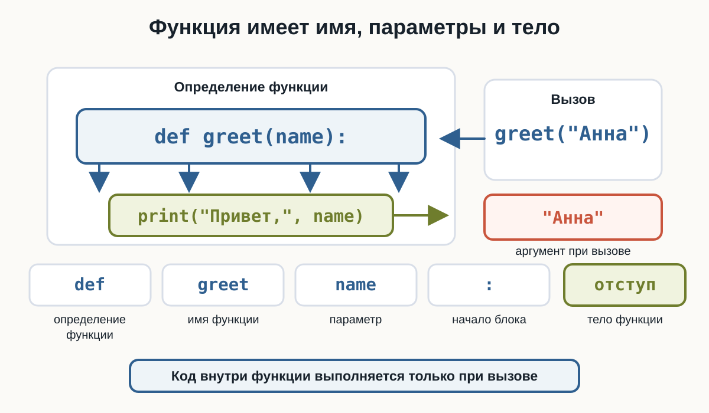
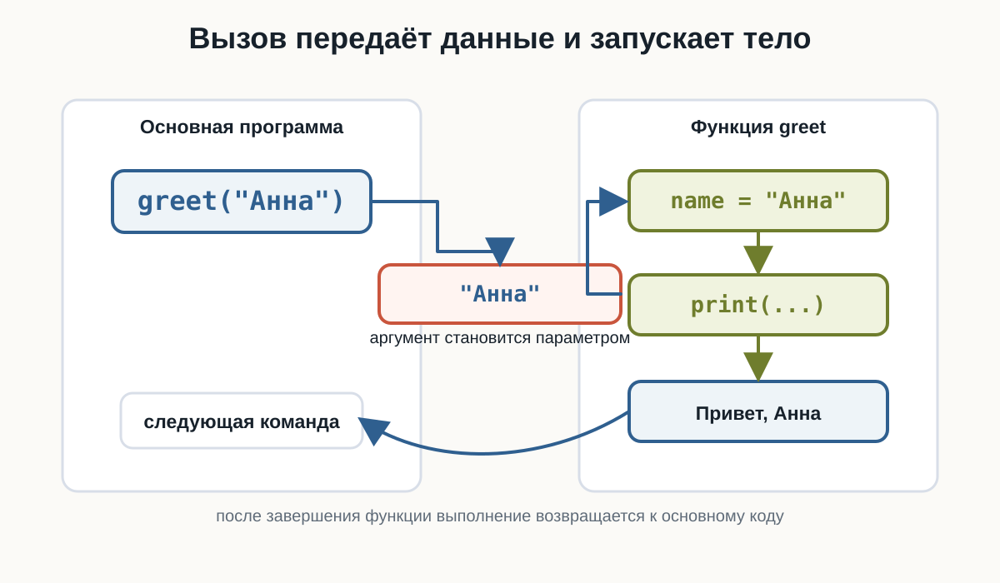
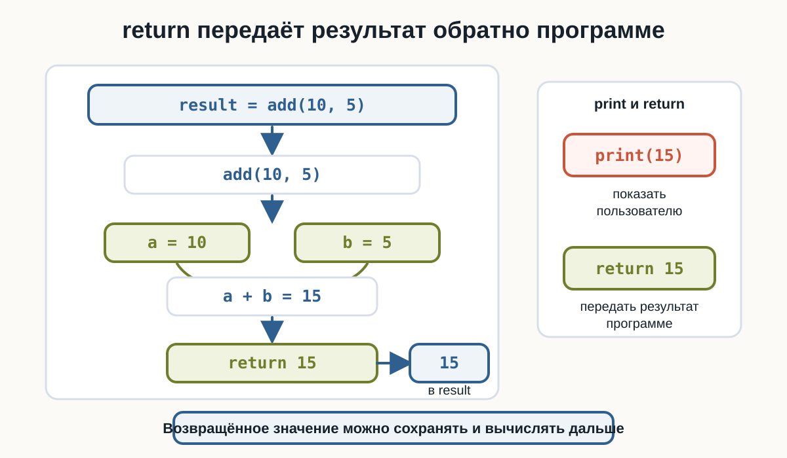
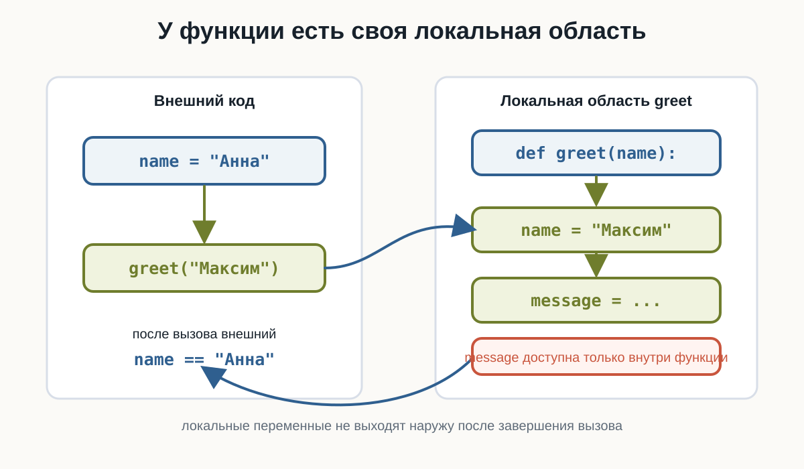
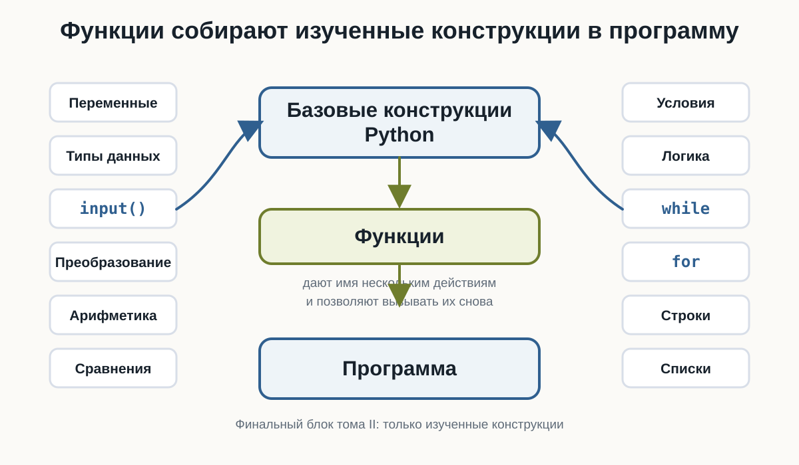

---
pagetitle: "Функции в Python: def, параметры и return"
description: "Функции в Python для начинающих: def, вызов функции, параметры и аргументы, несколько параметров, return, отличие print() от return, None, локальные переменные, значения по умолчанию и функции со списками."
keywords:
  - функции Python
  - def Python
  - return Python
  - параметры функции
  - аргументы Python
  - локальные переменные
number-sections: true
---

# 3.13 Функции {.unnumbered}

::: {.callout-important}
Главный вопрос главы:

**Как объединить несколько действий в один переиспользуемый блок кода и вызывать его тогда, когда он нужен?**
:::

К этому моменту наши программы уже умеют многое.

Мы можем получать данные:

```python
name = input("Введите имя: ")
```

выполнять вычисления:

```python
total = price * quantity
```

принимать решения:

```python
if age >= 18:
    print("Доступ разрешён")
```

повторять действия:

```python
for number in range(1, 6):
    print(number)
```

и работать с наборами данных:

```python
numbers = [10, 20, 30]
```

Но по мере роста программы появляется новая проблема.

Один и тот же код может понадобиться несколько раз.

Например:

```python
print("--------------------")
print("Добро пожаловать!")
print("--------------------")
```

Если такой блок нужен в трёх местах, можно скопировать его:

```python
print("--------------------")
print("Добро пожаловать!")
print("--------------------")

print("Основная часть программы")

print("--------------------")
print("Добро пожаловать!")
print("--------------------")
```

Но копирование кода быстро становится неудобным.

Гораздо лучше один раз дать группе команд имя, а затем вызывать её тогда, когда она нужна.

Для этого в Python существуют **функции**.

---

## Что такое функция

**Функция** — это именованный блок кода, который можно выполнить по вызову.

Например:

```python
def greet():
    print("Привет!")
```

Здесь мы создали функцию:

```python
greet
```

Но пока она ещё не выполнялась.

Чтобы запустить код внутри функции, её нужно **вызвать**:

```python
greet()
```

Полная программа:

```python
def greet():
    print("Привет!")


greet()
```

Результат:

```text
Привет!
```

В HTML-версии можно проверить, что само определение функции ничего не выводит, а каждый вызов запускает тело заново.

:::: {.content-visible when-format="html"}
::: {.python-playground data-source="../examples/chapter20/first-function.py" data-title="Первая функция"}
:::
::::

:::: {.content-visible when-format="pdf"}
```{.python filename="first-function.py"}

```
::::

Общая идея:

```text
создать функцию
      ↓
дать ей имя
      ↓
описать действия
      ↓
вызвать функцию
      ↓
действия выполняются
```

---

## Создание функции с def

Для создания собственной функции используется слово:

```python
def
```

Например:

```python
def greet():
    print("Привет!")
```

Эту запись можно разобрать так:

```text
def       → объявляем функцию

greet     → имя функции

()        → круглые скобки

:         → начало блока

    ...   → тело функции
```

Общая форма:

```python
def имя_функции():
    действие
```

::: {.callout-note title="def означает определение функции"}

С помощью:

```python
def
```

мы **определяем** функцию.

Например:

```python
def show_message():
    print("Python")
```

Но код внутри неё выполняется только после вызова:

```python
show_message()
```
:::

---

## Вызов функции

После определения функции её можно вызвать:

```python
def greet():
    print("Привет!")


greet()
```

Вызов выглядит так:

```python
greet()
```

Круглые скобки здесь важны.

Сравните:

```python
greet
```

и:

```python
greet()
```

На текущем этапе достаточно запомнить:

> Чтобы выполнить функцию, после её имени ставятся круглые скобки.

---

## Функцию можно вызвать несколько раз

Главное преимущество функции — возможность повторного использования.

Например:

```python
def greet():
    print("Добро пожаловать!")


greet()
greet()
greet()
```

Результат:

```text
Добро пожаловать!
Добро пожаловать!
Добро пожаловать!
```

Код функции написан один раз, но выполнен три раза.

---

## Несколько команд внутри функции

Функция может содержать несколько строк:

```python
def show_header():
    print("--------------------")
    print("Путь Python-разработчика")
    print("--------------------")
```

Вызов:

```python
show_header()
```

Результат:

```text
--------------------
Путь Python-разработчика
--------------------
```

Все строки с одинаковым отступом относятся к функции.

---

## Отступы внутри функции

Как и в `if`, `for` и `while`, Python использует отступы для определения блока.

Правильно:

```python
def greet():
    print("Привет!")
    print("Добро пожаловать!")
```

Неправильно:

```python
def greet():
print("Привет!")
```

::: {.callout-warning title="Тело функции должно иметь отступ"}

После:

```python
def greet():
```

команды функции записываются с отступом:

```python
def greet():
    print("Привет!")
```

Обычно используется 4 пробела.
:::

---

## Код после функции

Рассмотрим:

```python
def greet():
    print("Привет!")


print("Начало программы")

greet()

print("Конец программы")
```

Результат:

```text
Начало программы
Привет!
Конец программы
```

Python не выполняет функцию в момент её определения.

Сначала он узнаёт, что функция существует:

```python
def greet():
```

А код внутри выполняется только при:

```python
greet()
```

---

## Зачем нужны функции

Функции помогают решать сразу несколько задач.

Они позволяют:

```text
не повторять одинаковый код
↓
разделять программу на понятные части
↓
давать действиям понятные имена
↓
повторно использовать готовую логику
↓
упрощать чтение и изменение программы
```

Например, вместо:

```python
print("--------------------")
print("Меню")
print("--------------------")
```

в нескольких местах можно написать:

```python
def show_menu_header():
    print("--------------------")
    print("Меню")
    print("--------------------")
```

а затем:

```python
show_menu_header()
```

---

## Понятные имена функций

Имя функции должно описывать действие.

Хорошие примеры:

```python
show_menu()
print_report()
calculate_total()
check_password()
greet_user()
```

Менее понятные:

```python
f()
do()
func1()
x()
```

Функции обычно называют глаголами или фразами, описывающими действие.

::: {.callout-tip title="Имя должно отвечать на вопрос «что делает функция?»"}

Например:

```python
calculate_total()
```

сразу говорит:

> вычислить итог.

А:

```python
show_message()
```

говорит:

> показать сообщение.
:::

---

## Параметры функции

Пока наша функция всегда делает одно и то же:

```python
def greet():
    print("Привет!")
```

Но часто функции нужны данные.

Например, мы хотим приветствовать разных пользователей:

```text
Привет, Анна!
Привет, Максим!
Привет, Олег!
```

Для этого используется **параметр**.

```python
def greet(name):
    print("Привет,", name)
```

Теперь при вызове нужно передать значение:

```python
greet("Анна")
```

Результат:

```text
Привет, Анна
```

На схеме видно, где находится параметр в определении и где находится аргумент при вызове.

{fig-alt="Схема показывает определение функции def greet(name): с подписью def как определения функции, greet как имени функции, name как параметра, двоеточия как начала блока и строки с отступом как тела функции. Рядом показан вызов greet с аргументом Анна."}

---

## Как работает параметр

Рассмотрим:

```python
def greet(name):
    print("Привет,", name)


greet("Анна")
```

Во время вызова:

```python
greet("Анна")
```

значение:

```python
"Анна"
```

передаётся параметру:

```python
name
```

Внутри функции получается:

```text
name → "Анна"
```

После этого выполняется:

```python
print("Привет,", name)
```

Можно представить:

```text
greet("Анна")
      ↓
   "Анна"
      ↓
    name
      ↓
тело функции
      ↓
Привет, Анна
```

Эту передачу значения можно представить как переход из основной программы в функцию и обратно.

{fig-alt="Схема показывает вызов greet с аргументом Анна, передачу значения параметру name, выполнение тела функции, вывод Привет Анна и возврат к следующей команде основной программы."}

---

## Параметр и аргумент

Здесь важно различать два понятия.

В определении:

```python
def greet(name):
```

`name` — **параметр**.

А при вызове:

```python
greet("Анна")
```

`"Анна"` — **аргумент**.

То есть:

```text
параметр
→ имя внутри определения функции

аргумент
→ конкретное значение при вызове
```

::: {.callout-note title="Параметр и аргумент"}

```python
def greet(name):
```

`name` — параметр.

```python
greet("Анна")
```

`"Анна"` — аргумент.

Аргумент передаёт конкретное значение параметру.
:::

---

## Одна функция — разные данные

Теперь одну функцию можно использовать с разными значениями:

```python
def greet(name):
    print("Привет,", name)


greet("Анна")
greet("Максим")
greet("Олег")
```

Результат:

```text
Привет, Анна
Привет, Максим
Привет, Олег
```

Поменяйте аргументы в HTML-версии и проверьте, что тело функции остаётся тем же.

:::: {.content-visible when-format="html"}
::: {.python-playground data-source="../examples/chapter20/function-parameters.py" data-title="Параметр функции"}
:::
::::

:::: {.content-visible when-format="pdf"}
```{.python filename="function-parameters.py"}

```
::::

Именно поэтому функции настолько полезны.

Логика написана один раз:

```python
print("Привет,", name)
```

а данные могут быть разными.

---

## Несколько параметров

Функция может принимать несколько параметров.

Например:

```python
def show_user(name, age):
    print("Имя:", name)
    print("Возраст:", age)
```

Вызов:

```python
show_user("Анна", 25)
```

Результат:

```text
Имя: Анна
Возраст: 25
```

В playground можно сравнить позиционный вызов и короткий пример именованных аргументов.

:::: {.content-visible when-format="html"}
::: {.python-playground data-source="../examples/chapter20/multiple-parameters.py" data-title="Несколько параметров"}
:::
::::

:::: {.content-visible when-format="pdf"}
```{.python filename="multiple-parameters.py"}

```
::::

Значения передаются по порядку:

```text
"Анна" → name
25     → age
```

---

## Порядок аргументов имеет значение

Рассмотрим:

```python
def show_user(name, age):
    print("Имя:", name)
    print("Возраст:", age)
```

Правильный вызов:

```python
show_user("Анна", 25)
```

Если написать:

```python
show_user(25, "Анна")
```

Python технически передаст:

```text
name → 25
age  → "Анна"
```

и результат окажется неправильным по смыслу.

::: {.callout-warning title="Следите за порядком аргументов"}

Для:

```python
def show_user(name, age):
```

вызов:

```python
show_user("Анна", 25)
```

передаёт:

```text
"Анна" → name
25     → age
```

Позиция аргумента важна.
:::

---

## Функция для вычисления

Функция может не только выводить текст.

Например:

```python
def show_sum(a, b):
    result = a + b

    print(result)
```

Вызов:

```python
show_sum(10, 5)
```

Результат:

```text
15
```

Другой вызов:

```python
show_sum(100, 25)
```

Результат:

```text
125
```

---

## Функция и input()

Данные можно получить до вызова функции:

```python
def greet(name):
    print("Привет,", name)


user_name = input("Введите имя: ")

greet(user_name)
```

Например:

```text
Введите имя: Анна
Привет, Анна
```

Получается:

```text
input()
   ↓
значение
   ↓
аргумент
   ↓
параметр функции
   ↓
действие
```

---

## Возвращаемое значение

До сих пор функции сами выводили результат:

```python
def show_sum(a, b):
    print(a + b)
```

Но часто результат нужен **не для немедленного вывода**, а для дальнейшей работы.

Например:

```text
вычислить стоимость
↓
сохранить результат
↓
прибавить доставку
↓
сравнить с бюджетом
```

Для этого функция может **возвращать значение**.

Используется:

```python
return
```

---

## Первый return

Например:

```python
def add(a, b):
    return a + b
```

Теперь можно написать:

```python
result = add(10, 5)

print(result)
```

Результат:

```text
15
```

Функция:

```python
add(10, 5)
```

создаёт результат:

```text
15
```

и возвращает его в место вызова.

---

## Как работает return

Рассмотрим:

```python
def add(a, b):
    return a + b


result = add(10, 5)
```

Пошагово:

```text
add(10, 5)
    ↓
a = 10
b = 5
    ↓
10 + 5
    ↓
15
    ↓
return
    ↓
result = 15
```

После этого значение можно использовать как обычное число:

```python
print(result * 2)
```

Результат:

```text
30
```

Схема показывает весь путь возвращаемого значения: от аргументов до переменной `result`.

{fig-alt="Схема показывает result = add(10, 5), вызов add(10, 5), значения параметров a = 10 и b = 5, вычисление a + b, результат 15, return 15 и сохранение result = 15. Рядом сравниваются print(15), который показывает значение пользователю, и return 15, который передаёт результат программе."}

Проверьте в HTML-версии, что возвращённое значение можно сохранить и использовать в следующем вычислении.

:::: {.content-visible when-format="html"}
::: {.python-playground data-source="../examples/chapter20/return-value.py" data-title="Возвращаемое значение"}
:::
::::

:::: {.content-visible when-format="pdf"}
```{.python filename="return-value.py"}

```
::::

---

## print() и return — не одно и то же

Это очень важное различие.

Функция:

```python
def add(a, b):
    print(a + b)
```

сама выводит значение на экран.

А:

```python
def add(a, b):
    return a + b
```

возвращает значение вызывающему коду.

Сравним.

### print()

```python
def add(a, b):
    print(a + b)


add(10, 5)
```

выведет:

```text
15
```

### return

```python
def add(a, b):
    return a + b


result = add(10, 5)

print(result)
```

тоже выведет:

```text
15
```

Но во втором случае число:

```text
15
```

сохранено в `result` и его можно использовать дальше.

::: {.callout-important title="print() показывает, return возвращает"}

```python
print()
```

выводит значение пользователю.

```python
return
```

передаёт результат функции обратно в программу.

Например:

```python
result = add(10, 5)
```

имеет смысл только тогда, когда функция возвращает значение.
:::

В этом примере удобно увидеть разницу между выводом, возвращаемым значением и `None`.

:::: {.content-visible when-format="html"}
::: {.python-playground data-source="../examples/chapter20/print-vs-return.py" data-title="print() и return"}
:::
::::

:::: {.content-visible when-format="pdf"}
```{.python filename="print-vs-return.py"}

```
::::

---

## Возвращённое значение можно использовать сразу

Например:

```python
def add(a, b):
    return a + b


print(add(10, 5))
```

Результат:

```text
15
```

Или:

```python
print(add(10, 5) * 2)
```

Результат:

```text
30
```

Функция становится частью выражения.

---

## Пример: стоимость покупки

Напишем функцию:

```python
def calculate_total(price, quantity):
    return price * quantity
```

Использование:

```python
total = calculate_total(250, 3)

print(total)
```

Результат:

```text
750
```

Теперь можно добавить доставку:

```python
total = calculate_total(250, 3)

final_price = total + 150

print(final_price)
```

Результат:

```text
900
```

---

## Функция может возвращать строку

`return` работает не только с числами.

Например:

```python
def make_greeting(name):
    return "Привет, " + name
```

Использование:

```python
message = make_greeting("Анна")

print(message)
```

Результат:

```text
Привет, Анна
```

---

## Функция может возвращать bool

Например:

```python
def is_adult(age):
    return age >= 18
```

Проверим:

```python
print(is_adult(20))
print(is_adult(15))
```

Результат:

```text
True
False
```

Теперь результат функции можно использовать в `if`:

```python
age = int(input("Введите возраст: "))

if is_adult(age):
    print("Доступ разрешён")
else:
    print("Доступ запрещён")
```

Здесь соединяются сразу несколько предыдущих тем.

Поменяйте возраст и условие внутри функции, чтобы увидеть, как `bool`-результат работает прямо в `if`.

:::: {.content-visible when-format="html"}
::: {.python-playground data-source="../examples/chapter20/boolean-function.py" data-title="Функция возвращает bool"}
:::
::::

:::: {.content-visible when-format="pdf"}
```{.python filename="boolean-function.py"}

```
::::

---

## return завершает выполнение функции

Рассмотрим:

```python
def check_number(number):
    if number > 0:
        return "Положительное"

    return "Ноль или отрицательное"
```

Если:

```python
number > 0
```

истинно, выполняется:

```python
return "Положительное"
```

После `return` функция завершается.

Код ниже этого `return` в текущем вызове уже не выполняется.

---

## Код после return

Например:

```python
def example():
    return 10
    print("Эта строка не выполнится")
```

После:

```python
return 10
```

функция заканчивает работу.

Поэтому следующий `print()` недостижим.

::: {.callout-warning title="return завершает функцию"}

Как только Python выполняет:

```python
return
```

текущий вызов функции завершается.

Команды ниже этого `return` в той же ветке уже не выполняются.
:::

---

## Несколько return

В одной функции может быть несколько `return`, если они находятся в разных ветках.

Например:

```python
def describe_number(number):
    if number > 0:
        return "Положительное"
    elif number < 0:
        return "Отрицательное"
    else:
        return "Ноль"
```

Использование:

```python
print(describe_number(10))
print(describe_number(-5))
print(describe_number(0))
```

Результат:

```text
Положительное
Отрицательное
Ноль
```

Для каждого вызова выполняется только один `return`.

---

## Что возвращает функция без return

Рассмотрим:

```python
def greet():
    print("Привет!")
```

Попробуем сохранить результат:

```python
result = greet()

print(result)
```

Результат:

```text
Привет!
None
```

Почему?

Функция не содержит явного:

```python
return
```

Поэтому Python возвращает:

```python
None
```

---

## None как результат функции

Мы уже встречали:

```python
None
```

Это специальное значение, означающее отсутствие обычного результата.

Например:

```python
def show_message():
    print("Python")


result = show_message()

print(type(result))
```

После выполнения функции `result` содержит `None`.

::: {.callout-note title="Функция всегда возвращает значение"}

Если вы не написали явный:

```python
return ...
```

функция возвращает:

```python
None
```

Поэтому функции, предназначенные только для действий вроде `print()`, обычно не используют их результат дальше.
:::

---

## Параметры можно использовать внутри вычислений

Например:

```python
def rectangle_area(width, height):
    area = width * height

    return area
```

Вызов:

```python
result = rectangle_area(5, 3)

print(result)
```

Результат:

```text
15
```

Функция скрывает детали вычисления за понятным именем:

```python
rectangle_area(...)
```

---

## Функция может вызывать другую функцию

Функции можно комбинировать.

Например:

```python
def calculate_total(price, quantity):
    return price * quantity


def show_total(price, quantity):
    total = calculate_total(price, quantity)

    print("Итого:", total)
```

Вызов:

```python
show_total(100, 3)
```

Результат:

```text
Итого: 300
```

Можно представить:

```text
show_total()
     ↓
calculate_total()
     ↓
   результат
     ↓
show_total()
     ↓
   print()
```

---

## Разделение большой задачи

Представим программу:

```text
получить данные
↓
посчитать сумму
↓
проверить скидку
↓
показать результат
```

Каждую часть можно вынести в отдельную функцию.

Например:

```python
def calculate_total(price, quantity):
    return price * quantity


def has_discount(total):
    return total >= 3000


def show_result(total):
    print("Итого:", total)
```

Основная программа становится понятнее:

```python
total = calculate_total(1200, 3)

show_result(total)

print(has_discount(total))
```

Функции помогают разделять программу на небольшие смысловые части.

---

## Локальные переменные

Рассмотрим:

```python
def calculate_total(price, quantity):
    total = price * quantity

    return total
```

Переменная:

```python
total
```

создана внутри функции.

Такая переменная называется **локальной**.

Она предназначена для работы внутри функции.

---

## Переменная внутри функции

Например:

```python
def example():
    message = "Привет"

    print(message)


example()
```

Это работает.

Но после функции:

```python
print(message)
```

обычно приведёт к ошибке:

```text
NameError
```

Потому что `message` существует только внутри локальной области функции.

::: {.callout-important title="Переменные функции имеют свою область"}

Переменная, созданная внутри функции:

```python
def example():
    value = 10
```

является локальной.

За пределами функции к ней напрямую обращаться не следует.
:::

---

## Параметры тоже локальные

Параметр:

```python
name
```

в:

```python
def greet(name):
    print(name)
```

существует внутри конкретного вызова функции.

Например:

```python
greet("Анна")
greet("Максим")
```

В первом вызове:

```text
name → "Анна"
```

Во втором:

```text
name → "Максим"
```

Каждый вызов получает собственные значения параметров.

---

## Внешняя и локальная переменная могут иметь одинаковое имя

Например:

```python
name = "Анна"


def greet(name):
    print("Привет,", name)


greet("Максим")

print(name)
```

Результат:

```text
Привет, Максим
Анна
```

Параметр `name` внутри функции — отдельное локальное имя.

Он не изменяет внешнюю переменную `name`.

На этом этапе достаточно понимать именно эту идею.

Схема разделяет внешний код и локальную область функции.

{fig-alt="Схема показывает внешний код с переменной name равной Анна и отдельную локальную область функции greet, где параметр name получает значение Максим и создаётся локальная переменная message. Схема подчёркивает, что локальные переменные не доступны снаружи, а внешняя name остаётся Анна."}

В HTML-версии можно убедиться, что внешний `name` не меняется после вызова функции.

:::: {.content-visible when-format="html"}
::: {.python-playground data-source="../examples/chapter20/local-scope.py" data-title="Локальная область"}
:::
::::

:::: {.content-visible when-format="pdf"}
```{.python filename="local-scope.py"}

```
::::

---

## Не полагайтесь на глобальные данные без необходимости

Можно написать:

```python
name = "Анна"


def greet():
    print("Привет,", name)
```

Такой код может работать.

Но функция становится зависимой от переменной, созданной где-то снаружи.

Часто понятнее передать нужное значение явно:

```python
def greet(name):
    print("Привет,", name)


greet("Анна")
```

Так сразу видно, какие данные нужны функции.

::: {.callout-tip title="Передавайте функции нужные данные явно"}

Понятнее:

```python
def calculate_total(price, quantity):
    return price * quantity
```

чем функция, которая незаметно берёт `price` и `quantity` из внешней части программы.

Параметры делают зависимости функции видимыми.
:::

---

## Аргументы можно брать из переменных

Необязательно передавать значения напрямую:

```python
calculate_total(100, 3)
```

Можно использовать переменные:

```python
price = 100
quantity = 3

total = calculate_total(price, quantity)

print(total)
```

Это один из самых распространённых способов работы с функциями.

---

## Именованные аргументы

До сих пор значения передавались по позиции:

```python
show_user("Анна", 25)
```

Python также позволяет явно указать имя параметра:

```python
show_user(name="Анна", age=25)
```

Такой вызов называется использованием **именованных аргументов**.

Например:

```python
def show_user(name, age):
    print("Имя:", name)
    print("Возраст:", age)


show_user(age=25, name="Анна")
```

Результат остаётся корректным:

```text
Имя: Анна
Возраст: 25
```

Потому что теперь значения связаны с параметрами по именам.

---

## Значения параметров по умолчанию

Иногда один параметр обычно имеет одно и то же значение.

Например:

```python
def greet(name, greeting="Привет"):
    print(greeting + ",", name)
```

Теперь можно вызвать:

```python
greet("Анна")
```

Результат:

```text
Привет, Анна
```

Параметр:

```python
greeting
```

получил значение:

```python
"Привет"
```

по умолчанию.

Проверьте два вызова: без второго аргумента и с заменой значения по умолчанию.

:::: {.content-visible when-format="html"}
::: {.python-playground data-source="../examples/chapter20/default-parameter.py" data-title="Параметр по умолчанию"}
:::
::::

:::: {.content-visible when-format="pdf"}
```{.python filename="default-parameter.py"}

```
::::

---

## Значение по умолчанию можно заменить

Можно передать другой аргумент:

```python
greet("Анна", "Здравствуйте")
```

Результат:

```text
Здравствуйте, Анна
```

То есть:

```text
аргумент не передан
→ используется значение по умолчанию

аргумент передан
→ используется переданное значение
```

---

## Обязательные параметры идут раньше

Например:

```python
def greet(name, greeting="Привет"):
```

записано корректно.

`name` нужно передать обязательно.

`greeting` имеет значение по умолчанию.

На текущем этапе придерживайтесь простого правила:

> Сначала записывайте обязательные параметры, затем параметры со значениями по умолчанию.

---

## Функция и список

Функция может получать список:

```python
def show_items(items):
    for item in items:
        print(item)
```

Использование:

```python
languages = ["Python", "Java", "Go"]

show_items(languages)
```

Результат:

```text
Python
Java
Go
```

---

## Функция для суммы списка

Например:

```python
def calculate_sum(numbers):
    total = 0

    for number in numbers:
        total += number

    return total
```

Вызов:

```python
values = [10, 20, 30]

result = calculate_sum(values)

print(result)
```

Результат:

```text
60
```

Передайте функции другой список и посмотрите, как меняется результат.

:::: {.content-visible when-format="html"}
::: {.python-playground data-source="../examples/chapter20/function-with-list.py" data-title="Функция получает список"}
:::
::::

:::: {.content-visible when-format="pdf"}
```{.python filename="function-with-list.py"}

```
::::

Конечно, Python уже предоставляет:

```python
sum()
```

Но собственная функция помогает увидеть, как можно скрыть алгоритм за понятным именем.

---

## Функция может возвращать список

Например:

```python
def double_numbers(numbers):
    result = []

    for number in numbers:
        result.append(number * 2)

    return result
```

Вызов:

```python
numbers = [1, 2, 3]

doubled = double_numbers(numbers)

print(doubled)
```

Результат:

```text
[2, 4, 6]
```

В этом примере функция возвращает новый список, а исходный список можно оставить без изменений.

:::: {.content-visible when-format="html"}
::: {.python-playground data-source="../examples/chapter20/double-numbers.py" data-title="Функция возвращает новый список"}
:::
::::

:::: {.content-visible when-format="pdf"}
```{.python filename="double-numbers.py"}

```
::::

Здесь функция:

```text
получает список
↓
создаёт новый список
↓
заполняет его
↓
возвращает результат
```

---

## Не смешивайте слишком много задач в одной функции

Рассмотрим функцию, которая:

```text
спрашивает данные
вычисляет
проверяет
печатает
сохраняет
```

Чем больше разных обязанностей у функции, тем сложнее её понимать.

Например, функция:

```python
def calculate_total(price, quantity):
    return price * quantity
```

делает одну понятную вещь.

Это хороший ориентир:

> одна функция — одна понятная задача.

---

## Маленькие функции легче читать

Например:

```python
def is_adult(age):
    return age >= 18
```

Она короткая, но полезная.

В основном коде:

```python
if is_adult(age):
    print("Доступ разрешён")
```

намерение программы читается почти как обычный текст.

---

## Функции уменьшают повторение кода

Без функции:

```python
total1 = 100 * 3
total2 = 250 * 2
total3 = 75 * 5
```

С функцией:

```python
def calculate_total(price, quantity):
    return price * quantity


total1 = calculate_total(100, 3)
total2 = calculate_total(250, 2)
total3 = calculate_total(75, 5)
```

Формула хранится в одном месте.

Если логика изменится, её проще изменить внутри функции.

---

## Функции делают основную программу понятнее

Сравните:

```python
price = 120
quantity = 3
total = price * quantity

if total >= 300:
    discount = total * 0.1
else:
    discount = 0

final_price = total - discount

print(final_price)
```

И вариант с функциями:

```python
def calculate_total(price, quantity):
    return price * quantity


def calculate_discount(total):
    if total >= 300:
        return total * 0.1

    return 0


total = calculate_total(120, 3)
discount = calculate_discount(total)

final_price = total - discount

print(final_price)
```

Теперь отдельные действия имеют имена.

Это становится особенно важно по мере роста программы.

---

## Типичные ошибки

### Функция определена, но не вызвана

Например:

```python
def greet():
    print("Привет!")
```

На экране ничего не появится.

Нужно:

```python
greet()
```

---

### Забыт аргумент

Функция:

```python
def greet(name):
    print("Привет,", name)
```

Требует значение для `name`.

Вызов:

```python
greet()
```

приведёт к:

```text
TypeError
```

Нужно:

```python
greet("Анна")
```

---

### Передано слишком много аргументов

Например:

```python
def greet(name):
    print("Привет,", name)


greet("Анна", 25)
```

Функция ожидает один аргумент, а получила два.

Python сообщит о `TypeError`.

---

### Перепутаны print() и return

Например:

```python
def add(a, b):
    print(a + b)


result = add(10, 5)

print(result)
```

Получим:

```text
15
None
```

Функция вывела `15`, но не вернула его.

Если результат нужен дальше:

```python
def add(a, b):
    return a + b
```

---

### Код после return

```python
def example():
    return 10
    print("Не выполнится")
```

После `return` функция уже завершена.

---

## Пошаговый разбор вызова

Рассмотрим:

```python
def calculate_area(width, height):
    area = width * height

    return area


result = calculate_area(5, 4)

print(result)
```

Пошагово:

```text
1. Python встречает def
   ↓
   запоминает функцию calculate_area

2. выполняется:
   calculate_area(5, 4)

3. параметры получают значения:
   width  = 5
   height = 4

4. выполняется:
   area = 5 * 4

5. получается:
   area = 20

6. выполняется:
   return 20

7. значение возвращается:
   result = 20

8. print(result)
   ↓
   20
```

---

## Попробуйте сами

::: {.callout-tip title="Эксперимент"}

Создайте:

```python
def multiply(a, b):
    return a * b
```

Попробуйте вызовы:

```python
print(multiply(2, 3))
print(multiply(10, 5))
print(multiply(1.5, 4))
```

Затем измените функцию так, чтобы она:

- складывала числа;
- вычитала второе число из первого;
- возвращала квадрат одного числа;
- проверяла, положительное ли число.

Перед каждым запуском попробуйте предсказать результат.
:::

---

## Практический пример: итог покупки

Соединим несколько тем курса.

```python
def calculate_total(price, quantity):
    return price * quantity


def calculate_discount(total):
    if total >= 3000:
        return total * 0.1

    return 0


price = float(input("Цена товара: "))
quantity = int(input("Количество: "))

total = calculate_total(price, quantity)
discount = calculate_discount(total)
final_price = total - discount

print("Сумма:", total)
print("Скидка:", discount)
print("К оплате:", final_price)
```

В HTML-версии можно менять цену и количество, чтобы увидеть, как основная программа использует две функции.

:::: {.content-visible when-format="html"}
::: {.python-playground data-source="../examples/chapter20/purchase-functions.py" data-title="Итог покупки через функции"}
:::
::::

:::: {.content-visible when-format="pdf"}
```{.python filename="purchase-functions.py"}

```
::::

Здесь используются:

```text
input()
↓
преобразование типов
↓
функции
↓
параметры
↓
вычисления
↓
условие
↓
return
↓
итоговый результат
```

Это уже пример программы, разбитой на отдельные смысловые части.

---

## Практический пример: обработка списка

Создадим функцию для поиска максимального значения без использования `max()`:

```python
def find_max(numbers):
    maximum = numbers[0]

    for number in numbers:
        if number > maximum:
            maximum = number

    return maximum
```

Использование:

```python
values = [10, 50, 20, 35]

result = find_max(values)

print(result)
```

Результат:

```text
50
```

Здесь функция объединяет:

```text
список
↓
for
↓
if
↓
локальную переменную
↓
return
```

::: {.callout-note title="Предполагается непустой список"}

В этом примере используется:

```python
numbers[0]
```

Поэтому функция рассчитана на непустой список.

Проверку пустого списка можно добавить отдельно, но сейчас главная цель — увидеть, как уже изученные конструкции объединяются внутри функции.
:::

---

## Функции объединяют изученные конструкции

Внутри функции можно использовать практически всё, что мы уже изучили:

```text
переменные
input()
арифметику
сравнения
if / elif / else
and / or / not
while
for
строки
списки
```

Например:

```python
def count_positive(numbers):
    count = 0

    for number in numbers:
        if number > 0:
            count += 1

    return count
```

Вызов:

```python
values = [-2, 5, 0, 10, -1]

print(count_positive(values))
```

Результат:

```text
2
```

Функция становится способом объединить уже знакомые конструкции в отдельный инструмент.

---

## Что важно запомнить

Функция — это именованный блок кода.

Создание функции:

```python
def greet():
    print("Привет!")
```

Вызов:

```python
greet()
```

Функция может принимать параметры:

```python
def greet(name):
    print("Привет,", name)
```

и аргументы передаются при вызове:

```python
greet("Анна")
```

Несколько параметров:

```python
def add(a, b):
    ...
```

Возврат результата:

```python
def add(a, b):
    return a + b
```

Использование результата:

```python
result = add(10, 5)
```

Важно различать:

```text
print()
→ показывает значение

return
→ возвращает значение
```

Если явного `return` нет, функция возвращает:

```python
None
```

Переменные, созданные внутри функции, обычно локальные.

Функции помогают:

```text
убирать повторение
↓
разделять большую программу
↓
давать действиям понятные имена
↓
повторно использовать код
↓
делать программу понятнее
```

И самое важное:

> **Функция превращает набор команд в отдельный переиспользуемый инструмент программы.**

---

## Завершение тома II

На этом заканчивается **Том II — «Базовые конструкции Python»**.

Мы начали с простых команд и постепенно дошли до программ, которые умеют получать данные, обрабатывать их, принимать решения и разделять логику на функции.

За этот том мы познакомились с основными строительными блоками Python:

```text
переменные
↓
типы данных
↓
input()
↓
преобразование типов
↓
арифметика
↓
сравнения
↓
условия
↓
логические операции
↓
while
↓
for
↓
строки
↓
списки
↓
функции
```

Финальная карта показывает, как функции объединяют эти блоки в переиспользуемые части программы.

{fig-alt="Итоговая карта второго тома показывает изученные темы: переменные, типы данных, input, преобразование типов, арифметику, сравнения, условия, логические операции, while, for, строки, списки и функции. Эти блоки складываются в программу."}

Теперь код уже может выглядеть так:

:::: {.content-visible when-format="html"}
::: {.python-playground data-source="../examples/chapter20/final-volume-project.py" data-title="Финальный пример тома II"}
:::
::::

:::: {.content-visible when-format="pdf"}
```{.python filename="final-volume-project.py"}

```
::::

В этой небольшой программе соединяется почти всё, что мы изучали в томе.

И это важная точка.

Теперь отдельные конструкции Python начинают складываться в программы, состоящие из понятных частей.

Дальше можно двигаться к более крупным идеям языка и разработки, опираясь на этот фундамент.

::: {.callout-tip title="Итог тома"}

Главная цель этого тома была не просто запомнить синтаксис.

Важно научиться видеть программу как сочетание нескольких базовых идей:

```text
данные
↓
вычисления
↓
решения
↓
повторения
↓
структуры данных
↓
функции
```

Именно из этих элементов начинают складываться более серьёзные программы.
:::

---

### Практические задания

**Задание 1. Первая функция**

Создайте функцию:

```python
say_hello()
```

которая выводит:

```text
Привет, Python!
```

Вызовите её два раза.

::: {.callout-note title="Ответ" collapse="true"}

```python
def say_hello():
    print("Привет, Python!")


say_hello()
say_hello()
```

:::

---

**Задание 2. Приветствие пользователя**

Создайте функцию:

```python
greet(name)
```

которая выводит приветствие.

Пример:

```python
greet("Анна")
```

Результат:

```text
Привет, Анна
```

::: {.callout-note title="Ответ" collapse="true"}

```python
def greet(name):
    print("Привет,", name)


greet("Анна")
```

:::

---

**Задание 3. Сумма двух чисел**

Создайте функцию:

```python
add(a, b)
```

которая возвращает сумму двух чисел.

::: {.callout-note title="Ответ" collapse="true"}

```python
def add(a, b):
    return a + b


result = add(10, 5)

print(result)
```

Результат:

```text
15
```

:::

---

**Задание 4. Площадь прямоугольника**

Создайте функцию:

```python
rectangle_area(width, height)
```

которая возвращает площадь прямоугольника.

::: {.callout-note title="Ответ" collapse="true"}

```python
def rectangle_area(width, height):
    return width * height


area = rectangle_area(5, 3)

print(area)
```

Результат:

```text
15
```

:::

---

**Задание 5. Совершеннолетие**

Создайте функцию:

```python
is_adult(age)
```

которая возвращает:

```python
True
```

если возраст не меньше `18`, иначе:

```python
False
```

::: {.callout-note title="Ответ" collapse="true"}

```python
def is_adult(age):
    return age >= 18


print(is_adult(20))
print(is_adult(15))
```

Результат:

```text
True
False
```

:::

---

**Задание 6. Положительное, отрицательное или ноль**

Создайте функцию:

```python
describe_number(number)
```

которая возвращает одну из строк:

```text
Положительное
Отрицательное
Ноль
```

::: {.callout-note title="Ответ" collapse="true"}

```python
def describe_number(number):
    if number > 0:
        return "Положительное"
    elif number < 0:
        return "Отрицательное"
    else:
        return "Ноль"


print(describe_number(10))
print(describe_number(-5))
print(describe_number(0))
```

:::

---

**Задание 7. Приветствие по умолчанию**

Создайте функцию:

```python
greet(name, greeting="Привет")
```

Примеры:

```python
greet("Анна")
greet("Максим", "Здравствуйте")
```

::: {.callout-note title="Ответ" collapse="true"}

```python
def greet(name, greeting="Привет"):
    print(greeting + ",", name)


greet("Анна")
greet("Максим", "Здравствуйте")
```

Результат:

```text
Привет, Анна
Здравствуйте, Максим
```

:::

---

**Задание 8. Сумма списка**

Создайте собственную функцию:

```python
calculate_sum(numbers)
```

которая с помощью `for` возвращает сумму элементов списка.

Не используйте `sum()` внутри функции.

::: {.callout-note title="Ответ" collapse="true"}

```python
def calculate_sum(numbers):
    total = 0

    for number in numbers:
        total += number

    return total


values = [10, 20, 30]

print(calculate_sum(values))
```

Результат:

```text
60
```

:::

---

**Задание 9. Только положительные значения**

Создайте функцию:

```python
count_positive(numbers)
```

которая возвращает количество положительных чисел в списке.

::: {.callout-note title="Ответ" collapse="true"}

```python
def count_positive(numbers):
    count = 0

    for number in numbers:
        if number > 0:
            count += 1

    return count


values = [-5, 10, 0, 3, -2, 7]

print(count_positive(values))
```

Результат:

```text
3
```

:::

---

**Задание 10. Удвоение списка**

Создайте функцию:

```python
double_numbers(numbers)
```

которая возвращает новый список, где каждое число умножено на `2`.

::: {.callout-note title="Ответ" collapse="true"}

```python
def double_numbers(numbers):
    result = []

    for number in numbers:
        result.append(number * 2)

    return result


numbers = [1, 2, 3, 4]

print(double_numbers(numbers))
```

Результат:

```text
[2, 4, 6, 8]
```

:::

---

**Задание 11. Найдите ошибку**

Что не так с этой программой?

```python
def add(a, b):
    print(a + b)


result = add(10, 5)

print(result)
```

Какой будет вывод?

Исправьте функцию так, чтобы результат можно было сохранить.

::: {.callout-note title="Ответ" collapse="true"}

Функция выводит:

```text
15
```

но ничего явно не возвращает.

Поэтому:

```python
result
```

получает:

```python
None
```

Полный вывод:

```text
15
None
```

Нужно использовать `return`:

```python
def add(a, b):
    return a + b


result = add(10, 5)

print(result)
```

Теперь:

```text
15
```

:::

---

**Задание 12. Что выполнится после return?**

Не запускайте код сразу:

```python
def test():
    print("Начало")
    return 10
    print("Конец")


result = test()

print(result)
```

Определите вывод.

::: {.callout-note title="Ответ" collapse="true"}

Результат:

```text
Начало
10
```

Строка:

```python
print("Конец")
```

не выполнится.

После:

```python
return 10
```

функция завершается.

:::

---

**Задание 13. Локальная переменная**

Что произойдёт?

```python
def example():
    message = "Python"

    print(message)


example()

print(message)
```

::: {.callout-note title="Ответ" collapse="true"}

Внутри функции будет выведено:

```text
Python
```

Но внешний:

```python
print(message)
```

приведёт к:

```text
NameError
```

`message` — локальная переменная функции.

:::

---

**Задание 14. Функция максимума**

Создайте функцию:

```python
find_max(numbers)
```

которая возвращает максимальное значение непустого списка.

Не используйте встроенную функцию `max()`.

::: {.callout-note title="Ответ" collapse="true"}

```python
def find_max(numbers):
    maximum = numbers[0]

    for number in numbers:
        if number > maximum:
            maximum = number

    return maximum


numbers = [10, 5, 30, 12, 25]

print(find_max(numbers))
```

Результат:

```text
30
```

:::

---

**Задание 15. Итог покупки**

Создайте две функции:

```python
calculate_total(price, quantity)
```

которая возвращает стоимость товаров,

и:

```python
calculate_discount(total)
```

которая возвращает скидку `10%`, если сумма не меньше `3000`, иначе `0`.

Получите цену и количество через `input()` и выведите итоговую сумму.

::: {.callout-note title="Ответ" collapse="true"}

```python
def calculate_total(price, quantity):
    return price * quantity


def calculate_discount(total):
    if total >= 3000:
        return total * 0.1

    return 0


price = float(input("Цена товара: "))
quantity = int(input("Количество: "))

total = calculate_total(price, quantity)
discount = calculate_discount(total)

final_price = total - discount

print("Сумма:", total)
print("Скидка:", discount)
print("К оплате:", final_price)
```

:::

---

**Задание 16. Финальная задача тома**

Напишите программу для обработки результатов пользователя.

Программа должна:

1. попросить пользователя ввести `5` чисел;
2. сохранить их в список;
3. создать функцию:

```python
calculate_average(numbers)
```

которая возвращает среднее значение;

4. создать функцию:

```python
count_positive(numbers)
```

которая возвращает количество положительных чисел;

5. вывести:
   - список;
   - среднее значение;
   - количество положительных чисел;
   - минимальное значение;
   - максимальное значение.

::: {.callout-note title="Ответ" collapse="true"}

```python
def calculate_average(numbers):
    return sum(numbers) / len(numbers)


def count_positive(numbers):
    count = 0

    for number in numbers:
        if number > 0:
            count += 1

    return count


numbers = []

for i in range(5):
    number = float(input("Введите число: "))
    numbers.append(number)


average = calculate_average(numbers)
positive_count = count_positive(numbers)

print("Список:", numbers)
print("Среднее:", average)
print("Положительных:", positive_count)
print("Минимум:", min(numbers))
print("Максимум:", max(numbers))
```

Эта задача объединяет основные конструкции всего тома:

```text
input()
↓
преобразование типов
↓
for
↓
список
↓
append()
↓
функции
↓
параметры
↓
условия
↓
return
↓
обработка результата
```

:::
