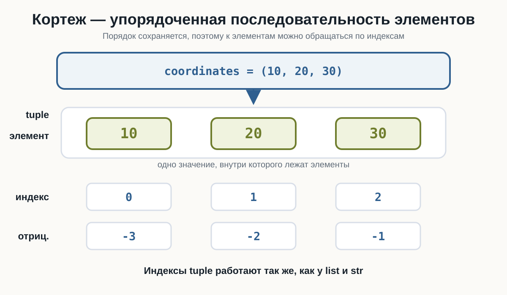
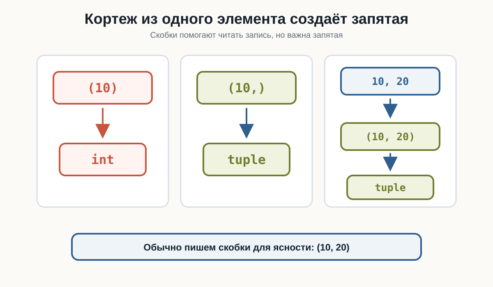
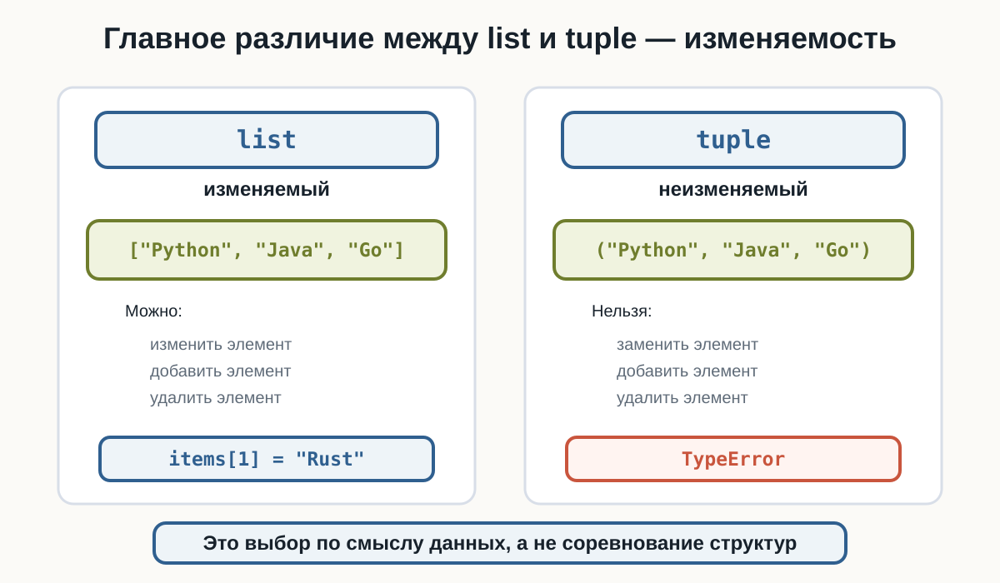
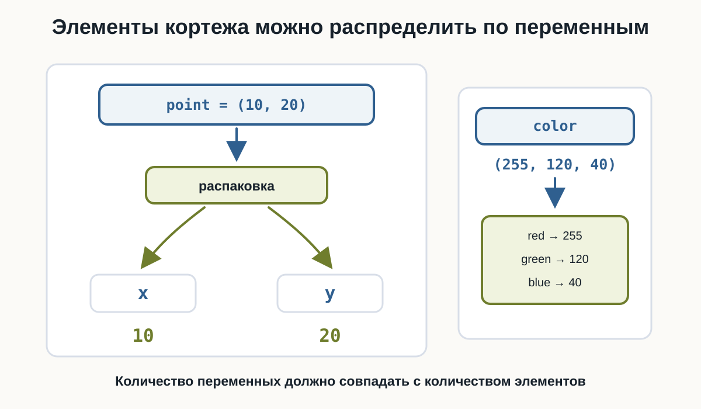
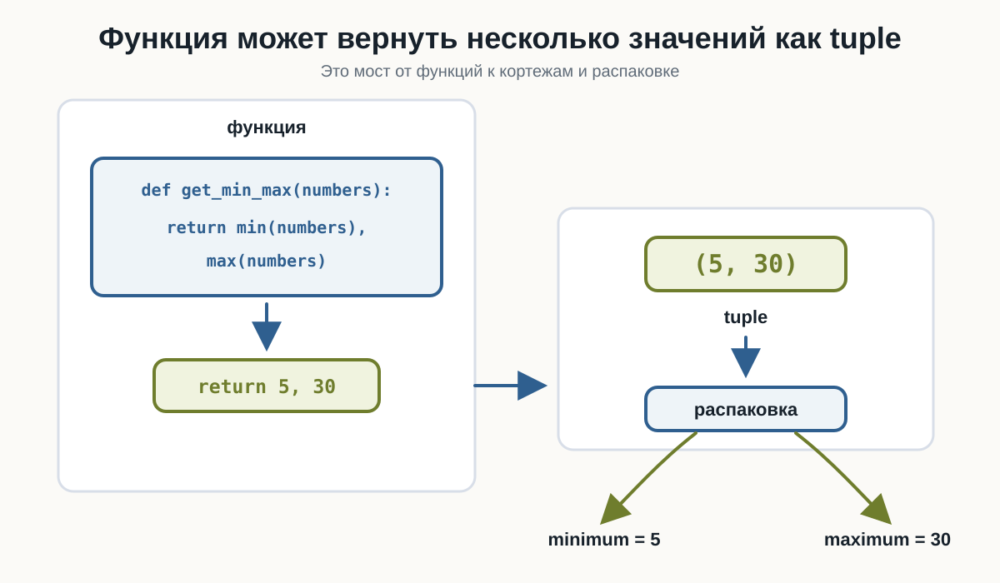

# 4.1 Кортежи {.unnumbered}

::: {.callout-important}
Главный вопрос главы:

**Как хранить несколько значений, которые после создания не должны изменяться?**
:::

В предыдущем томе мы познакомились со списками. Список хранит несколько значений и позволяет менять набор элементов:

```python
languages = ["Python", "Java", "Go"]

languages.append("Rust")
languages[1] = "C++"
```

Но иногда набор значений должен оставаться фиксированным после создания.

Например:

```text
координаты точки
цвет в формате RGB
дата
размер изображения
набор фиксированных настроек
```

Для таких случаев в Python есть **кортеж**.

---

## Первый кортеж

Кортеж обычно записывают в круглых скобках:

```python
coordinates = (10, 20)

print(coordinates)
print(type(coordinates))
```

Результат:

```text
(10, 20)
<class 'tuple'>
```

Внутри два значения, но вся конструкция целиком — одно значение типа `tuple`.

:::: {.content-visible when-format="html"}
::: {.python-playground data-source="../examples/chapter21/tuple-basics.py" data-title="Первые кортежи"}
:::
::::

:::: {.content-visible when-format="pdf"}
```{.python filename="tuple-basics.py"}

```
::::

---

## Элементы кортежа

Как и список, кортеж содержит элементы в определённом порядке.

Например:

```python
point = (10, 20, 30)
```

Здесь три элемента: `10`, `20` и `30`. Все они принадлежат одному значению `point`.

{fig-alt="Кортеж coordinates показан как один контейнер с тремя элементами 10, 20 и 30. Под элементами находятся положительные индексы 0, 1, 2 и отрицательные индексы -3, -2, -1. Схема подчёркивает, что кортеж — упорядоченная последовательность элементов."}

---

## Кортеж похож на список

Список и кортеж во многом ведут себя одинаково:

```python
numbers_list = [10, 20, 30]
numbers_tuple = (10, 20, 30)
```

Обе структуры сохраняют порядок, поддерживают индексы, `len()`, срезы, перебор через `for` и проверку через `in`.

Главное различие:

```text
list  → изменяемый

tuple → неизменяемый
```

Кортеж, как и список, может хранить значения разных типов:

```python
user = ("Анна", 25, 1.68, True)

print(user)
```

Но чаще кортеж используют для небольшой фиксированной группы связанных значений: координат, RGB-цвета, размера изображения.

---

## Пустой кортеж

Кортеж может быть пустым:

```python
items = ()
```

Проверим:

```python
items = ()

print(items)
print(type(items))
print(len(items))
```

Результат:

```text
()
<class 'tuple'>
0
```

---

## Кортеж из одного элемента

У кортежа из одного элемента есть важная особенность:

```python
value = (10)

print(type(value))
```

Результат:

```text
<class 'int'>
```

Круглые скобки сами по себе могут просто группировать выражение. Для кортежа из одного элемента нужна запятая:

```python
value = (10,)

print(value)
print(type(value))
```

Результат:

```text
(10,)
<class 'tuple'>
```

Главная разница:

```text
(10)  → int

(10,) → tuple
```

::: {.callout-warning title="Не забывайте запятую"}

Кортежи обычно записывают в круглых скобках, а важную роль в синтаксисе кортежа играет запятая.
:::

---

## Скобки помогают читать код

Технически кортеж можно записать и без круглых скобок:

```python
point = 10, 20
```

Проверим:

```python
point = 10, 20

print(point)
print(type(point))
```

Результат:

```text
(10, 20)
<class 'tuple'>
```

Но в учебном коде чаще будем использовать:

```python
point = (10, 20)
```

Так структура заметнее, и читателю проще увидеть, что это единая группа значений.

:::: {.content-visible when-format="html"}
::: {.python-playground data-source="../examples/chapter21/single-element-tuple.py" data-title="Кортеж из одного элемента"}
:::
::::

:::: {.content-visible when-format="pdf"}
```{.python filename="single-element-tuple.py"}

```
::::

{fig-alt="Схема показывает, что запись (10) даёт значение типа int, запись (10,) даёт tuple, а запись 10, 20 тоже создаёт tuple. Главная мысль: для кортежа из одного элемента нужна запятая."}

---

## Индексы кортежа

Индексы кортежа работают так же, как индексы строки и списка.

Рассмотрим:

```python
languages = ("Python", "Java", "Go")
```

Положительные индексы начинаются с `0`, отрицательные идут с конца:

```text
элемент:   Python   Java   Go
индекс:      0       1     2
отриц.:     -3      -2    -1
```

Пример:

```python
languages = ("Python", "Java", "Go")

print(languages[0])
print(languages[1])
print(languages[-1])
print(languages[-2])
```

Результат:

```text
Python
Java
Go
Java
```

:::: {.content-visible when-format="html"}
::: {.python-playground data-source="../examples/chapter21/tuple-indexing.py" data-title="Индексы кортежа"}
:::
::::

:::: {.content-visible when-format="pdf"}
```{.python filename="tuple-indexing.py"}

```
::::

---

## Ошибка индекса

Если обратиться к несуществующей позиции:

```python
languages = ("Python", "Java", "Go")

print(languages[10])
```

Python сообщит:

```text
IndexError
```

Причина та же, что со строками и списками: элемента с таким индексом нет.

---

## Длина кортежа

Количество элементов возвращает `len()`:

```python
languages = ("Python", "Java", "Go")

print(len(languages))
print(len(()))
```

Результат:

```text
3
0
```

---

## Срезы кортежей

Кортеж поддерживает срезы в формате `[start:stop:step]`. Граница `stop` не включается:

```python
numbers = (10, 20, 30, 40, 50)

print(numbers[1:4])
print(numbers[:3])
print(numbers[2:])
print(numbers[-2:])
print(numbers[::2])
print(numbers[::-1])
```

Результат:

```text
(20, 30, 40)
(10, 20, 30)
(30, 40, 50)
(40, 50)
(10, 30, 50)
(50, 40, 30, 20, 10)
```

Срез кортежа возвращает новый кортеж. Исходный кортеж не изменяется.

:::: {.content-visible when-format="html"}
::: {.python-playground data-source="../examples/chapter21/tuple-slicing.py" data-title="Срезы кортежа"}
:::
::::

:::: {.content-visible when-format="pdf"}
```{.python filename="tuple-slicing.py"}

```
::::

---

## Перебор и проверка

Кортеж можно перебирать через `for` и проверять через `in` / `not in`:

```python
languages = ("Python", "Java", "Go")

for language in languages:
    print(language)

print("Python" in languages)
print("Rust" not in languages)
```

:::: {.content-visible when-format="html"}
::: {.python-playground data-source="../examples/chapter21/tuple-iteration.py" data-title="Перебор и проверка кортежа"}
:::
::::

:::: {.content-visible when-format="pdf"}
```{.python filename="tuple-iteration.py"}

```
::::

---

## Кортеж нельзя изменить

Рассмотрим список:

```python
languages = ["Python", "Java", "Go"]

languages[1] = "Rust"

print(languages)
```

Результат:

```text
['Python', 'Rust', 'Go']
```

Со списком это работает.

С кортежем та же операция приведёт к ошибке:

```python
languages = ("Python", "Java", "Go")

languages[1] = "Rust"
```

Python сообщит об ошибке:

```text
TypeError
```

Кортеж **неизменяемый**.

:::: {.content-visible when-format="pdf"}
```{.python filename="tuple-immutability.py"}

```
::::

---

## Что означает неизменяемость

После создания кортежа нельзя заменить, добавить или удалить отдельный элемент.

Например, не работает:

```python
point[0] = 100
```

::: {.callout-important title="Кортеж неизменяемый"}

После создания:

```python
point = (10, 20)
```

нельзя изменить отдельный элемент:

```python
point[0] = 100
```

Если нужны другие значения, создаётся новый кортеж.
:::

{fig-alt="Слева показан list с элементами Python, Java и Go: элемент можно заменить, добавить или удалить. Справа показан tuple с теми же элементами: отдельный элемент нельзя заменить, добавить или удалить. Схема объясняет, что главное различие между list и tuple — изменяемость."}

---

## Можно создать новый кортеж

Неизменяемость не означает, что имя переменной навсегда связано с одним значением:

```python
point = (10, 20)

point = (100, 200)

print(point)
```

Результат:

```text
(100, 200)
```

Здесь старый кортеж не изменился. Переменная `point` просто получила новое значение.

---

## Объединение кортежей

Кортежи можно объединять через `+`:

```python
first = (1, 2)
second = (3, 4)

result = first + second

print(result)
```

Результат:

```text
(1, 2, 3, 4)
```

Исходные кортежи не изменяются. Создаётся новый кортеж.

---

## Повторение кортежа

Оператор `*` повторяет содержимое и тоже создаёт новый кортеж:

```python
values = (1, 2)

print(values * 3)
```

Результат:

```text
(1, 2, 1, 2, 1, 2)
```

---

## count()

Метод `count()` считает количество совпадений:

```python
numbers = (10, 20, 10, 30, 10)

print(numbers.count(10))
```

Результат:

```text
3
```

---

## index()

Метод `index()` возвращает индекс первого совпадения:

```python
languages = ("Python", "Java", "Go")

print(languages.index("Java"))
```

Результат:

```text
1
```

Если значения нет, возникнет:

```text
ValueError
```

---

## Почему у кортежа мало методов

У списка есть методы для изменения: `append()`, `insert()`, `remove()`, `pop()`, `sort()`. У кортежа таких методов нет, потому что он неизменяемый.

Основные методы кортежа всего два:

```python
count()
index()
```

---

## List и tuple

Соберём главное различие:

| Свойство | `list` | `tuple` |
|---|---|---|
| Синтаксис | `[1, 2, 3]` | `(1, 2, 3)` |
| Индексы | да | да |
| Отрицательные индексы | да | да |
| `len()` | да | да |
| Срезы | да | да |
| `for` | да | да |
| `in` | да | да |
| Изменение элемента | да | нет |
| `append()` | да | нет |
| `remove()` | да | нет |

Используйте `list`, когда набор должен изменяться:

```python
tasks = ["Учить Python", "Сделать проект"]
tasks.append("Прочитать документацию")
```

Используйте `tuple`, когда значения образуют фиксированную группу:

```python
point = (10, 20)
color = (255, 120, 40)
size = (1920, 1080)
```

::: {.callout-tip title="Выбирайте структуру по смыслу"}

Не нужно заменять все списки кортежами. `list` и `tuple` решают разные задачи.
:::

---

## Распаковка кортежа

Кортеж можно разложить по нескольким переменным:

```python
point = (10, 20)

x, y = point

print(x)
print(y)
```

Результат:

```text
10
20
```

Это называется **распаковкой**:

```text
(10, 20)
   ↓
 x    y
 ↓    ↓
10   20
```

---

Порядок важен: первый элемент попадает в первую переменную, второй — во вторую.

:::: {.content-visible when-format="html"}
::: {.python-playground data-source="../examples/chapter21/tuple-unpacking.py" data-title="Распаковка кортежа"}
:::
::::

:::: {.content-visible when-format="pdf"}
```{.python filename="tuple-unpacking.py"}

```
::::

{fig-alt="Кортеж point со значениями 10 и 20 распаковывается в переменные x и y. Рядом кортеж color со значениями 255, 120 и 40 распаковывается в переменные red, green и blue."}

---

## Распаковка трёх значений

Например:

```python
color = (255, 120, 40)

red, green, blue = color

print(red)
print(green)
print(blue)
```

Результат:

```text
255
120
40
```

Здесь:

```text
255 → red
120 → green
40  → blue
```

---

## Количество переменных должно совпадать

При простой распаковке количество переменных должно совпадать с количеством элементов:

```python
point = (10, 20)
x, y, z = point
```

Python сообщит:

```text
ValueError
```

::: {.callout-warning title="Следите за количеством значений"}

При простой распаковке:

```python
x, y = (10, 20)
```

количество переменных должно соответствовать количеству элементов.

```text
2 элемента
↓
2 переменные
```
:::

---

## Кортеж можно распаковать сразу

Отдельная переменная для кортежа не обязательна:

```python
x, y = (10, 20)

print(x)
print(y)
```

Результат:

```text
10
20
```

Можно встретить и запись без скобок:

```python
x, y = 10, 20
```

Результат тот же: несколько значений распределяются по нескольким переменным.

---

## Обмен значений переменных

Распаковка позволяет удобно поменять значения местами:

```python
a = 10
b = 20

a, b = b, a

print(a)
print(b)
```

Результат:

```text
20
10
```

:::: {.content-visible when-format="html"}
::: {.python-playground data-source="../examples/chapter21/swap-values.py" data-title="Обмен значений переменных"}
:::
::::

:::: {.content-visible when-format="pdf"}
```{.python filename="swap-values.py"}

```
::::

---

## Функция может вернуть несколько значений

В предыдущей главе мы изучили функции. Если функция возвращает несколько значений через запятую, Python собирает их в кортеж:

```python
def get_point():
    return 10, 20
```

Вызов:

```python
point = get_point()

print(point)
print(type(point))
```

Результат:

```text
(10, 20)
<class 'tuple'>
```

Результат функции можно сразу распаковать:

```python
def get_point():
    return 10, 20


x, y = get_point()

print(x)
print(y)
```

Результат:

```text
10
20
```

Получается цепочка:

```text
функция
   ↓
return 10, 20
   ↓
(10, 20)
   ↓
распаковка
   ↓
x = 10
y = 20
```

Так функции и кортежи хорошо работают вместе.

{fig-alt="Функция get_min_max возвращает min(numbers), max(numbers). Python получает tuple (5, 30), затем результат распаковывается в переменные minimum и maximum."}

---

## Пример: минимальное и максимальное значение

Функция может вернуть два связанных результата:

```python
def get_min_max(numbers):
    return min(numbers), max(numbers)


numbers = [12, 5, 30, 8]

minimum, maximum = get_min_max(numbers)

print("Минимум:", minimum)
print("Максимум:", maximum)
```

Результат:

```text
Минимум: 5
Максимум: 30
```

:::: {.content-visible when-format="html"}
::: {.python-playground data-source="../examples/chapter21/function-return-tuple.py" data-title="Функция возвращает tuple"}
:::
::::

:::: {.content-visible when-format="pdf"}
```{.python filename="function-return-tuple.py"}

```
::::

---

## Кортежи внутри списка

Кортежи можно хранить внутри списка:

```python
points = [
    (10, 20),
    (30, 40),
    (50, 60)
]
```

Здесь `points` — изменяемый список точек, а каждая точка — фиксированный кортеж координат.

---

## Перебор списка кортежей

Можно вывести каждую точку целиком:

```python
points = [
    (10, 20),
    (30, 40),
    (50, 60)
]

for point in points:
    print(point)
```

Результат:

```text
(10, 20)
(30, 40)
(50, 60)
```

---

## Распаковка прямо в for

Или сразу распаковать каждую точку в цикле:

```python
points = [
    (10, 20),
    (30, 40),
    (50, 60)
]

for x, y in points:
    print("x:", x, "y:", y)
```

Результат:

```text
x: 10 y: 20
x: 30 y: 40
x: 50 y: 60
```

На каждой итерации очередной кортеж распаковывается в `x` и `y`.

:::: {.content-visible when-format="html"}
::: {.python-playground data-source="../examples/chapter21/points-list.py" data-title="Список кортежей"}
:::
::::

:::: {.content-visible when-format="pdf"}
```{.python filename="points-list.py"}

```
::::

---

## Где list и tuple работают вместе

Частый вариант: список хранит изменяемый набор объектов, а кортеж описывает один фиксированный объект.

```python
points = [
    (2, 5),
    (10, 3),
    (7, 8)
]

for x, y in points:
    print("Координаты:", x, y)
```

Ещё пример:

```python
resolutions = [
    (1920, 1080),
    (2560, 1440),
    (3840, 2160)
]

for width, height in resolutions:
    print(width, "x", height)
```

Смысл тот же: `list` хранит набор, который может расти или уменьшаться, а `tuple` хранит фиксированную пару значений.

---

## bool кортежа

Как и другие коллекции, пустой кортеж:

```python
()
```

считается ложным значением:

```python
print(bool(()))
```

Результат:

```text
False
```

Непустой:

```python
print(bool((10, 20)))
```

Результат:

```text
True
```

Поэтому можно встретить:

```python
if coordinates:
    print("Координаты заданы")
```

---

## Итоговый ориентир

```text
Будут ли элементы набора изменяться?
          ↓
      да      нет
      ↓        ↓
    list     tuple
```

Это не жёсткое правило на все случаи. Главное — понимать смысл данных и выбирать структуру осознанно.

:::: {.content-visible when-format="html"}
::: {.python-playground data-source="../examples/chapter21/tuple-analysis.py" data-title="Итоговый пример: анализ чисел"}
:::
::::

:::: {.content-visible when-format="pdf"}
```{.python filename="tuple-analysis.py"}

```
::::

---

## Попробуйте сами

::: {.callout-tip title="Эксперимент"}

Создайте:

```python
values = (10, 20, 30, 40, 50)
```

Перед запуском предскажите результаты:

```python
print(values[0])
print(values[-1])
print(values[1:4])
print(len(values))
print(30 in values)
```

Затем попробуйте:

```python
values[0] = 100
```

и посмотрите, какую ошибку сообщит Python.

После этого сравните тот же эксперимент со списком:

```python
values = [10, 20, 30, 40, 50]
values[0] = 100
```

Обратите внимание на различие между `tuple` и `list`.
:::

---

## Что важно запомнить

Кортеж имеет тип:

```text
tuple
```

Пример:

```python
point = (10, 20)
```

Он хранит несколько элементов:

```text
(10, 20)
```

Поддерживает индексы:

```python
point[0]
point[-1]
```

Длину:

```python
len(point)
```

Срезы:

```python
point[start:stop:step]
```

Перебор:

```python
for value in values:
    ...
```

Проверку:

```python
value in values
value not in values
```

Основные методы:

```python
count()
index()
```

Главное отличие:

```text
list
→ изменяемый

tuple
→ неизменяемый
```

Особый случай:

```text
(10)  → int
(10,) → tuple
```

Кортеж можно распаковать:

```python
x, y = (10, 20)
```

Функция также может вернуть несколько значений:

```python
def get_point():
    return 10, 20
```

И самое важное:

> **Кортеж удобно использовать для фиксированной упорядоченной группы связанных значений.**

---

### Практические задания

**Задание 1. Первый кортеж**

Создайте кортеж:

```text
Python
Java
Go
```

Выведите его и его тип.

::: {.callout-note title="Ответ" collapse="true"}

```python
languages = ("Python", "Java", "Go")

print(languages)
print(type(languages))
```

Результат:

```text
('Python', 'Java', 'Go')
<class 'tuple'>
```

:::

---

**Задание 2. Первый и последний элемент**

Дан:

```python
numbers = (10, 20, 30, 40)
```

Выведите первый и последний элементы.

::: {.callout-note title="Ответ" collapse="true"}

```python
numbers = (10, 20, 30, 40)

print(numbers[0])
print(numbers[-1])
```

Результат:

```text
10
40
```

:::

---

**Задание 3. Длина кортежа**

Дан:

```python
cities = ("Москва", "Казань", "Самара", "Омск")
```

Выведите количество элементов.

::: {.callout-note title="Ответ" collapse="true"}

```python
cities = ("Москва", "Казань", "Самара", "Омск")

print(len(cities))
```

Результат:

```text
4
```

:::

---

**Задание 4. Кортеж из одного элемента**

Как создать кортеж, содержащий только:

```text
Python
```

Проверьте результат через `type()`.

::: {.callout-note title="Ответ" collapse="true"}

```python
language = ("Python",)

print(language)
print(type(language))
```

Важно оставить запятую:

```python
("Python",)
```

Без неё:

```python
("Python")
```

получится обычная строка.

:::

---

**Задание 5. Срез**

Дан:

```python
numbers = (10, 20, 30, 40, 50)
```

Получите:

```text
(20, 30, 40)
```

с помощью среза.

::: {.callout-note title="Ответ" collapse="true"}

```python
numbers = (10, 20, 30, 40, 50)

print(numbers[1:4])
```

:::

---

**Задание 6. Проверка элемента**

Дан:

```python
languages = ("Python", "Java", "Go")
```

Попросите пользователя ввести язык и проверьте, содержится ли он в кортеже.

::: {.callout-note title="Ответ" collapse="true"}

```python
languages = ("Python", "Java", "Go")

language = input("Введите язык: ")

if language in languages:
    print("Язык найден")
else:
    print("Языка нет")
```

:::

---

**Задание 7. Перебор кортежа**

Дан:

```python
colors = ("red", "green", "blue")
```

Выведите каждый элемент на отдельной строке.

::: {.callout-note title="Ответ" collapse="true"}

```python
colors = ("red", "green", "blue")

for color in colors:
    print(color)
```

:::

---

**Задание 8. Найдите ошибку**

Почему этот код не работает?

```python
point = (10, 20)

point[0] = 100
```

::: {.callout-note title="Ответ" collapse="true"}

Кортежи неизменяемые.

После создания нельзя изменить отдельный элемент:

```python
point[0] = 100
```

Python сообщит:

```text
TypeError
```

Если нужны новые координаты, можно создать новый кортеж:

```python
point = (100, 20)
```

:::

---

**Задание 9. Распаковка**

Дан:

```python
point = (15, 25)
```

Распакуйте его в переменные:

```python
x
y
```

и выведите их.

::: {.callout-note title="Ответ" collapse="true"}

```python
point = (15, 25)

x, y = point

print("x:", x)
print("y:", y)
```

Результат:

```text
x: 15
y: 25
```

:::

---

**Задание 10. RGB**

Дан цвет:

```python
color = (255, 128, 64)
```

Распакуйте его в:

```python
red
green
blue
```

::: {.callout-note title="Ответ" collapse="true"}

```python
color = (255, 128, 64)

red, green, blue = color

print("Red:", red)
print("Green:", green)
print("Blue:", blue)
```

:::

---

**Задание 11. count()**

Дан:

```python
numbers = (10, 20, 10, 30, 10, 40)
```

Определите, сколько раз встречается число `10`.

::: {.callout-note title="Ответ" collapse="true"}

```python
numbers = (10, 20, 10, 30, 10, 40)

print(numbers.count(10))
```

Результат:

```text
3
```

:::

---

**Задание 12. index()**

Дан:

```python
languages = ("Python", "Java", "Go", "Rust")
```

Найдите индекс:

```text
Go
```

::: {.callout-note title="Ответ" collapse="true"}

```python
languages = ("Python", "Java", "Go", "Rust")

print(languages.index("Go"))
```

Результат:

```text
2
```

:::

---

**Задание 13. Функция с двумя результатами**

Создайте функцию:

```python
get_min_max(numbers)
```

которая возвращает минимальное и максимальное значения списка.

Затем распакуйте результат в две переменные.

::: {.callout-note title="Ответ" collapse="true"}

```python
def get_min_max(numbers):
    return min(numbers), max(numbers)


numbers = [12, 5, 30, 8]

minimum, maximum = get_min_max(numbers)

print("Минимум:", minimum)
print("Максимум:", maximum)
```

Результат:

```text
Минимум: 5
Максимум: 30
```

Функция возвращает:

```python
(5, 30)
```

который затем распаковывается.

:::

---

**Задание 14. Список координат**

Дан список:

```python
points = [
    (10, 20),
    (30, 40),
    (50, 60)
]
```

С помощью распаковки внутри `for` выведите:

```text
x = 10, y = 20
x = 30, y = 40
x = 50, y = 60
```

::: {.callout-note title="Ответ" collapse="true"}

```python
points = [
    (10, 20),
    (30, 40),
    (50, 60)
]

for x, y in points:
    print("x =", x, ", y =", y)
```

На каждой итерации очередной кортеж:

```python
(x, y)
```

распаковывается в две переменные.

:::

---

**Задание 15. List или tuple?**

Выберите подходящую структуру для каждого случая:

1. список покупок;
2. координаты точки `(x, y)`;
3. список текущих задач;
4. размер экрана `(width, height)`;
5. список пользователей.

::: {.callout-note title="Ответ" collapse="true"}

Один из разумных вариантов:

```text
список покупок
→ list

координаты точки
→ tuple

список задач
→ list

размер экрана
→ tuple

список пользователей
→ list
```

Причина:

```text
list
→ набор предполагается изменять

tuple
→ фиксированная группа связанных значений
```

Это не абсолютное правило для всех программ, но хороший ориентир на текущем этапе.

:::

---

**Задание 16. Задача со звёздочкой**

Создайте функцию:

```python
analyze_numbers(numbers)
```

которая получает список чисел и возвращает кортеж:

```text
(минимум, максимум, среднее)
```

Затем распакуйте результат.

Например:

```python
numbers = [10, 20, 30]
```

должно дать:

```text
Минимум: 10
Максимум: 30
Среднее: 20.0
```

::: {.callout-note title="Ответ" collapse="true"}

```python
def analyze_numbers(numbers):
    minimum = min(numbers)
    maximum = max(numbers)
    average = sum(numbers) / len(numbers)

    return minimum, maximum, average


numbers = [10, 20, 30]

minimum, maximum, average = analyze_numbers(numbers)

print("Минимум:", minimum)
print("Максимум:", maximum)
print("Среднее:", average)
```

Функция возвращает три значения:

```python
return minimum, maximum, average
```

Python объединяет их в кортеж:

```text
(10, 30, 20.0)
```

После чего результат распаковывается в три переменные.

:::

---

## Что дальше?

Кортеж помогает хранить несколько значений в определённом порядке:

```python
color = (255, 120, 40)
```

Причём этот набор после создания не изменяется.

Но иногда порядок вообще не важен.

Вместо этого нужно другое свойство:

```text
каждое значение должно встречаться только один раз
```

Например:

```text
уникальные теги
уникальные категории
уникальные посетители
уникальные значения из списка
```

Для таких задач Python предоставляет ещё одну структуру данных — **множество**.

В следующей главе познакомимся с типом:

```python
set
```

и узнаем, как Python работает с уникальными значениями.
