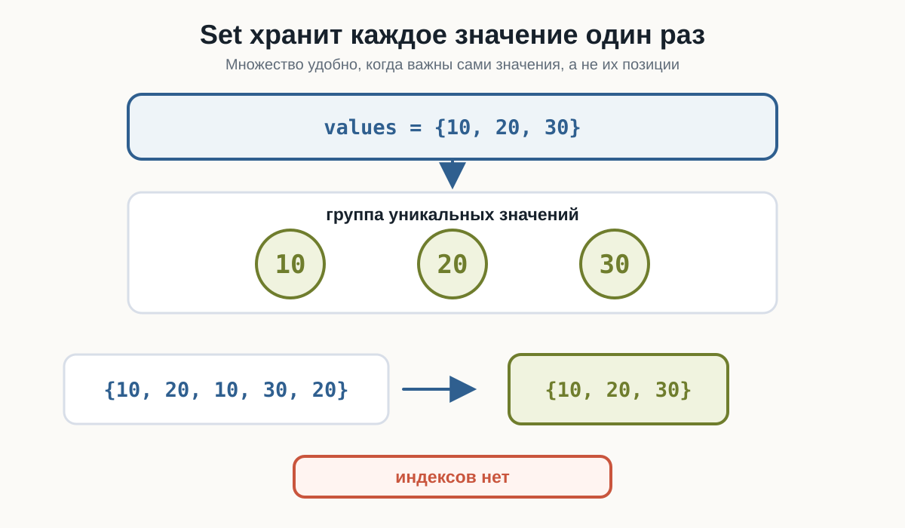
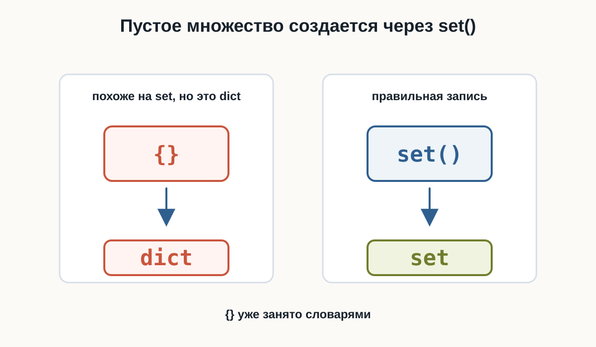
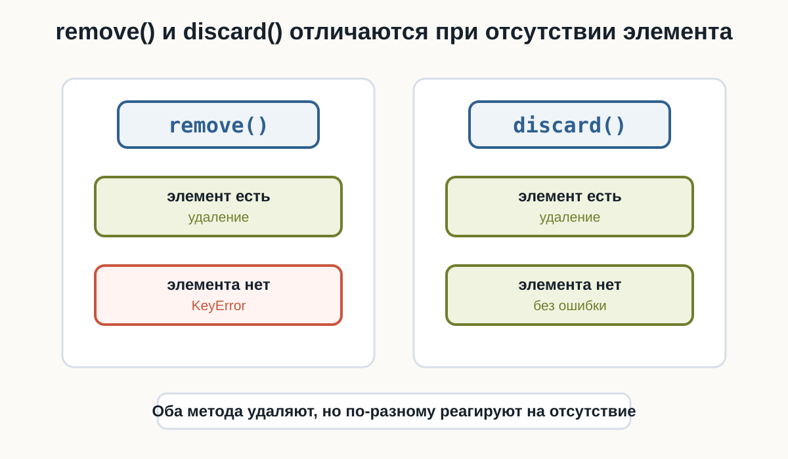
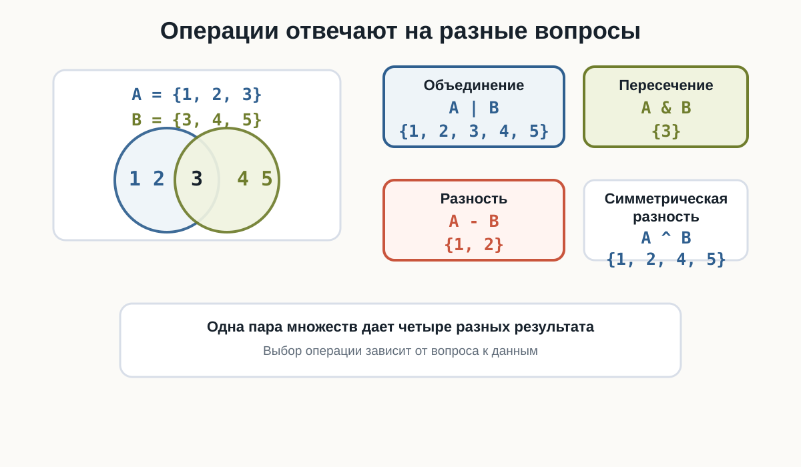
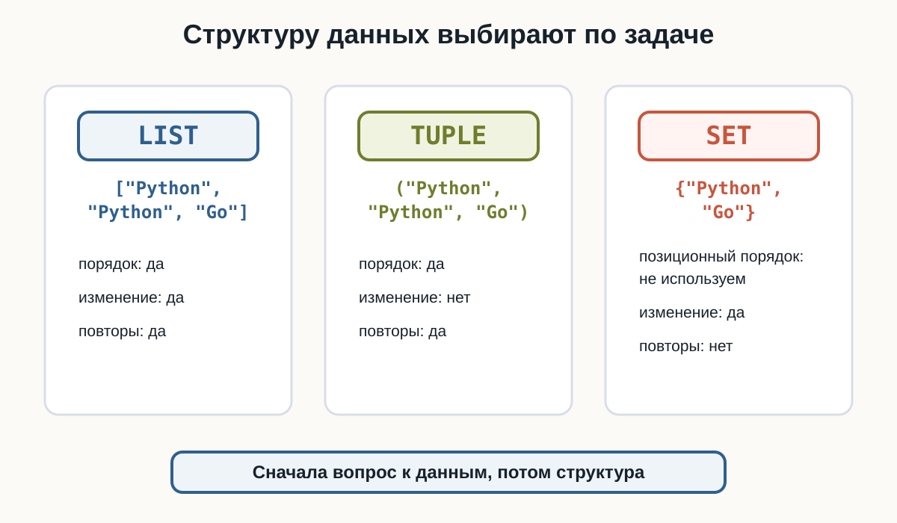

---
pagetitle: "Множества в Python: set, уникальные значения и операции"
description: "Множества (set) в Python: создание, удаление дубликатов, add, remove, discard, объединение, пересечение, разность и практические примеры."
keywords:
  - Python множества
  - set Python
  - множества Python для начинающих
  - уникальные значения Python
  - удалить дубликаты Python
  - union Python
  - intersection Python
  - difference Python
---

# 4.2 Множества {.unnumbered}

::: {.callout-important}
Главный вопрос главы:

**Как хранить уникальные значения и выполнять операции над группами данных?**
:::

В предыдущей главе мы познакомились с кортежами:

```python
point = (10, 20)
```

Кортеж сохраняет порядок элементов и подходит для фиксированного набора значений.

Теперь рассмотрим другую задачу.

Представим список языков:

```python
languages = ["Python", "Java", "Python", "Go", "Java"]
```

Некоторые значения повторяются.

Если нас интересует только то, **какие языки присутствуют**, а количество повторений не имеет значения, удобно использовать множество:

```python
languages = {"Python", "Java", "Go"}
```

В Python множества имеют тип `set`.

---

## Что такое множество

Множество — коллекция уникальных элементов.

Создадим первое множество:

```python
languages = {"Python", "Java", "Go"}

print(languages)
print(type(languages))
```

Тип:

```text
<class 'set'>
```

Главное свойство видно на примере:

```python
numbers = {10, 20, 10, 30, 20}

print(numbers)
```

В множестве останутся только уникальные значения:

```text
10
20
30
```

Повторные `10` и `20` не создают дополнительные элементы.

{fig-alt="Множество values содержит уникальные значения 10, 20 и 30. Набор с повторами 10, 20, 10, 30, 20 превращается в 10, 20, 30. Отдельно подчеркнуто, что у set нет индексов."}

::: {.callout-note title="Порядок элементов"}

Не следует рассчитывать на определённый порядок элементов `set`.

Например, множество:

```python
{"Python", "Java", "Go"}
```

при выводе может отображаться не в том порядке, в котором значения были записаны.

Если порядок данных важен, нужно выбрать другую структуру.
:::

---

## Создание множества

Множество с элементами можно создать с помощью фигурных скобок:

```python
numbers = {10, 20, 30}
```

Строки:

```python
languages = {"Python", "Java", "Go"}
```

Логические значения:

```python
answers = {True, False}
```

В одном `set` технически могут находиться значения разных типов:

```python
values = {10, "Python", True}
```

Но на практике понятнее, когда множество представляет одну группу однородных по смыслу данных.

---

## Пустое множество

Здесь есть важная особенность.

Такая запись:

```python
items = {}
```

**не создаёт множество**.

Проверим:

```python
items = {}

print(type(items))
```

Результат:

```text
<class 'dict'>
```

С фигурными скобками без элементов Python создаёт словарь.

Для пустого множества используется:

```python
items = set()
```

Проверим:

```python
items = set()

print(items)
print(type(items))
```

Результат:

```text
set()
<class 'set'>
```

::: {.callout-warning title="Не путайте {} и set()"}

```python
{}
```

— пустой словарь.

```python
set()
```

— пустое множество.

Это различие важно запомнить.
:::

:::: {.content-visible when-format="html"}
::: {.python-playground data-source="../examples/chapter22/empty-set.py" data-title="Пустое множество"}
:::
::::

:::: {.content-visible when-format="pdf"}
```{.python filename="empty-set.py"}

```
::::

{fig-alt="Сравнение показывает, что запись фигурные скобки без элементов создает dict, а set() создает пустое множество set."}

---

## Создание set из другой коллекции

Функция `set()` умеет принимать другую коллекцию.

Например, список:

```python
numbers = [10, 20, 10, 30, 20]

unique_numbers = set(numbers)

print(unique_numbers)
```

Повторения исчезнут.

То же можно сделать со строками:

```python
letters = set("banana")

print(letters)
```

В результате множество будет содержать уникальные символы строки.

Это один из самых распространённых способов применения `set`: получить уникальные значения из существующих данных.

:::: {.content-visible when-format="html"}
::: {.python-playground data-source="../examples/chapter22/remove-duplicates.py" data-title="Удаление дубликатов"}
:::
::::

:::: {.content-visible when-format="pdf"}
```{.python filename="remove-duplicates.py"}

```
::::

---

## Сколько уникальных значений

После преобразования можно использовать `len()`:

```python
cities = ["Москва", "Казань", "Москва", "Омск", "Казань"]

unique_cities = set(cities)

print(len(unique_cities))
```

Результат:

```text
3
```

Таким способом можно узнать количество **различных** значений.

---

## Проверка элемента

Множества хорошо подходят для проверки наличия значения.

Используется уже знакомый оператор `in`:

```python
allowed_roles = {"admin", "editor", "moderator"}

print("admin" in allowed_roles)
print("guest" in allowed_roles)
```

Результат:

```text
True
False
```

Можно использовать условие:

```python
role = "editor"

if role in allowed_roles:
    print("Роль разрешена")
```

Для проверки отсутствия используется `not in`:

```python
if "guest" not in allowed_roles:
    print("Такой роли нет")
```

:::: {.content-visible when-format="html"}
::: {.python-playground data-source="../examples/chapter22/set-membership.py" data-title="Проверка элемента в set"}
:::
::::

:::: {.content-visible when-format="pdf"}
```{.python filename="set-membership.py"}

```
::::

---

## У множества нет индексов

У списка можно получить элемент по позиции:

```python
languages = ["Python", "Java", "Go"]

print(languages[0])
```

У множества такой операции нет:

```python
languages = {"Python", "Java", "Go"}

print(languages[0])
```

Этот код приведёт к:

```text
TypeError
```

Причина проста: `set` не предназначен для работы с позициями элементов.

Поэтому для множества нет смысла спрашивать:

```text
какой элемент первый?
какой элемент последний?
что находится по индексу 2?
```

Если такая информация нужна, `set` — скорее всего, не та структура данных.

---

## Добавление элемента

Для добавления используется метод:

```python
add()
```

Например:

```python
skills = {"Python", "Git"}

skills.add("SQL")

print(skills)
```

Теперь множество содержит:

```text
Python
Git
SQL
```

Если добавить существующее значение:

```python
skills.add("Python")
```

второй `"Python"` не появится.

Это естественное следствие уникальности элементов `set`.

:::: {.content-visible when-format="html"}
::: {.python-playground data-source="../examples/chapter22/set-modification.py" data-title="Добавление элемента"}
:::
::::

:::: {.content-visible when-format="pdf"}
```{.python filename="set-modification.py"}

```
::::

---

## Удаление через remove()

Метод `remove()` удаляет указанное значение:

```python
blocked_users = {"alex", "maria", "john"}

blocked_users.remove("maria")

print(blocked_users)
```

Но есть важная деталь.

Если элемента нет:

```python
blocked_users.remove("anna")
```

возникнет:

```text
KeyError
```

Поэтому `remove()` удобно использовать, когда мы уверены, что значение присутствует.

---

## Удаление через discard()

Метод `discard()` тоже удаляет значение:

```python
blocked_users = {"alex", "maria", "john"}

blocked_users.discard("maria")
```

Главное отличие проявляется, если элемента нет:

```python
blocked_users.discard("anna")
```

Ошибки не будет.

Сравним:

| Метод | Элемент существует | Элемента нет |
|---|---|---|
| `remove()` | удаляет | `KeyError` |
| `discard()` | удаляет | ничего не происходит |

:::: {.content-visible when-format="html"}
::: {.python-playground data-source="../examples/chapter22/set-removal.py" data-title="remove() и discard()"}
:::
::::

:::: {.content-visible when-format="pdf"}
```{.python filename="set-removal.py"}

```
::::

{fig-alt="Слева remove удаляет существующий элемент, но для отсутствующего элемента приводит к KeyError. Справа discard удаляет существующий элемент, а при отсутствии элемента не вызывает ошибку."}

::: {.callout-tip title="remove() или discard()?"}

Используйте:

```python
remove()
```

если отсутствие элемента само по себе означает проблему.

Используйте:

```python
discard()
```

если нужно просто убедиться, что значения больше нет.
:::

---

## Метод pop()

У множества есть метод:

```python
pop()
```

Он удаляет и возвращает **произвольный элемент**:

```python
values = {"Python", "Java", "Go"}

removed = values.pop()

print("Удалено:", removed)
print(values)
```

Не следует использовать `pop()` в расчёте на удаление «первого» или «последнего» элемента.

У `set` нет такого позиционного смысла.

---

## Очистка множества

Чтобы удалить все элементы, используется:

```python
clear()
```

Например:

```python
active_filters = {"python", "junior", "remote"}

active_filters.clear()

print(active_filters)
```

Результат:

```text
set()
```

Сам объект множества остаётся, но становится пустым.

---

## Перебор множества

Множество можно перебирать циклом `for`:

```python
technologies = {"Python", "Docker", "Git"}

for technology in technologies:
    print(technology)
```

Каждый элемент будет обработан один раз.

Но порядок обхода не следует считать фиксированным.

Поэтому такой код подходит, когда важны сами элементы:

```text
Python
Docker
Git
```

а не их позиции.

---

## Объединение множеств

Теперь начинается одна из самых полезных возможностей `set`.

Есть две команды разработчиков:

```python
backend = {"Python", "PostgreSQL", "Docker"}
devops = {"Docker", "Linux", "Kubernetes"}
```

Нужно получить все технологии, встречающиеся хотя бы в одной команде.

Используем оператор:

```python
|
```

```python
all_technologies = backend | devops

print(all_technologies)
```

Получится множество примерно такого содержания:

```text
Python
PostgreSQL
Docker
Linux
Kubernetes
```

`Docker` встречался в обоих множествах, но в результате присутствует один раз.

Операция называется **объединением**.

То же самое можно записать:

```python
backend.union(devops)
```

:::: {.content-visible when-format="html"}
::: {.python-playground data-source="../examples/chapter22/set-union.py" data-title="Объединение множеств"}
:::
::::

:::: {.content-visible when-format="pdf"}
```{.python filename="set-union.py"}

```
::::

---

## Пересечение множеств

Теперь найдём технологии, которые используются **обеими** командами.

Оператор:

```python
&
```

Пример:

```python
backend = {"Python", "PostgreSQL", "Docker"}
devops = {"Docker", "Linux", "Kubernetes"}

common = backend & devops

print(common)
```

Результат:

```text
Docker
```

Это **пересечение** множеств.

Другой вариант записи:

```python
backend.intersection(devops)
```

Смысл:

```text
A & B
↓
значения, которые есть и в A, и в B
```

:::: {.content-visible when-format="html"}
::: {.python-playground data-source="../examples/chapter22/set-intersection.py" data-title="Пересечение множеств"}
:::
::::

:::: {.content-visible when-format="pdf"}
```{.python filename="set-intersection.py"}

```
::::

---

## Разность множеств

Иногда нужно узнать, какие значения присутствуют в одном множестве, но отсутствуют в другом.

Используется:

```python
-
```

Например:

```python
backend = {"Python", "PostgreSQL", "Docker"}
devops = {"Docker", "Linux", "Kubernetes"}

only_backend = backend - devops

print(only_backend)
```

В результате останутся:

```text
Python
PostgreSQL
```

`Docker` исключается, потому что присутствует и в `devops`.

То же самое:

```python
backend.difference(devops)
```

:::: {.content-visible when-format="html"}
::: {.python-playground data-source="../examples/chapter22/set-difference.py" data-title="Разность множеств"}
:::
::::

:::: {.content-visible when-format="pdf"}
```{.python filename="set-difference.py"}

```
::::

---

## Направление разности имеет значение

Сравним:

```python
backend - devops
```

и:

```python
devops - backend
```

Это разные вопросы.

Первый:

```text
Что есть в backend, но нет в devops?
```

Второй:

```text
Что есть в devops, но нет в backend?
```

Например:

```python
backend = {"Python", "PostgreSQL", "Docker"}
devops = {"Docker", "Linux", "Kubernetes"}

print(backend - devops)
print(devops - backend)
```

В первом результате будут `Python` и `PostgreSQL`, во втором — `Linux` и `Kubernetes`.

---

## Симметрическая разность

Есть ещё одна полезная операция:

```python
^
```

Она оставляет значения, которые встречаются только в одном из двух множеств.

```python
first = {"Python", "Git", "Docker"}
second = {"Python", "SQL", "Docker"}

difference = first ^ second

print(difference)
```

Общие значения:

```text
Python
Docker
```

не попадут в результат.

Останутся:

```text
Git
SQL
```

Эту операцию называют **симметрической разностью**.

На начальном этапе достаточно понимать её как:

> элементы, которые не являются общими.

:::: {.content-visible when-format="html"}
::: {.python-playground data-source="../examples/chapter22/set-symmetric-difference.py" data-title="Симметрическая разность"}
:::
::::

:::: {.content-visible when-format="pdf"}
```{.python filename="set-symmetric-difference.py"}

```
::::

---

## Четыре операции рядом

Пусть:

```python
a = {1, 2, 3}
b = {3, 4, 5}
```

Тогда:

```python
a | b
```

даёт все уникальные значения:

```text
{1, 2, 3, 4, 5}
```

```python
a & b
```

даёт общие:

```text
{3}
```

```python
a - b
```

даёт значения только из `a`:

```text
{1, 2}
```

```python
a ^ b
```

даёт значения, которые не являются общими:

```text
{1, 2, 4, 5}
```

Удобная памятка:

| Операция | Оператор | Вопрос |
|---|---|---|
| Объединение | `A \| B` | Что есть хотя бы в одном? |
| Пересечение | `A & B` | Что есть в обоих? |
| Разность | `A - B` | Что есть в A, но нет в B? |
| Симметрическая разность | `A ^ B` | Что не является общим? |

{fig-alt="Два множества A равно 1, 2, 3 и B равно 3, 4, 5 показаны как пересекающиеся области. Рядом приведены результаты операций A или B, A и B, A минус B и A симметрическая разность B."}

---

## Пример: интересы пользователей

Допустим, два пользователя выбрали интересующие их темы:

```python
anna = {"Python", "SQL", "Linux"}
maxim = {"Python", "Docker", "Git"}
```

Общие интересы:

```python
common = anna & maxim

print(common)
```

Получим:

```text
Python
```

Все темы двух пользователей:

```python
all_topics = anna | maxim
```

Темы Анны, которых нет у Максима:

```python
only_anna = anna - maxim
```

Одни и те же данные позволяют отвечать на разные вопросы с помощью операций над множествами.

---

## Пример: уникальные посетители

Представим, что система сохранила идентификаторы посещений:

```python
visits = [
    "user_17",
    "user_42",
    "user_17",
    "user_91",
    "user_42"
]
```

Количество записей:

```python
print(len(visits))
```

равно:

```text
5
```

Но пользователей меньше.

Получим уникальных посетителей:

```python
unique_users = set(visits)

print(len(unique_users))
```

Результат:

```text
3
```

Здесь `list` отвечает на вопрос:

```text
Сколько было записей о посещениях?
```

а `set`:

```text
Сколько разных пользователей посетили систему?
```

---

## Итоговый пример: студенты двух курсов

Множества удобно использовать, когда нужно сравнить две группы.

Например, есть студенты курса Python и курса SQL. По этим двум наборам можно найти общих студентов, всех уникальных студентов и тех, кто посещает только один курс.

:::: {.content-visible when-format="html"}
::: {.python-playground data-source="../examples/chapter22/set-analysis.py" data-title="Анализ двух курсов"}
:::
::::

:::: {.content-visible when-format="pdf"}
```{.python filename="set-analysis.py"}

```
::::

---

## Set, list и tuple

Теперь мы знаем три структуры для нескольких значений.

| Структура | Порядок | Можно изменять | Повторы |
|---|---|---|---|
| `list` | да | да | да |
| `tuple` | да | нет | да |
| `set` | не полагаемся на порядок | да | нет |

{fig-alt="Сравнение list, tuple и set. List сохраняет порядок, изменяется и допускает повторы. Tuple сохраняет порядок, не изменяется и допускает повторы. Set не использует позиционный порядок, изменяется и не допускает повторы."}

Выбор зависит от задачи.

Нужна изменяемая последовательность:

```python
tasks = ["Купить кофе", "Написать код"]
```

Используем:

```text
list
```

Нужна фиксированная группа:

```python
resolution = (1920, 1080)
```

Используем:

```text
tuple
```

Нужны уникальные значения:

```python
permissions = {"read", "write", "delete"}
```

Подходит:

```text
set
```

---

## Что важно запомнить

Множество имеет тип:

```python
set
```

Множество с данными:

```python
languages = {"Python", "Java", "Go"}
```

Пустое множество:

```python
languages = set()
```

`set` хранит уникальные элементы и не предоставляет доступ по индексу.

Основные операции изменения:

```python
values.add(item)
values.remove(item)
values.discard(item)
values.pop()
values.clear()
```

Проверка:

```python
item in values
item not in values
```

Основные операции между множествами:

```python
a | b
a & b
a - b
a ^ b
```

Они позволяют получать объединение, пересечение, разность и симметрическую разность.

---

### Практические задания

**Задание 1. Участники конференции**

После регистрации получился список:

```python
participants = [
    "Анна",
    "Иван",
    "Мария",
    "Анна",
    "Олег",
    "Иван",
    "София"
]
```

Определите:

- сколько всего регистраций;
- сколько уникальных участников.

::: {.callout-note title="Ответ" collapse="true"}

```python
participants = [
    "Анна",
    "Иван",
    "Мария",
    "Анна",
    "Олег",
    "Иван",
    "София"
]

unique_participants = set(participants)

print("Регистраций:", len(participants))
print("Участников:", len(unique_participants))
```

Результат:

```text
Регистраций: 7
Участников: 5
```

:::

---

**Задание 2. Доступ в лабораторию**

Разрешённые пропуска:

```python
allowed = {"A102", "B205", "C310", "D404"}
```

Попросите пользователя ввести номер пропуска и сообщите, разрешён ли доступ.

::: {.callout-note title="Ответ" collapse="true"}

```python
allowed = {"A102", "B205", "C310", "D404"}

card = input("Номер пропуска: ")

if card in allowed:
    print("Доступ разрешён")
else:
    print("Доступ запрещён")
```

:::

---

**Задание 3. Список стоп-слов**

Дано множество:

```python
stop_words = {"реклама", "спам", "акция"}
```

Добавьте слово `"скидка"`.

Удалите `"акция"` так, чтобы программа не завершилась ошибкой, даже если этого слова уже нет.

::: {.callout-note title="Ответ" collapse="true"}

```python
stop_words = {"реклама", "спам", "акция"}

stop_words.add("скидка")
stop_words.discard("акция")

print(stop_words)
```

Для удаления используется `discard()`, потому что отсутствие элемента не приводит к `KeyError`.

:::

---

**Задание 4. Два музыкальных плейлиста**

Есть любимые жанры двух пользователей:

```python
user_1 = {"rock", "jazz", "blues", "electronic"}
user_2 = {"jazz", "hip-hop", "electronic", "classical"}
```

Найдите жанры, которые нравятся обоим.

::: {.callout-note title="Ответ" collapse="true"}

```python
user_1 = {"rock", "jazz", "blues", "electronic"}
user_2 = {"jazz", "hip-hop", "electronic", "classical"}

common = user_1 & user_2

print(common)
```

В результате останутся:

```text
jazz
electronic
```

:::

---

**Задание 5. Отсутствующие навыки**

Для вакансии нужны:

```python
required = {"Python", "Git", "SQL", "Docker"}
```

Кандидат знает:

```python
candidate = {"Python", "Git", "Linux"}
```

Определите, какие навыки ему ещё нужно изучить.

::: {.callout-note title="Ответ" collapse="true"}

```python
required = {"Python", "Git", "SQL", "Docker"}
candidate = {"Python", "Git", "Linux"}

missing = required - candidate

print(missing)
```

Результат содержит:

```text
SQL
Docker
```

Здесь важен порядок операции:

```python
required - candidate
```

:::

---

**Задание 6. Каталог двух магазинов**

Первый магазин продаёт:

```python
shop_a = {"ноутбук", "мышь", "клавиатура", "монитор"}
```

Второй:

```python
shop_b = {"монитор", "наушники", "мышь", "веб-камера"}
```

Получите единый каталог товаров без повторений.

::: {.callout-note title="Ответ" collapse="true"}

```python
shop_a = {"ноутбук", "мышь", "клавиатура", "монитор"}
shop_b = {"монитор", "наушники", "мышь", "веб-камера"}

catalog = shop_a | shop_b

print(catalog)
```

Используется объединение множеств.

:::

---

**Задание 7. Изменения подписок**

В прошлом месяце пользователь был подписан на:

```python
old = {"Python", "Linux", "Git", "SQL"}
```

Сейчас:

```python
current = {"Python", "Docker", "Git", "FastAPI"}
```

Найдите темы, состояние подписки на которые изменилось: пользователь либо отказался от них, либо добавил их.

::: {.callout-note title="Ответ" collapse="true"}

```python
old = {"Python", "Linux", "Git", "SQL"}
current = {"Python", "Docker", "Git", "FastAPI"}

changed = old ^ current

print(changed)
```

Общие `"Python"` и `"Git"` исключаются.

В результате останутся темы, присутствующие только в одном из множеств.

:::

---

**Задание 8. Анализ текста**

Попросите пользователя ввести строку.

Определите количество различных символов в ней, не учитывая пробелы.

Например:

```text
hello world
```

Программа должна работать с введённым пользователем текстом, а не с заранее заданным набором символов.

::: {.callout-note title="Ответ" collapse="true"}

```python
text = input("Введите текст: ")

characters = set(text)
characters.discard(" ")

print("Уникальных символов:", len(characters))
```

Здесь строка преобразуется в `set`, поэтому повторяющиеся символы автоматически исключаются.

:::

---

**Задание 9. Проверка прав**

Для выполнения операции нужны права:

```python
required = {"read", "write"}
```

Права пользователя:

```python
permissions = {"read", "write", "download"}
```

Напишите программу, которая проверяет, присутствуют ли **все необходимые права**.

Попробуйте решить задачу, используя уже изученные операции над множествами.

::: {.callout-note title="Ответ" collapse="true"}

Один из вариантов:

```python
required = {"read", "write"}
permissions = {"read", "write", "download"}

missing = required - permissions

if len(missing) == 0:
    print("Все необходимые права есть")
else:
    print("Не хватает прав:", missing)
```

Мы вычитаем из обязательных прав те, которые уже есть у пользователя.

Если результат пуст:

```python
set()
```

значит отсутствующих прав нет.

:::

---

**Задание 10. Анализ двух групп**

На два курса записались студенты:

```python
python_students = {
    "Анна",
    "Максим",
    "Игорь",
    "София",
    "Денис"
}

sql_students = {
    "Игорь",
    "София",
    "Мария",
    "Алексей"
}
```

Выведите:

1. студентов, посещающих оба курса;
2. всех уникальных студентов;
3. студентов только курса Python;
4. студентов только курса SQL;
5. студентов, посещающих ровно один из двух курсов;
6. общее количество уникальных студентов.

::: {.callout-note title="Ответ" collapse="true"}

```python
python_students = {
    "Анна",
    "Максим",
    "Игорь",
    "София",
    "Денис"
}

sql_students = {
    "Игорь",
    "София",
    "Мария",
    "Алексей"
}

both = python_students & sql_students
all_students = python_students | sql_students
only_python = python_students - sql_students
only_sql = sql_students - python_students
one_course = python_students ^ sql_students

print("Оба курса:", both)
print("Все студенты:", all_students)
print("Только Python:", only_python)
print("Только SQL:", only_sql)
print("Только один курс:", one_course)
print("Всего студентов:", len(all_students))
```

Эта задача объединяет четыре основные операции над множествами в одном сценарии.

:::

---

## Что дальше?

Мы уже умеем хранить данные несколькими способами:

```text
list
→ последовательность, которую можно изменять

tuple
→ фиксированная последовательность

set
→ уникальные значения
```

Но во всех этих случаях мы в основном работаем с отдельными элементами.

Следующая задача будет другой.

Представим данные пользователя:

```text
имя       → Анна
возраст   → 25
город     → Казань
профессия → разработчик
```

Здесь каждому значению хочется дать собственное имя.

Для хранения таких пар:

```text
ключ → значение
```

Python предоставляет **словари (`dict`)**.

Следующая глава — **«Словари»**.

