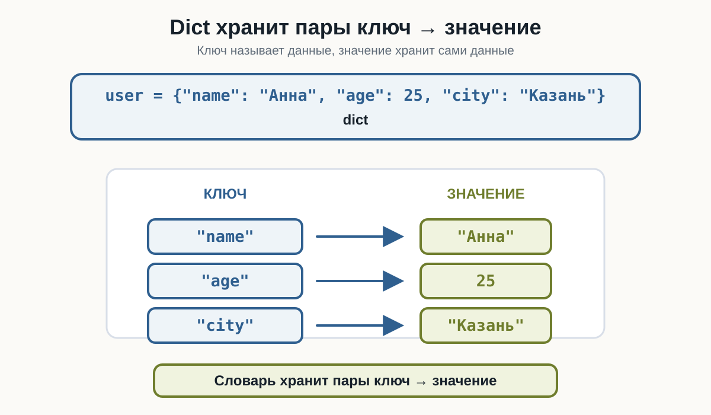
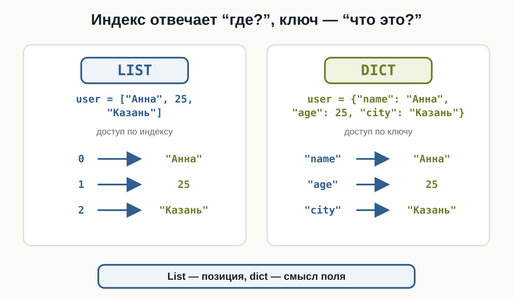
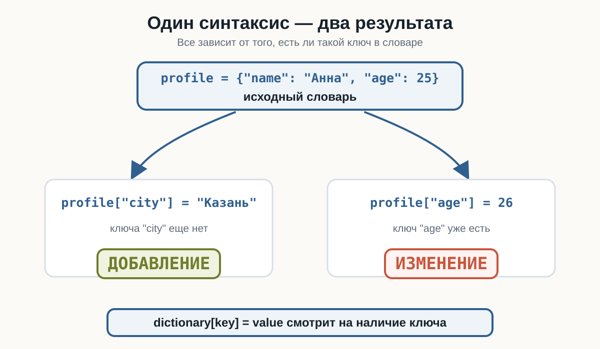
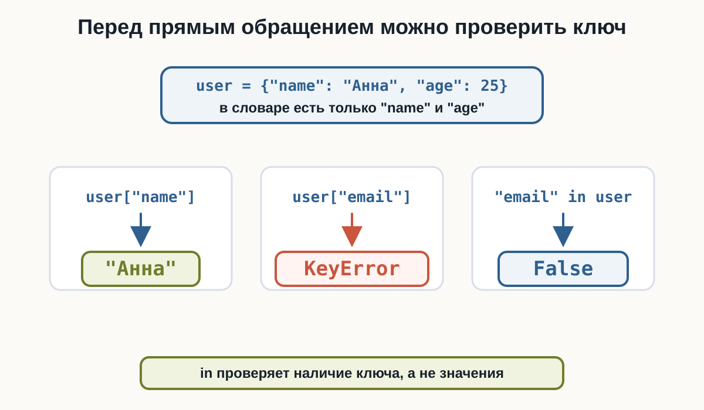
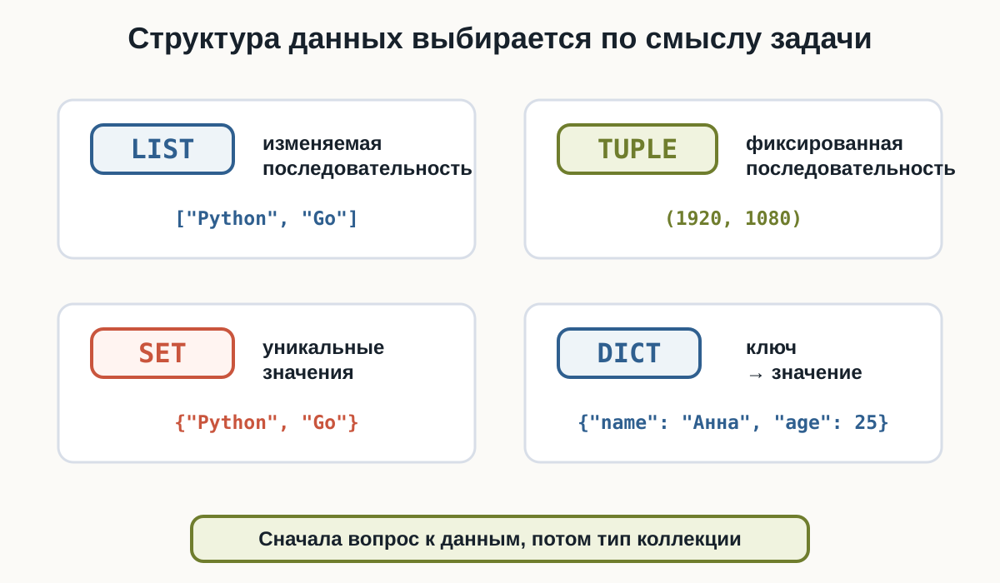

# 4.3 Словари {.unnumbered}

::: {.callout-important}
Главный вопрос главы:

**Как хранить связанные данные в формате «ключ → значение»?**
:::

В списках, кортежах и множествах мы работали с отдельными элементами:

```python
languages = ["Python", "Java", "Go"]
```

Но данные одного объекта часто состоят из именованных характеристик:

```text
имя     → Анна
возраст → 25
город   → Казань
```

Список такую информацию хранить может:

```python
user = ["Анна", 25, "Казань"]
```

Но тогда нужно помнить, что означает каждая позиция. Словарь позволяет обратиться к данным по смыслу:

```python
user["name"]
user["age"]
user["city"]
```

---

## Что такое словарь

Словарь хранит данные в виде пар:

```text
ключ → значение
```

Пример:

```python
user = {
    "name": "Анна",
    "age": 25,
    "city": "Казань"
}
```

Здесь ключи `"name"`, `"age"` и `"city"` указывают, что означает каждое значение.

Тип словаря называется `dict`. Количество пар возвращает `len()`:

```python
user = {
    "name": "Анна",
    "age": 25,
    "city": "Казань"
}

print(user)
print(type(user))
print(len(user))
```

Результат:

```text
{'name': 'Анна', 'age': 25, 'city': 'Казань'}
<class 'dict'>
3
```

:::: {.content-visible when-format="html"}
::: {.python-playground data-source="../examples/chapter23/dict-basics.py" data-title="Первый словарь"}
:::
::::

:::: {.content-visible when-format="pdf"}
```{.python filename="dict-basics.py"}

```
::::

---

## Ключ и значение

Каждая запись словаря состоит из ключа и значения:

```python
"name": "Анна"
```

Слева находится **ключ**, справа — **значение**. Между ними ставится двоеточие, а пары разделяются запятыми:

```python
user = {
    "name": "Анна",
    "age": 25,
    "city": "Казань"
}
```

Ключ позволяет понять, что означает значение, без знания его позиции.

{fig-alt="Словарь user показан как набор пар ключ значение: ключ name ведёт к значению Анна, age ведёт к 25, city ведёт к Казань. Главная мысль: словарь хранит пары ключ значение."}

---

## Создание словаря

Небольшой словарь можно записать в одну строку:

```python
product = {"name": "Ноутбук", "price": 85000}
```

Если полей несколько, удобнее использовать несколько строк:

```python
product = {
    "name": "Ноутбук",
    "price": 85000,
    "available": True
}
```

Так структуру легче читать.

---

## Пустой словарь

Пустой словарь создаётся фигурными скобками:

```python
settings = {}
```

Проверим:

```python
settings = {}

print(settings)
print(type(settings))
```

Результат:

```text
{}
<class 'dict'>
```

Связь с предыдущей главой:

```text
{}    → dict
set() → set
```

Для пустого множества по-прежнему используется `set()`.

:::: {.content-visible when-format="pdf"}
```{.python filename="empty-dict.py"}

```
::::

---

## Получение значения по ключу

Чтобы получить значение, после имени словаря указывают ключ в квадратных скобках:

```python
dictionary[key]
```

Пример:

```python
product = {
    "name": "Ноутбук",
    "price": 85000,
    "available": True
}

print(product["name"])
print(product["price"])
print(product["available"])
```

Результат:

```text
Ноутбук
85000
True
```

Главная идея: мы обращаемся не к позиции, а к конкретному ключу.

:::: {.content-visible when-format="html"}
::: {.python-playground data-source="../examples/chapter23/dict-access.py" data-title="Получение значения по ключу"}
:::
::::

:::: {.content-visible when-format="pdf"}
```{.python filename="dict-access.py"}

```
::::

---

## Ключи — не индексы

У списка значение получают по индексу:

```python
user = ["Анна", 25, "Казань"]

print(user[0])
```

У словаря значение получают по ключу:

```python
user = {
    "name": "Анна",
    "age": 25,
    "city": "Казань"
}

print(user["name"])
```

Индекс отвечает на вопрос «где?». Ключ отвечает на вопрос «что это?».

{fig-alt="Слева список user с индексами 0, 1, 2 и доступом по позиции. Справа словарь user с ключами name, age, city и доступом по смысловому ключу. Главная мысль: индекс отвечает где, ключ отвечает что это."}

Запись:

```python
user[0]
```

не означает «первое значение словаря». Она означает: найти значение с ключом `0`. Если такого ключа нет, возникнет ошибка.

---

## Если ключа нет

Прямое обращение через квадратные скобки предполагает, что ключ существует:

```python
user = {
    "name": "Анна",
    "age": 25
}

print(user["email"])
```

Ключа `"email"` нет, поэтому Python сообщит:

```text
KeyError
```

:::: {.content-visible when-format="html"}
```{.python filename="dict-key-error.py"}

```
::::

:::: {.content-visible when-format="pdf"}
```{.python filename="dict-key-error.py"}

```
::::

::: {.callout-warning title="Несуществующий ключ"}

Обращение:

```python
data["key"]
```

безопасно только тогда, когда такой ключ действительно есть в словаре.
:::

---

## Добавление новой пары

Чтобы добавить новую пару, присвойте значение новому ключу:

```python
profile = {
    "nickname": "Neo",
    "level": 12
}

profile["server"] = "EU-1"

print(profile)
```

Если ключа ещё нет, создаётся новая пара `ключ → значение`.

:::: {.content-visible when-format="html"}
::: {.python-playground data-source="../examples/chapter23/dict-add.py" data-title="Добавление новой пары"}
:::
::::

:::: {.content-visible when-format="pdf"}
```{.python filename="dict-add.py"}

```
::::

---

## Изменение значения

Если ключ уже существует, та же запись изменит значение:

```python
game = {
    "title": "Python Quest",
    "score": 1200
}

game["score"] = 1450

print(game)
```

Результат:

```text
{'title': 'Python Quest', 'score': 1450}
```

:::: {.content-visible when-format="html"}
::: {.python-playground data-source="../examples/chapter23/dict-update-value.py" data-title="Изменение значения"}
:::
::::

:::: {.content-visible when-format="pdf"}
```{.python filename="dict-update-value.py"}

```
::::

---

## Один синтаксис — два результата

Запись:

```python
dictionary[key] = value
```

работает по-разному в зависимости от ключа:

```text
ключа нет  → добавление новой пары
ключ есть → изменение значения
```

{fig-alt="Схема показывает один словарь profile. Присваивание profile city добавляет новую пару, потому что ключа city ещё нет. Присваивание profile age изменяет значение, потому что ключ age уже существует."}

---

## Значения могут иметь разные типы

Один словарь может описывать объект с разными характеристиками:

```python
course = {
    "title": "Python",
    "lessons": 42,
    "price": 19.99,
    "available": True
}
```

Здесь значения имеют разные типы:

```text
"title"     → str
"lessons"   → int
"price"     → float
"available" → bool
```

---

## Ключи должны быть уникальными

В одном словаре каждый ключ обозначает одно значение.

Не следует создавать словарь с повторяющимися ключами:

```python
data = {
    "name": "Анна",
    "name": "Мария"
}
```

Одинаковые ключи не создают две независимые записи. Последнее значение заменяет предыдущее:

```python
data = {
    "name": "Анна",
    "name": "Мария"
}

print(data["name"])
```

Результат:

```text
Мария
```

---

## Количество пар

Для словаря работает `len()`:

```python
user = {
    "name": "Анна",
    "age": 25,
    "city": "Казань"
}

print(len(user))
```

Результат:

```text
3
```

`len()` возвращает количество пар `ключ → значение`.

---

## Проверка наличия ключа

Оператор `in` проверяет наличие **ключа**:

```python
device = {
    "name": "Sensor A",
    "status": "online"
}

if "temperature" in device:
    print(device["temperature"])
else:
    print("Температура неизвестна")
```

Для проверки отсутствия используется `not in`:

```python
if "email" not in user:
    print("Email не указан")
```

:::: {.content-visible when-format="html"}
::: {.python-playground data-source="../examples/chapter23/dict-membership.py" data-title="Проверка ключа"}
:::
::::

:::: {.content-visible when-format="pdf"}
```{.python filename="dict-membership.py"}

```
::::

::: {.callout-note title="in проверяет ключи"}

В выражении:

```python
"name" in user
```

Python проверяет наличие ключа `"name"`. Значения словаря здесь не проверяются.
:::

{fig-alt="Обращение user name возвращает Анна, обращение user email приводит к KeyError, а проверка email in user возвращает False. Главная мысль: перед прямым обращением можно проверить наличие ключа."}

---

## Удаление пары

Пару можно удалить с помощью `del`:

```python
session = {
    "player": "Alex",
    "score": 1250,
    "temporary_code": "X7F9"
}

del session["temporary_code"]

print(session)
```

После удаления ключа `"temporary_code"` в словаре больше нет.

Если попытаться удалить отсутствующий ключ, возникнет `KeyError`.

:::: {.content-visible when-format="html"}
::: {.python-playground data-source="../examples/chapter23/dict-delete.py" data-title="Удаление пары"}
:::
::::

:::: {.content-visible when-format="pdf"}
```{.python filename="dict-delete.py"}

```
::::

---

## Пример: карточка товара

Словарь удобно использовать для описания одного объекта:

```python
product = {
    "name": "Механическая клавиатура",
    "price": 7490,
    "available": True
}

print("Товар:", product["name"])
print("Цена:", product["price"])

product["price"] = 6990
product["rating"] = 4.8

print(product)
```

Здесь мы получили значения по ключам, изменили цену и добавили новое поле.

:::: {.content-visible when-format="html"}
::: {.python-playground data-source="../examples/chapter23/product-card.py" data-title="Карточка товара"}
:::
::::

:::: {.content-visible when-format="pdf"}
```{.python filename="product-card.py"}

```
::::

---

## Итоговый пример

Соберём базовые операции словаря в одном сценарии:

```python
spaceship = {
    "name": "Odyssey",
    "fuel": 80,
    "crew": 4,
    "active": True
}

spaceship["fuel"] = spaceship["fuel"] - 15
spaceship["destination"] = "Mars"

if "autopilot" not in spaceship:
    spaceship["autopilot"] = False

print("Корабль:", spaceship["name"])
print("Топливо:", spaceship["fuel"])
print("Характеристик:", len(spaceship))
print(spaceship)
```

:::: {.content-visible when-format="html"}
::: {.python-playground data-source="../examples/chapter23/dict-practice.py" data-title="Итоговый пример: словарь корабля"}
:::
::::

:::: {.content-visible when-format="pdf"}
```{.python filename="dict-practice.py"}

```
::::

---

## Список или словарь

Список удобен, когда важна последовательность элементов:

```python
temperatures = [18, 20, 19, 22]
```

Словарь удобен, когда значения имеют собственные имена:

```python
weather = {
    "city": "Казань",
    "temperature": 20,
    "wind": "северный"
}
```

Общий ориентир:

| Структура | Когда использовать | Пример |
|---|---|---|
| `list` | изменяемая последовательность | `["Python", "Go"]` |
| `tuple` | фиксированная последовательность | `(1920, 1080)` |
| `set` | уникальные значения | `{"Python", "Go"}` |
| `dict` | пары `ключ → значение` | `{"name": "Анна", "age": 25}` |

{fig-alt="Карта структур данных: list подходит для изменяемой последовательности, tuple для фиксированной последовательности, set для уникальных значений, dict для пар ключ значение. Главная мысль: структура данных выбирается по смыслу задачи."}

---

## Что важно запомнить

Словарь имеет тип `dict` и хранит пары:

```text
ключ → значение
```

Базовые действия:

```python
user = {"name": "Анна", "age": 25}

print(user["name"])

user["city"] = "Казань"
user["age"] = 26

print("name" in user)
print(len(user))

del user["city"]
```

Если обратиться к отсутствующему ключу:

```python
user["email"]
```

возникнет `KeyError`.

---

### Практические задания

**Задание 1. Космический аппарат**

Создайте словарь с информацией о космическом аппарате:

```text
name     → Voyager 1
launched → 1977
active   → True
```

Выведите название аппарата и год запуска.

::: {.callout-note title="Ответ" collapse="true"}

```python
spacecraft = {
    "name": "Voyager 1",
    "launched": 1977,
    "active": True
}

print(spacecraft["name"])
print(spacecraft["launched"])
```

:::

---

**Задание 2. Игровой персонаж**

Дан персонаж:

```python
player = {
    "name": "Raven",
    "health": 100,
    "level": 7
}
```

После боя здоровье уменьшилось до `65`. Измените словарь и выведите новое значение здоровья.

::: {.callout-note title="Ответ" collapse="true"}

```python
player = {
    "name": "Raven",
    "health": 100,
    "level": 7
}

player["health"] = 65

print(player["health"])
```

:::

---

**Задание 3. Фильм**

Дан фильм:

```python
movie = {
    "title": "Interstellar",
    "year": 2014
}
```

Добавьте рейтинг `8.7`, а затем выведите весь словарь.

::: {.callout-note title="Ответ" collapse="true"}

```python
movie = {
    "title": "Interstellar",
    "year": 2014
}

movie["rating"] = 8.7

print(movie)
```

:::

---

**Задание 4. Компьютер**

Дано описание компьютера:

```python
computer = {
    "cpu": "Ryzen 7",
    "ram": 32,
    "ssd": 1000
}
```

Проверьте, присутствует ли ключ `"gpu"`. Если его нет, выведите:

```text
Видеокарта не указана
```

::: {.callout-note title="Ответ" collapse="true"}

```python
computer = {
    "cpu": "Ryzen 7",
    "ram": 32,
    "ssd": 1000
}

if "gpu" not in computer:
    print("Видеокарта не указана")
```

:::

---

**Задание 5. Игровая сессия**

Дана игровая сессия:

```python
session = {
    "player": "Alex",
    "score": 1250,
    "temporary_code": "X7F9"
}
```

Удалите `"temporary_code"` и выведите словарь.

::: {.callout-note title="Ответ" collapse="true"}

```python
session = {
    "player": "Alex",
    "score": 1250,
    "temporary_code": "X7F9"
}

del session["temporary_code"]

print(session)
```

:::

---

**Задание 6. Автомобиль**

Дан автомобиль:

```python
car = {
    "brand": "Volvo",
    "model": "XC60",
    "year": 2024,
    "electric": False
}
```

Определите количество характеристик с помощью Python, не считая их вручную.

::: {.callout-note title="Ответ" collapse="true"}

```python
car = {
    "brand": "Volvo",
    "model": "XC60",
    "year": 2024,
    "electric": False
}

print(len(car))
```

Результат:

```text
4
```

:::

---

**Задание 7. Склад**

На складе хранится информация:

```python
item = {
    "name": "Монитор",
    "price": 32000,
    "quantity": 4
}
```

Поступило ещё `3` монитора. Не записывайте итоговое количество вручную: измените `"quantity"`, используя его текущее значение.

::: {.callout-note title="Ответ" collapse="true"}

```python
item = {
    "name": "Монитор",
    "price": 32000,
    "quantity": 4
}

item["quantity"] = item["quantity"] + 3

print(item["quantity"])
```

Результат:

```text
7
```

:::

---

**Задание 8. Профиль игрока**

Создайте словарь:

```text
nickname → Neo
level    → 12
coins    → 450
premium  → False
```

Затем выполните последовательно:

1. увеличьте `level` на `1`;
2. добавьте `150` монет к текущему количеству;
3. измените `premium` на `True`;
4. добавьте новое поле `"server"` со значением `"EU-1"`;
5. выведите итоговый словарь.

::: {.callout-note title="Ответ" collapse="true"}

```python
player = {
    "nickname": "Neo",
    "level": 12,
    "coins": 450,
    "premium": False
}

player["level"] = player["level"] + 1
player["coins"] = player["coins"] + 150
player["premium"] = True
player["server"] = "EU-1"

print(player)
```

:::

---

**Задание 9. Датчик**

Дан словарь:

```python
device = {
    "name": "Sensor A",
    "status": "online"
}
```

Напишите код, который выводит значение `"temperature"` только в том случае, если такой ключ существует. Если ключа нет, вывести:

```text
Температура неизвестна
```

::: {.callout-note title="Ответ" collapse="true"}

```python
device = {
    "name": "Sensor A",
    "status": "online"
}

if "temperature" in device:
    print(device["temperature"])
else:
    print("Температура неизвестна")
```

:::

---

**Задание 10. Книга**

Создайте словарь, описывающий книгу. В нём должны быть поля:

```text
title
author
year
available
```

После создания:

1. выведите название и автора;
2. измените `available`;
3. добавьте поле `pages`;
4. проверьте наличие поля `rating`;
5. если его нет — добавьте рейтинг;
6. удалите `year`;
7. выведите количество оставшихся характеристик и итоговый словарь.

::: {.callout-note title="Ответ" collapse="true"}

```python
book = {
    "title": "1984",
    "author": "George Orwell",
    "year": 1949,
    "available": True
}

print(book["title"])
print(book["author"])

book["available"] = False
book["pages"] = 328

if "rating" not in book:
    book["rating"] = 4.8

del book["year"]

print("Характеристик:", len(book))
print(book)
```

:::

---

## Что дальше?

Теперь мы умеем создать словарь, получить значение по ключу, добавить новую пару, изменить значение, проверить наличие ключа и удалить пару.

Следующий естественный вопрос:

```text
Как удобнее и безопаснее работать со словарём целиком?
```

На него отвечает следующая глава — **«Работа со словарями»**.

---

## Словари Python: краткое резюме

Словарь (`dict`) в Python хранит данные в формате **«ключ → значение»**. Такой формат удобен, когда отдельным характеристикам нужно дать понятные имена: например, имя пользователя, цену товара, статус заказа или настройки программы.

Словарь создаётся с помощью фигурных скобок `{}`. Значение можно получить через `dictionary[key]`, новую пару добавить присваиванием, а существующее значение изменить через тот же ключ. Оператор `in` позволяет проверить наличие ключа, `len()` возвращает количество пар, а `del` удаляет запись.

Если ключ отсутствует, обращение через `dictionary[key]` приводит к `KeyError`. Поэтому перед прямым обращением полезно проверять ключ через `in`, когда отсутствие ключа является нормальной ситуацией.
