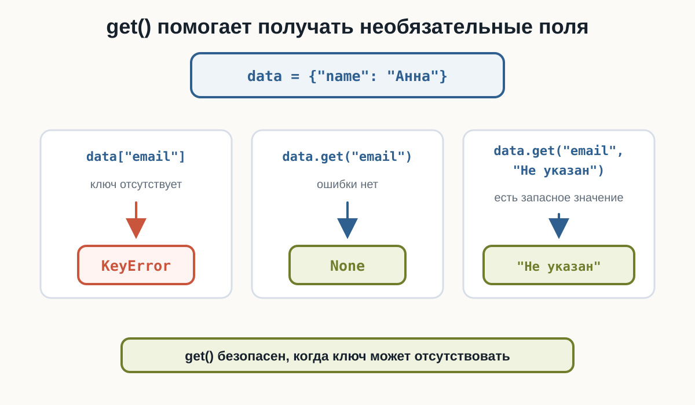
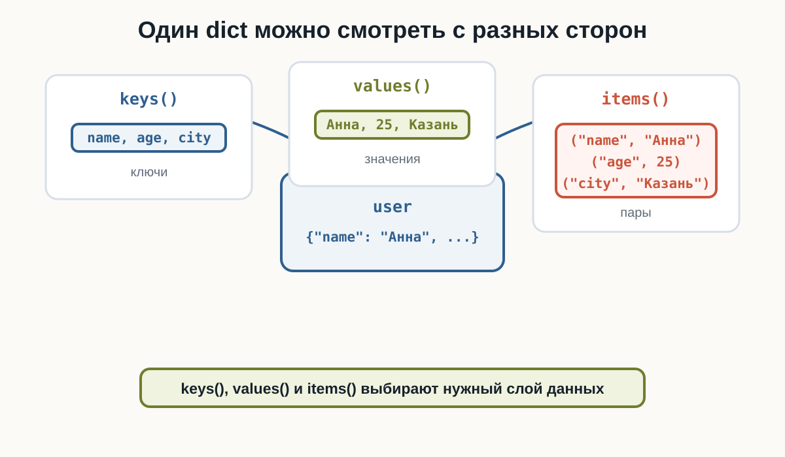
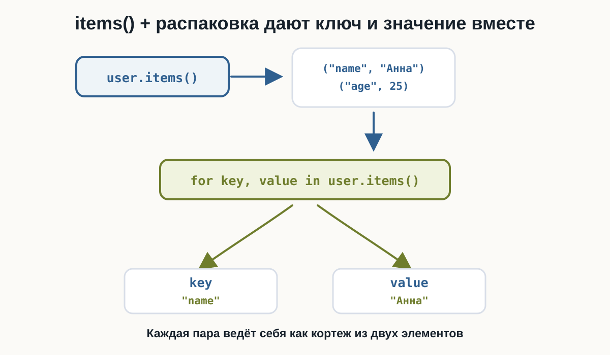
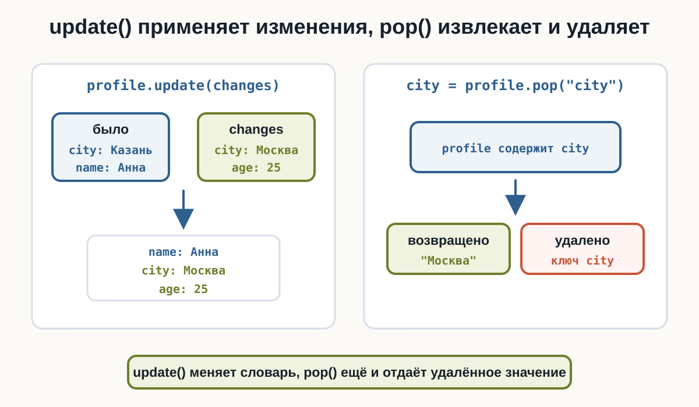
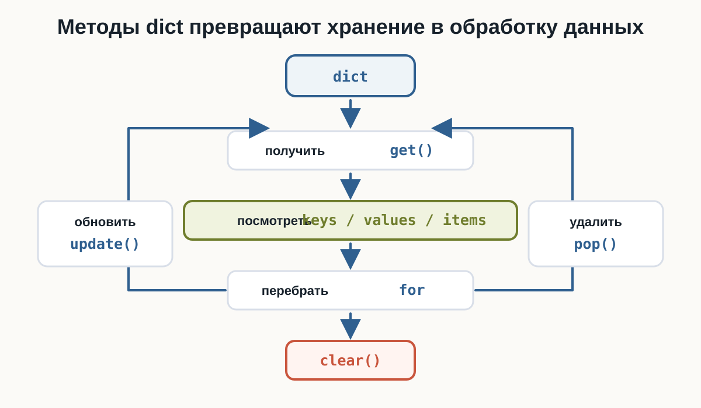

# 4.4 Работа со словарями {.unnumbered}

::: {.callout-important}
Главный вопрос главы:

**Как удобнее получать, перебирать, обновлять и очищать словарь?**
:::

В предыдущей главе мы познакомились со словарём `dict`: ключами, значениями, созданием словаря, прямым доступом через `dictionary[key]`, добавлением, изменением, `len()`, проверкой ключа через `in` и удалением через `del`.

Теперь разберём методы и приёмы, которые нужны для работы со словарём целиком.

---

## Безопасное получение через get()

Прямой доступ требует, чтобы ключ существовал. Если ключа нет, будет `KeyError`.

Метод `get()` работает мягче: он возвращает значение, если ключ есть, и `None`, если ключ отсутствует.

```python
user = {
    "name": "Анна",
    "age": 25
}

print(user.get("name"))
print(user.get("email"))
```

Результат:

```text
Анна
None
```

Главная идея: `get()` не вызывает `KeyError` для отсутствующего ключа.

:::: {.content-visible when-format="html"}
::: {.python-playground data-source="../examples/chapter24/dict-get.py" data-title="get() без KeyError"}
:::
::::

:::: {.content-visible when-format="pdf"}
```{.python filename="dict-get.py"}

```
::::

{fig-alt="Сравнение прямого доступа и get(). Обращение data email через квадратные скобки приводит к KeyError, data.get email возвращает None, а data.get email со значением по умолчанию возвращает Не указан."}

---

## get() со значением по умолчанию

Вторым аргументом `get()` можно передать значение, которое нужно вернуть при отсутствии ключа:

```python
dictionary.get(key, default)
```

Пример:

```python
config = {
    "theme": "dark"
}

theme = config.get("theme", "light")
font_size = config.get("font_size", 14)

print(theme)
print(font_size)
```

Результат:

```text
dark
14
```

`default` используется только тогда, когда ключа нет. Для `"theme"` вернулось настоящее значение `"dark"`, а для отсутствующего `"font_size"` — `14`.

:::: {.content-visible when-format="html"}
::: {.python-playground data-source="../examples/chapter24/dict-get-default.py" data-title="get() со значением по умолчанию"}
:::
::::

:::: {.content-visible when-format="pdf"}
```{.python filename="dict-get-default.py"}

```
::::

---

## Ключи через keys()

Метод `keys()` предоставляет ключи словаря.

```python
user = {
    "name": "Анна",
    "age": 25,
    "city": "Казань"
}

for key in user.keys():
    print(key)
```

Результат:

```text
name
age
city
```

На текущем этапе достаточно понимать:

```text
keys()
→ ключи словаря
```

:::: {.content-visible when-format="pdf"}
```{.python filename="dict-keys.py"}

```
::::

---

## Значения через values()

Метод `values()` удобен, когда ключи не нужны и нужно обработать только значения.

```python
scores = {
    "Python": 90,
    "SQL": 82,
    "Git": 95
}

total = 0

for score in scores.values():
    total += score

print(total)
```

Результат:

```text
267
```

Здесь цикл видит только числа `90`, `82` и `95`.

:::: {.content-visible when-format="html"}
::: {.python-playground data-source="../examples/chapter24/dict-values.py" data-title="values() и сумма значений"}
:::
::::

:::: {.content-visible when-format="pdf"}
```{.python filename="dict-values.py"}

```
::::

---

## Пары через items()

Метод `items()` предоставляет пары `ключ → значение`.

```python
user = {
    "name": "Анна",
    "age": 25,
    "city": "Казань"
}

for key, value in user.items():
    print(key, "→", value)
```

Результат:

```text
name → Анна
age → 25
city → Казань
```

Каждый элемент `items()` можно распаковать в две переменные: `key` и `value`.

:::: {.content-visible when-format="html"}
::: {.python-playground data-source="../examples/chapter24/dict-items.py" data-title="items() и пары ключ-значение"}
:::
::::

:::: {.content-visible when-format="pdf"}
```{.python filename="dict-items.py"}

```
::::

{fig-alt="Словарь user показан в центре. От него идут три направления: keys к ключам name, age, city; values к значениям Анна, 25, Казань; items к парам name Анна, age 25, city Казань."}

---

## Перебор словаря через for

Если перебирать сам словарь, Python перебирает его ключи:

```python
settings = {
    "theme": "dark",
    "language": "ru",
    "notifications": True
}

for key in settings:
    print(key, "=", settings[key])
```

Результат:

```text
theme = dark
language = ru
notifications = True
```

Запись `for key in settings:` означает перебор ключей. Значение можно получить через `settings[key]`.

В файле примера есть подсказка: если нужны и ключ, и значение, `items()` обычно понятнее.

:::: {.content-visible when-format="pdf"}
```{.python filename="dict-iteration.py"}

```
::::

---

## Перебор ключей и значений

Когда в цикле нужны сразу ключ и значение, обычно используют `items()`:

```python
for key, value in user.items():
    print(key, value)
```

Это связано с уже знакомой распаковкой кортежей:

```python
key, value = ("name", "Анна")
```

На каждой итерации новая пара из `items()` раскладывается по двум переменным.

{fig-alt="user.items() выдаёт пары name Анна и age 25. Цикл for key, value in user.items() распаковывает пару в переменные key и value."}

---

## Обновление через update()

Метод `update()` применяет сразу несколько изменений:

```python
profile = {
    "name": "Анна",
    "city": "Казань"
}

changes = {
    "city": "Москва",
    "age": 25
}

profile.update(changes)

print(profile)
```

В результате `"city"` изменится на `"Москва"`, а новый ключ `"age"` добавится.

:::: {.content-visible when-format="html"}
::: {.python-playground data-source="../examples/chapter24/dict-update.py" data-title="update() применяет изменения"}
:::
::::

:::: {.content-visible when-format="pdf"}
```{.python filename="dict-update.py"}

```
::::

Правило такое же, как при присваивании:

```text
ключ уже есть → значение изменится
ключа нет    → пара добавится
```

---

## Удаление через pop()

В предыдущей главе было удаление через `del`. Метод `pop()` отличается тем, что возвращает удалённое значение.

```python
user = {
    "name": "Анна",
    "age": 25,
    "city": "Казань"
}

city = user.pop("city")

print(city)
print(user)

missing = user.pop("email", "Не указан")

print(missing)
```

Результат:

```text
Казань
{'name': 'Анна', 'age': 25}
Не указан
```

Если ключ может отсутствовать, передавайте значение по умолчанию:

```python
dictionary.pop(key, default)
```

Тогда отсутствующий ключ не приведёт к `KeyError`.

:::: {.content-visible when-format="html"}
::: {.python-playground data-source="../examples/chapter24/dict-pop.py" data-title="pop() удаляет и возвращает значение"}
:::
::::

:::: {.content-visible when-format="pdf"}
```{.python filename="dict-pop.py"}

```
::::

{fig-alt="Слева update меняет city с Казань на Москва и добавляет age. Справа pop возвращает значение city и удаляет ключ из словаря."}

---

## Очистка через clear()

Метод `clear()` удаляет все пары из словаря:

```python
cache = {
    "user": "Анна",
    "token": "ABC123"
}

cache.clear()

print(cache)
```

Результат:

```text
{}
```

Словарь остаётся существовать, но становится пустым.

:::: {.content-visible when-format="pdf"}
```{.python filename="dict-clear.py"}

```
::::

---

## Изменение значений во время перебора

Во время перебора можно менять значения существующих ключей, если набор ключей не меняется.

```python
prices = {
    "Кофе": 200,
    "Чай": 150,
    "Сок": 180
}

for product in prices:
    prices[product] += 20

print(prices)
```

Результат:

```text
{'Кофе': 220, 'Чай': 170, 'Сок': 200}
```

Здесь мы не добавляем и не удаляем ключи. Меняются только значения.

:::: {.content-visible when-format="html"}
::: {.python-playground data-source="../examples/chapter24/dict-update-values-loop.py" data-title="Изменение values в цикле"}
:::
::::

:::: {.content-visible when-format="pdf"}
```{.python filename="dict-update-values-loop.py"}

```
::::

---

## Не меняйте размер dict во время for

Во время прямого перебора словаря не стоит добавлять или удалять ключи этого же словаря.

Такой код не используйте как рабочий:

```python
for key in data:
    del data[key]
```

И такой тоже:

```python
for key in data:
    data["new"] = 100
```

Изменение количества ключей во время итерации может привести к ошибке:

```text
RuntimeError: dictionary changed size during iteration
```

::: {.callout-warning title="Главное правило"}
Значения существующих ключей менять можно.

Количество ключей во время прямого перебора менять не стоит.
:::

---

## Пример: дорогие товары

С помощью `items()` можно фильтровать словарь по значениям.

```python
prices = {
    "Мышь": 2500,
    "Клавиатура": 7000,
    "Монитор": 32000,
    "Кабель": 800
}

for product, price in prices.items():
    if price >= 5000:
        print(product, "→", price)
```

Результат:

```text
Клавиатура → 7000
Монитор → 32000
```

Здесь `items()` даёт пару, распаковка разделяет её на `product` и `price`, а `if` оставляет только нужные товары.

:::: {.content-visible when-format="html"}
::: {.python-playground data-source="../examples/chapter24/expensive-products.py" data-title="Фильтрация товаров по цене"}
:::
::::

:::: {.content-visible when-format="pdf"}
```{.python filename="expensive-products.py"}

```
::::

---

## Итоговый пример: анализ склада

Соберём `get()`, `items()`, `update()` и `pop()` в одном сценарии.

```python
stock = {
    "Ноутбук": 4,
    "Монитор": 0,
    "Клавиатура": 12,
    "Мышь": 0,
    "Наушники": 7
}

total_quantity = 0

for product, quantity in stock.items():
    total_quantity += quantity

    if quantity > 0:
        print(product, "есть в наличии")

print("Всего единиц:", total_quantity)

webcam = stock.get("Веб-камера", 0)

print("Веб-камер:", webcam)

stock.update({
    "Монитор": 3,
    "Веб-камера": 5
})

removed = stock.pop("Мышь", 0)

print("Удалено мышей:", removed)
print(stock)
```

В этом примере словарь не просто хранит данные: программа считает остатки, проверяет отсутствующий ключ, применяет поставку и удаляет позицию.

:::: {.content-visible when-format="html"}
::: {.python-playground data-source="../examples/chapter24/dictionary-analysis.py" data-title="Итоговый пример: анализ склада"}
:::
::::

:::: {.content-visible when-format="pdf"}
```{.python filename="dictionary-analysis.py"}

```
::::

---

## Что использовать

Краткая памятка:

| Операция | Когда нужна |
|---|---|
| `data.get(key)` | получить необязательное значение |
| `data.get(key, default)` | заменить `None` своим значением |
| `data.keys()` | пройти по ключам |
| `data.values()` | пройти по значениям |
| `data.items()` | пройти по парам `key, value` |
| `for key in data` | перебрать ключи короткой записью |
| `data.update(changes)` | применить несколько изменений |
| `data.pop(key)` | удалить ключ и получить значение |
| `data.pop(key, default)` | удалить ключ без ошибки при отсутствии |
| `data.clear()` | очистить словарь |

---

## Что важно запомнить

`get()` безопасно получает значение:

```python
data.get("email")
data.get("email", "Не указан")
```

`keys()`, `values()` и `items()` дают разные взгляды на один словарь:

```python
data.keys()
data.values()
data.items()
```

Цикл по самому словарю перебирает ключи:

```python
for key in data:
    ...
```

`items()` удобно распаковывать в две переменные:

```python
for key, value in data.items():
    ...
```

`update()` применяет изменения, `pop()` удаляет и возвращает значение, `clear()` очищает словарь.

Во время перебора можно менять значения существующих ключей, но не стоит добавлять или удалять ключи того же словаря.

{fig-alt="Итоговая карта главы: dict позволяет получить значение через get, посмотреть содержимое через keys values items, перебрать через for, обновить через update, удалить через pop и очистить через clear."}

---

### Практические задания

**Задание 1. Погода**

Дан словарь:

```python
weather = {
    "temperature": 18,
    "wind": 4
}
```

Получите `"humidity"` через `get()`. Если поля нет, используйте значение `"неизвестно"`.

::: {.callout-note title="Ответ" collapse="true"}

```python
weather = {
    "temperature": 18,
    "wind": 4
}

humidity = weather.get("humidity", "неизвестно")

print("Влажность:", humidity)
```

:::

---

**Задание 2. Системные параметры**

Дан словарь:

```python
system = {
    "os": "Linux",
    "ram": 32,
    "cores": 8
}
```

Выведите только названия параметров.

::: {.callout-note title="Ответ" collapse="true"}

```python
system = {
    "os": "Linux",
    "ram": 32,
    "cores": 8
}

for key in system.keys():
    print(key)
```

:::

---

**Задание 3. Выручка**

Даны продажи:

```python
sales = {
    "Понедельник": 12000,
    "Вторник": 15000,
    "Среда": 11000,
    "Четверг": 17000
}
```

Вычислите общую выручку, перебирая только значения.

::: {.callout-note title="Ответ" collapse="true"}

```python
sales = {
    "Понедельник": 12000,
    "Вторник": 15000,
    "Среда": 11000,
    "Четверг": 17000
}

total = 0

for value in sales.values():
    total += value

print("Выручка:", total)
```

:::

---

**Задание 4. Игровой инвентарь**

Дан словарь:

```python
inventory = {
    "Зелье": 5,
    "Стрела": 40,
    "Ключ": 2
}
```

Выведите все позиции в формате `предмет : количество`, используя `items()`.

::: {.callout-note title="Ответ" collapse="true"}

```python
inventory = {
    "Зелье": 5,
    "Стрела": 40,
    "Ключ": 2
}

for item, quantity in inventory.items():
    print(item, ":", quantity)
```

:::

---

**Задание 5. Конфигурация сервера**

Изначально:

```python
server = {
    "host": "localhost",
    "port": 8000,
    "debug": True
}
```

Новые настройки:

```python
changes = {
    "port": 8080,
    "debug": False,
    "workers": 4
}
```

Примените изменения одной операцией.

::: {.callout-note title="Ответ" collapse="true"}

```python
server = {
    "host": "localhost",
    "port": 8000,
    "debug": True
}

changes = {
    "port": 8080,
    "debug": False,
    "workers": 4
}

server.update(changes)

print(server)
```

:::

---

**Задание 6. Корзина**

Дана корзина:

```python
cart = {
    "Ноутбук": 1,
    "Мышь": 2,
    "Кабель": 3
}
```

Удалите `"Кабель"` через `pop()` и сохраните его количество в переменную.

::: {.callout-note title="Ответ" collapse="true"}

```python
cart = {
    "Ноутбук": 1,
    "Мышь": 2,
    "Кабель": 3
}

quantity = cart.pop("Кабель")

print("Удалено:", quantity)
print(cart)
```

:::

---

**Задание 7. Сессия**

Дан словарь:

```python
session = {
    "user": "alex",
    "active": True
}
```

Удалите `"token"` через `pop()` так, чтобы отсутствие ключа не вызвало ошибку.

::: {.callout-note title="Ответ" collapse="true"}

```python
session = {
    "user": "alex",
    "active": True
}

token = session.pop("token", None)

print(token)
print(session)
```

:::

---

**Задание 8. Изменение цен**

Дан прайс:

```python
prices = {
    "Кофе": 200,
    "Чай": 150,
    "Какао": 220
}
```

Увеличьте каждую цену на `10%`.

::: {.callout-note title="Ответ" collapse="true"}

```python
prices = {
    "Кофе": 200,
    "Чай": 150,
    "Какао": 220
}

for product in prices:
    prices[product] = prices[product] * 1.1

print(prices)
```

:::

---

**Задание 9. Результаты игроков**

Даны результаты:

```python
scores = {
    "Alex": 1250,
    "Maria": 1840,
    "John": 990,
    "Sofia": 1720
}
```

С помощью `items()` найдите игрока с максимальным результатом. Не используйте `max()` как готовое решение.

::: {.callout-note title="Ответ" collapse="true"}

```python
scores = {
    "Alex": 1250,
    "Maria": 1840,
    "John": 990,
    "Sofia": 1720
}

best_player = None
best_score = -1

for player, score in scores.items():
    if score > best_score:
        best_player = player
        best_score = score

print("Игрок:", best_player)
print("Результат:", best_score)
```

:::

---

**Задание 10. Анализ склада**

Дан склад:

```python
stock = {
    "Ноутбук": 4,
    "Монитор": 0,
    "Клавиатура": 12,
    "Мышь": 0,
    "Наушники": 7
}
```

Нужно:

1. подсчитать общее количество единиц товара;
2. вывести товары, которые есть в наличии;
3. получить количество `"Веб-камера"` через `get()` со значением `0`;
4. применить обновление для `"Монитор"` и `"Веб-камера"`;
5. удалить `"Мышь"` через `pop()` со значением по умолчанию;
6. вывести итоговый словарь.

::: {.callout-note title="Ответ" collapse="true"}

```python
stock = {
    "Ноутбук": 4,
    "Монитор": 0,
    "Клавиатура": 12,
    "Мышь": 0,
    "Наушники": 7
}

total_quantity = 0

for product, quantity in stock.items():
    total_quantity += quantity

    if quantity > 0:
        print(product, "есть в наличии")

print("Всего единиц:", total_quantity)

webcam = stock.get("Веб-камера", 0)

print("Веб-камер:", webcam)

stock.update({
    "Монитор": 3,
    "Веб-камера": 5
})

removed = stock.pop("Мышь", 0)

print("Удалено мышей:", removed)
print(stock)
```

:::

---

## Что дальше?

Теперь мы умеем обрабатывать один словарь: безопасно получать данные, перебирать ключи и значения, обновлять пары, удалять элементы и очищать структуру.

Следующий шаг — объединить уже знакомые структуры:

```python
users = [
    {"name": "Анна", "age": 25},
    {"name": "Максим", "age": 30}
]
```

Такие данные состоят из нескольких уровней. Это тема следующей главы — **«Вложенные структуры данных»**.

---

## Работа со словарями Python: краткое резюме

Работа со словарями в Python строится вокруг нескольких практичных методов. `get()` помогает безопасно получать необязательные значения, `keys()` даёт ключи, `values()` — значения, а `items()` — пары, которые удобно распаковывать в цикле `for`.

Метод `update()` применяет сразу несколько изменений, `pop()` удаляет ключ и возвращает его значение, а `clear()` полностью очищает словарь. При переборе словаря можно менять значения существующих ключей, но не стоит добавлять или удалять ключи в том же прямом цикле.
