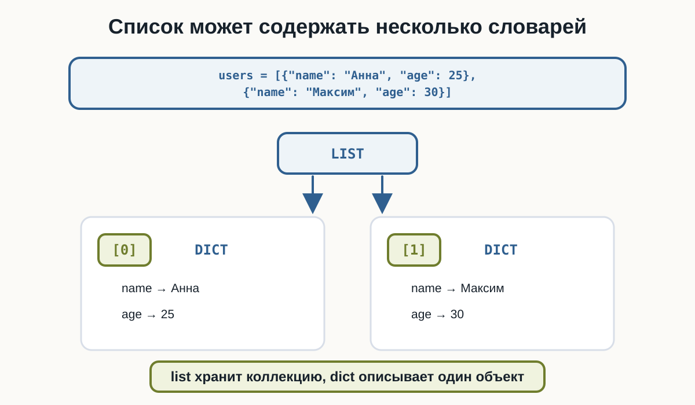
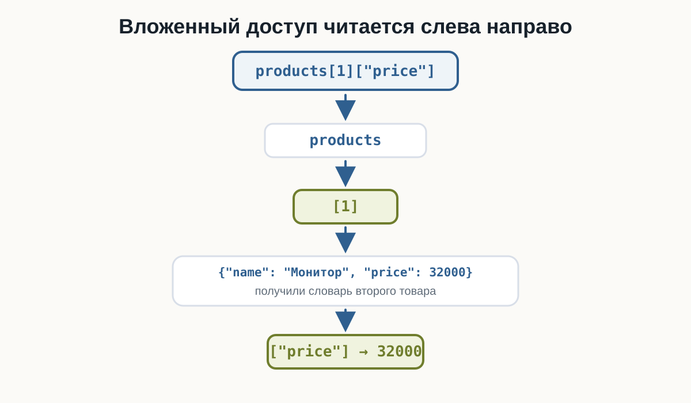
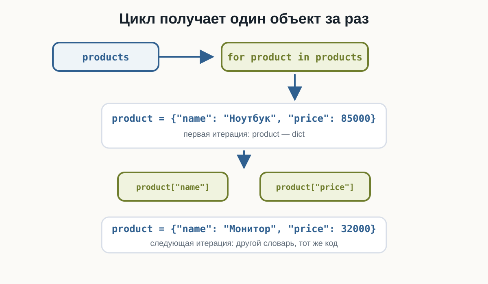
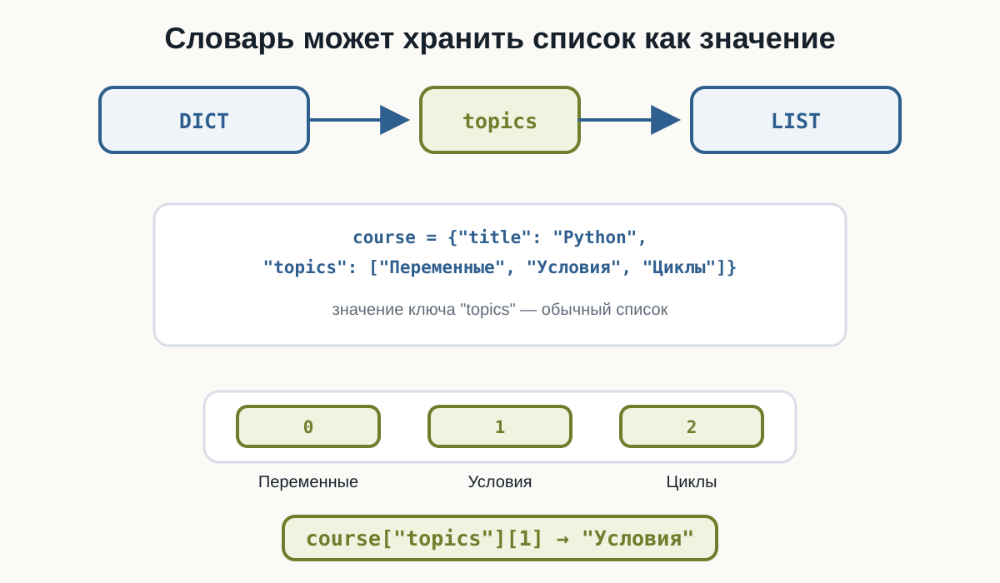
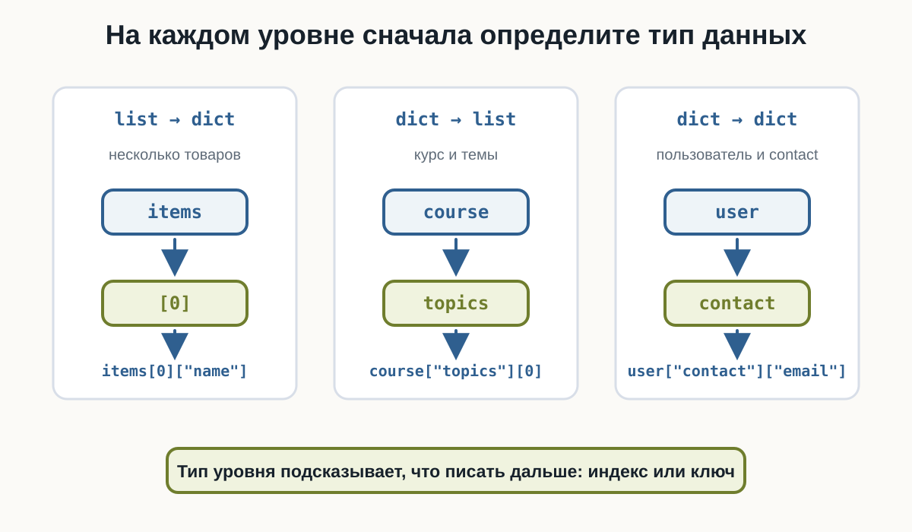

---
pagetitle: "Вложенные структуры данных в Python: списки и словари"
description: "Вложенные структуры данных в Python: списки словарей, словари со списками, доступ, изменение и перебор вложенных данных на практических примерах."
keywords:
  - вложенные структуры Python
  - список словарей Python
  - словарь со списком Python
  - вложенные словари Python
  - list of dict Python
  - nested data Python
---

# 4.5 Вложенные структуры данных {.unnumbered}

::: {.callout-important}
Главный вопрос главы:

**Как объединять списки и словари, чтобы описывать более сложные данные?**
:::

До сих пор мы работали с отдельными структурами.

Список:

```python
languages = ["Python", "Java", "Go"]
```

Словарь:

```python
user = {
    "name": "Анна",
    "age": 25
}
```

Но реальные данные часто состоят из нескольких объектов.

Например, нужно хранить нескольких пользователей:

```text
Анна → 25 лет
Максим → 30 лет
Олег → 27 лет
```

Один словарь описывает одного пользователя.

Несколько пользователей удобно хранить в списке:

```python
users = [
    {
        "name": "Анна",
        "age": 25
    },
    {
        "name": "Максим",
        "age": 30
    },
    {
        "name": "Олег",
        "age": 27
    }
]
```

Так появляются **вложенные структуры данных**.

---

## Что такое вложенная структура

Вложенная структура — это структура данных, внутри которой находятся другие структуры.

Например:

```python
users = [
    {"name": "Анна", "age": 25},
    {"name": "Максим", "age": 30}
]
```

Здесь:

```text
users
↓
list
↓
каждый элемент
↓
dict
```

Получается:

```text
list
├── dict
└── dict
```

---

## Список словарей

Одна из самых распространённых моделей:

```python
products = [
    {
        "name": "Ноутбук",
        "price": 85000
    },
    {
        "name": "Монитор",
        "price": 32000
    },
    {
        "name": "Мышь",
        "price": 2500
    }
]
```

Здесь:

```text
products
→ список товаров

каждый элемент списка
→ словарь одного товара
```

Список хранит коллекцию объектов, а словарь описывает свойства каждого объекта.

::::: {.content-visible when-format="html"}
```{.python filename="list-of-dicts.py"}

```
:::::

::::: {.content-visible when-format="pdf"}
```{.python filename="list-of-dicts.py"}

```
:::::

{fig-alt="Список users содержит два словаря. Элемент с индексом 0 ведёт к словарю с полями name Анна и age 25, элемент с индексом 1 ведёт к словарю с полями name Максим и age 30. Главная мысль: список может содержать несколько словарей."}

---

## Доступ к одному объекту

Получим первый элемент списка:

```python
products[0]
```

Результат:

```python
{
    "name": "Ноутбук",
    "price": 85000
}
```

Теперь можно получить поле этого словаря:

```python
products[0]["name"]
```

Результат:

```text
Ноутбук
```

Полная цепочка:

```text
products
↓
[0]
↓
первый словарь
↓
["name"]
↓
"Ноутбук"
```

---

## Читаем выражение слева направо

Рассмотрим:

```python
products[1]["price"]
```

Читаем по шагам:

```text
products
↓
элемент с индексом 1
↓
словарь товара
↓
ключ "price"
↓
32000
```

Такой способ чтения помогает разбирать вложенные выражения без угадывания.

Если написать индекс, которого нет, например `products[10]`, Python получит несуществующий элемент списка и выдаст `IndexError`.

Если элемент есть, но внутри словаря нет нужного ключа, например `products[0]["missing"]`, будет `KeyError`.

::: {.callout-tip title="Разбирайте доступ по шагам"}

Если выражение кажется сложным:

```python
products[1]["price"]
```

мысленно разбейте его:

```python
product = products[1]
price = product["price"]
```

Результат тот же, но структура становится понятнее.
:::

::::: {.content-visible when-format="html"}
:::: {.python-playground data-source="../examples/chapter25/nested-access.py" data-title="Вложенный доступ слева направо"}
::::
:::::

::::: {.content-visible when-format="pdf"}
```{.python filename="nested-access.py"}

```
:::::

{fig-alt="Выражение products[1][price] разбирается слева направо: сначала список products, затем индекс 1, затем словарь товара Монитор, затем ключ price и значение 32000. Главная мысль: вложенный доступ читается слева направо."}

---

## Изменение вложенного значения

Элемент внутри вложенного словаря можно изменить:

```python
products = [
    {
        "name": "Ноутбук",
        "price": 85000
    },
    {
        "name": "Монитор",
        "price": 32000
    }
]

products[1]["price"] = 30000

print(products[1])
```

Теперь второй товар содержит:

```text
price → 30000
```

Мы:

```text
нашли элемент списка
↓
получили словарь
↓
изменили значение по ключу
```

---

## Добавление поля во вложенный словарь

Можно добавить новое поле:

```python
products[0]["available"] = True
```

Теперь первый товар содержит:

```python
{
    "name": "Ноутбук",
    "price": 85000,
    "available": True
}
```

Это обычное изменение словаря, только сам словарь находится внутри списка.

::::: {.content-visible when-format="html"}
:::: {.python-playground data-source="../examples/chapter25/nested-update.py" data-title="Изменение и добавление поля"}
::::
:::::

::::: {.content-visible when-format="pdf"}
```{.python filename="nested-update.py"}

```
:::::

---

## Перебор списка словарей

Чаще всего все объекты обрабатываются циклом:

```python
products = [
    {"name": "Ноутбук", "price": 85000},
    {"name": "Монитор", "price": 32000},
    {"name": "Мышь", "price": 2500}
]

for product in products:
    print(product["name"], "→", product["price"])
```

Результат:

```text
Ноутбук → 85000
Монитор → 32000
Мышь → 2500
```

На каждой итерации:

```python
product
```

содержит один словарь.

::::: {.content-visible when-format="html"}
:::: {.python-playground data-source="../examples/chapter25/nested-iteration.py" data-title="Перебор списка словарей"}
::::
:::::

::::: {.content-visible when-format="pdf"}
```{.python filename="nested-iteration.py"}

```
:::::

{fig-alt="Цикл for product in products получает один словарь за раз. На первой итерации product содержит словарь ноутбука, затем код читает product name и product price. На следующей итерации product содержит другой словарь. Главная мысль: при переборе списка словарей цикл получает один объект за раз."}

---

## Фильтрация объектов

Можно использовать условие внутри цикла:

```python
products = [
    {"name": "Ноутбук", "price": 85000},
    {"name": "Монитор", "price": 32000},
    {"name": "Мышь", "price": 2500}
]

for product in products:
    if product["price"] >= 30000:
        print(product["name"])
```

Результат:

```text
Ноутбук
Монитор
```

Теперь условие применяется к каждому объекту отдельно.

::::: {.content-visible when-format="html"}
:::: {.python-playground data-source="../examples/chapter25/nested-filter.py" data-title="Фильтрация объектов по полю"}
::::
:::::

::::: {.content-visible when-format="pdf"}
```{.python filename="nested-filter.py"}

```
:::::

---

## Безопасное получение поля

Не все словари обязательно содержат одинаковые поля.

Например:

```python
users = [
    {
        "name": "Анна",
        "city": "Казань"
    },
    {
        "name": "Максим"
    }
]
```

У второго пользователя нет `"city"`.

Поэтому:

```python
user["city"]
```

может вызвать `KeyError`.

Используем уже знакомый `get()`:

```python
for user in users:
    city = user.get("city", "Не указан")

    print(user["name"], "→", city)
```

Результат:

```text
Анна → Казань
Максим → Не указан
```

::::: {.content-visible when-format="html"}
:::: {.python-playground data-source="../examples/chapter25/optional-field.py" data-title="Необязательное поле и get()"}
::::
:::::

::::: {.content-visible when-format="pdf"}
```{.python filename="optional-field.py"}

```
:::::

---

## Добавление нового объекта

Список остаётся обычным изменяемым списком.

Поэтому можно использовать `append()`:

```python
users = [
    {"name": "Анна", "age": 25}
]

users.append({
    "name": "Максим",
    "age": 30
})

print(users)
```

Теперь список содержит два словаря.

---

## Создание объекта перед append()

Иногда удобнее сначала создать словарь:

```python
new_user = {
    "name": "Олег",
    "age": 27
}
```

а затем:

```python
users.append(new_user)
```

Это особенно полезно, когда данные собираются постепенно.

---

## Создание объекта из input()

Например:

```python
users = []

name = input("Имя: ")
age = int(input("Возраст: "))

user = {
    "name": name,
    "age": age
}

users.append(user)

print(users)
```

Получается цепочка:

```text
input()
↓
переменные
↓
dict
↓
append()
↓
list
```

::::: {.content-visible when-format="html"}
:::: {.python-playground data-source="../examples/chapter25/append-dict.py" data-title="input → dict → append → list"}
::::
:::::

::::: {.content-visible when-format="pdf"}
```{.python filename="append-dict.py"}

```
:::::

---

## Словарь со списком

Вложенность может работать и наоборот.

Например:

```python
course = {
    "title": "Python",
    "topics": [
        "Переменные",
        "Условия",
        "Циклы"
    ]
}
```

Здесь:

```text
course
↓
dict
↓
ключ "topics"
↓
list
```

{fig-alt="Словарь course хранит ключ topics, значение которого является списком тем. Доступ course topics 1 возвращает Условия. Главная мысль: словарь может хранить список как значение."}

---

## Доступ к элементу списка внутри словаря

Получим список тем:

```python
course["topics"]
```

Получим первую тему:

```python
course["topics"][0]
```

Результат:

```text
Переменные
```

Читаем:

```text
course
↓
ключ "topics"
↓
список
↓
индекс 0
↓
"Переменные"
```

---

## Изменение списка внутри словаря

Поскольку `"topics"` содержит обычный список:

```python
course["topics"].append("Функции")
```

Теперь:

```python
print(course["topics"])
```

получим:

```text
['Переменные', 'Условия', 'Циклы', 'Функции']
```

Методы списка работают как обычно.

---

## Перебор списка внутри словаря

Например:

```python
course = {
    "title": "Python",
    "topics": [
        "Переменные",
        "Условия",
        "Циклы"
    ]
}

for topic in course["topics"]:
    print(topic)
```

Цикл получает элементы вложенного списка.

::::: {.content-visible when-format="html"}
:::: {.python-playground data-source="../examples/chapter25/dict-with-list.py" data-title="Словарь со списком"}
::::
:::::

::::: {.content-visible when-format="pdf"}
```{.python filename="dict-with-list.py"}

```
:::::

---

## Несколько списков внутри словаря

Словарь может хранить несколько списков:

```python
project = {
    "name": "Website",
    "developers": ["Анна", "Максим"],
    "technologies": ["Python", "HTML", "CSS"]
}
```

Получить второго разработчика:

```python
project["developers"][1]
```

Получить первую технологию:

```python
project["technologies"][0]
```

Главное — каждый раз понимать, какой тип находится на текущем уровне.

---

## Проверяйте тип структуры на каждом уровне

Рассмотрим:

```python
project["developers"][1]
```

По шагам:

```text
project
→ dict

project["developers"]
→ list

project["developers"][1]
→ str
```

А:

```python
users[0]["name"]
```

разбирается иначе:

```text
users
→ list

users[0]
→ dict

users[0]["name"]
→ str
```

Это один из самых полезных навыков при работе с вложенными данными.

---

## Словарь внутри словаря

Можно вложить словарь в другой словарь:

```python
user = {
    "name": "Анна",
    "contact": {
        "email": "anna@example.com",
        "city": "Казань"
    }
}
```

Получить email:

```python
user["contact"]["email"]
```

Результат:

```text
anna@example.com
```

В этой главе ограничимся простыми структурами глубиной 2–3 уровня.

---

## Изменение вложенного словаря

Например:

```python
user["contact"]["city"] = "Москва"
```

Получаем:

```text
contact
└── city → Москва
```

Логика та же:

```text
получить внешний словарь
↓
получить внутренний словарь
↓
изменить поле
```

::::: {.content-visible when-format="html"}
:::: {.python-playground data-source="../examples/chapter25/nested-dict.py" data-title="Словарь внутри словаря"}
::::
:::::

::::: {.content-visible when-format="pdf"}
```{.python filename="nested-dict.py"}

```
:::::

---

## Пример: заказы

```python
orders = [
    {
        "id": 101,
        "customer": "Анна",
        "total": 4500,
        "paid": True
    },
    {
        "id": 102,
        "customer": "Максим",
        "total": 7300,
        "paid": False
    }
]
```

Выведем неоплаченные заказы:

```python
for order in orders:
    if not order["paid"]:
        print(
            "Заказ",
            order["id"],
            "→",
            order["customer"]
        )
```

Здесь список словарей уже напоминает данные реального приложения.

---

## Пример: сумма заказов

Можно обработать числовое поле всех объектов:

```python
orders = [
    {"id": 101, "total": 4500},
    {"id": 102, "total": 7300},
    {"id": 103, "total": 2100}
]

total = 0

for order in orders:
    total += order["total"]

print("Общая сумма:", total)
```

Результат:

```text
Общая сумма: 13900
```

::::: {.content-visible when-format="html"}
:::: {.python-playground data-source="../examples/chapter25/orders-analysis.py" data-title="Анализ заказов"}
::::
:::::

::::: {.content-visible when-format="pdf"}
```{.python filename="orders-analysis.py"}

```
:::::

---

## Поиск объекта

Например, найдём пользователя по имени:

```python
users = [
    {"name": "Анна", "age": 25},
    {"name": "Максим", "age": 30},
    {"name": "Олег", "age": 27}
]

search_name = "Максим"

for user in users:
    if user["name"] == search_name:
        print(user)
```

Мы пока не усложняем логику досрочным выходом из цикла.

Главная идея — поиск нужного словаря по его полю.

---

## Добавление данных в найденный объект

Например:

```python
users = [
    {"name": "Анна", "active": True},
    {"name": "Максим", "active": False}
]

for user in users:
    if user["name"] == "Максим":
        user["active"] = True

print(users)
```

Изменяется конкретный словарь внутри списка.

---

## Итоговый пример: команда

Теперь объединим несколько операций в одной модели:

```python
team = {
    "name": "Backend",
    "members": [
        {"name": "Анна", "experience": 3},
        {"name": "Максим", "experience": 5},
        {"name": "Олег", "experience": 2}
    ]
}
```

Здесь внешний словарь описывает команду, а список `"members"` хранит словари участников.

Программа может посчитать средний опыт, выбрать участников по условию и изменить вложенное значение.

::::: {.content-visible when-format="html"}
:::: {.python-playground data-source="../examples/chapter25/team-analysis.py" data-title="Итоговый пример: анализ команды"}
::::
:::::

::::: {.content-visible when-format="pdf"}
```{.python filename="team-analysis.py"}

```
:::::

---

## Не делайте вложенность глубже без необходимости

Технически можно добавлять новые уровни почти бесконечно, но такой код быстро становится трудно читать.

```python
team["members"][0]["name"]
```

Такую цепочку ещё можно спокойно разобрать: словарь, список, словарь, поле.

А если выражение становится заметно длиннее, структуру стоит внимательно пересмотреть.

На текущем этапе хороший ориентир:

> Если доступ превращается в длинную цепочку из множества `[]`, структуру стоит внимательно пересмотреть.

::: {.callout-warning title="Сложнее — не значит лучше"}

Вложенные структуры полезны, но чрезмерная вложенность усложняет:

- чтение;
- изменение;
- поиск ошибок;
- обработку данных.

Пока используйте 2–3 понятных уровня.
:::

---

## Как выбрать структуру

Рассмотрим несколько моделей.

Несколько товаров:

```python
[
    {"name": "Ноутбук", "price": 85000},
    {"name": "Монитор", "price": 32000}
]
```

Подходит:

```text
list
↓
dict
```

Один курс с несколькими темами:

```python
{
    "title": "Python",
    "topics": ["Циклы", "Строки", "Списки"]
}
```

Подходит:

```text
dict
↓
list
```

Пользователь с контактными данными:

```python
{
    "name": "Анна",
    "contact": {
        "email": "anna@example.com"
    }
}
```

Подходит:

```text
dict
↓
dict
```

Структуру выбирают исходя из смысла данных.

{fig-alt="Итоговая карта показывает три модели: list затем dict для нескольких товаров, dict затем list для курса и тем, dict затем dict для пользователя и контактов. Под моделями приведены короткие примеры доступа items 0 name, course topics 0 и user contact email. Главная мысль: на каждом уровне сначала определите тип данных."}

---

## Что важно запомнить

Список словарей:

```python
users = [
    {"name": "Анна"},
    {"name": "Максим"}
]
```

Доступ:

```python
users[0]["name"]
```

Перебор:

```python
for user in users:
    print(user["name"])
```

Словарь со списком:

```python
course = {
    "topics": ["Условия", "Циклы"]
}
```

Доступ:

```python
course["topics"][0]
```

Словарь внутри словаря:

```python
user = {
    "contact": {
        "email": "anna@example.com"
    }
}
```

Доступ:

```python
user["contact"]["email"]
```

Для необязательных полей словаря полезен:

```python
get()
```

Главное правило:

> На каждом уровне понимайте, с каким типом данных вы сейчас работаете.

---

### Практические задания

**Задание 1. Фильмотека**

Дан список:

```python
movies = [
    {"title": "Interstellar", "year": 2014},
    {"title": "Dune", "year": 2021},
    {"title": "Arrival", "year": 2016}
]
```

Выведите названия всех фильмов.

::: {.callout-note title="Ответ" collapse="true"}

```python
movies = [
    {"title": "Interstellar", "year": 2014},
    {"title": "Dune", "year": 2021},
    {"title": "Arrival", "year": 2016}
]

for movie in movies:
    print(movie["title"])
```

:::

---

**Задание 2. Изменение статуса сервера**

Даны серверы:

```python
servers = [
    {"name": "api-1", "online": True},
    {"name": "api-2", "online": False},
    {"name": "api-3", "online": True}
]
```

Измените статус `api-2` на `True`.

::: {.callout-note title="Ответ" collapse="true"}

```python
servers = [
    {"name": "api-1", "online": True},
    {"name": "api-2", "online": False},
    {"name": "api-3", "online": True}
]

for server in servers:
    if server["name"] == "api-2":
        server["online"] = True

print(servers)
```

:::

---

**Задание 3. Студент и предметы**

Дан словарь:

```python
student = {
    "name": "Мария",
    "subjects": ["Python", "SQL", "Git"]
}
```

Выведите каждый предмет на отдельной строке.

::: {.callout-note title="Ответ" collapse="true"}

```python
student = {
    "name": "Мария",
    "subjects": ["Python", "SQL", "Git"]
}

for subject in student["subjects"]:
    print(subject)
```

:::

---

**Задание 4. Новый навык**

Дан профиль:

```python
developer = {
    "name": "Alex",
    "skills": ["Python", "Git"]
}
```

Добавьте навык `"Docker"`.

::: {.callout-note title="Ответ" collapse="true"}

```python
developer = {
    "name": "Alex",
    "skills": ["Python", "Git"]
}

developer["skills"].append("Docker")

print(developer)
```

:::

---

**Задание 5. Контактные данные**

Дан:

```python
employee = {
    "name": "Анна",
    "contact": {
        "email": "anna@example.com",
        "phone": "+123456789"
    }
}
```

Выведите email сотрудника.

::: {.callout-note title="Ответ" collapse="true"}

```python
employee = {
    "name": "Анна",
    "contact": {
        "email": "anna@example.com",
        "phone": "+123456789"
    }
}

print(employee["contact"]["email"])
```

:::

---

**Задание 6. Средняя температура**

Даны измерения:

```python
measurements = [
    {"city": "Москва", "temperature": 18},
    {"city": "Казань", "temperature": 22},
    {"city": "Самара", "temperature": 20},
    {"city": "Омск", "temperature": 16}
]
```

Вычислите среднюю температуру.

::: {.callout-note title="Ответ" collapse="true"}

```python
measurements = [
    {"city": "Москва", "temperature": 18},
    {"city": "Казань", "temperature": 22},
    {"city": "Самара", "temperature": 20},
    {"city": "Омск", "temperature": 16}
]

total = 0

for measurement in measurements:
    total += measurement["temperature"]

average = total / len(measurements)

print("Средняя температура:", average)
```

:::

---

**Задание 7. Только доступные билеты**

Даны:

```python
tickets = [
    {"event": "Python Meetup", "available": True},
    {"event": "Data Conference", "available": False},
    {"event": "Open Source Day", "available": True}
]
```

Выведите только мероприятия, на которые ещё есть билеты.

::: {.callout-note title="Ответ" collapse="true"}

```python
tickets = [
    {"event": "Python Meetup", "available": True},
    {"event": "Data Conference", "available": False},
    {"event": "Open Source Day", "available": True}
]

for ticket in tickets:
    if ticket["available"]:
        print(ticket["event"])
```

:::

---

**Задание 8. Необязательное поле**

Даны пользователи:

```python
users = [
    {"name": "Анна", "country": "Россия"},
    {"name": "John"},
    {"name": "Maria", "country": "Испания"}
]
```

Выведите:

```text
Анна → Россия
John → Не указана
Maria → Испания
```

Используйте `get()`.

::: {.callout-note title="Ответ" collapse="true"}

```python
users = [
    {"name": "Анна", "country": "Россия"},
    {"name": "John"},
    {"name": "Maria", "country": "Испания"}
]

for user in users:
    country = user.get("country", "Не указана")

    print(user["name"], "→", country)
```

:::

---

**Задание 9. Добавление заказа**

Есть список:

```python
orders = [
    {"id": 101, "total": 1500},
    {"id": 102, "total": 2700}
]
```

Создайте новый заказ:

```text
id    → 103
total → 4200
```

и добавьте его в список.

::: {.callout-note title="Ответ" collapse="true"}

```python
orders = [
    {"id": 101, "total": 1500},
    {"id": 102, "total": 2700}
]

new_order = {
    "id": 103,
    "total": 4200
}

orders.append(new_order)

print(orders)
```

:::

---

**Задание 10. Анализ команды**

Дана команда:

```python
team = {
    "name": "Backend",
    "members": [
        {"name": "Анна", "experience": 3},
        {"name": "Максим", "experience": 5},
        {"name": "Олег", "experience": 2}
    ]
}
```

Нужно:

1. вывести название команды;
2. вывести всех участников;
3. найти суммарный опыт;
4. вычислить средний опыт;
5. вывести участников с опытом не меньше `3` лет;
6. увеличить опыт Олега на `1`.

::: {.callout-note title="Ответ" collapse="true"}

```python
team = {
    "name": "Backend",
    "members": [
        {"name": "Анна", "experience": 3},
        {"name": "Максим", "experience": 5},
        {"name": "Олег", "experience": 2}
    ]
}

print("Команда:", team["name"])

total_experience = 0

for member in team["members"]:
    print(member["name"])

    total_experience += member["experience"]

average = total_experience / len(team["members"])

print("Общий опыт:", total_experience)
print("Средний опыт:", average)

print("Опыт от 3 лет:")

for member in team["members"]:
    if member["experience"] >= 3:
        print(member["name"])

for member in team["members"]:
    if member["name"] == "Олег":
        member["experience"] += 1

print(team)
```

:::

---

## Что дальше?

Теперь мы умеем хранить данные в более реалистичном виде:

```text
list
↓
dict
```

или:

```text
dict
↓
list
```

Мы можем:

```text
получать вложенные значения
↓
перебирать объекты
↓
изменять поля
↓
фильтровать данные
↓
добавлять новые объекты
```

Но при обработке данных часто возникает повторяющийся шаблон.

Например:

```python
squares = []

for number in numbers:
    squares.append(number ** 2)
```

Такой код встречается очень часто.

Python позволяет записывать некоторые подобные преобразования короче.

Следующая глава — **«List comprehensions»**.

---

## Вложенные структуры данных Python: краткое резюме

Вложенные структуры данных в Python позволяют объединять `list` и `dict` для описания более сложных объектов. Распространённый вариант — список словарей, где каждый словарь представляет отдельный объект: пользователя, товар, заказ или задачу.

Доступ к вложенным данным выполняется последовательно: например, `users[0]["name"]` сначала получает элемент списка, а затем значение словаря. Аналогично `course["topics"][0]` сначала получает список по ключу, а затем его элемент.

При работе с вложенными структурами важно понимать тип данных на каждом уровне и избегать лишней глубины. Следующая глава посвящена теме **«List comprehensions»**.
