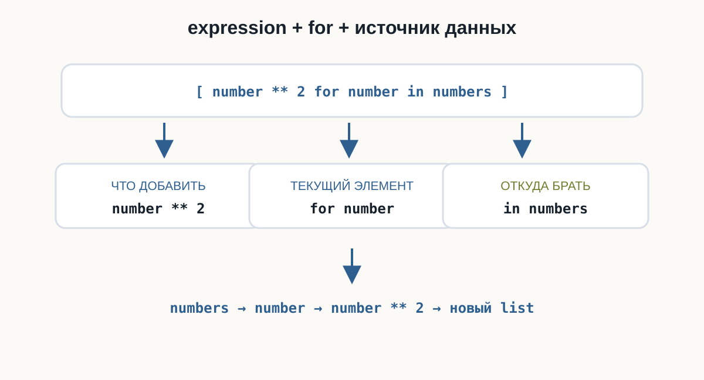
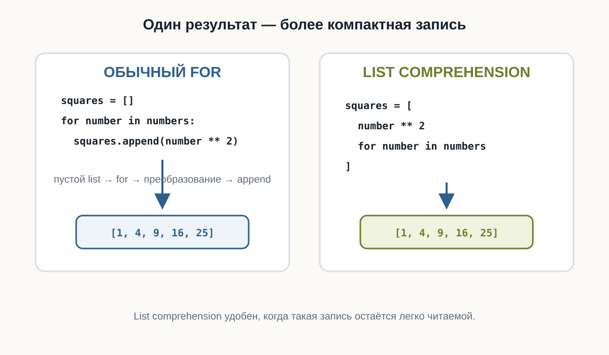
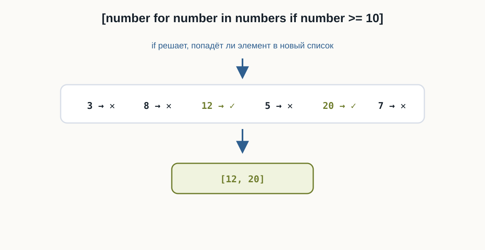
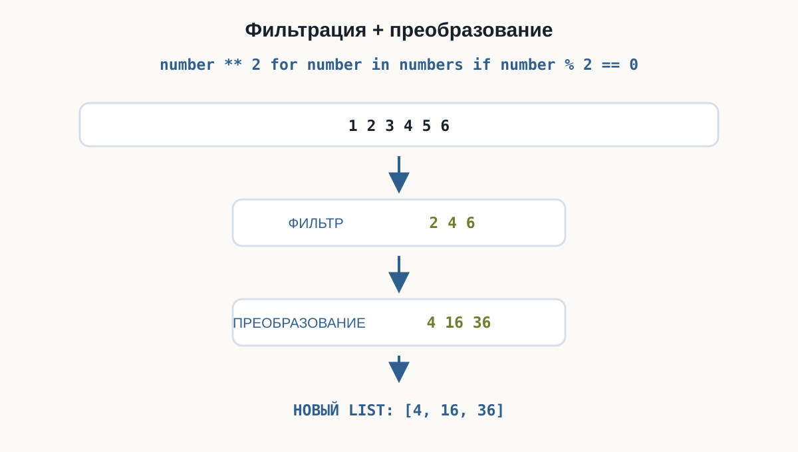
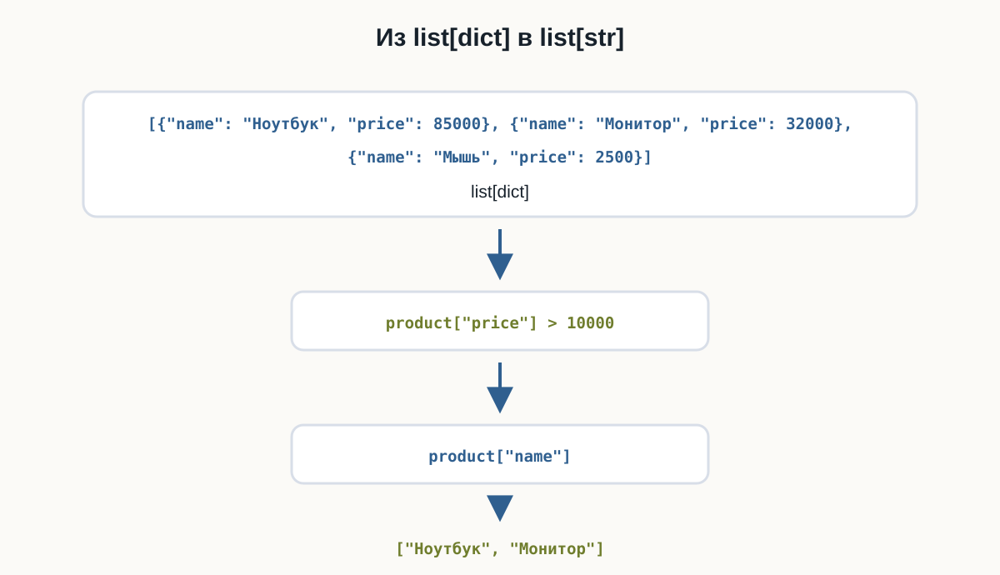

---
pagetitle: "List comprehensions в Python: создание списков в одну строку"
description: "List comprehensions в Python для начинающих: создание новых списков, преобразование элементов, фильтрация с if и сравнение с обычным циклом for."
keywords:
  - list comprehensions Python
  - генераторы списков Python
  - списковые включения Python
  - создание списков Python
  - for if Python
  - Python list comprehension
---

# 4.6 List comprehensions  {.unnumbered}

::: {.callout-important}
Главный вопрос главы:

**Как создавать новые списки на основе существующих без повторяющегося `for` и `append()`?**
:::

В предыдущих главах мы часто создавали новый список так:

```python
numbers = [1, 2, 3, 4, 5]

squares = []

for number in numbers:
    squares.append(number ** 2)

print(squares)
```

Результат:

```text
[1, 4, 9, 16, 25]
```

Этот код понятен:

```text
создать пустой список
↓
перебрать исходные данные
↓
преобразовать элемент
↓
добавить результат
```

В Python такой шаблон можно записать компактнее:

```python
squares = [number ** 2 for number in numbers]
```

Это **list comprehension**.

::::: {.content-visible when-format="html"}
:::: {.python-playground data-source="../examples/chapter26/for-vs-comprehension.py" data-title="for + append() и list comprehension"}
::::
:::::

::::: {.content-visible when-format="pdf"}
```{.python filename="for-vs-comprehension.py"}

```
:::::

---

## Первый list comprehension

Рассмотрим полный пример:

```python
numbers = [1, 2, 3, 4, 5]

squares = [number ** 2 for number in numbers]

print(squares)
```

Результат:

```text
[1, 4, 9, 16, 25]
```

Общий синтаксис:

```python
[expression for item in iterable]
```

Например:

```python
[number ** 2 for number in numbers]
```

Здесь:

```text
number ** 2
→ что добавить в новый список

for number in numbers
→ откуда брать элементы
```

::::: {.content-visible when-format="html"}
:::: {.python-playground data-source="../examples/chapter26/basic-comprehension.py" data-title="Первый list comprehension"}
::::
:::::

::::: {.content-visible when-format="pdf"}
```{.python filename="basic-comprehension.py"}

```
:::::

{fig-alt="В list comprehension expression определяет, что добавить; for number — текущий элемент; in numbers — источник данных. Поток: numbers, number, number в квадрате, новый список."}

---

## Обычный цикл и list comprehension

Эти два варианта решают одну задачу.

Обычный цикл:

```python
squares = []

for number in numbers:
    squares.append(number ** 2)
```

List comprehension:

```python
squares = [number ** 2 for number in numbers]
```

Во втором варианте исчезают:

```python
squares = []
```

и:

```python
squares.append(...)
```

Python сразу создаёт новый список.

{fig-alt="Слева обычный цикл создаёт список квадратов через пустой список, for и append. Справа list comprehension создаёт такой же список. Оба способа дают [1, 4, 9, 16, 25]."}

---

## Как читать list comprehension

Рассмотрим:

```python
[length * 2 for length in lengths]
```

Удобно читать начиная с `for`:

```text
для каждого length из lengths
↓
вычислить length * 2
↓
добавить результат в новый список
```

Например:

```python
lengths = [2, 5, 8]

doubled = [length * 2 for length in lengths]

print(doubled)
```

Результат:

```text
[4, 10, 16]
```

::: {.callout-tip title="Сначала найдите for"}

Если запись:

```python
[value * 2 for value in values]
```

пока выглядит непривычно, сначала прочитайте:

```python
for value in values
```

а затем посмотрите, какое выражение стоит слева:

```python
value * 2
```

Так конструкцию проще разобрать.
:::

---

## Новый список создаётся отдельно

List comprehension не изменяет исходный список:

```python
numbers = [1, 2, 3]

doubled = [number * 2 for number in numbers]

print(numbers)
print(doubled)
```

Результат:

```text
[1, 2, 3]
[2, 4, 6]
```

`numbers` остаётся прежним.

Создаётся новый список:

```python
doubled
```

---

## Преобразование чисел

List comprehension особенно удобен для однотипных преобразований.

Например, перевод температур из градусов Цельсия в Фаренгейты:

```{.python filename="number-transform.py"}

```

Результат:

```text
[32.0, 50.0, 68.0, 86.0]
```

Каждый элемент проходит через одно выражение:

```python
temperature * 9 / 5 + 32
```

---

## Преобразование строк

List comprehension работает не только с числами.

Например:

```python
names = ["anna", "max", "olga"]

upper_names = [name.upper() for name in names]

print(upper_names)
```

Результат:

```text
['ANNA', 'MAX', 'OLGA']
```

Для каждого элемента вызывается:

```python
name.upper()
```

---

## Получение длины строк

Можно получить новое значение из каждого элемента:

```{.python filename="string-transform.py"}

```

Результат:

```text
[6, 2, 10]
```

Исходный список содержит строки:

```text
Python
Go
JavaScript
```

Новый — числа:

```text
6
2
10
```

Тип элементов нового списка не обязан совпадать с исходным.

---

## Фильтрация с if

Иногда нужно добавить не все элементы.

Обычный вариант:

```python
numbers = [3, 8, 12, 5, 20, 7]

large_numbers = []

for number in numbers:
    if number >= 10:
        large_numbers.append(number)

print(large_numbers)
```

Результат:

```text
[12, 20]
```

С list comprehension:

```python
large_numbers = [
    number
    for number in numbers
    if number >= 10
]
```

Синтаксис:

```python
[expression for item in iterable if condition]
```

::::: {.content-visible when-format="html"}
:::: {.python-playground data-source="../examples/chapter26/filter-numbers.py" data-title="Фильтрация чисел"}
::::
:::::

::::: {.content-visible when-format="pdf"}
```{.python filename="filter-numbers.py"}

```
:::::

---

## Как работает условие

Рассмотрим:

```python
[number for number in numbers if number >= 10]
```

Логика:

```text
взять очередной number
↓
проверить number >= 10
↓
True?
├── да → добавить number
└── нет → пропустить
```

`if` здесь отвечает за то, попадёт ли элемент в новый список.

{fig-alt="Условие number >= 10 проверяет числа 3, 8, 12, 5, 20 и 7. Только 12 и 20 проходят в новый список."}

---

## Чётные числа

Например:

```python
numbers = [1, 2, 3, 4, 5, 6, 7, 8]

even_numbers = [
    number
    for number in numbers
    if number % 2 == 0
]

print(even_numbers)
```

Результат:

```text
[2, 4, 6, 8]
```

Исходный список не изменяется.

---

## Фильтрация строк

Условия могут работать и со строками:

```python
words = [
    "Python",
    "Go",
    "JavaScript",
    "SQL",
    "TypeScript"
]

long_words = [
    word
    for word in words
    if len(word) >= 6
]

print(long_words)
```

Результат:

```text
['Python', 'JavaScript', 'TypeScript']
```

---

## Преобразование и фильтрация вместе

List comprehension может одновременно:

1. выбрать подходящие элементы;
2. преобразовать их.

Например:

```python
numbers = [1, 2, 3, 4, 5, 6]

squares = [
    number ** 2
    for number in numbers
    if number % 2 == 0
]

print(squares)
```

Результат:

```text
[4, 16, 36]
```

Сначала условие оставляет:

```text
2
4
6
```

Затем выражение:

```python
number ** 2
```

преобразует их:

```text
4
16
36
```

::::: {.content-visible when-format="html"}
:::: {.python-playground data-source="../examples/chapter26/transform-and-filter.py" data-title="Фильтрация и преобразование"}
::::
:::::

::::: {.content-visible when-format="pdf"}
```{.python filename="transform-and-filter.py"}

```
:::::

{fig-alt="Из чисел от 1 до 6 фильтр оставляет 2, 4 и 6, затем выражение создаёт их квадраты: 4, 16 и 36."}

---

## List comprehension со списком словарей

Теперь соединим тему с предыдущей главой.

Есть товары:

```python
products = [
    {"name": "Ноутбук", "price": 85000},
    {"name": "Монитор", "price": 32000},
    {"name": "Мышь", "price": 2500}
]
```

Получим список названий:

```python
names = [
    product["name"]
    for product in products
]

print(names)
```

Результат:

```text
['Ноутбук', 'Монитор', 'Мышь']
```

Каждый:

```python
product
```

по-прежнему является словарём.

::::: {.content-visible when-format="html"}
:::: {.python-playground data-source="../examples/chapter26/dict-list-comprehension.py" data-title="Список названий товаров"}
::::
:::::

::::: {.content-visible when-format="pdf"}
```{.python filename="dict-list-comprehension.py"}

```
:::::

---

## Фильтрация списка словарей

Например, нужны товары дороже `10000`:

```python
products = [
    {"name": "Ноутбук", "price": 85000},
    {"name": "Монитор", "price": 32000},
    {"name": "Мышь", "price": 2500}
]

expensive = [
    product
    for product in products
    if product["price"] > 10000
]

print(expensive)
```

В новый список попадут словари ноутбука и монитора.

---

## Получение одного поля после фильтрации

Если нужны только названия:

```python
expensive_names = [
    product["name"]
    for product in products
    if product["price"] > 10000
]

print(expensive_names)
```

Результат:

```text
['Ноутбук', 'Монитор']
```

Здесь одновременно используются:

```text
фильтрация
+
получение поля
+
создание нового списка
```

::::: {.content-visible when-format="html"}
:::: {.python-playground data-source="../examples/chapter26/filter-dictionaries.py" data-title="Фильтрация списка словарей"}
::::
:::::

::::: {.content-visible when-format="pdf"}
```{.python filename="filter-dictionaries.py"}

```
:::::

{fig-alt="Список словарей с товарами фильтруется по price больше 10000, затем из прошедших словарей извлекается поле name. Результат — список строк Ноутбук и Монитор."}

---

## Можно использовать range()

List comprehension может работать с `range()`:

```{.python filename="range-comprehension.py"}

```

Результат:

```text
[1, 4, 9, 16, 25]
```

Промежуточный список чисел создавать не требуется.

---

## Несколько простых выборок из заказов

Не обязательно объединять все условия в одну конструкцию. Для одного набора заказов можно создать несколько понятных списков: оплаченные `id`, суммы больше `5000` и оплаченные заказы больше `5000`.

::::: {.content-visible when-format="html"}
:::: {.python-playground data-source="../examples/chapter26/orders-comprehension.py" data-title="Несколько list comprehensions для заказов"}
::::
:::::

::::: {.content-visible when-format="pdf"}
```{.python filename="orders-comprehension.py"}

```
:::::

Каждый список отвечает на один вопрос о заказах. Это проще читать и изменять, чем одну длинную строку.

---

## Когда list comprehension удобен

Он хорошо подходит для простых операций:

```text
преобразовать каждый элемент
```

```text
отфильтровать элементы
```

```text
отфильтровать + преобразовать
```

Например:

```python
prices_with_tax = [
    price * 1.2
    for price in prices
]
```

или:

```python
active_users = [
    user
    for user in users
    if user["active"]
]
```

---

## Когда обычный for лучше

List comprehension не обязан заменять каждый цикл.

Рассмотрим:

```python
result = []

for number in numbers:
    if number > 0:
        print("Обрабатываем:", number)

        value = number ** 2
        result.append(value)
```

Здесь есть несколько действий.

Переписывание такого кода в одну сложную конструкцию сделает его менее понятным.

::: {.callout-warning title="Короткий код не всегда лучше"}

Используйте list comprehension, когда преобразование или фильтрация остаются понятными с первого взгляда.

Если внутри появляется сложная логика, несколько условий или побочные действия — обычный `for` часто читается лучше.
:::

---

## Однострочная или многострочная запись

Короткий вариант:

```python
squares = [number ** 2 for number in numbers]
```

Если выражение становится длиннее, его можно оформить:

```python
expensive_names = [
    product["name"]
    for product in products
    if product["price"] > 10000
]
```

Это всё тот же list comprehension.

Многострочная запись часто легче читается.

---

## Типичные ошибки

### Забыли квадратные скобки

Нам нужен список:

```python
[number * 2 for number in numbers]
```

Квадратные скобки здесь являются частью синтаксиса list comprehension.

### Перепутали порядок

Правильно:

```python
[number * 2 for number in numbers]
```

а не:

```python
[for number in numbers number * 2]
```

Удобная схема:

```text
что добавить
↓
for
↓
откуда брать
↓
необязательный if
```

### Слишком много логики

Если конструкция перестала быстро читаться, лучше вернуться к обычному циклу.

---

## Что выбрать: for или list comprehension

Обычный `for`:

```python
result = []

for item in items:
    result.append(...)
```

удобен, когда:

- действий несколько;
- нужна сложная логика;
- важны промежуточные шаги;
- компактная запись ухудшает понимание.

List comprehension:

```python
result = [
    expression
    for item in items
]
```

удобен, когда задача сводится к понятному созданию нового списка.

---

## Что важно запомнить

Базовая форма:

```python
[expression for item in iterable]
```

Например:

```python
[number ** 2 for number in numbers]
```

С условием:

```python
[expression for item in iterable if condition]
```

Например:

```python
[number for number in numbers if number > 0]
```

Преобразование и фильтрация:

```python
[number ** 2 for number in numbers if number % 2 == 0]
```

Со словарями:

```python
[user["name"] for user in users]
```

Фильтрация словарей:

```python
[
    user
    for user in users
    if user["active"]
]
```

List comprehension создаёт **новый список**.

Используйте его тогда, когда результат остаётся легко читаемым.

---

### Практические задания

**Задание 1. Километры в метры**

Дан список:

```python
kilometers = [1, 3, 5, 10]
```

Создайте новый список со значениями в метрах.

Используйте list comprehension.

::: {.callout-note title="Ответ" collapse="true"}

```python
kilometers = [1, 3, 5, 10]

meters = [
    kilometer * 1000
    for kilometer in kilometers
]

print(meters)
```

Результат:

```text
[1000, 3000, 5000, 10000]
```

:::

---

**Задание 2. Длины файлов**

Даны имена:

```python
files = [
    "main.py",
    "config.yaml",
    "README.md",
    "app.py"
]
```

Создайте список, содержащий длину каждого имени.

::: {.callout-note title="Ответ" collapse="true"}

```python
files = [
    "main.py",
    "config.yaml",
    "README.md",
    "app.py"
]

lengths = [
    len(filename)
    for filename in files
]

print(lengths)
```

:::

---

**Задание 3. Положительные значения**

Даны изменения баланса:

```python
changes = [-150, 300, -50, 700, -20, 100]
```

Создайте новый список только с положительными значениями.

::: {.callout-note title="Ответ" collapse="true"}

```python
changes = [-150, 300, -50, 700, -20, 100]

income = [
    value
    for value in changes
    if value > 0
]

print(income)
```

Результат:

```text
[300, 700, 100]
```

:::

---

**Задание 4. Нечётные числа**

Используя:

```python
range(1, 21)
```

создайте список нечётных чисел от `1` до `20`.

::: {.callout-note title="Ответ" collapse="true"}

```python
odd_numbers = [
    number
    for number in range(1, 21)
    if number % 2 != 0
]

print(odd_numbers)
```

:::

---

**Задание 5. Активные серверы**

Даны:

```python
servers = [
    {"name": "api-1", "online": True},
    {"name": "api-2", "online": False},
    {"name": "api-3", "online": True},
    {"name": "api-4", "online": False}
]
```

Создайте список словарей только с работающими серверами.

::: {.callout-note title="Ответ" collapse="true"}

```python
servers = [
    {"name": "api-1", "online": True},
    {"name": "api-2", "online": False},
    {"name": "api-3", "online": True},
    {"name": "api-4", "online": False}
]

online_servers = [
    server
    for server in servers
    if server["online"]
]

print(online_servers)
```

:::

---

**Задание 6. Имена активных серверов**

Используйте те же данные, но создайте список только с именами работающих серверов:

```text
['api-1', 'api-3']
```

::: {.callout-note title="Ответ" collapse="true"}

```python
servers = [
    {"name": "api-1", "online": True},
    {"name": "api-2", "online": False},
    {"name": "api-3", "online": True},
    {"name": "api-4", "online": False}
]

online_names = [
    server["name"]
    for server in servers
    if server["online"]
]

print(online_names)
```

:::

---

**Задание 7. Цены со скидкой**

Даны цены:

```python
prices = [1200, 3500, 8000, 15000]
```

Для товаров стоимостью от `5000` создайте новый список цен со скидкой `10%`.

В новый список должны попасть только товары, которые подходят под условие.

::: {.callout-note title="Ответ" collapse="true"}

```python
prices = [1200, 3500, 8000, 15000]

discounted = [
    price * 0.9
    for price in prices
    if price >= 5000
]

print(discounted)
```

Результат:

```text
[7200.0, 13500.0]
```

:::

---

**Задание 8. Пользователи старше 18 лет**

Даны:

```python
users = [
    {"name": "Анна", "age": 17},
    {"name": "Максим", "age": 25},
    {"name": "Мария", "age": 19},
    {"name": "Олег", "age": 16}
]
```

Создайте список имён пользователей, которым не меньше `18` лет.

::: {.callout-note title="Ответ" collapse="true"}

```python
users = [
    {"name": "Анна", "age": 17},
    {"name": "Максим", "age": 25},
    {"name": "Мария", "age": 19},
    {"name": "Олег", "age": 16}
]

adult_names = [
    user["name"]
    for user in users
    if user["age"] >= 18
]

print(adult_names)
```

Результат:

```text
['Максим', 'Мария']
```

:::

---

**Задание 9. Расширения Python-файлов**

Даны:

```python
files = [
    "main.py",
    "index.html",
    "app.py",
    "styles.css",
    "test.py"
]
```

Создайте новый список только с Python-файлами.

Используйте метод строки `endswith()`.

::: {.callout-note title="Ответ" collapse="true"}

```python
files = [
    "main.py",
    "index.html",
    "app.py",
    "styles.css",
    "test.py"
]

python_files = [
    filename
    for filename in files
    if filename.endswith(".py")
]

print(python_files)
```

Результат:

```text
['main.py', 'app.py', 'test.py']
```

:::

---

**Задание 10. Анализ заказов**

Даны:

```python
orders = [
    {"id": 101, "total": 4500, "paid": True},
    {"id": 102, "total": 7300, "paid": False},
    {"id": 103, "total": 12000, "paid": True},
    {"id": 104, "total": 2800, "paid": True},
    {"id": 105, "total": 9500, "paid": False}
]
```

С помощью отдельных list comprehensions создайте:

1. список оплаченных заказов;
2. список `id` оплаченных заказов;
3. список сумм заказов дороже `5000`;
4. список `id` оплаченных заказов дороже `5000`.

::: {.callout-note title="Ответ" collapse="true"}

```python
orders = [
    {"id": 101, "total": 4500, "paid": True},
    {"id": 102, "total": 7300, "paid": False},
    {"id": 103, "total": 12000, "paid": True},
    {"id": 104, "total": 2800, "paid": True},
    {"id": 105, "total": 9500, "paid": False}
]

paid_orders = [
    order
    for order in orders
    if order["paid"]
]

paid_ids = [
    order["id"]
    for order in orders
    if order["paid"]
]

large_totals = [
    order["total"]
    for order in orders
    if order["total"] > 5000
]

large_paid_ids = [
    order["id"]
    for order in orders
    if order["paid"] and order["total"] > 5000
]

print("Оплаченные:", paid_orders)
print("ID оплаченных:", paid_ids)
print("Суммы > 5000:", large_totals)
print("Оплаченные > 5000:", large_paid_ids)
```

:::

---

## Что дальше?

List comprehensions позволяют компактно создавать новые списки:

```python
squares = [
    number ** 2
    for number in numbers
]
```

Похожий синтаксис существует и для других структур данных, но это отдельные темы.

В текущем опубликованном плане после этой главы нет подключённой следующей страницы. Следующая запланированная глава в структуре проекта — **«Обработка ошибок»**.

---

## List comprehensions в Python: краткое резюме

List comprehension — компактный синтаксис Python для создания нового списка на основе существующей последовательности. Базовая форма записывается как `[expression for item in iterable]`, а необязательный `if` позволяет сразу отфильтровать элементы.

List comprehensions подходят для простых преобразований и фильтрации: вычисления новых значений, обработки строк, выбора элементов по условию и извлечения полей из списка словарей. При этом исходный список не изменяется — создаётся новый.

Если логика становится сложной или требует нескольких последовательных действий, обычный цикл `for` обычно остаётся более читаемым решением.
